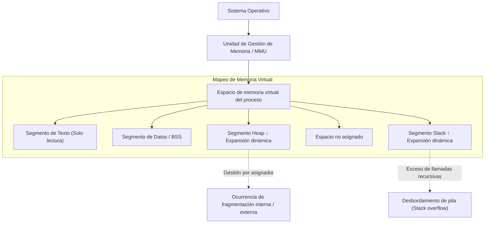
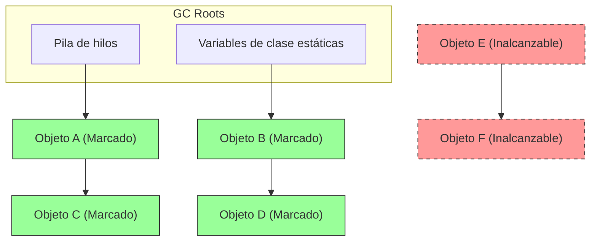
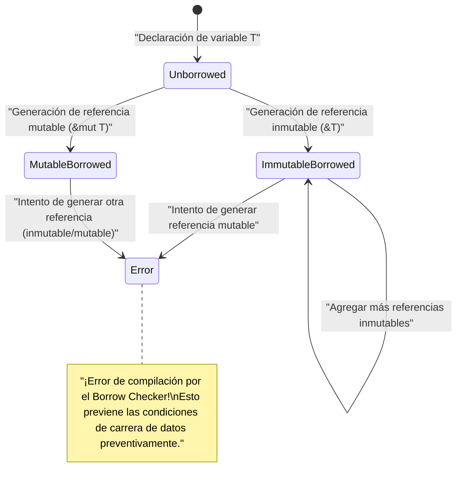

# Bienvenido a la Verdad de la Gestión de Memoria: Desentrañando los Abismos desde C, Java y Rust

En el desarrollo de software, la gestión de memoria es un tema eterno e inevitable, y uno de los factores más importantes que determinan el rendimiento y la estabilidad de un sistema. En este artículo, a través de una inmersión profunda abrumadora, equivalente a una escala de aproximadamente 20,000 caracteres, cubriremos completamente desde la teoría básica de la gestión de memoria hasta las técnicas de optimización en arquitecturas modernas.

La libertad y responsabilidad de la **gestión manual** que trajo el lenguaje C, la automatización segura mediante la **recolección de basura** ( GC ) popularizada por Java, y el paradigma de validación en tiempo de compilación llamado **propiedad** ( Ownership ) presentado por Rust. Al comparar y analizar estos tres enfoques completamente diferentes, nos acercaremos a la esencia de la **historia y evolución** de cómo los lenguajes de programación se han enfrentado a ese recurso limitado que es la memoria.

---

## 1. Estructura Básica de la Memoria: Stack, Heap y Memoria Virtual

Cuando se ejecuta un programa, el sistema operativo ( OS ) asigna al proceso un área de memoria abstraída llamada "espacio de memoria virtual". Desde la perspectiva del programa, este espacio parece un espacio de memoria contiguo y gigantesco, pero en segundo plano, el mecanismo de paginación del OS lo mapea a la memoria física ( RAM ) o al área de intercambio (swap).

El espacio de memoria virtual se divide lógicamente en los siguientes segmentos según su función:

1. **Segmento de Texto (Text Segment)** : Área donde se almacenan las instrucciones en lenguaje máquina compilado (código ejecutable). Por lo general, se configura como de solo lectura para evitar alteraciones.
2. **Segmento de Datos (Data Segment)** : Área donde se ubican las variables globales inicializadas y las variables estáticas ( static ).
3. **Segmento BSS (BSS Segment)** : Área donde se ubican las variables globales y estáticas no inicializadas, se limpian a cero al inicio de la ejecución.
4. **Segmento de Pila (Stack Segment)** : Área donde se apilan las variables locales y el contexto durante las llamadas a funciones (dirección de retorno, argumentos, etc.).
5. **Segmento de Montículo (Heap Segment)** : Área para asignar memoria dinámicamente durante la ejecución del programa.

### 1.1 Características y Límites de la Memoria Stack

El stack tiene una estructura de datos LIFO (último en entrar, primero en salir), la memoria se asigna automáticamente como un marco de pila cuando se llama a una función, y se libera automáticamente tan pronto como se sale de la función.
Dado que la asignación se completa simplemente moviendo el puntero de la pila, es extremadamente **rápido**.

Sin embargo, el stack tiene un límite definitivo. El tamaño del stack está restringido por el OS (por ejemplo: en Linux suele ser de 8MB), y si se intenta asignar arreglos gigantescos en el stack o se realizan llamadas recursivas demasiado profundas, se produce un **desbordamiento de pila (stack overflow)** y el programa colapsa.

### 1.2 Características y Complejidad de la Memoria Heap

El heap es un área vasta para asignar memoria dinámicamente. Se utiliza para almacenar datos cuyo tamaño se determina en tiempo de ejecución o datos que continúan existiendo más allá del alcance de una función.

La gestión del heap es compleja, y el programador o el tiempo de ejecución (runtime) deben realizar la asignación y liberación en el momento adecuado. Una gestión inadecuada del heap causa fugas de memoria y fragmentación ( Fragmentation ), que se explican más adelante.



---

## 2. Lenguaje C: La Máxima Libertad y Responsabilidad Personal

El lenguaje C permite un control de bajo nivel cercano al hardware y le otorgó a los desarrolladores el **control total** de la gestión de memoria. Si bien esto puede extraer el máximo rendimiento, significa que un pequeño error puede traducirse directamente en errores fatales o agujeros de seguridad.

### 2.1 Mecanismo de malloc y free

La asignación dinámica de la memoria heap en el lenguaje C se realiza manualmente a través de funciones de la biblioteca estándar como `malloc` y `calloc` , y la liberación a través de `free` . En el fondo, operan asignadores como `ptmalloc` o `jemalloc` , que solicitan memoria al OS a través de llamadas al sistema ( `brk` o `mmap` ).

```c
#include <stdio.h>
#include <stdlib.h>
#include <string.h>

typedef struct {
    int id;
    char name[50];
} User;

int main() {
    // Asignar memoria dinámicamente para la estructura User en el área del heap
    User *user_ptr = (User*)malloc(sizeof(User));
    
    if (user_ptr == NULL) {
        fprintf(stderr, "Falló la asignación de memoria.\n");
        return 1;
    }
    
    // Escritura de datos
    user_ptr->id = 1;
    strncpy(user_ptr->name, "Alice", sizeof(user_ptr->name) - 1);
    user_ptr->name[sizeof(user_ptr->name) - 1] = '\0';
    
    printf("User ID: %d, Name: %s\n", user_ptr->id, user_ptr->name);
    
    // Asegúrese de liberar manualmente la memoria cuando termine de usarla
    free(user_ptr);
    
    // Dado que el puntero después de la liberación se convierte en un puntero colgante, asigne NULL para garantizar la seguridad
    user_ptr = NULL;
    
    return 0;
}
```

### 2.2 La Pesadilla Causada por la Gestión Manual de Memoria

La gestión de memoria en el lenguaje C fácilmente genera los siguientes errores típicos (vulnerabilidades de memoria).

1. **Fuga de Memoria (Memory Leak)** : El fenómeno en el que la memoria que no se usa permanece sin liberarse porque se olvida llamar a `free` . Si ocurre en un servidor que funciona durante mucho tiempo, eventualmente consumirá toda la memoria del sistema y será finalizado a la fuerza por el asesino OOM (Out Of Memory).
2. **Puntero Colgante (Dangling Pointer)** : Un puntero que continúa apuntando a un área de memoria que ya ha sido liberada por `free` . Si se intenta acceder a la memoria a través de este puntero, se produce un comportamiento indefinido (como un fallo de segmentación).
3. **Doble Liberación (Double Free)** : Un error donde se llama a `free` dos veces para el puntero a la misma área del heap. Destruye la estructura interna del asignador (como la lista libre del heap) y se convierte en una vulnerabilidad de seguridad.
4. **Desbordamiento de Búfer (Buffer Overflow)** : El fenómeno de escribir datos más allá del área de memoria asignada. Al sobrescribir datos importantes adyacentes o la dirección de retorno, se convierte en la puerta de entrada para ataques que ejecutan código malicioso (como el aplastamiento de pila).

Modelémoslo matemáticamente. Sea $ A(t) $ la cantidad total de asignación en el heap en un punto $ t $ , y $ F(t) $ la cantidad total de liberación. El uso activo de memoria $ M(t) $ en el sistema se expresa mediante la siguiente integral:

$ M(t) = \int_0^t (A(\tau) - F(\tau)) d\tau $

En el punto $ T $ donde el programa finaliza normalmente, lo ideal es lógicamente que $ M(T) = 0 $ . Sin embargo, si la condición $ A(t) > F(t) $ continúa constantemente, $ M(t) $ continuará aumentando de manera monótona y superará el límite de memoria física $ M_{max} $ del sistema. Esta es la definición matemática de **fuga de memoria** .

---

## 3. Java: La Revolución de la Recolección de Basura

El cambio de paradigma significativo en la industria del software, que sufría con los frecuentes errores de memoria en C/C++, lo trajo Java. Java eliminó la complejidad de la gestión de memoria de los programadores y se la delegó a la **recolección de basura** ( GC ) contenida en la Máquina Virtual Java ( JVM ). Los desarrolladores ahora podían concentrarse únicamente en escribir la lógica de negocios y la instanciación de objetos.

### 3.1 Fundamentos del GC: Accesibilidad y Mark-and-Sweep

El GC de Java se basa en el concepto de "Accesibilidad ( Reachability )". Define las variables locales en la pila, variables estáticas, etc., como "GC Roots" y determina que los objetos cuyas referencias se pueden rastrear desde allí están **vivos** ( Alive ), y los objetos que ya no se pueden rastrear son **basura** ( Garbage ).

El algoritmo más clásico y fundamental es el "Mark-and-Sweep".

1. **Fase de Marcado (Mark)** : Comienza desde los GC Roots y recorre el gráfico de referencias de objetos. Otorga una "marca de vivo" a todos los objetos accesibles.
2. **Fase de Barrido (Sweep)** : Escanea todo el heap y recupera las áreas de memoria de los objetos no marcados a una "lista de espacio libre (free list)".



En la figura anterior, los objetos verdes están marcados como accesibles y están protegidos. Por otro lado, el conjunto de objetos indicados por las líneas punteadas rojas no es referenciado por ningún lado, por lo que su memoria se recupera automáticamente en la fase de barrido.

### 3.2 Comportamiento de la Memoria en Código Java

En Java, se asignan objetos en el heap con la palabra clave `new` , pero no hay una instrucción de liberación equivalente al `free` de C.

```java
import java.util.ArrayList;
import java.util.List;

public class GcExample {
    public static void main(String[] args) {
        // Genera un objeto en el heap y vincula su referencia a una variable local
        List<String> activeList = new ArrayList<>();
        activeList.add("Important Data");
        
        // Genera una gran cantidad de objetos de corta duración dentro del alcance
        for (int i = 0; i < 10000; i++) {
            // El objeto temp se vuelve inalcanzable al final de cada iteración del bucle
            String temp = new String("Temporary Data " + i);
        }
        
        // Al llegar a este punto, 10,000 objetos String son objeto de recolección por el GC
        // activeList es accesible desde los GC Roots hasta el final del método main
        
        // Solicitud explícita para ejecutar el GC (sin embargo, no se garantiza que la JVM lo ejecute realmente)
        System.gc();
        
        System.out.println("Fin del programa");
    }
}
```

### 3.3 GC Generacional (Generational GC) y Stop-The-World

Las JVM modernas (como HotSpot VM) dividen el heap en generaciones ( Generation ) para mayor eficiencia. Esto se basa en la regla empírica de **"la mayoría de los objetos se vuelven innecesarios poco después de su creación (Hipótesis Generacional Débil)"** .

El heap se divide a grandes rasgos en la "Generación Joven ( Young : espacio Eden, espacio Survivor )" y la "Generación Vieja ( Old : espacio Tenured )".

- **Minor GC** : Se activa cuando la generación Young se llena. Recupera rápidamente objetos de corta duración.
- **Major GC / Full GC** : Los objetos que sobreviven a varios Minor GC son promovidos ( Promote ) a la generación Old. Cuando la generación Old se llena, se activa el Full GC a mayor escala y requiere más tiempo.

Cuando se ejecuta el GC, todos los hilos de la aplicación se pausan temporalmente para mantener la consistencia de la memoria. A esto se le llama pausa **Stop-The-World (STW)** . En sistemas de tiempo real o sistemas financieros donde se requiere baja latencia, este STW es un problema crítico, por lo que avanza la investigación y adopción de algoritmos de GC de última generación como G1GC y ZGC, que reducen el STW tanto como sea posible.

---

## 4. Rust: La Tercera Vía que Trae Propiedad y Préstamo

El "rendimiento extremo mediante la gestión manual" en C/C++ y la "seguridad de memoria mediante la gestión automática" en Java; se pensó durante mucho tiempo que ambos estaban en una relación de compensación. Sin embargo, el lenguaje Rust logró la gran hazaña de garantizar al 100% la seguridad de la memoria en tiempo de compilación y eliminar la recolección de basura mediante la introducción del modelo revolucionario de **"Propiedad ( Ownership )"** .

### 4.1 Los 3 Principios de Propiedad (Ownership)

El sistema de propiedad, que forma la base de la gestión de memoria de Rust, se compone de las tres reglas estrictas siguientes:

1. Cada valor en Rust está vinculado a una variable llamada **propietario ( owner )** .
2. En todo momento, solo puede haber **un propietario** del valor.
3. Cuando el propietario **sale del alcance (scope)** , el valor se descarta (drop) inmediatamente.

Con estas reglas, Rust no obliga a los desarrolladores a escribir `malloc` o `free` , sino que llama automáticamente a la función `drop` y libera la memoria en el momento exacto en que la variable sale del alcance. No hay subprocesos de monitoreo en tiempo de ejecución como en GC.

### 4.2 Transferencia de Propiedad (Move)

En Rust, cuando se asigna una variable a otra o se pasa por valor a una función, la propiedad se "mueve ( Move )". La variable original ya no será accesible (resultará en un error de compilación). Esto hace que una doble liberación (Double Free) sea estructuralmente imposible.

```rust
fn main() {
    // Asegura un string en el heap. s1 se convierte en el propietario.
    let s1 = String::from("hello, rust");
    
    // La propiedad se mueve de s1 a s2.
    // A partir de este momento, s1 se invalida. Es una copia superficial (shallow copy), pero para evitar una doble liberación, la variable original se invalida.
    let s2 = s1; 
    
    // println!("{}", s1); // ¡Error de compilación! (value borrowed here after move)
    println!("s2 owns the data: {}", s2);
    
} // Fin del alcance. s2 es descartada, y la memoria en el heap se libera de forma segura.
```

### 4.3 Préstamo (Borrowing) y Tiempo de Vida (Lifetime)

Si tuviéramos que mover la propiedad en todas las operaciones, la programación sería extremadamente inconveniente. Para acceder a los datos sin quitar la propiedad, Rust tiene los conceptos de **Referencia ( Reference )** y **Préstamo ( Borrowing )** .

Además, el **Comprobador de Préstamos ( Borrow Checker )** integrado en el compilador de Rust impone las siguientes reglas estrictas en tiempo de compilación.

- En cualquier momento dado, solo se puede tener **una referencia mutable ( `&mut T` )** , o **cualquier número de referencias inmutables ( `&T` )** (la coexistencia simultánea no es posible. Prevención de Data Race).
- El tiempo de vida (Lifetime) de una referencia no debe exceder el tiempo de vida de los datos originales (Prevención completa de punteros colgantes).

```rust
fn main() {
    let mut data = String::from("Memory");
    
    // Préstamo inmutable (se pueden crear varios)
    let r1 = &data;
    let r2 = &data;
    println!("Referencias inmutables: {} y {}", r1, r2);
    // El tiempo de vida de r1, r2 termina aquí (porque no se usarán en adelante)
    
    // Préstamo mutable (solo se puede crear uno)
    let r3 = &mut data;
    r3.push_str(" Management");
    println!("Después de cambiar con referencia mutable: {}", r3);
    
    // Si intentas usar r1 y r3 al mismo tiempo, el comprobador de préstamos arrojará un error de compilación
    // println!("{}, {}", r1, r3); // ¡Error!
}
```



---

## 5. Optimización de Vanguardia: Localidad de Datos y Caché de CPU

Al dominar la gestión de memoria, es importante ir más allá de la mera "asignación y liberación" y adaptarse a la arquitectura de hardware moderna. Ese es el concepto de **Localidad de Datos ( Data Locality )** .

Las CPU modernas son extremadamente rápidas, pero el acceso a la memoria principal ( RAM ) incurre en un retraso de cientos de ciclos de reloj. Para ocultar esto, las CPU están equipadas con un **caché de CPU** jerárquico como L1, L2 y L3.

Cuando la CPU lee datos de la memoria, carga en el caché no solo esos datos, sino un bloque de memoria completo de un cierto tamaño (línea de caché, generalmente 64 bytes) que está adyacente. Esto se llama "Localidad Espacial ( Spatial Locality )".

### 5.1 Diferencias en Eficiencia de Caché por Lenguaje

- **C / C++ / Rust** : Cuando creas un array de estructuras ( `struct Array[100]` o `Vec<MyStruct>` ), los datos se disponen de manera contigua en la memoria sin espacios. Al procesar en bucle el array, el pre-lector (prefetcher) de hardware de la CPU funciona perfectamente, y la tasa de aciertos de caché aumenta drásticamente.
- **Java** : Un array de objetos en Java ( `MyObject[]` ) no es de la entidad misma, sino un array de "referencias a objetos (punteros)". Dado que cada objeto entidad se asigna en ubicaciones separadas en el heap, cada iteración del bucle rastrea el puntero para acceder a una dirección de memoria aleatoria, provocando una serie grave de fallos de caché ( Cache Miss ).

El tiempo promedio efectivo de acceso a memoria $ T_{avg} $ se expresa de la siguiente manera:

$ T_{avg} = h \cdot T_{cache} + (1 - h) \cdot T_{memory} $

Aquí, $ h $ es la tasa de aciertos de caché ( $ 0 \le h \le 1 $ ), $ T_{cache} $ es el tiempo de acceso a caché (aproximadamente 1 a 4 ns) y $ T_{memory} $ es el tiempo de acceso a la memoria principal (aproximadamente 100 ns).
Al establecer $ h $ en 0.99 (enfoque estilo C/Rust) o reducirlo a 0.5 (búsqueda de punteros estilo Java), surge una diferencia de docenas de veces en la velocidad de ejecución del bucle de la aplicación. Esta es la verdadera razón por la que C++ y Rust se eligen para motores de juegos y sistemas de negociación de alta frecuencia.

---

## 6. Conclusión: Hacia una Selección Tecnológica Adecuada

En este artículo, profundizamos en tres paradigmas de gestión de memoria completamente diferentes.

| Lenguaje | Enfoque | Ventajas | Desventajas / Retos |
|:---:|:---|:---|:---|
| **C** | Gestión manual con `malloc/free` | Máxima velocidad, máxima eficiencia de caché, ligero | Caldo de cultivo para vulnerabilidades (fugas, doble liberación), alto costo de desarrollo |
| **Java** | GC (Recolección de basura) | Mejora de la velocidad de desarrollo, garantía de seguridad de memoria | Fluctuaciones de latencia debido a STW, deterioro de la eficiencia de caché |
| **Rust** | Comprobador de propiedad y préstamos | Seguridad sin costo en tiempo de ejecución, rápido | Curva de aprendizaje pronunciada, dificultad en el diseño de tiempos de vida |

La historia de la **gestión de memoria** ha sido un juego de sube y baja entre el rendimiento y la seguridad. El GC nació para prevenir tragedias causadas por la gestión manual, y el modelo de propiedad se inventó para evitar la penalización de rendimiento del GC.

Cuando diseñamos un sistema, en lugar de decisiones simplistas como "usar Rust porque es el más rápido" o "usar Java porque es seguro", evaluar los requisitos del sistema (estrictez con respecto a la latencia, recursos de desarrollo, facilidad de mantenimiento) frente a la **verdad** subyacente de la gestión de memoria, y seleccionar la tecnología óptima, es verdaderamente el camino para convertirse en un ingeniero de primera clase.
