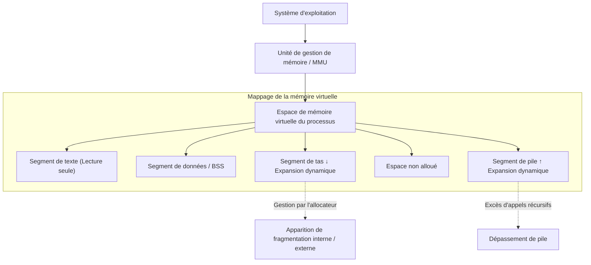
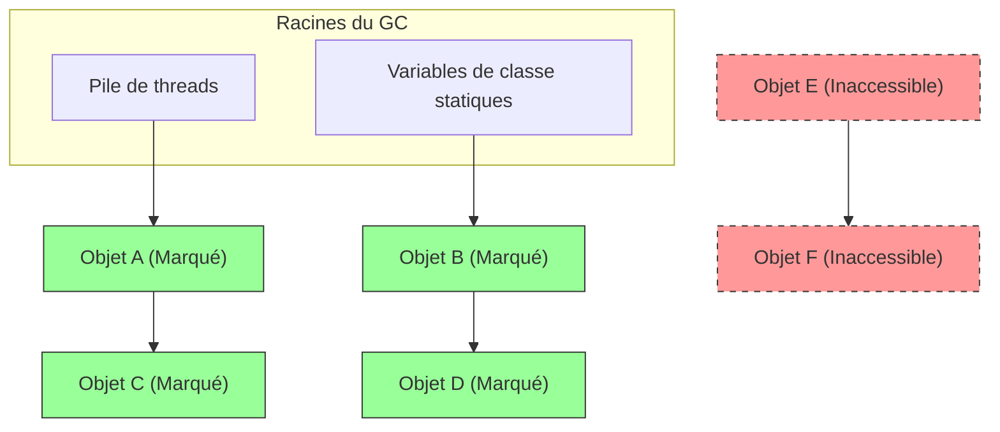
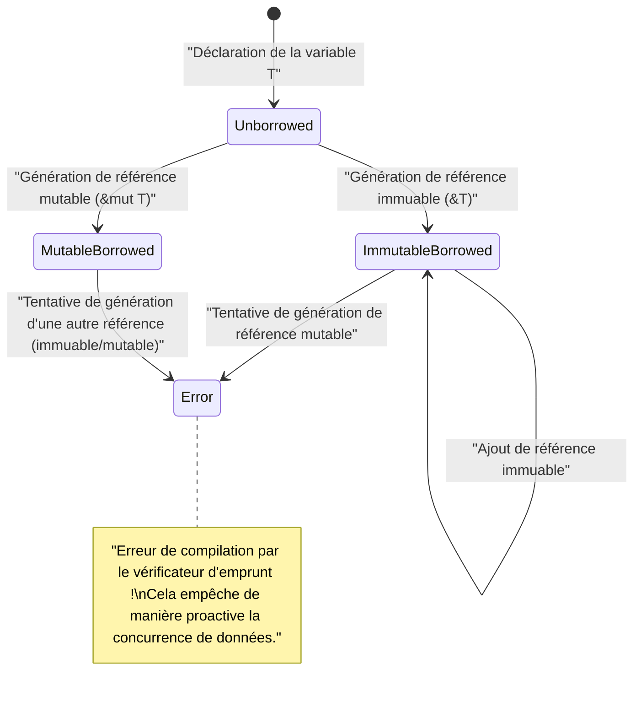

# Bienvenue dans la vérité de la gestion de la mémoire : Dénouer les profondeurs à partir de C, Java et [Rust](https://kenji.blog/fr/p/webassembly-wasm-current-future/)

Dans le développement logiciel, la gestion de la mémoire est un thème éternel incontournable, et l'un des éléments les plus importants déterminant les performances et la stabilité du système. Dans cet article, à travers une analyse approfondie comparable à environ 20 000 caractères, nous couvrons complètement depuis les théories fondamentales de la gestion de la mémoire jusqu'aux méthodes d'optimisation dans les architectures modernes.

La liberté et la responsabilité de la **gestion manuelle** apportées par le langage C, l'automatisation sécurisée par le **ramasse-miettes** (GC) popularisée par Java, et le paradigme de vérification à la compilation appelé **possession** (Ownership) présenté par Rust. En comparant et analysant ces trois approches complètement différentes, nous nous approchons de l'essence de **l'histoire et de l'évolution** de la manière dont les langages de programmation ont fait face à cette ressource limitée qu'est la mémoire.

---

## 1. Structure de base de la mémoire : Pile, tas et mémoire virtuelle

Lorsqu'un programme est exécuté, le système d'exploitation (OS) alloue une zone mémoire abstraite appelée "espace de mémoire virtuelle" au processus. Depuis le point de vue du programme, cet espace semble être un espace mémoire vaste et continu, mais en arrière-plan, il est mappé à la mémoire physique (RAM) et à l'espace d'échange (swap) par le mécanisme de pagination de l'OS.

L'espace de mémoire virtuelle est logiquement divisé principalement en les segments suivants selon leur rôle :

1. **Segment de texte (Text Segment)** : Zone où les instructions en langage machine compilé (code exécutable) sont stockées. Normalement défini en lecture seule pour éviter les altérations.
2. **Segment de données (Data Segment)** : Zone où les variables globales et les variables statiques (static) initialisées sont placées.
3. **Segment BSS (BSS Segment)** : Les variables globales et statiques non initialisées y sont placées, et sont mises à zéro au début de l'exécution.
4. **Segment de pile (Stack Segment)** : Zone où les variables locales et le contexte lors des appels de fonction (adresse de retour, arguments, etc.) sont empilés.
5. **Segment de tas (Heap Segment)** : Zone pour l'allocation dynamique de la mémoire lors de l'exécution du programme.

### 1.1 Caractéristiques et limites de la mémoire de pile

La pile a une structure de données LIFO (dernier entré, premier sorti), la mémoire est automatiquement allouée sous forme de cadre de pile lors de l'appel d'une fonction, et est automatiquement libérée au moment de quitter la fonction.
Comme l'allocation s'effectue simplement en déplaçant le pointeur de pile, elle est extrêmement **rapide**.

Cependant, la pile a une limite décisive. La taille de la pile est limitée par l'OS (ex. : généralement 8 Mo sous Linux), et si vous essayez d'allouer un grand tableau sur la pile, ou d'effectuer des appels récursifs trop profonds, un **dépassement de pile** (stack overflow) se produit et le programme plante.

### 1.2 Caractéristiques et complexité de la mémoire de tas

Le tas est une vaste zone pour allouer dynamiquement de la mémoire. Il est utilisé pour stocker des données dont la taille est déterminée à l'exécution, ou des données qui continuent d'exister au-delà de la portée d'une fonction.

La gestion du tas est complexe et nécessite que le programmeur ou le runtime effectue l'allocation et la libération au moment opportun. Une mauvaise gestion du tas est la cause de fuites de mémoire et de fragmentation (Fragmentation) que nous décrirons plus tard.



---

## 2. Langage C : Liberté ultime et responsabilité personnelle

Le langage C permet un contrôle de bas niveau proche du matériel, donnant aux développeurs **l'autorité complète** sur la gestion de la mémoire. Bien que cela permette de tirer les meilleures performances, cela signifie aussi qu'une petite erreur mène directement à des bugs fatals ou des failles de sécurité.

### 2.1 Mécanismes de malloc et free

L'allocation dynamique de la mémoire du tas en langage C est effectuée manuellement avec les fonctions de la bibliothèque standard `malloc` ou `calloc`, et la libération avec `free`. En arrière-plan, des allocateurs comme `ptmalloc` ou `jemalloc` fonctionnent et demandent de la mémoire à l'OS via des appels système (`brk` ou `mmap`).

```c
#include <stdio.h>
#include <stdlib.h>
#include <string.h>

typedef struct {
    int id;
    char name[50];
} User;

int main() {
    // Allouer dynamiquement de la mémoire pour la structure User dans le segment de tas
    User *user_ptr = (User*)malloc(sizeof(User));
    
    if (user_ptr == NULL) {
        fprintf(stderr, "L'allocation de mémoire a échoué.\n");
        return 1;
    }
    
    // Écriture de données
    user_ptr->id = 1;
    strncpy(user_ptr->name, "Alice", sizeof(user_ptr->name) - 1);
    user_ptr->name[sizeof(user_ptr->name) - 1] = '\0';
    
    printf("User ID: %d, Name: %s\n", user_ptr->id, user_ptr->name);
    
    // Assurez-vous de libérer manuellement la mémoire après utilisation
    free(user_ptr);
    
    // Le pointeur après la libération devient un pointeur suspendu, attribuez NULL pour assurer la sécurité
    user_ptr = NULL;
    
    return 0;
}
```

### 2.2 Le cauchemar provoqué par la gestion manuelle de la mémoire

La gestion de la mémoire en langage C produit facilement des bugs typiques (vulnérabilités de la mémoire) comme les suivants.

1. **Fuite de mémoire (Memory Leak)** : Le phénomène où la mémoire non utilisée reste non libérée en oubliant d'appeler `free`. Si cela se produit sur des serveurs fonctionnant pendant de longues périodes, cela finit par consommer toute la mémoire du système et est terminé de force par le tueur OOM (Out Of Memory).
2. **Pointeur suspendu (Dangling Pointer)** : Un pointeur qui continue de pointer vers une zone mémoire déjà libérée par `free`. Tenter d'accéder à la mémoire via ce pointeur provoque un comportement non défini (comme une erreur de segmentation).
3. **Double libération (Double Free)** : Erreur consistant à appeler `free` deux fois sur le pointeur de la même zone de tas. Cela détruit la structure interne de l'allocateur (comme la liste libre du tas) et devient une vulnérabilité de sécurité.
4. **Dépassement de tampon (Buffer Overflow)** : Le phénomène d'écriture de données au-delà de la zone mémoire allouée. En écrasant les données importantes adjacentes ou l'adresse de retour, cela devient le point de départ d'attaques exécutant du code malveillant (comme l'écrasement de pile).

Modélisons cela avec des formules mathématiques. Soit $ A(t) $ la quantité totale d'allocation de tas à un moment $ t $, et $ F(t) $ la quantité totale de libération. L'utilisation active de la mémoire $ M(t) $ dans le système est représentée par l'intégrale suivante :

$ M(t) = \int_0^t (A(\tau) - F(\tau)) d\tau $

À l'instant $ T $ où le programme se termine normalement, l'idéal est logiquement $ M(T) = 0 $. Cependant, si l'état $ A(t) > F(t) $ continue de manière constante, $ M(t) $ continuera d'augmenter de manière monotone et dépassera la limite de mémoire physique du système $ M_{max} $. C'est la définition mathématique d'une **fuite de mémoire**.

---

## 3. Java : La révolution apportée par le ramasse-miettes

Java a apporté un changement de paradigme majeur à l'industrie du logiciel, qui souffrait de bugs de mémoire fréquents en C/C++. Java a retiré la complexité de la gestion de la mémoire aux programmeurs et l'a confiée au **ramasse-miettes** (GC) inclus dans la machine virtuelle Java (JVM). Les développeurs ont ainsi pu se concentrer uniquement sur l'écriture de la logique métier et la création d'objets.

### 3.1 Les bases du GC : Accessibilité et Mark-and-Sweep

Le GC de Java est basé sur le concept d'"accessibilité (Reachability)". Il définit les variables locales sur la pile ou les variables statiques comme des "racines du GC", et détermine les objets dont les références peuvent être tracées comme **vivants** (Alive), et ceux qui ne peuvent pas être tracés comme **déchets** (Garbage).

L'algorithme le plus classique et fondamental est le "Mark-and-Sweep".

1. **Phase de marquage (Mark)** : Commence aux racines du GC et traverse le graphe de références des objets. Il ajoute une "marque de vie" à tous les objets accessibles.
2. **Phase de nettoyage (Sweep)** : Scanne l'ensemble du tas et récupère les zones mémoire des objets non marqués dans la "liste des zones libres (free list)".



Dans la figure ci-dessus, les objets verts sont marqués comme accessibles et sont protégés. D'autre part, l'ensemble d'objets indiqué par des lignes pointillées rouges n'étant référencé de nulle part, sa mémoire est automatiquement récupérée pendant la phase de nettoyage.

### 3.2 Comportement de la mémoire dans le code Java

En Java, on alloue des objets sur le tas avec le mot-clé `new`, mais il n'existe pas d'instruction de libération équivalente au `free` du langage C.

```java
import java.util.ArrayList;
import java.util.List;

public class GcExample {
    public static void main(String[] args) {
        // Générer un objet sur le tas et lier la référence à une variable locale
        List<String> activeList = new ArrayList<>();
        activeList.add("Important Data");
        
        // Générer un grand nombre d'objets éphémères dans la portée
        for (int i = 0; i < 10000; i++) {
            // L'objet temp devient inaccessible à la fin de chaque itération de la boucle
            String temp = new String("Temporary Data " + i);
        }
        
        // À ce stade, les 10 000 objets String sont la cible de récupération du GC
        // activeList est accessible depuis la racine du GC jusqu'à la fin de la méthode main
        
        // Demande d'exécution explicite du GC (cependant, il n'est pas garanti que la JVM l'exécute réellement)
        System.gc();
        
        System.out.println("Fin du programme");
    }
}
```

### 3.3 GC générationnel (Generational GC) et Stop-The-World

Les JVM modernes (comme HotSpot VM) divisent le tas par générations (Generation) pour plus d'efficacité. Ceci est basé sur la règle empirique selon laquelle **"de nombreux objets deviennent inutiles peu de temps après leur création (hypothèse générationnelle faible)"**.

Le tas est divisé grossièrement en "Jeune génération (Espaces Eden, Survivor)" et "Ancienne génération (Espace Tenured)".

- **GC mineur (Minor GC)** : Se déclenche lorsque la jeune génération est pleine. Il récupère rapidement les objets éphémères.
- **GC majeur / Full GC** : Les objets ayant survécu à plusieurs GC mineurs sont promus (Promote) dans l'ancienne génération. Lorsque l'ancienne génération est pleine, un Full GC à plus grande échelle et prenant plus de temps se déclenche.

Lors de l'exécution du GC, tous les threads de l'application sont mis en pause pour maintenir la cohérence de la mémoire. Ceci est appelé une pause **Stop-The-World (STW)**. Dans les systèmes temps réel ou les systèmes financiers exigeant une faible latence, ce STW est un problème fatal, c'est pourquoi la recherche et l'introduction d'algorithmes GC modernes comme G1GC ou ZGC, qui minimisent le STW autant que possible, progressent.

---

## 4. [Rust](https://kenji.blog/fr/p/webassembly-wasm-current-future/) : La troisième voie apportée par la possession et l'emprunt

"Performances extrêmes par gestion manuelle" du langage C, et "Sécurité de la mémoire par gestion automatique" de Java. Ces deux concepts ont longtemps été considérés comme un compromis. Cependant, le langage Rust a introduit un modèle révolutionnaire appelé **"possession" (Ownership)**, accomplissant l'exploit de garantir la sécurité de la mémoire à 100 % lors de la compilation, tout en éliminant le ramasse-miettes.

### 4.1 Les 3 principes de la possession (Ownership)

Le système de possession, qui constitue la base de la gestion de la mémoire de Rust, est constitué des trois règles strictes suivantes.

1. Chaque valeur en Rust est liée à une variable appelée **propriétaire (owner)**.
2. À tout moment, il n'y a qu' **un seul propriétaire** pour une valeur.
3. Lorsque le propriétaire **sort de la portée**, la valeur est immédiatement détruite (drop).

Grâce à ces règles, Rust ne demande pas aux développeurs d'écrire `malloc` ou `free`, mais appelle automatiquement la fonction `drop` au moment où une variable sort de la portée, libérant la mémoire. Il n'y a pas de thread de surveillance d'exécution comme pour le GC.

### 4.2 Déplacement de possession (Move)

En [Rust](https://kenji.blog/fr/p/webassembly-wasm-current-future/), lorsque vous assignez une variable à une autre, ou que vous la passez par valeur à une fonction, la possession est "déplacée (Move)". La variable d'origine ne peut plus être accédée ensuite (cela entraîne une erreur de compilation). Cela rend la double libération structurellement impossible.

```rust
fn main() {
    // Alloue une chaîne sur le tas. s1 devient le propriétaire.
    let s1 = String::from("hello, rust");
    
    // La possession est déplacée (move) de s1 vers s2.
    // À partir de cet instant, s1 est invalidé. C'est une copie superficielle, mais la variable d'origine est invalidée pour empêcher une double libération.
    let s2 = s1; 
    
    // println!("{}", s1); // Erreur de compilation ! (value borrowed here after move)
    println!("s2 owns the data: {}", s2);
    
} // Fin de la portée. s2 est détruit, et la mémoire sur le tas est libérée en toute sécurité.
```

### 4.3 Emprunt (Borrowing) et durée de vie (Lifetime)

Déplacer la possession à chaque opération rendrait la programmation extrêmement gênante. Pour accéder aux données sans en prendre la possession, [Rust](https://kenji.blog/fr/p/webassembly-wasm-current-future/) propose les concepts de **référence (Reference)** et d'**emprunt (Borrowing)**.

De plus, le **vérificateur d'emprunt (Borrow Checker)** intégré au compilateur de Rust applique les règles strictes suivantes à la compilation.

- À un moment donné, vous ne pouvez avoir **soit qu'une seule référence mutable (`&mut T`)**, **soit un nombre quelconque de références immuables (`&T`)** (coexistence simultanée impossible. Prévention de la concurrence de données).
- La durée de vie (lifetime) de la référence ne doit pas dépasser celle des données d'origine (prévention complète des pointeurs suspendus).

```rust
fn main() {
    let mut data = String::from("Memory");
    
    // Emprunt immuable (plusieurs créations possibles)
    let r1 = &data;
    let r2 = &data;
    println!("Références immuables : {} and {}", r1, r2);
    // La durée de vie de r1, r2 se termine ici (car ils ne sont plus utilisés ensuite)
    
    // Emprunt mutable (une seule création possible)
    let r3 = &mut data;
    r3.push_str(" Management");
    println!("Après modification via référence mutable : {}", r3);
    
    // Tenter d'utiliser r1 et r3 en même temps entraîne une erreur de compilation du vérificateur d'emprunt
    // println!("{}, {}", r1, r3); // Error!
}
```



---

## 5. Optimisation de pointe : Localité des données et cache CPU

Pour maîtriser la gestion de la mémoire, il est important d'aller au-delà de la simple "allocation et libération" et de se rapprocher de l'architecture matérielle moderne. C'est le concept de **localité des données (Data Locality)**.

Les CPU modernes sont très rapides, mais l'accès à la mémoire principale (RAM) subit une latence de centaines de cycles d'horloge. Pour dissimuler cela, le CPU est équipé de **caches CPU** hiérarchiques tels que L1, L2, L3.

Lorsque le CPU lit des données en mémoire, il charge non seulement ces données, mais aussi tout le bloc mémoire adjacent d'une certaine taille (ligne de cache, généralement 64 octets) dans le cache. C'est ce qu'on appelle la "localité spatiale (Spatial Locality)".

### 5.1 Différences d'efficacité du cache selon les langages

- **C / C++ / [Rust](https://kenji.blog/fr/p/webassembly-wasm-current-future/)** : Lors de la création d'un tableau de structures (`struct Array[100]` ou `Vec<MyStruct>`), les données sont placées consécutivement sans espaces en mémoire. Lors du traitement du tableau dans une boucle, le prefetcher matériel du CPU fonctionne parfaitement et le taux de réussite du cache augmente de manière spectaculaire.
- **Java** : Un tableau d'objets Java (`MyObject[]`) n'est pas un tableau d'entités, mais un "tableau de références (pointeurs) vers des objets". Puisque chaque objet physique est alloué à différents endroits sur le tas, chaque itération de la boucle implique de suivre des pointeurs pour accéder à des adresses mémoire aléatoires, entraînant de graves défauts de cache (Cache Miss).

Le temps d'accès mémoire effectif moyen $ T_{avg} $ est exprimé ainsi :

$ T_{avg} = h \cdot T_{cache} + (1 - h) \cdot T_{memory} $

Ici, $ h $ est le taux de réussite du cache ($ 0 \le h \le 1 $), $ T_{cache} $ est le temps d'accès au cache (environ 1 à 4 ns), et $ T_{memory} $ est le temps d'accès à la mémoire principale (environ 100 ns).
Selon que l'on ajuste $ h $ à 0,99 (approche style C/[Rust](https://kenji.blog/fr/p/webassembly-wasm-current-future/)) ou à 0,5 (chasse aux pointeurs style Java), il se crée une différence de plusieurs dizaines de fois dans la vitesse d'exécution des boucles d'une application. C'est la véritable raison pour laquelle C++ et Rust sont choisis pour les moteurs de jeu ou les systèmes de trading à haute fréquence.

---

## 6. Conclusion : Vers une sélection technologique adaptée à chaque situation

Cet article a exploré en profondeur trois paradigmes de gestion de mémoire complètement différents.

| Langage | Approche | Avantages | Inconvénients/Défis |
|:---:|:---|:---|:---|
| **C** | Gestion manuelle via `malloc/free` | Vitesse extrême, efficacité de cache maximale, léger | Foyer de vulnérabilités (fuites, double libération), coût de développement élevé |
| **Java** | GC (Ramasse-miettes) | Amélioration de la vitesse de développement, garantie de la sécurité mémoire | Fluctuation de la latence due au STW, dégradation de l'efficacité du cache |
| **[Rust](https://kenji.blog/fr/p/webassembly-wasm-current-future/)** | Possession et vérificateur d'emprunt | Sécurité avec un coût d'exécution nul, rapide | Courbe d'apprentissage abrupte, difficulté de conception de la durée de vie |

L'histoire de la **gestion de la mémoire** a été un jeu de bascule oscillant entre performances et sécurité. Le GC a été créé pour prévenir les tragédies causées par la gestion manuelle, et le modèle de possession a été inventé pour contourner la pénalité de performances du GC.

Lorsque nous concevons un système, la voie d'un ingénieur de premier ordre consiste à choisir la technologie optimale non pas par des décisions simplistes telles que "utiliser Rust car c'est le plus rapide" ou "utiliser Java car c'est sûr", mais en confrontant les exigences du système (stricte latence, ressources de développement, maintenabilité) à la **vérité** sous-jacente de la gestion de la mémoire.
