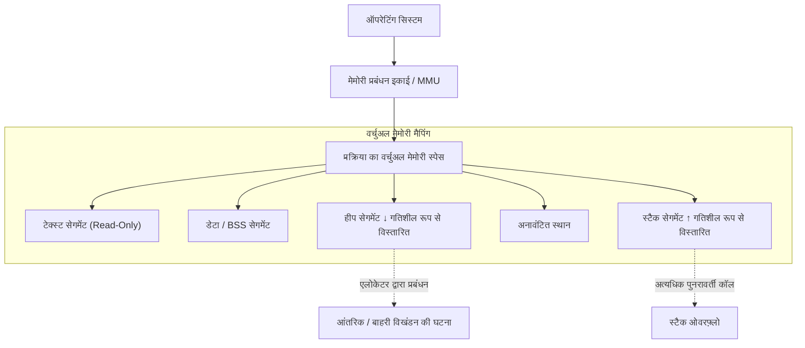
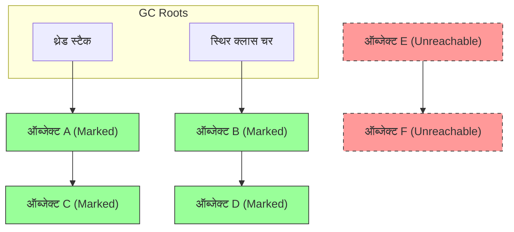
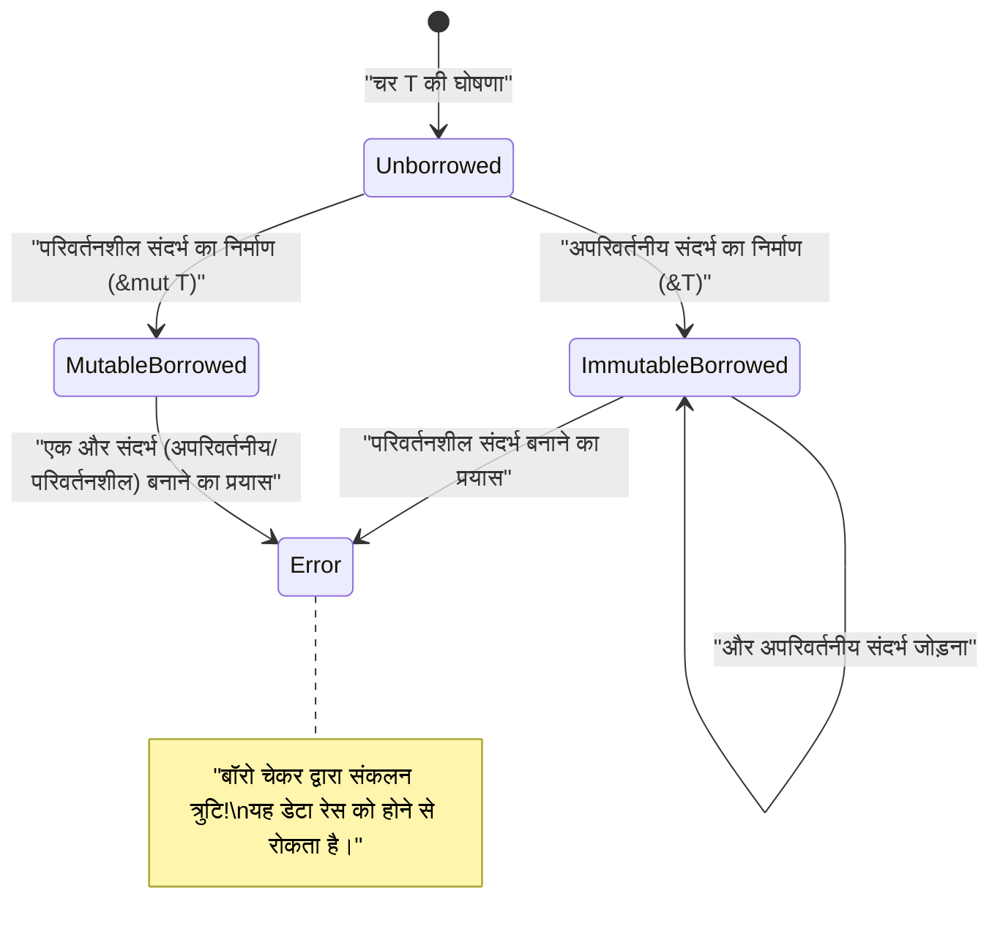

# मेमोरी प्रबंधन की सच्चाई में आपका स्वागत है: C, Java और [Rust](https://kenji.blog/hi/p/webassembly-wasm-current-future/) से सुलझती गहराई

सॉफ्टवेयर विकास में, मेमोरी प्रबंधन एक अपरिहार्य और शाश्वत विषय है, जो सिस्टम के प्रदर्शन और स्थिरता को निर्धारित करने वाले सबसे महत्वपूर्ण कारकों में से एक है। इस लेख में, हम एक व्यापक गहराई के माध्यम से, मेमोरी प्रबंधन के मूल सिद्धांतों से लेकर आधुनिक आर्किटेक्चर में अनुकूलन तकनीकों तक सब कुछ पूरी तरह से कवर करेंगे।

C भाषा द्वारा लाया गया **मैन्युअल प्रबंधन** की स्वतंत्रता और जिम्मेदारी, Java द्वारा लोकप्रिय बनाया गया **गार्बेज कलेक्शन** ( GC ) के माध्यम से सुरक्षित स्वचालन, और Rust द्वारा प्रस्तुत **ओनरशिप** ( Ownership ) के रूप में संकलन-समय सत्यापन का प्रतिमान। इन 3 पूरी तरह से अलग दृष्टिकोणों की तुलना और विश्लेषण करके, हम इस बात की **इतिहास और विकास** के सार तक पहुंचेंगे कि प्रोग्रामिंग भाषाओं ने मेमोरी नामक सीमित संसाधन के साथ कैसे काम किया है।

---

## 1. मेमोरी की मूल संरचना: स्टैक, हीप और वर्चुअल मेमोरी

जब कोई प्रोग्राम निष्पादित होता है, तो ऑपरेटिंग सिस्टम ( OS ) प्रक्रिया को एक "वर्चुअल मेमोरी स्पेस" नामक अमूर्त मेमोरी क्षेत्र आवंटित करता है। यह स्पेस प्रोग्राम के नजरिए से एक निरंतर विशाल मेमोरी स्पेस की तरह दिखता है, लेकिन पृष्ठभूमि में OS के पेजिंग तंत्र द्वारा इसे भौतिक मेमोरी ( RAM ) और स्वैप क्षेत्र में मैप किया जाता है।

वर्चुअल मेमोरी स्पेस को तार्किक रूप से इसकी भूमिका के अनुसार निम्नलिखित सेगमेंट में विभाजित किया गया है:

1. **टेक्स्ट सेगमेंट (Text Segment)** : वह क्षेत्र जहां संकलित मशीन भाषा निर्देश (निष्पादन योग्य कोड) संग्रहीत होते हैं। छेड़छाड़ को रोकने के लिए इसे आमतौर पर रीड-ओनली के रूप में सेट किया जाता है।
2. **डेटा सेगमेंट (Data Segment)** : वह क्षेत्र जहां आरंभ किए गए वैश्विक चर और स्थिर ( static ) चर रखे जाते हैं।
3. **BSS सेगमेंट (BSS Segment)** : वह क्षेत्र जहां बिना आरंभ किए गए वैश्विक और स्थिर चर रखे जाते हैं, और निष्पादन की शुरुआत में शून्य कर दिए जाते हैं।
4. **स्टैक सेगमेंट (Stack Segment)** : वह क्षेत्र जहां स्थानीय चर और फ़ंक्शन कॉल संदर्भ (वापसी पता, तर्क, आदि) संग्रहीत किए जाते हैं।
5. **हीप सेगमेंट (Heap Segment)** : प्रोग्राम के निष्पादन के दौरान गतिशील रूप से मेमोरी आवंटित करने का क्षेत्र।

### 1.1 स्टैक मेमोरी की विशेषताएं और सीमाएं

स्टैक की डेटा संरचना LIFO (लास्ट इन फर्स्ट आउट) होती है, जहां फ़ंक्शन को कॉल किए जाने पर मेमोरी स्वचालित रूप से स्टैक फ्रेम के रूप में आवंटित की जाती है, और फ़ंक्शन से बाहर निकलते ही स्वचालित रूप से मुक्त हो जाती है।
स्टैक पॉइंटर को स्थानांतरित करके आवंटन पूरा हो जाता है, इसलिए यह अत्यंत **तेज** है।

हालाँकि, स्टैक की एक निश्चित सीमा है। स्टैक का आकार OS द्वारा सीमित होता है (उदा: Linux में आमतौर पर 8MB), और यदि आप स्टैक पर एक विशाल सरणी आवंटित करने का प्रयास करते हैं या बहुत गहरे पुनरावर्ती कॉल करते हैं, तो **स्टैक ओवरफ़्लो** होता है, और प्रोग्राम क्रैश हो जाता है।

### 1.2 हीप मेमोरी की विशेषताएं और जटिलता

हीप गतिशील रूप से मेमोरी आवंटित करने के लिए एक विशाल क्षेत्र है। इसका उपयोग उन डेटा को संग्रहीत करने के लिए किया जाता है जिनका आकार रनटाइम पर निर्धारित होता है, या जो डेटा फ़ंक्शन के दायरे से परे मौजूद रहता है।

हीप का प्रबंधन जटिल है, और प्रोग्रामर या रनटाइम को उपयुक्त समय पर आवंटन और मुक्ति को संभालना चाहिए। अनुचित हीप प्रबंधन मेमोरी लीक और विखंडन ( Fragmentation ) का कारण बन सकता है, जिसकी चर्चा नीचे की गई है।



---

## 2. C भाषा: परम स्वतंत्रता और आत्म-जिम्मेदारी

C भाषा हार्डवेयर के करीब निम्न-स्तरीय नियंत्रण को सक्षम बनाती है और डेवलपर्स को मेमोरी प्रबंधन का **पूर्ण अधिकार** देती है। हालांकि यह सर्वोत्तम प्रदर्शन ला सकता है, इसका अर्थ यह भी है कि थोड़ी सी भी गलती गंभीर बग या सुरक्षा कमजोरियों का कारण बन सकती है।

### 2.1 malloc और free का तंत्र

C भाषा में, हीप मेमोरी का गतिशील आवंटन मानक लाइब्रेरी फ़ंक्शन `malloc` और `calloc` के माध्यम से किया जाता है, और मुक्ति `free` द्वारा मैन्युअल रूप से की जाती है। पर्दे के पीछे, `ptmalloc` या `jemalloc` जैसे एलोकेटर काम करते हैं और सिस्टम कॉल ( `brk` या `mmap` ) के माध्यम से OS से मेमोरी का अनुरोध करते हैं।

```c
#include <stdio.h>
#include <stdlib.h>
#include <string.h>

typedef struct {
    int id;
    char name[50];
} User;

int main() {
    // User संरचना के लिए हीप पर गतिशील रूप से मेमोरी आवंटित करें
    User *user_ptr = (User*)malloc(sizeof(User));
    
    if (user_ptr == NULL) {
        fprintf(stderr, "मेमोरी आवंटित करने में विफल।\n");
        return 1;
    }
    
    // डेटा लिखना
    user_ptr->id = 1;
    strncpy(user_ptr->name, "Alice", sizeof(user_ptr->name) - 1);
    user_ptr->name[sizeof(user_ptr->name) - 1] = '\0';
    
    printf("User ID: %d, Name: %s\n", user_ptr->id, user_ptr->name);
    
    // उपयोग के बाद मैन्युअल रूप से मेमोरी को मुक्त करना सुनिश्चित करें
    free(user_ptr);
    
    // मुक्त होने के बाद पॉइंटर डैंगलिंग पॉइंटर बन जाता है, इसलिए सुरक्षा सुनिश्चित करने के लिए NULL असाइन करें
    user_ptr = NULL;
    
    return 0;
}
```

### 2.2 मैन्युअल मेमोरी प्रबंधन से होने वाले बुरे सपने

C भाषा में मेमोरी प्रबंधन आसानी से निम्नलिखित विशिष्ट बग (मेमोरी कमजोरियां) पैदा कर सकता है:

1. **मेमोरी लीक (Memory Leak)** : `free` को कॉल करना भूल जाने से, अनुपयोगी मेमोरी बिना मुक्त हुए बनी रहती है। यदि यह लंबे समय से चल रहे सर्वर पर होता है, तो यह अंततः पूरे सिस्टम की मेमोरी को खा जाता है, और इसे OOM (Out Of Memory) किलर द्वारा जबरन समाप्त कर दिया जाता है।
2. **डैंगलिंग पॉइंटर (Dangling Pointer)** : एक पॉइंटर जो उस मेमोरी क्षेत्र को इंगित करता रहता है जिसे पहले ही `free` द्वारा मुक्त किया जा चुका है। इस पॉइंटर के माध्यम से मेमोरी तक पहुंचने का प्रयास अपरिभाषित व्यवहार (सेगमेंटेशन फॉल्ट, आदि) का कारण बनता है।
3. **डबल फ्री (Double Free)** : एक ही हीप क्षेत्र के पॉइंटर के लिए दो बार `free` कॉल करने की त्रुटि। यह एलोकेटर की आंतरिक संरचना (हीप की फ्री लिस्ट, आदि) को नष्ट कर देता है और सुरक्षा के लिए खतरा बन जाता है।
4. **बफ़र ओवरफ़्लो (Buffer Overflow)** : आवंटित मेमोरी क्षेत्र से परे डेटा लिखने की घटना। आसन्न महत्वपूर्ण डेटा या रिटर्न एड्रेस को अधिलेखित करके, यह दुर्भावनापूर्ण कोड (स्टैक स्मैशिंग, आदि) निष्पादित करने के हमलों का द्वार बन सकता है।

आइए इसे गणितीय रूप से मॉडल करें। किसी भी समय $ t $ पर कुल हीप आवंटन $ A(t) $ और कुल मुक्त की गई मात्रा को $ F(t) $ मान लें। सिस्टम में सक्रिय मेमोरी उपयोग $ M(t) $ को निम्नलिखित इंटीग्रल द्वारा दर्शाया जा सकता है:

$ M(t) = \int_0^t (A(\tau) - F(\tau)) d\tau $

जब प्रोग्राम सफलतापूर्वक समाप्त होता है, समय $ T $ पर, तार्किक रूप से $ M(T) = 0 $ होना आदर्श है। हालाँकि, यदि $ A(t) > F(t) $ की स्थिति लगातार बनी रहती है, तो $ M(t) $ बढ़ता ही जाएगा, और सिस्टम की भौतिक मेमोरी सीमा $ M_{max} $ को पार कर जाएगा। यह **मेमोरी लीक** की गणितीय परिभाषा है।

---

## 3. Java: गार्बेज कलेक्शन द्वारा लाई गई क्रांति

C/C++ में बार-बार होने वाले मेमोरी बग से जूझ रहे सॉफ्टवेयर उद्योग में एक बड़ा बदलाव लाने वाला Java था। Java ने प्रोग्रामर से मेमोरी प्रबंधन की जटिलता ले ली और इसे Java वर्चुअल मशीन ( JVM ) के भीतर समाहित **गार्बेज कलेक्शन** ( GC ) को सौंप दिया। डेवलपर्स अब केवल व्यावसायिक तर्क लिखने और ऑब्जेक्ट बनाने पर ध्यान केंद्रित कर सकते थे।

### 3.1 GC की मूल बातें: रीचेबिलिटी और Mark-and-Sweep

Java का GC "पहुंच-योग्यता ( Reachability )" की अवधारणा पर आधारित है। स्टैक और स्थिर चर पर स्थानीय चर को "GC रूट" के रूप में परिभाषित किया जाता है, और जिन ऑब्जेक्ट तक वहां से संदर्भ प्राप्त किया जा सकता है उन्हें **जीवित** ( Alive ) माना जाता है, और जिन ऑब्जेक्ट तक नहीं पहुंचा जा सकता उन्हें **गार्बेज** ( Garbage = कचरा ) माना जाता है।

सबसे क्लासिक और बुनियादी एल्गोरिदम " Mark-and-Sweep " है।

1. **Mark (मार्क) चरण** : GC रूट से शुरू करके, ऑब्जेक्ट के संदर्भ ग्राफ़ को ट्रैवर्स (स्कैन) किया जाता है। सभी सुलभ ऑब्जेक्ट को एक "जीवित मार्क" दिया जाता है।
2. **Sweep (स्वीप) चरण** : पूरे हीप को स्कैन किया जाता है, और बिना मार्क वाले ऑब्जेक्ट के मेमोरी क्षेत्र को "खाली स्थान सूची (फ्री लिस्ट)" में वापस ले लिया जाता है।



ऊपर दिए गए चित्र में, हरे रंग की वस्तुओं को पहुंच-योग्य के रूप में चिह्नित और संरक्षित किया गया है। दूसरी ओर, लाल बिंदीदार रेखा द्वारा इंगित ऑब्जेक्ट सेट को कहीं से भी संदर्भित नहीं किया गया है, इसलिए स्वीप चरण के दौरान इसकी मेमोरी को स्वचालित रूप से पुनः प्राप्त किया जाएगा।

### 3.2 Java कोड में मेमोरी का व्यवहार

Java में, हीप पर ऑब्जेक्ट आवंटित करने के लिए `new` कीवर्ड का उपयोग किया जाता है, लेकिन C भाषा के `free` के बराबर कोई मुक्ति आदेश नहीं है।

```java
import java.util.ArrayList;
import java.util.List;

public class GcExample {
    public static void main(String[] args) {
        // हीप पर एक ऑब्जेक्ट बनाएं और एक संदर्भ को स्थानीय चर से बांधें
        List<String> activeList = new ArrayList<>();
        activeList.add("Important Data");
        
        // स्कोप के भीतर बड़ी संख्या में अल्पकालिक ऑब्जेक्ट बनाएं
        for (int i = 0; i < 10000; i++) {
            // temp ऑब्जेक्ट लूप के प्रत्येक इटरेशन के अंत में अगम्य हो जाता है
            String temp = new String("Temporary Data " + i);
        }
        
        // जब आप यहां पहुंचते हैं, तो 10,000 String ऑब्जेक्ट GC संग्रह का लक्ष्य बन जाते हैं
        // activeList मुख्य विधि के अंत तक GC रूट से पहुंच योग्य है
        
        // स्पष्ट GC निष्पादन अनुरोध (हालांकि, इस बात की कोई गारंटी नहीं है कि JVM वास्तव में इसे निष्पादित करेगा)
        System.gc();
        
        System.out.println("प्रोग्राम समाप्त");
    }
}
```

### 3.3 जनरेशनल GC (Generational GC) और Stop-The-World

आधुनिक JVM (जैसे HotSpot VM) कार्यक्षमता के लिए हीप को पीढ़ियों ( Generation ) में विभाजित करते हैं। यह इस अनुभवजन्य नियम पर आधारित है कि **"अधिकांश ऑब्जेक्ट बनाए जाने के तुरंत बाद अनावश्यक हो जाते हैं (कमजोर पीढ़ीगत परिकल्पना)"**।

हीप को मोटे तौर पर "Young जेनरेशन ( Eden स्पेस, Survivor स्पेस )" और "Old जेनरेशन ( Tenured स्पेस )" में विभाजित किया गया है।

- **Minor GC** : Young जेनरेशन भर जाने पर ट्रिगर होता है। यह अल्पकालिक ऑब्जेक्ट को तेजी से इकट्ठा करता है।
- **Major GC / Full GC** : जो ऑब्जेक्ट कई Minor GC से बचे रहते हैं उन्हें Old जेनरेशन में प्रमोट ( Promote ) कर दिया जाता है। जब Old जेनरेशन भर जाता है, तो बड़े और अधिक समय लेने वाले Full GC ट्रिगर होते हैं।

जब GC निष्पादित होता है, तो मेमोरी की अखंडता बनाए रखने के लिए एप्लिकेशन के सभी थ्रेड को रोक दिया जाता है। इसे **Stop-The-World (STW)** पॉज़ कहा जाता है। चूंकि यह STW वास्तविक समय प्रणालियों और कम-विलंबता वित्तीय प्रणालियों में एक घातक समस्या हो सकती है, इसलिए G1GC और ZGC जैसे नवीनतम GC एल्गोरिदम जो STW को जितना संभव हो उतना कम करते हैं, उनका शोध और कार्यान्वयन किया जा रहा है।

---

## 4. [Rust](https://kenji.blog/hi/p/webassembly-wasm-current-future/): ओनरशिप और बॉरोइंग द्वारा लाया गया तीसरा रास्ता

C भाषा का "मैन्युअल प्रबंधन के कारण चरम प्रदर्शन" और Java का "स्वचालित प्रबंधन के कारण मेमोरी सुरक्षा"। माना जाता था कि ये दोनों लंबे समय से ट्रेड-ऑफ रिलेशनशिप में हैं। हालाँकि, Rust भाषा ने **"ओनरशिप ( Ownership )"** का अभूतपूर्व मॉडल पेश करके एक बड़ी उपलब्धि हासिल की, जो गार्बेज कलेक्शन को खत्म करते हुए कंपाइल समय पर 100% मेमोरी सुरक्षा की गारंटी देता है।

### 4.1 ओनरशिप (Ownership) के 3 सिद्धांत

Rust का ओनरशिप सिस्टम, जो इसके मेमोरी प्रबंधन का मूल है, निम्नलिखित 3 सख्त नियमों से बना है:

1. Rust में प्रत्येक मान का एक **मालिक ( owner )** होता है, जो एक चर होता है।
2. किसी भी समय, एक मान का केवल **एक मालिक** होता है।
3. जब मालिक **स्कोप से बाहर** जाता है, तो मान तुरंत नष्ट (ड्रॉप) हो जाता है।

इन नियमों के साथ, Rust विकासकों को `malloc` या `free` लिखने के लिए मजबूर किए बिना, चर के स्कोप से बाहर निकलते ही स्वचालित रूप से `drop` फ़ंक्शन को कॉल करता है और मेमोरी को मुक्त करता है। GC की तरह कोई रनटाइम मॉनिटरिंग थ्रेड नहीं है।

### 4.2 ओनरशिप का स्थानांतरण (Move)

[Rust](https://kenji.blog/hi/p/webassembly-wasm-current-future/) में, जब आप किसी चर को दूसरे चर में असाइन करते हैं, या मान को किसी फ़ंक्शन में पास करते हैं, तो ओनरशिप "स्थानांतरित ( Move )" हो जाता है। मूल चर फिर अप्राप्य हो जाता है (परिणामस्वरूप संकलन त्रुटि होती है)। यह संरचनात्मक रूप से डबल फ्री (Double Free) को असंभव बना देता है।

```rust
fn main() {
    // हीप पर एक स्ट्रिंग आवंटित करें। s1 मालिक बन जाता है।
    let s1 = String::from("hello, rust");
    
    // ओनरशिप s1 से s2 में स्थानांतरित (मूव) हो जाता है।
    // इस क्षण से, s1 अमान्य हो जाता है। यह एक उथली प्रतिलिपि (शैलो कॉपी) है, लेकिन दोहरे मुक्त होने से रोकने के लिए मूल चर अमान्य हो जाता है।
    let s2 = s1; 
    
    // println!("{}", s1); // संकलन त्रुटि! (value borrowed here after move)
    println!("s2 owns the data: {}", s2);
    
} // स्कोप का अंत। s2 को ड्रॉप किया जाता है, और हीप पर मेमोरी को सुरक्षित रूप से मुक्त कर दिया जाता है।
```

### 4.3 बॉरोइंग (Borrowing) और लाइफटाइम

यदि हर ऑपरेशन के साथ ओनरशिप को स्थानांतरित कर दिया जाए, तो प्रोग्रामिंग अत्यंत असुविधाजनक हो जाएगी। ओनरशिप लिए बिना डेटा तक पहुंचने के लिए, [Rust](https://kenji.blog/hi/p/webassembly-wasm-current-future/) में **संदर्भ ( Reference )** और **बॉरोइंग ( Borrowing )** की अवधारणा है।

इसके अलावा, Rust के कंपाइलर में अंतर्निहित **बॉरो चेकर ( Borrow Checker )**, कंपाइल समय पर निम्नलिखित सख्त नियमों को लागू करता है:

- किसी भी समय, आप या तो **1 परिवर्तनशील संदर्भ ( `&mut T` )**, या **कितने भी अपरिवर्तनीय संदर्भ ( `&T` )** रख सकते हैं (एक साथ सह-अस्तित्व की अनुमति नहीं है। डेटा रेस को रोकना)।
- एक संदर्भ का लाइफटाइम (वैध अवधि) मूल डेटा के लाइफटाइम से अधिक नहीं होना चाहिए (डैंगलिंग पॉइंटर की पूर्ण रोकथाम)।

```rust
fn main() {
    let mut data = String::from("Memory");
    
    // अपरिवर्तनीय बॉरोइंग (कई बनाए जा सकते हैं)
    let r1 = &data;
    let r2 = &data;
    println!("अपरिवर्तनीय संदर्भ: {} and {}", r1, r2);
    // r1, r2 का लाइफटाइम यहां समाप्त होता है (क्योंकि उनका बाद में उपयोग नहीं किया जाता है)
    
    // परिवर्तनशील बॉरोइंग (केवल 1 बनाया जा सकता है)
    let r3 = &mut data;
    r3.push_str(" Management");
    println!("परिवर्तनशील संदर्भ के साथ बदलने के बाद: {}", r3);
    
    // यदि आप एक ही समय में r1 और r3 का उपयोग करने का प्रयास करते हैं, तो बॉरो चेकर संकलन त्रुटि देगा
    // println!("{}, {}", r1, r3); // Error!
}
```



---

## 5. अत्याधुनिक अनुकूलन: डेटा लोकैलिटी और CPU कैश

मेमोरी प्रबंधन में महारत हासिल करने में, साधारण "आवंटन और मुक्ति" से आगे जाना और आधुनिक हार्डवेयर आर्किटेक्चर के करीब आना महत्वपूर्ण है। यह **डेटा लोकैलिटी ( Data Locality )** की अवधारणा है।

आधुनिक CPU बहुत तेज़ हैं, लेकिन मुख्य मेमोरी ( RAM ) तक पहुँचने में सैकड़ों क्लॉक साइकिल की देरी होती है। इसे छिपाने के लिए, CPU पदानुक्रमित **CPU कैश** जैसे L1, L2 और L3 से लैस हैं।

जब CPU मेमोरी से डेटा पढ़ता है, तो यह केवल उस डेटा को नहीं, बल्कि एक निश्चित आकार (कैश लाइन, आमतौर पर 64 बाइट्स) के आसन्न मेमोरी ब्लॉक को एक साथ कैश में लोड करता है। इसे "स्थानिक स्थानीयता ( Spatial Locality )" कहा जाता है।

### 5.1 भाषा द्वारा कैश दक्षता में अंतर

- **C / C++ / [Rust](https://kenji.blog/hi/p/webassembly-wasm-current-future/)** : जब आप संरचनाओं का एक सरणी ( `struct Array[100]` या `Vec<MyStruct>` ) बनाते हैं, तो डेटा को मेमोरी में लगातार बिना किसी अंतराल के रखा जाता है। सरणी पर लूप करते समय, CPU का हार्डवेयर प्रीफ़ेचर पूरी तरह से काम करता है, और कैश हिट दर नाटकीय रूप से बढ़ जाती है।
- **Java** : Java की ऑब्जेक्ट ऐरे ( `MyObject[]` ) वास्तविक संस्थाओं की ऐरे नहीं है, बल्कि "ऑब्जेक्ट्स के संदर्भ (पॉइंटर्स)" की ऐरे है। चूंकि प्रत्येक वास्तविक ऑब्जेक्ट हीप पर अलग-अलग स्थानों में आवंटित किया जाता है, प्रत्येक लूप प्रसंस्करण एक यादृच्छिक मेमोरी पते तक पहुंचने के लिए एक पॉइंटर का अनुसरण करता है, जिससे गंभीर कैश मिस ( Cache Miss ) होते हैं।

प्रभावी औसत मेमोरी एक्सेस समय $ T_{avg} $ को निम्नानुसार व्यक्त किया गया है:

$ T_{avg} = h \cdot T_{cache} + (1 - h) \cdot T_{memory} $

यहाँ, $ h $ कैश हिट दर है ( $ 0 \le h \le 1 $ ), $ T_{cache} $ कैश एक्सेस समय है (लगभग 1 से 4 ns), और $ T_{memory} $ मुख्य मेमोरी एक्सेस समय है (लगभग 100 ns)।
$ h $ को 0.99 (C/[Rust](https://kenji.blog/hi/p/webassembly-wasm-current-future/) दृष्टिकोण) बनाने या इसे 0.5 (Java-जैसे पॉइंटर चेज़िंग) तक कम करने के बीच, एप्लिकेशन की लूप निष्पादन गति में दर्जनों गुना का अंतर है। यही वास्तविक कारण है कि गेम इंजन और उच्च-आवृत्ति ट्रेडिंग सिस्टम में C++ और Rust को चुना जाता है।

---

## 6. सारांश: सही जगह पर सही तकनीक चुनना

इस लेख में, हमने 3 पूरी तरह से अलग मेमोरी प्रबंधन प्रतिमानों का गहराई से अध्ययन किया।

| भाषा | दृष्टिकोण | लाभ | कमियां / चुनौतियां |
|:---:|:---|:---|:---|
| **C** | `malloc/free` के साथ मैन्युअल प्रबंधन | परम गति, अधिकतम कैश दक्षता, हल्कापन | कमजोरियों का घर (लीक, डबल फ्री), उच्च विकास लागत |
| **Java** | GC (गार्बेज कलेक्शन) | विकास की गति में सुधार, मेमोरी सुरक्षा की गारंटी | STW के कारण लेटेंसी में उतार-चढ़ाव, खराब कैश दक्षता |
| **[Rust](https://kenji.blog/hi/p/webassembly-wasm-current-future/)** | ओनरशिप / बॉरो चेकर | शून्य रनटाइम लागत के साथ सुरक्षा, उच्च गति | खड़ी सीखने की अवस्था, लाइफटाइम डिजाइनिंग में कठिनाई |

**मेमोरी प्रबंधन** का इतिहास प्रदर्शन और सुरक्षा के बीच झूलने वाले सीसॉ गेम जैसा रहा है। मैन्युअल प्रबंधन के कारण होने वाली त्रासदियों को रोकने के लिए GC का जन्म हुआ, और GC के प्रदर्शन दंड से बचने के लिए ओनरशिप मॉडल का आविष्कार किया गया।

जब हम सिस्टम डिज़ाइन करते हैं, तो "यह सबसे तेज़ है इसलिए Rust का उपयोग करें" या "यह सुरक्षित है इसलिए Java का उपयोग करें" जैसे अल्पकालिक निर्णय लेने के बजाय, एक शीर्ष इंजीनियर का मार्ग सिस्टम की आवश्यकताओं (लेटेंसी की सख्ती, विकास संसाधन, रखरखाव) का मिलान मेमोरी प्रबंधन की **सच्चाई** के साथ करना और सर्वोत्तम तकनीक चुनना है।
