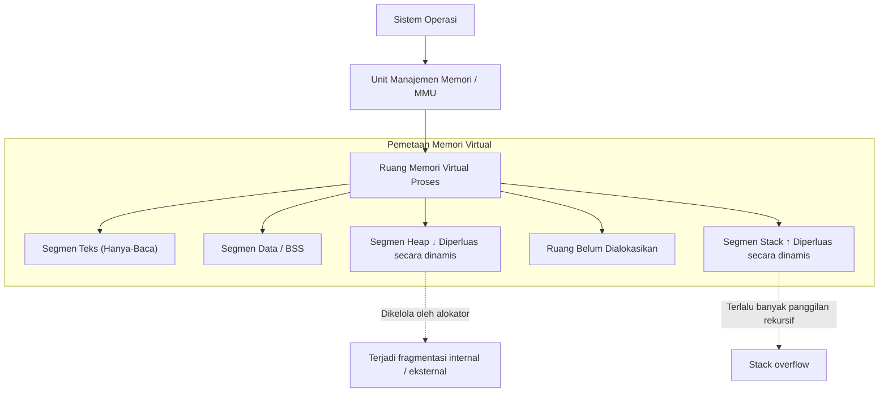
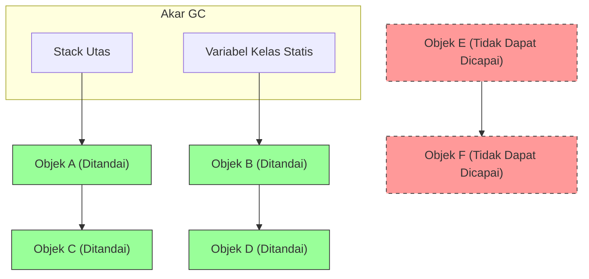
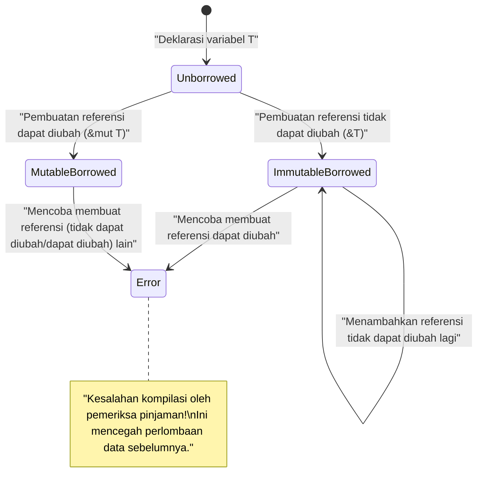

# Selamat Datang di Kebenaran Manajemen Memori: Mengungkap Misteri dari C, Java, dan Rust

Dalam pengembangan perangkat lunak, manajemen memori adalah tema abadi yang tidak dapat dihindari, dan salah satu faktor terpenting yang menentukan kinerja dan stabilitas sistem. Dalam artikel ini, melalui eksplorasi mendalam berskala sekitar 20.000 karakter, kami akan sepenuhnya mencakup segala hal mulai dari teori dasar manajemen memori hingga teknik pengoptimalan dalam arsitektur modern.

Kebebasan dan tanggung jawab **manajemen manual** yang dibawa oleh bahasa C, otomatisasi yang aman melalui **pengumpulan sampah** ( GC ) yang dipopulerkan oleh Java, dan paradigma verifikasi waktu kompilasi yang disebut **kepemilikan** ( Ownership ) yang dihadirkan oleh Rust. Dengan membandingkan dan menganalisis ketiga pendekatan yang sama sekali berbeda ini, kita akan mendekati esensi dari **sejarah dan evolusi** tentang bagaimana bahasa pemrograman berhadapan dengan sumber daya terbatas yang disebut memori.

---

## 1. Struktur Dasar Memori: Stack, Heap, dan Memori Virtual

Saat sebuah program dieksekusi, sistem operasi ( OS ) mengalokasikan area memori abstrak yang disebut "ruang memori virtual" untuk proses tersebut. Dari sudut pandang program, ruang ini terlihat seperti ruang memori besar yang berkelanjutan, tetapi di balik layar, ruang ini dipetakan ke memori fisik ( RAM ) dan area swap oleh mekanisme paging OS.

Ruang memori virtual secara logis dibagi ke dalam segmen-segmen berikut berdasarkan perannya:

1. **Segmen Teks (Text Segment)** : Area di mana instruksi bahasa mesin (kode yang dapat dieksekusi) yang telah dikompilasi disimpan. Biasanya diatur sebagai hanya-baca (read-only) untuk mencegah gangguan.
2. **Segmen Data (Data Segment)** : Area di mana variabel global dan variabel statis yang telah diinisialisasi ditempatkan.
3. **Segmen BSS (BSS Segment)** : Variabel global dan variabel statis yang tidak diinisialisasi ditempatkan di sini, dan dibersihkan ke nol (zero-cleared) saat eksekusi dimulai.
4. **Segmen Stack (Stack Segment)** : Area di mana variabel lokal dan konteks selama pemanggilan fungsi (alamat kembalian, argumen, dll.) ditumpuk.
5. **Segmen Heap (Heap Segment)** : Area untuk mengalokasikan memori secara dinamis selama eksekusi program.

### 1.1 Karakteristik dan Keterbatasan Memori Stack

Stack memiliki struktur data LIFO (Masuk Terakhir, Keluar Pertama), dan memori dialokasikan secara otomatis sebagai bingkai stack saat sebuah fungsi dipanggil, kemudian dibebaskan secara otomatis segera setelah fungsi keluar.
Karena alokasi diselesaikan hanya dengan memindahkan penunjuk stack (stack pointer), ini sangat **cepat**.

Namun, stack memiliki keterbatasan yang krusial. Ukuran stack dibatasi oleh OS (misalnya: di Linux biasanya 8MB), dan mencoba mengalokasikan array raksasa pada stack atau melakukan panggilan rekursif yang terlalu dalam akan menyebabkan **stack overflow**, dan program akan mogok (crash).

### 1.2 Karakteristik dan Kompleksitas Memori Heap

Heap adalah area luas untuk mengalokasikan memori secara dinamis. Ini digunakan untuk menyimpan data yang ukurannya ditentukan saat runtime, atau data yang terus bertahan di luar ruang lingkup fungsi.

Manajemen heap itu kompleks, dan programmer atau runtime harus mengalokasikan dan membebaskannya pada waktu yang tepat. Manajemen heap yang tidak tepat adalah penyebab kebocoran memori (memory leak) dan fragmentasi (Fragmentation) yang akan dibahas nanti.



---

## 2. Bahasa C: Kebebasan Finansial dan Tanggung Jawab Sendiri

Bahasa C memungkinkan kontrol lapisan rendah yang dekat dengan perangkat keras, memberikan pengembang **otoritas penuh** atas manajemen memori. Meskipun ini dapat mengeluarkan performa terbaik, ini juga berarti bahwa kesalahan kecil dapat langsung mengarah pada bug yang fatal dan celah keamanan.

### 2.1 Mekanisme malloc dan free

Alokasi memori dinamis untuk memori heap dalam bahasa C dilakukan secara manual melalui fungsi pustaka standar `malloc` dan `calloc`, dan pembebasannya melalui `free`. Di balik layar, alokator seperti `ptmalloc` atau `jemalloc` bekerja untuk meminta memori dari OS melalui pemanggilan sistem (`brk` atau `mmap`).

```c
#include <stdio.h>
#include <stdlib.h>
#include <string.h>

typedef struct {
    int id;
    char name[50];
} User;

int main() {
    // Mengalokasikan memori secara dinamis untuk struktur User pada area heap
    User *user_ptr = (User*)malloc(sizeof(User));
    
    if (user_ptr == NULL) {
        fprintf(stderr, "Gagal mengalokasikan memori.\n");
        return 1;
    }
    
    // Penulisan data
    user_ptr->id = 1;
    strncpy(user_ptr->name, "Alice", sizeof(user_ptr->name) - 1);
    user_ptr->name[sizeof(user_ptr->name) - 1] = '\0';
    
    printf("ID Pengguna: %d, Nama: %s\n", user_ptr->id, user_ptr->name);
    
    // Pastikan untuk membebaskan memori secara manual setelah selesai digunakan
    free(user_ptr);
    
    // Karena pointer setelah dibebaskan menjadi dangling pointer, tetapkan NULL untuk memastikan keamanan
    user_ptr = NULL;
    
    return 0;
}
```

### 2.2 Mimpi Buruk yang Ditimbulkan oleh Manajemen Memori Manual

Manajemen memori dalam bahasa C dengan mudah menghasilkan bug (kerentanan memori) tipikal seperti berikut ini.

1. **Kebocoran Memori (Memory Leak)** : Fenomena di mana memori yang tidak digunakan tetap ada tanpa dibebaskan karena lupa memanggil `free`. Jika ini terjadi di server yang berjalan lama, pada akhirnya akan menghabiskan memori seluruh sistem dan dimatikan secara paksa oleh pembunuh OOM (Out Of Memory).
2. **Dangling Pointer** : Sebuah pointer yang terus menunjuk ke area memori yang telah dibebaskan oleh `free`. Mencoba mengakses memori melalui pointer ini akan menyebabkan perilaku yang tidak terdefinisi (seperti kesalahan segmentasi / segmentation fault).
3. **Pembebasan Ganda (Double Free)** : Kesalahan memanggil `free` dua kali terhadap pointer area heap yang sama. Ini merusak struktur internal alokator (seperti free list heap) dan menjadi kerentanan keamanan.
4. **Buffer Overflow** : Fenomena menulis data melebihi area memori yang telah dialokasikan. Dengan menimpa data penting atau alamat kembalian yang berdekatan, ini menjadi titik awal serangan yang mengeksekusi kode berbahaya (seperti stack smashing).

Mari kita memodelkannya dengan persamaan matematika. Misalkan jumlah total alokasi heap pada titik waktu $ t $ adalah $ A(t) $ dan jumlah total pembebasan adalah $ F(t) $. Penggunaan memori aktif $ M(t) $ di dalam sistem diwakili oleh integral berikut.

$ M(t) = \int_0^t (A(\tau) - F(\tau)) d\tau $

Pada titik waktu $ T $ saat program selesai secara normal, secara logis ideal jika $ M(T) = 0 $. Namun, jika status $ A(t) > F(t) $ terus berlanjut, $ M(t) $ akan terus meningkat secara monoton dan melampaui batas atas memori fisik sistem $ M_{max} $. Inilah definisi matematis dari **kebocoran memori**.

---

## 3. Java: Revolusi yang Dibawa oleh Pengumpulan Sampah

Java membawa pergeseran paradigma yang besar ke industri perangkat lunak, yang menderita bug memori yang sering terjadi dalam C/C++. Java mengambil kerumitan manajemen memori dari programmer dan mempercayakannya pada **pengumpulan sampah** ( GC ) yang ada di dalam Mesin Virtual Java (JVM). Pengembang kini hanya perlu berfokus pada penulisan logika bisnis dan pembuatan objek.

### 3.1 Dasar GC: Keterjangkauan dan Mark-and-Sweep

GC di Java didasarkan pada konsep "Keterjangkauan (Reachability)". Variabel lokal di stack dan variabel statis didefinisikan sebagai "Akar GC (GC Roots)", dan objek yang referensinya dapat dilacak dari sana dianggap **hidup** (Alive), sedangkan objek yang tidak dapat dilacak dianggap **sampah** (Garbage).

Algoritma yang paling klasik dan mendasar adalah "Mark-and-Sweep".

1. **Fase Mark (Tandai)** : Dimulai dari Akar GC dan menelusuri grafik referensi objek. Ini menambahkan "tanda hidup" ke semua objek yang dapat dijangkau.
2. **Fase Sweep (Sapu)** : Memindai seluruh heap dan memulihkan area memori dari objek yang tidak memiliki tanda ke "daftar ruang kosong (free list)".



Pada gambar di atas, objek hijau ditandai sebagai dapat dijangkau dan dilindungi. Di sisi lain, kumpulan objek yang ditunjukkan oleh garis putus-putus merah secara otomatis memorinya dipulihkan pada fase sweep karena tidak direferensikan dari mana pun.

### 3.2 Perilaku Memori dalam Kode Java

Di Java, objek dialokasikan di heap menggunakan kata kunci `new`, tetapi tidak ada instruksi pembebasan yang setara dengan `free` di C.

```java
import java.util.ArrayList;
import java.util.List;

public class GcExample {
    public static void main(String[] args) {
        // Menghasilkan objek di heap dan mengaitkan referensi ke variabel lokal
        List<String> activeList = new ArrayList<>();
        activeList.add("Data Penting");
        
        // Menghasilkan sejumlah besar objek berumur pendek di dalam ruang lingkup
        for (int i = 0; i < 10000; i++) {
            // objek temp menjadi tidak dapat dicapai pada akhir setiap iterasi loop
            String temp = new String("Data Sementara " + i);
        }
        
        // Pada saat mencapai titik ini, 10.000 objek String menjadi target pengumpulan GC
        // activeList dapat dicapai dari akar GC hingga akhir metode main
        
        // Permintaan eksekusi eksplisit GC (namun, tidak ada jaminan bahwa JVM benar-benar akan mengeksekusinya)
        System.gc();
        
        System.out.println("Program selesai");
    }
}
```

### 3.3 GC Generasional (Generational GC) dan Stop-The-World

JVM modern (seperti HotSpot VM) membagi heap berdasarkan generasi (Generation) untuk efisiensi. Ini didasarkan pada aturan praktis empiris bahwa **"banyak objek menjadi tidak diperlukan segera setelah dibuat (hipotesis generasi lemah)"**.

Heap secara umum dibagi menjadi "Generasi Muda (Young Generation: Ruang Eden, Ruang Survivor)" dan "Generasi Tua (Old Generation: Ruang Tenured)".

- **Minor GC** : Terpicu saat Generasi Muda penuh. Ini memulihkan objek berumur pendek dengan cepat.
- **Major GC / Full GC** : Objek yang bertahan dari beberapa Minor GC dipromosikan (Promote) ke Generasi Tua. Saat Generasi Tua penuh, Full GC yang lebih besar dan memakan waktu akan terpicu.

Saat GC dijalankan, semua utas aplikasi akan dijeda (pause) untuk menjaga konsistensi memori. Ini disebut jeda **Stop-The-World (STW)**. Dalam sistem waktu nyata (real-time) atau sistem keuangan yang memerlukan latensi rendah, STW ini menjadi masalah fatal, sehingga penelitian dan pengenalan algoritma GC terbaru yang meminimalkan STW (seperti G1GC dan ZGC) sedang digalakkan.

---

## 4. Rust: Jalan Ketiga yang Dibawa oleh Kepemilikan dan Peminjaman

"Performa ekstrem melalui manajemen manual" milik C dan "Keamanan memori melalui manajemen otomatis" milik Java. Keduanya telah lama dianggap memiliki hubungan timbal balik (trade-off). Namun, bahasa pemrograman Rust telah mencapai pencapaian luar biasa dengan menyingkirkan pengumpulan sampah (GC) sambil memberikan jaminan 100% atas keamanan memori pada saat kompilasi, dengan memperkenalkan model inovatif yang disebut **"Kepemilikan (Ownership)"**.

### 4.1 Tiga Prinsip Kepemilikan (Ownership)

Sistem kepemilikan yang merupakan inti dari manajemen memori di Rust terdiri dari tiga aturan ketat berikut ini.

1. Setiap nilai di Rust terikat dengan sebuah variabel yang disebut **pemilik (owner)**.
2. Kapan pun, nilai hanya boleh memiliki **satu pemilik**.
3. Saat pemilik **keluar dari ruang lingkup**, nilainya segera dihapus (di-drop).

Dengan aturan ini, Rust secara otomatis memanggil fungsi `drop` pada saat variabel keluar dari ruang lingkup dan membebaskan memori tanpa mengharuskan pengembang menulis `malloc` atau `free`. Tidak ada utas (thread) pemantauan runtime seperti pada GC.

### 4.2 Perpindahan Kepemilikan (Move)

Di Rust, saat Anda menetapkan (assign) variabel ke variabel lain atau meneruskannya ke fungsi berdasarkan nilai, kepemilikan akan "berpindah (Move)". Variabel sumber tidak lagi dapat diakses setelahnya (akan menghasilkan kesalahan kompilasi). Ini membuat pembebasan ganda (Double Free) secara struktural tidak mungkin terjadi.

```rust
fn main() {
    // Mengalokasikan string di heap. s1 menjadi pemiliknya.
    let s1 = String::from("hello, rust");
    
    // Kepemilikan berpindah (move) dari s1 ke s2.
    // Mulai saat ini, s1 dinonaktifkan. Ini adalah salinan dangkal (shallow copy), tetapi untuk mencegah pembebasan ganda, variabel asli dinonaktifkan.
    let s2 = s1; 
    
    // println!("{}", s1); // Kesalahan kompilasi! (nilai dipinjam di sini setelah dipindah)
    println!("s2 memiliki data: {}", s2);
    
} // Akhir ruang lingkup. s2 di-drop, dan memori di heap dibebaskan dengan aman.
```

### 4.3 Peminjaman (Borrowing) dan Waktu Hidup (Lifetime)

Jika semua operasi memindahkan kepemilikan, pemrograman akan menjadi sangat tidak nyaman. Untuk mengakses data tanpa merampas kepemilikan, Rust memiliki konsep **Referensi (Reference)** dan **Peminjaman (Borrowing)**.

Selain itu, **Pemeriksa Pinjaman (Borrow Checker)** bawaan kompilator Rust memaksakan aturan ketat berikut pada saat kompilasi.

- Pada titik waktu mana pun, Anda hanya dapat memiliki **satu referensi yang dapat diubah (`&mut T`)**, atau **sejumlah referensi yang tidak dapat diubah (`&T`)** (keduanya tidak dapat hidup berdampingan. Mencegah Perlombaan Data / Data Race).
- Waktu hidup (masa berlaku) dari sebuah referensi tidak boleh melampaui waktu hidup dari data aslinya (pencegahan mutlak terhadap dangling pointer).

```rust
fn main() {
    let mut data = String::from("Memori");
    
    // Pinjaman tidak dapat diubah (dapat dibuat banyak)
    let r1 = &data;
    let r2 = &data;
    println!("Referensi tidak dapat diubah: {} dan {}", r1, r2);
    // Waktu hidup r1 dan r2 berakhir di sini (karena tidak digunakan lagi setelah ini)
    
    // Pinjaman dapat diubah (hanya dapat dibuat satu)
    let r3 = &mut data;
    r3.push_str(" Manajemen");
    println!("Setelah perubahan dengan referensi dapat diubah: {}", r3);
    
    // Jika mencoba menggunakan r1 dan r3 pada saat yang sama, pemeriksa pinjaman akan menghasilkan kesalahan kompilasi
    // println!("{}, {}", r1, r3); // Kesalahan!
}
```



---

## 5. Pengoptimalan Tercanggih: Lokalitas Data dan Cache CPU

Untuk menguasai manajemen memori, penting untuk melampaui batasan sekadar "alokasi dan pembebasan" dan merangkul arsitektur perangkat keras modern. Itulah konsep **Lokalitas Data (Data Locality)**.

CPU modern sangat cepat, tetapi ada ratusan siklus clock latensi dalam mengakses memori utama (RAM). Untuk menyembunyikan hal ini, CPU dilengkapi dengan hierarki **cache CPU** seperti L1, L2, dan L3.

Saat CPU memuat data dari memori, CPU tidak hanya memuat data itu sendiri, tetapi memuat seluruh blok memori yang berdekatan dengan ukuran tertentu (baris cache / cache line, biasanya 64 byte) ke dalam cache. Ini disebut "Lokalitas Spasial (Spatial Locality)".

### 5.1 Perbedaan Efisiensi Cache Berdasarkan Bahasa

- **C / C++ / Rust** : Saat Anda membuat array dari struktur (`struct Array[100]` atau `Vec<MyStruct>`), data tersebut ditempatkan secara berurutan dan padat di memori tanpa celah. Saat melakukan pengulangan pada array, prefetcher perangkat keras CPU berfungsi dengan sempurna, sehingga tingkat rasio hit cache (cache hit rate) meningkat secara dramatis.
- **Java** : Array objek Java (`MyObject[]`) bukanlah entitas (nilai aslinya), melainkan array "referensi (pointer) ke objek". Karena setiap objek aktual dialokasikan di tempat yang tersebar di heap, setiap kali terjadi pengulangan, sistem mengikuti pointer untuk mengakses alamat memori yang acak, menyebabkan kesalahan cache (Cache Miss) berturut-turut yang parah.

Waktu rata-rata akses memori efektif $ T_{avg} $ dinyatakan sebagai berikut.

$ T_{avg} = h \cdot T_{cache} + (1 - h) \cdot T_{memory} $

Di mana, $ h $ adalah rasio hit cache ( $ 0 \le h \le 1 $ ), $ T_{cache} $ adalah waktu akses cache (sekitar 1~4 ns), dan $ T_{memory} $ adalah waktu akses memori utama (sekitar 100 ns).
Dengan menjadikan $ h $ mendekati 0.99 (pendekatan C/Rust) dibandingkan menurunkannya ke 0.5 (pengejaran pointer ala Java), akan tercipta perbedaan kecepatan eksekusi perulangan (looping) aplikasi puluhan kali lipat. Inilah alasan sebenarnya mengapa C++ atau Rust dipilih dalam mesin game atau sistem perdagangan berfrekuensi tinggi (high-frequency trading system).

---

## 6. Kesimpulan: Menuju Pemilihan Teknologi yang Tepat pada Tempatnya

Dalam artikel ini, kita telah menggali lebih dalam 3 paradigma manajemen memori yang sama sekali berbeda.

| Bahasa | Pendekatan | Keuntungan | Kerugian / Masalah |
|:---:|:---|:---|:---|
| **C** | Manajemen manual dengan `malloc/free` | Kecepatan tertinggi, efisiensi cache maksimum, ringan | Sarang kerentanan (kebocoran, pembebasan ganda), biaya pengembangan tinggi |
| **Java** | GC (Pengumpulan Sampah) | Peningkatan kecepatan pengembangan, terjaminnya keamanan memori | Fluktuasi latensi akibat STW, memburuknya efisiensi cache |
| **Rust** | Kepemilikan & Pemeriksa Pinjaman | Keamanan dengan biaya runtime nol, kecepatan tinggi | Kurva pembelajaran yang curam, kesulitan dalam mendesain waktu hidup (lifetime) |

Sejarah **manajemen memori** adalah permainan jungkat-jungkit yang berayun di antara performa dan keamanan. GC diciptakan untuk mencegah tragedi akibat manajemen manual, dan model kepemilikan ditemukan untuk menghindari penalti performa dari GC.

Saat merancang sebuah sistem, alih-alih membuat keputusan picik seperti "Gunakan Rust karena tercepat" atau "Gunakan Java karena aman," membandingkan persyaratan sistem (keketatan terhadap latensi, sumber daya pengembangan, kemudahan pemeliharaan) dengan **kebenaran** di balik manajemen memori, dan memilih teknologi yang paling optimal adalah jalan untuk menjadi seorang insinyur kelas satu.
