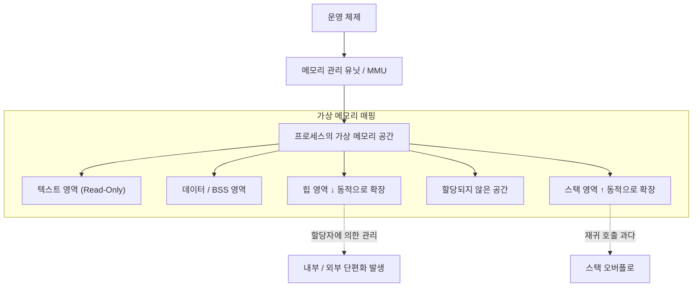
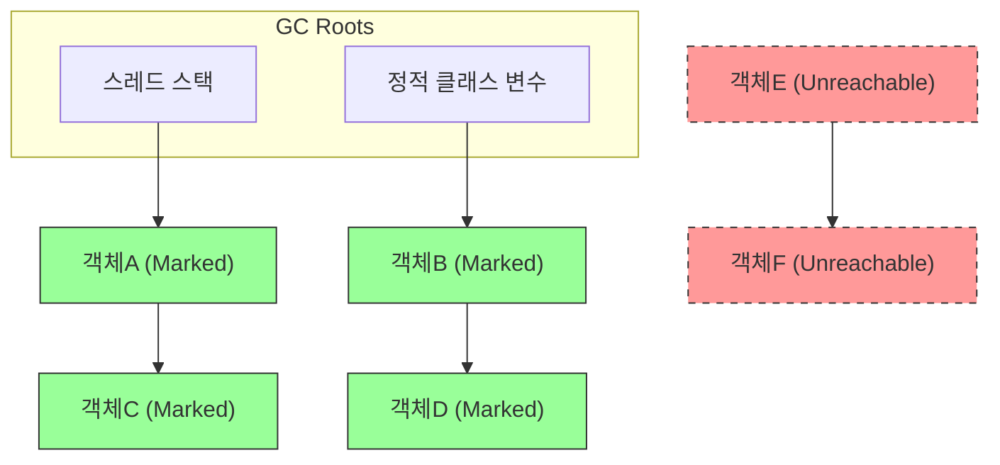
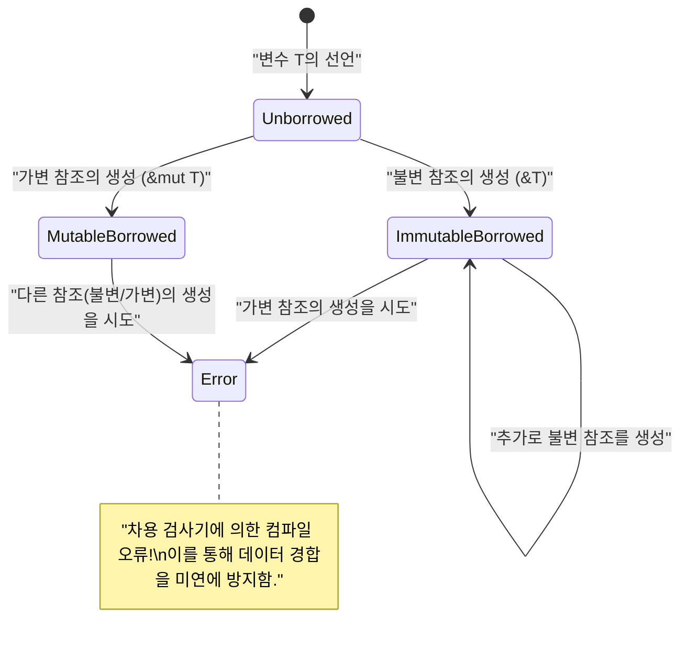

# 메모리 관리의 진실에 오신 것을 환영합니다: C, [Java](https://kenji.blog/ko/p/programming-languages-history-paradigm-evolution/), [Rust](https://kenji.blog/ko/p/webassembly-wasm-current-future/)로 풀어보는 심연

소프트웨어 개발에서 메모리 관리는 피할 수 없는 영원한 과제이며, 시스템의 성능과 안정성을 결정짓는 가장 중요한 요소 중 하나입니다. 본 기사에서는 약 20,000자에 필적하는 압도적인 깊이 있는 탐구를 통해 메모리 관리의 기초 이론부터 현대 아키텍처의 최적화 기법까지 완벽하게 망라합니다.

C언어가 가져다준 **수동 관리** 의 자유와 책임, [Java](https://kenji.blog/ko/p/programming-languages-history-paradigm-evolution/)가 대중화시킨 **가비지 컬렉션** ( GC )에 의한 안전한 자동화, 그리고 [Rust](https://kenji.blog/ko/p/programming-languages-history-paradigm-evolution/)가 제시한 **소유권** ( Ownership )이라는 컴파일 타임 검증의 패러다임. 이 세 가지 전혀 다른 접근 방식을 비교, 분석함으로써 프로그래밍 언어가 메모리라는 제한된 리소스에 어떻게 대응해 왔는지 그 **역사와 진화** 의 본질에 다가갑니다.

---

## 1. 메모리의 기본 구조: 스택, 힙, 그리고 가상 메모리

프로그램이 실행될 때 운영 체제( OS )는 프로세스에 대해 "가상 메모리 공간"이라는 추상화된 메모리 영역을 할당합니다. 이 공간은 프로그램 입장에서 보면 연속된 거대한 메모리 공간으로 보이지만, 그 이면에서는 OS의 페이징 메커니즘을 통해 물리적 메모리( RAM )나 스왑 영역에 매핑되어 있습니다.

가상 메모리 공간은 그 역할에 따라 주로 다음의 세그먼트로 논리적으로 분할됩니다.

1. **텍스트 영역 (Text Segment)** : 컴파일된 기계어 명령(실행 가능 코드)이 저장되는 영역. 보통 변조를 방지하기 위해 읽기 전용으로 설정됩니다.
2. **데이터 영역 (Data Segment)** : 초기화된 전역 변수나 정적( static ) 변수가 배치되는 영역.
3. **BSS 영역 (BSS Segment)** : 초기화되지 않은 전역 변수나 정적 변수가 배치되며, 실행 시작 시에 0으로 클리어됩니다.
4. **스택 영역 ([Stack](https://kenji.blog/ko/p/c-language-pointers-memory-management-stack-heap/) Segment)** : 지역 변수나 함수 호출 시의 컨텍스트(복귀 주소, 인수 등)가 쌓이는 영역.
5. **힙 영역 ([Heap](https://kenji.blog/ko/p/c-language-pointers-memory-management-stack-heap/) Segment)** : 프로그램 실행 시 동적으로 메모리를 할당하기 위한 영역.

### 1.1 스택 메모리의 특성과 한계

스택은 LIFO(후입선출) 데이터 구조를 가지며, 함수 호출 시 스택 프레임으로 메모리가 자동으로 확보되고 함수를 빠져나옴과 동시에 자동으로 해제됩니다.
스택 포인터를 이동시키는 것만으로 할당이 완료되기 때문에 매우 **빠릅니다** .

하지만 스택에는 결정적인 한계가 있습니다. 스택 크기는 OS에 의해 제한되어 있으며(예: Linux에서는 보통 8MB), 거대한 배열을 스택에 확보하려고 하거나 너무 깊은 재귀 호출을 수행하면 **스택 오버플로** 가 발생하여 프로그램이 크래시(충돌)됩니다.

### 1.2 힙 메모리의 특성과 복잡성

힙은 동적으로 메모리를 할당하기 위한 광대한 영역입니다. 실행 시에 크기가 결정되는 데이터나, 함수의 범위를 넘어 계속 살아남는 데이터를 저장하는 데 사용됩니다.

힙 관리는 복잡하며, 프로그래머 또는 런타임이 적절한 타이밍에 할당과 해제를 수행해야 합니다. 부적절한 힙 관리는 후술할 메모리 누수나 단편화( Fragmentation )를 일으키는 원인이 됩니다.



---

## 2. C언어: 궁극의 자유와 자기 책임

C언어는 하드웨어에 가까운 낮은 수준의 제어를 가능하게 하며, 개발자에게 메모리 관리의 **완전한 권한** 을 부여했습니다. 이는 최고의 성능을 끌어낼 수 있는 반면, 작은 실수가 치명적인 버그나 보안 취약점으로 직결됨을 의미합니다.

### 2.1 malloc과 free의 메커니즘

C언어에서 힙 메모리의 동적 확보는 표준 라이브러리 함수인 `malloc` 이나 `calloc` , 해제는 `free` 에 의해 수동으로 이루어집니다. 이면에서는 `ptmalloc` 이나 `jemalloc` 등의 할당자가 동작하며, 시스템 호출( `brk` 이나 `mmap` )을 통해 OS에 메모리를 요청합니다.

```c
#include <stdio.h>
#include <stdlib.h>
#include <string.h>

typedef struct {
    int id;
    char name[50];
} User;

int main() {
    // 힙 영역에 User 구조체용 메모리를 동적으로 확보
    User *user_ptr = (User*)malloc(sizeof(User));
    
    if (user_ptr == NULL) {
        fprintf(stderr, "메모리 할당에 실패했습니다.\n");
        return 1;
    }
    
    // 데이터 쓰기
    user_ptr->id = 1;
    strncpy(user_ptr->name, "Alice", sizeof(user_ptr->name) - 1);
    user_ptr->name[sizeof(user_ptr->name) - 1] = '\0';
    
    printf("User ID: %d, Name: %s\n", user_ptr->id, user_ptr->name);
    
    // 사용이 끝나면 반드시 수동으로 메모리를 해제한다
    free(user_ptr);
    
    // 해제 후의 포인터는 댕글링 포인터가 되므로, NULL을 대입하여 안전을 확보
    user_ptr = NULL;
    
    return 0;
}
```

### 2.2 수동 메모리 관리가 초래하는 악몽

C언어에서의 메모리 관리는 다음과 같은 전형적인 버그(메모리 취약점)를 쉽게 만들어냅니다.

1. **메모리 누수 (Memory Leak)** : `free` 호출을 잊어버림으로써 사용되지 않는 메모리가 해제되지 않고 계속 남아있는 현상. 장시간 가동되는 서버 등에서 발생하면 최종적으로 시스템 전체의 메모리를 다 써버리고, OOM(Out Of Memory) 킬러에 의해 강제 종료됩니다.
2. **댕글링 포인터 (Dangling [Pointer](https://kenji.blog/ko/p/c-language-pointers-memory-management-stack-heap/))** : 이미 `free` 로 해제된 메모리 영역을 계속 가리키는 포인터. 이 포인터를 거쳐 메모리 액세스를 시도하면 정의되지 않은 동작(세그먼테이션 폴트 등)을 일으킵니다.
3. **이중 해제 (Double Free)** : 같은 힙 영역의 포인터에 대해 두 번 `free` 를 호출해버리는 오류. 할당자의 내부 구조(힙의 프리 리스트 등)를 파괴하여 보안상의 취약점이 됩니다.
4. **버퍼 오버플로 (Buffer Overflow)** : 확보된 메모리 영역을 넘어 데이터를 써버리는 현상. 인접한 중요한 데이터나 반환 주소를 덮어씀으로써 악의적인 코드를 실행시키는 공격(스택 스매싱 등)의 실마리가 됩니다.

수식으로 모델화해 봅시다. 어떤 시점 $ t $ 에서의 힙의 총 할당량을 $ A(t) $ , 총 해제량을 $ F(t) $ 라고 합니다. 시스템 내의 활성 메모리 사용량 $ M(t) $ 는 다음의 적분으로 표현됩니다.

$ M(t) = \int_0^t (A(\tau) - F(\tau)) d\tau $

프로그램이 정상적으로 종료되는 시점 $ T $ 에서는 논리적으로 $ M(T) = 0 $ 이 되는 것이 이상적입니다. 그러나 만약 $ A(t) > F(t) $ 인 상태가 계속 유지된다면, $ M(t) $ 는 단조 증가를 계속하여 시스템의 물리 메모리 상한 $ M_{max} $ 를 돌파합니다. 이것이 **메모리 누수** 의 수학적인 정의입니다.

---

## 3. [Java](https://kenji.blog/ko/p/programming-languages-history-paradigm-evolution/): 가비지 컬렉션이 가져온 혁명

C/C++에서 빈발하는 메모리 버그로 고통받던 소프트웨어 업계에 큰 패러다임 전환을 가져온 것이 Java입니다. Java는 메모리 관리의 복잡성을 프로그래머로부터 거두어, Java 가상 머신( JVM )에 내장된 **가비지 컬렉션** ( GC )에 맡겼습니다. 개발자는 비즈니스 로직 작성과 객체 생성에만 집중할 수 있게 되었습니다.

### 3.1 GC의 기본: 도달 가능성과 Mark-and-Sweep

Java의 GC는 "도달 가능성( Reachability )"이라는 개념에 기반하고 있습니다. 스택 상의 지역 변수나 정적 변수 등을 "GC 루트"로 정의하고, 그곳으로부터 참조를 따라갈 수 있는 객체를 **생존** ( Alive ), 따라갈 수 없는 객체를 **가비지** ( Garbage = 쓰레기)로 판정합니다.

가장 고전적이고 기초적인 알고리즘이 " Mark-and-Sweep "입니다.

1. **Mark(마크) 단계** : GC 루트에서 시작하여 객체의 참조 그래프를 순회(트래버스)합니다. 도달 가능한 모든 객체에 "생존 마크"를 부여합니다.
2. **Sweep(스위프) 단계** : 힙 전체를 스캔하여 마크가 부여되지 않은 객체의 메모리 영역을 "빈 영역 리스트(프리 리스트)"로 회수합니다.



위의 그림에서 녹색 객체는 도달 가능한 것으로 마크되어 보호됩니다. 반면에 빨간색 점선으로 표시된 객체 집합은 어디에서도 참조되지 않기 때문에 스위프 단계에서 자동으로 메모리가 회수됩니다.

### 3.2 [Java](https://kenji.blog/ko/p/programming-languages-history-paradigm-evolution/) 코드에서의 메모리 동작

Java에서는 `new` 키워드로 힙에 객체를 할당하지만, C언어의 `free` 에 해당하는 해제 명령은 존재하지 않습니다.

```java
import java.util.ArrayList;
import java.util.List;

public class GcExample {
    public static void main(String[] args) {
        // 힙에 객체를 생성하고, 참조를 지역 변수에 연결
        List<String> activeList = new ArrayList<>();
        activeList.add("Important Data");
        
        // 스코프 내에서 대량의 수명이 짧은 객체를 생성
        for (int i = 0; i < 10000; i++) {
            // temp 객체는 루프의 각 반복 종료 시에 도달 불가능해짐
            String temp = new String("Temporary Data " + i);
        }
        
        // 여기에 도달한 시점에서 10,000개의 String 객체는 GC의 회수 대상이 됨
        // activeList 는 main 메서드의 끝까지 GC 루트로부터 도달 가능
        
        // 명시적인 GC 실행 요청 (단, JVM이 실제로 실행할지는 보장되지 않음)
        System.gc();
        
        System.out.println("프로그램 종료");
    }
}
```

### 3.3 세대별 GC(Generational GC)와 Stop-The-World

현대의 JVM(HotSpot VM 등)은 효율성을 위해 힙을 세대( Generation )로 분할하고 있습니다. 이는 **"많은 객체는 생성되고 바로 불필요해진다(약한 세대 가설)"** 는 경험 법칙에 기반하고 있습니다.

힙은 크게 "Young 세대( Eden 공간, Survivor 공간 )"와 "Old 세대( Tenured 공간 )"로 나뉩니다.

- **Minor GC** : Young 세대가 가득 차면 발동합니다. 수명이 짧은 객체를 고속으로 회수합니다.
- **Major GC / Full GC** : 몇 번의 Minor GC를 살아남은 객체는 Old 세대로 승격( Promote )됩니다. Old 세대가 가득 차면 더 대규모이고 시간이 걸리는 Full GC가 발동합니다.

GC가 실행될 때 메모리의 일관성을 유지하기 위해 애플리케이션의 모든 스레드가 일시 정지합니다. 이를 **Stop-The-World (STW)** 일시 정지라고 부릅니다. 실시간 시스템이나 낮은 지연 시간이 요구되는 금융 시스템에서 이 STW는 치명적인 문제가 되기 때문에, G1GC나 ZGC와 같이 STW를 극력 단축하는 최신 GC 알고리즘의 연구 및 도입이 진행되고 있습니다.

---

## 4. [Rust](https://kenji.blog/ko/p/webassembly-wasm-current-future/): 소유권과 차용이 가져오는 제3의 길

C언어의 "수동 관리에 의한 극한의 성능"과 [Java](https://kenji.blog/ko/p/programming-languages-history-paradigm-evolution/)의 "자동 관리에 의한 메모리 안전성". 이 두 가지는 오랫동안 트레이드오프 관계에 있다고 여겨져 왔습니다. 하지만 [Rust](https://kenji.blog/ko/p/programming-languages-history-paradigm-evolution/) 언어는 **"소유권( Ownership )"** 이라는 획기적인 모델을 도입함으로써, 가비지 컬렉션을 배제하면서 컴파일 시에 메모리 안전성을 100% 보장하는 위업을 달성했습니다.

### 4.1 소유권(Ownership)의 3원칙

Rust의 메모리 관리의 근간을 이루는 소유권 시스템은 다음의 세 가지 엄격한 규칙으로 구성되어 있습니다.

1. Rust의 각각의 값은 **소유자( owner )** 라고 불리는 변수와 연결되어 있다.
2. 어떠한 경우에도 값의 **소유자는 단 하나** 이다.
3. 소유자가 **스코프를 벗어나면** , 값은 즉시 파기(드롭)된다.

이 규칙에 의해 Rust는 개발자에게 `malloc` 이나 `free` 를 작성하게 하지 않고, 변수가 스코프를 벗어나는 순간 자동으로 `drop` 함수를 호출하여 메모리를 해제합니다. GC와 같은 런타임의 감시 스레드는 존재하지 않습니다.

### 4.2 소유권의 이동(Move)

[Rust](https://kenji.blog/ko/p/webassembly-wasm-current-future/)에서는 변수를 다른 변수에 대입하거나 함수에 값으로 전달하면 소유권이 "이동( Move )"합니다. 이동된 원래 변수는 그 후로 접근할 수 없게 됩니다(컴파일 오류가 발생합니다). 이로 인해 이중 해제(Double Free)가 구조적으로 불가능해집니다.

```rust
fn main() {
    // 힙에 문자열을 확보. s1이 소유자가 됨.
    let s1 = String::from("hello, rust");
    
    // s1에서 s2로 소유권이 이동(무브)함.
    // 이 순간부터 s1은 무효화됨. 얕은 복사(섀로우 카피)지만, 이중 해제를 막기 위해 원래 변수를 무효로 함.
    let s2 = s1; 
    
    // println!("{}", s1); // 컴파일 오류! (value borrowed here after move)
    println!("s2 owns the data: {}", s2);
    
} // 스코프 종료. s2가 드롭되고, 힙의 메모리가 안전하게 해제됨.
```

### 4.3 차용(Borrowing)과 라이프타임

모든 조작에서 소유권을 이동시키면 프로그래밍이 매우 불편해집니다. 소유권을 빼앗지 않고 데이터에 접근하기 위해, [Rust](https://kenji.blog/ko/p/webassembly-wasm-current-future/)에는 **참조( Reference )** 와 **차용( Borrowing )** 의 개념이 있습니다.

게다가 [Rust](https://kenji.blog/ko/p/programming-languages-history-paradigm-evolution/) 컴파일러에 내장된 **차용 검사기( Borrow Checker )** 는 다음의 엄격한 규칙을 컴파일 시에 강제합니다.

- 임의의 타이밍에 **하나의 가변 참조( `&mut T` )** 또는 **임의의 개수의 불변 참조( `&T` )** 중 어느 한쪽만을 가질 수 있다(동시 공존 불가. 데이터 경합 방지).
- 참조의 라이프타임(유효 기간)은 원래 데이터의 라이프타임을 초과해서는 안 된다(댕글링 포인터의 완벽한 방지).

```rust
fn main() {
    let mut data = String::from("Memory");
    
    // 불변한 차용 (여러 개 생성 가능)
    let r1 = &data;
    let r2 = &data;
    println!("불변 참조: {} and {}", r1, r2);
    // r1, r2의 라이프타임은 여기서 끝남 (이후 사용되지 않기 때문)
    
    // 가변한 차용 (1개만 생성 가능)
    let r3 = &mut data;
    r3.push_str(" Management");
    println!("가변 참조로 변경 후: {}", r3);
    
    // r1과 r3를 동시에 사용하려고 하면, 차용 검사기가 컴파일 오류를 냄
    // println!("{}, {}", r1, r3); // Error!
}
```



---

## 5. 최첨단의 최적화: 데이터 지역성과 CPU 캐시

메모리 관리를 마스터하는 데 있어 단순한 "할당과 해제"의 틀을 넘어 현대 하드웨어 아키텍처에 다가가는 것이 중요합니다. 그것이 바로 **데이터 지역성( Data Locality )** 이라는 개념입니다.

현대의 CPU는 매우 빠르지만, 메인 메모리( RAM )에 접근하는 데는 수백 클록 사이클의 지연이 발생합니다. 이를 숨기기 위해 CPU에는 L1, L2, L3와 같은 계층적인 **CPU 캐시** 가 탑재되어 있습니다.

CPU가 메모리에서 데이터를 읽어 들일 때, 그 데이터뿐만 아니라 인접한 일정 크기(캐시 라인, 보통 64바이트)의 메모리 블록을 통째로 캐시에 로드합니다. 이를 "공간적 지역성( Spatial Locality )"이라고 부릅니다.

### 5.1 언어별 캐시 효율성의 차이

- **C / C++ / [Rust](https://kenji.blog/ko/p/webassembly-wasm-current-future/)** : 구조체의 배열( `struct Array[100]` 이나 `Vec<MyStruct>` )을 생성하면, 데이터는 메모리상에 빈틈없이 연속해서 배치됩니다. 배열을 루프 처리할 때 CPU의 하드웨어 프리페처가 완벽하게 기능하여 캐시 적중률이 비약적으로 높아집니다.
- **[Java](https://kenji.blog/ko/p/programming-languages-history-paradigm-evolution/)** : Java의 객체 배열( `MyObject[]` )은 실체가 아니라 "객체에 대한 참조(포인터)"의 배열입니다. 실체가 되는 각 객체는 힙의 제각각인 장소에 할당되므로, 루프 처리 때마다 포인터를 따라 무작위 메모리 주소로 접근하게 되어 심각한 캐시 미스( Cache Miss )를 연발합니다.

메모리 액세스의 실효 평균 시간 $ T_{avg} $ 는 다음과 같이 표현됩니다.

$ T_{avg} = h \cdot T_{cache} + (1 - h) \cdot T_{memory} $

여기서 $ h $ 는 캐시 적중률( $ 0 \le h \le 1 $ ), $ T_{cache} $ 는 캐시 접근 시간(약 1〜4 ns), $ T_{memory} $ 는 메인 메모리 접근 시간(약 100 ns)입니다.
$ h $ 를 0.99로 만들 것인지(C/[Rust](https://kenji.blog/ko/p/webassembly-wasm-current-future/)적 접근) 아니면 0.5로 떨어뜨려 버릴 것인지(Java적 포인터 체이스)에 따라, 애플리케이션의 루프 실행 속도에서 수십 배의 차이가 발생합니다. 이것이 게임 엔진이나 고빈도 거래 시스템에서 C++나 [Rust](https://kenji.blog/ko/p/programming-languages-history-paradigm-evolution/)가 선택되는 진정한 이유입니다.

---

## 6. 요약: 적재적소의 기술 선정으로

본 기사에서는 3가지 전혀 다른 메모리 관리 패러다임을 깊이 탐구했습니다.

| 언어 | 접근 방식 | 장점 | 단점 및 과제 |
|:---:|:---|:---|:---|
| **C** | `malloc/free` 에 의한 수동 관리 | 궁극의 속도, 캐시 효율성 최대화, 가벼움 | 취약점의 온상(누수, 이중 해제), 높은 개발 비용 |
| **[Java](https://kenji.blog/ko/p/programming-languages-history-paradigm-evolution/)** | GC (가비지 컬렉션) | 개발 속도 향상, 메모리 안전성 보장 | STW로 인한 지연 시간의 불안정성, 캐시 효율성 악화 |
| **[Rust](https://kenji.blog/ko/p/webassembly-wasm-current-future/)** | 소유권 및 차용 검사기 | 런타임 비용 제로의 안전성, 고속 | 가파른 학습 곡선, 라이프타임 설계의 어려움 |

**메모리 관리** 의 역사는 성능과 안전성 사이에서 흔들리는 시소게임이었습니다. 수동 관리로 인한 참극을 막기 위해 GC가 탄생했고, GC의 성능 페널티를 피하기 위해 소유권 모델이 발명되었습니다.

우리가 시스템을 설계할 때 "가장 빠르니까 [Rust](https://kenji.blog/ko/p/programming-languages-history-paradigm-evolution/)를 쓴다", "안전하니까 [Java](https://kenji.blog/ko/p/programming-languages-history-paradigm-evolution/)를 쓴다" 같은 단락적인 결정이 아니라, 시스템의 요구 사항(지연 시간에 대한 엄격함, 개발 리소스, 유지 보수성)과 그 이면에 있는 메모리 관리의 **진실** 을 대조해 본 후에 최적의 기술을 선택하는 것이야말로 일류 엔지니어로 가는 길이라고 할 수 있을 것입니다.
