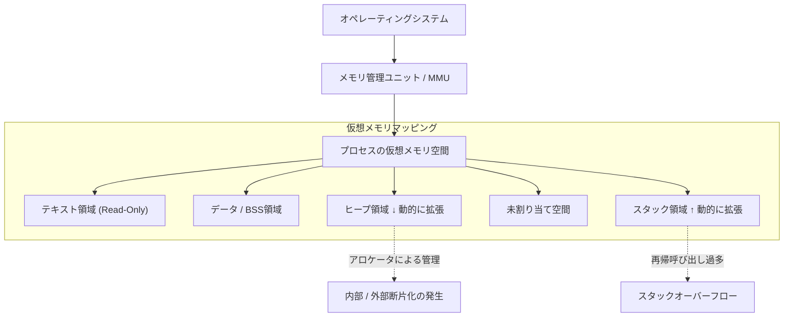
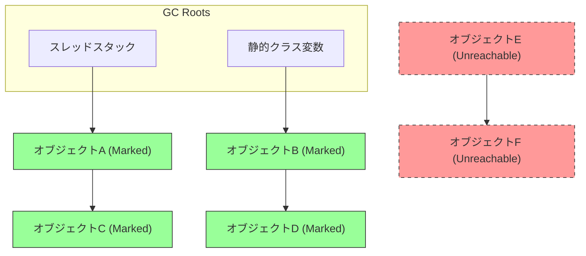
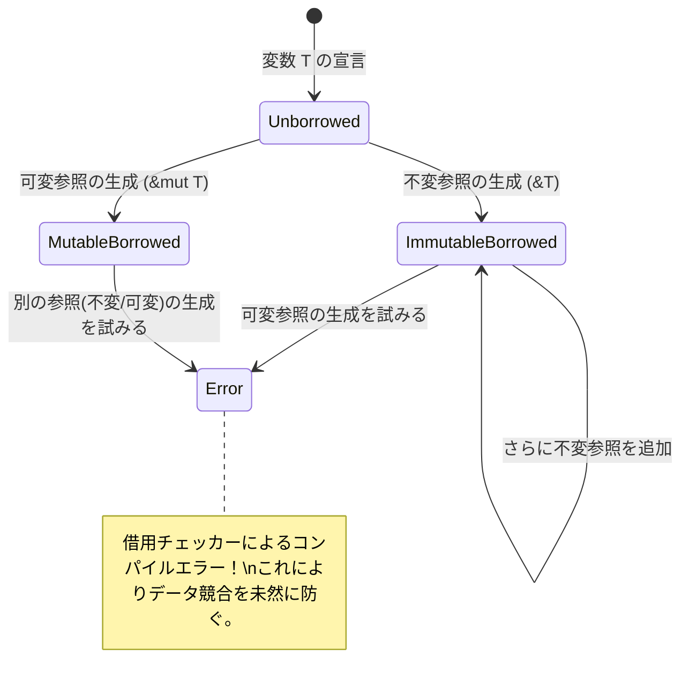

# [メモリ管理](https://kenji.blog/p/c-language-pointers-memory-management-stack-heap/)の真実へようこそ：C、Java、[Rust](https://kenji.blog/p/webassembly-wasm-current-future/)から紐解く深淵

ソフトウェア開発において、[メモリ管理](https://kenji.blog/p/c-language-pointers-memory-management-stack-heap/)は避けて通れない永遠のテーマであり、システムのパフォーマンスや安定性を決定づける最も重要な要素の一つです。本記事では、約20,000字規模に匹敵する圧倒的な深掘りを通じて、メモリ管理の基礎理論から、近代アーキテクチャにおける最適化手法までを完全に網羅します。

[C言語](https://kenji.blog/p/c-language-pointers-memory-management-stack-heap/)がもたらした **手動管理** の自由と責任、Javaが普及させた **ガベージコレクション** （ GC ）による安全な自動化、そしてRustが提示した **所有権** （ Ownership ）というコンパイル時検証のパラダイム。これら3つの全く異なるアプローチを比較・分析することで、[プログラミング言語](https://kenji.blog/p/programming-languages-history-paradigm-evolution/)がメモリという限られたリソースにどう向き合ってきたか、その **歴史と進化** の本質に迫ります。

---

## 1. メモリの基本構造：[スタック](https://kenji.blog/p/c-language-pointers-memory-management-stack-heap/)、[ヒープ](https://kenji.blog/p/c-language-pointers-memory-management-stack-heap/)、そして仮想メモリ

プログラムが実行される際、オペレーティングシステム（ OS ）はプロセスに対して「仮想メモリ空間」という抽象化されたメモリ領域を割り当てます。この空間は、プログラムから見れば連続した巨大なメモリ空間に見えますが、背後ではOSのページング機構によって物理メモリ（ RAM ）やスワップ領域にマッピングされています。

仮想メモリ空間は、その役割に応じて主に以下のセグメントに論理的に分割されています。

1. **テキスト領域 (Text Segment)** : コンパイルされた機械語の命令（実行可能コード）が格納される領域。通常、改ざんを防ぐために読み取り専用に設定されます。
2. **データ領域 (Data Segment)** : 初期化済みのグローバル変数や静的（ static ）変数が配置される領域。
3. **BSS領域 (BSS Segment)** : 初期化されていないグローバル変数や静的変数が配置され、実行開始時にゼロクリアされます。
4. **スタック領域 ([Stack](https://kenji.blog/p/c-language-pointers-memory-management-stack-heap/) Segment)** : ローカル変数や関数呼び出し時のコンテキスト（戻り先[アドレス](https://kenji.blog/p/c-language-pointers-memory-management-stack-heap/)、引数など）が積まれる領域。
5. **ヒープ領域 ([Heap](https://kenji.blog/p/c-language-pointers-memory-management-stack-heap/) Segment)** : プログラムの実行時に動的にメモリを割り当てるための領域。

### 1.1 スタックメモリの特性と限界

スタックはLIFO（後入れ先出し）のデータ構造を持ち、関数呼び出し時にスタックフレームとしてメモリが自動的に確保され、関数を抜けると同時に自動で解放されます。
スタック[ポインタ](https://kenji.blog/p/c-language-pointers-memory-management-stack-heap/)を移動させるだけでアロケーションが完了するため、極めて **高速** です。

しかし、スタックには決定的な限界があります。スタックサイズはOSによって制限されており（例: Linuxでは通常8MB）、巨大な配列をスタックに確保しようとしたり、深すぎる再帰呼び出しを行ったりすると **スタックオーバーフロー** が発生し、プログラムはクラッシュします。

### 1.2 ヒープメモリの特性と複雑性

ヒープは動的にメモリを割り当てるための広大な領域です。実行時にサイズが決定するデータや、関数のスコープを越えて生存し続けるデータを格納するために使用されます。

ヒープの管理は複雑であり、プログラマあるいはランタイムが適切なタイミングで割り当てと解放を行う必要があります。不適切なヒープ管理は、後述するメモリリークや断片化（ Fragmentation ）を引き起こす原因となります。



---

## 2. [C言語](https://kenji.blog/p/c-language-pointers-memory-management-stack-heap/)：究極の自由と自己責任

C言語は、ハードウェアに近い低レイヤーの制御を可能にし、開発者に[メモリ管理](https://kenji.blog/p/c-language-pointers-memory-management-stack-heap/)の **完全な権限** を与えました。これは最高のパフォーマンスを引き出せる反面、少しのミスが致命的なバグやセキュリティホールに直結することを意味します。

### 2.1 mallocとfreeのメカニズム

C言語における[ヒープ](https://kenji.blog/p/c-language-pointers-memory-management-stack-heap/)メモリの動的確保は標準ライブラリ関数の `malloc` や `calloc` 、解放は `free` によって手動で行われます。背後では `ptmalloc` や `jemalloc` などのアロケータが働き、システムコール（ `brk` や `mmap` ）を通じてOSからメモリを要求します。

```c
#include <stdio.h>
#include <stdlib.h>
#include <string.h>

typedef struct {
    int id;
    char name[50];
} User;

int main() {
    // ヒープ領域にUser構造体用のメモリを動的に確保
    User *user_ptr = (User*)malloc(sizeof(User));
    
    if (user_ptr == NULL) {
        fprintf(stderr, "メモリの割り当てに失敗しました。\n");
        return 1;
    }
    
    // データの書き込み
    user_ptr->id = 1;
    strncpy(user_ptr->name, "Alice", sizeof(user_ptr->name) - 1);
    user_ptr->name[sizeof(user_ptr->name) - 1] = '\0';
    
    printf("User ID: %d, Name: %s\n", user_ptr->id, user_ptr->name);
    
    // 使用が終わったら必ず手動でメモリを解放する
    free(user_ptr);
    
    // 解放後のポインタはダングリングポインタとなるため、NULLを代入して安全を確保
    user_ptr = NULL;
    
    return 0;
}
```

### 2.2 手動[メモリ管理](https://kenji.blog/p/c-language-pointers-memory-management-stack-heap/)が引き起こす悪夢

[C言語](https://kenji.blog/p/c-language-pointers-memory-management-stack-heap/)でのメモリ管理は、以下のような典型的なバグ（メモリの[脆弱性](https://kenji.blog/p/web-application-vulnerability-owasp-top-10/)）を容易に生み出します。

1. **メモリリーク (Memory Leak)** : `free` を呼び忘れることで、使用されないメモリが解放されずに残り続ける現象。長時間稼働するサーバーなどで発生すると、最終的にシステム全体のメモリを食いつぶし、OOM（Out Of Memory）キラーによって強制終了させられます。
2. **ダングリング[ポインタ](https://kenji.blog/p/c-language-pointers-memory-management-stack-heap/) (Dangling Pointer)** : すでに `free` で解放されたメモリ領域を指し示し続ける[ポインタ](https://kenji.blog/p/c-language-pointers-memory-management-stack-heap/)。このポインタ経由でメモリアクセスを試みると、未定義動作（セグメンテーションフォールトなど）を引き起こします。
3. **ダブルフリー (Double Free)** : 同じ[ヒープ](https://kenji.blog/p/c-language-pointers-memory-management-stack-heap/)領域のポインタに対して二度 `free` を呼び出してしまうエラー。アロケータの内部構造（ヒープのフリーリストなど）を破壊し、セキュリティ上の[脆弱性](https://kenji.blog/p/web-application-vulnerability-owasp-top-10/)となります。
4. **バッファオーバーフロー (Buffer Overflow)** : 確保されたメモリ領域を超えてデータを書き込んでしまう現象。隣接する重要なデータやリターン[アドレス](https://kenji.blog/p/c-language-pointers-memory-management-stack-heap/)を書き換えることで、悪意のあるコードを実行させる攻撃（[スタック](https://kenji.blog/p/c-language-pointers-memory-management-stack-heap/)スマッシングなど）の糸口となります。

数式でモデル化してみましょう。ある時点 $ t $ における[ヒープ](https://kenji.blog/p/c-language-pointers-memory-management-stack-heap/)の総割り当て量を $ A(t) $ 、総解放量を $ F(t) $ とします。システム内のアクティブなメモリ使用量 $ M(t) $ は、以下の積分で表されます。

$$ M(t) = \int_0^t (A(\tau) - F(\tau)) d\tau $$

プログラムが正常に終了する時点 $ T $ においては、論理的に $ M(T) = 0 $ となるのが理想です。しかし、もし $ A(t) > F(t) $ の状態が定常的に続けば、 $ M(t) $ は単調増加し続け、システムの物理メモリ上限 $ M_{max} $ を突破します。これが **メモリリーク** の数学的な定義です。

---

## 3. [Java](https://kenji.blog/p/programming-languages-history-paradigm-evolution/)：ガベージコレクションがもたらした革命

C/C++での頻発するメモリバグに苦しめられていたソフトウェア業界に、大きなパラダイムシフトをもたらしたのがJavaです。Javaは、[メモリ管理](https://kenji.blog/p/c-language-pointers-memory-management-stack-heap/)の複雑さをプログラマから取り上げ、Java仮想マシン（ JVM ）に内包された **ガベージコレクション** （ GC ）に委ねました。開発者はビジネスロジックの記述とオブジェクトの生成にのみ集中できるようになりました。

### 3.1 GCの基本：到達可能性とMark-and-Sweep

JavaのGCは「到達可能性（ Reachability ）」という概念に基づいています。スタック上のローカル変数や静的変数などを「GCルート」と定義し、そこから参照を辿れるオブジェクトを **生存** （ Alive ）、辿れなくなったオブジェクトを **ガベージ** （ Garbage = ゴミ）と判定します。

最も古典的かつ基礎的なアルゴリズムが「 Mark-and-Sweep 」です。

1. **Mark（マーク）フェーズ** : GCルートから開始し、オブジェクトの参照[グラフ](https://kenji.blog/p/tree-graph-data-structures-search-dfs-bfs-dijkstra/)をトラバース（走査）します。到達可能なすべてのオブジェクトに「生存マーク」を付与します。
2. **Sweep（スイープ）フェーズ** : [ヒープ](https://kenji.blog/p/c-language-pointers-memory-management-stack-heap/)全体をスキャンし、マークが付与されていないオブジェクトのメモリ領域を「空き領域リスト（フリーリスト）」に回収します。



上の図において、緑色のオブジェクトは到達可能としてマークされ保護されます。一方で赤色の点線で示されたオブジェクト集合は、どこからも参照されていないため、スイープフェーズで自動的にメモリが回収されます。

### 3.2 [Java](https://kenji.blog/p/programming-languages-history-paradigm-evolution/)コードにおけるメモリの振る舞い

Javaでは `new` キーワードで[ヒープ](https://kenji.blog/p/c-language-pointers-memory-management-stack-heap/)上にオブジェクトを割り当てますが、[C言語](https://kenji.blog/p/c-language-pointers-memory-management-stack-heap/)の `free` に相当する解放命令は存在しません。

```java
import java.util.ArrayList;
import java.util.List;

public class GcExample {
    public static void main(String[] args) {
        // ヒープ上にオブジェクトを生成し、参照をローカル変数に紐付け
        List<String> activeList = new ArrayList<>();
        activeList.add("Important Data");
        
        // スコープ内で大量の短命オブジェクトを生成
        for (int i = 0; i < 10000; i++) {
            // tempオブジェクトはループの各イテレーション終了時に到達不能となる
            String temp = new String("Temporary Data " + i);
        }
        
        // ここに到達した時点で、10,000個のStringオブジェクトはGCの回収対象となっている
        // activeList は main メソッドの最後までGCルートから到達可能
        
        // 明示的なGCの実行リクエスト (ただし、JVMが実際に実行するかは保証されない)
        System.gc();
        
        System.out.println("プログラム終了");
    }
}
```

### 3.3 世代別GC（Generational GC）とStop-The-World

現代のJVM（HotSpot VMなど）は、効率化のために[ヒープ](https://kenji.blog/p/c-language-pointers-memory-management-stack-heap/)を世代（ Generation ）で分割しています。これは **「多くのオブジェクトは生成されてすぐに不要になる（弱い世代仮説）」** という経験則に基づいています。

ヒープは大きく分けて「Young世代（ Eden空間、Survivor空間 ）」と「Old世代（ Tenured空間 ）」に分かれます。

- **Minor GC** : Young世代がいっぱいになると発動します。短命なオブジェクトを高速に回収します。
- **Major GC / Full GC** : 何度かのMinor GCを生き延びたオブジェクトはOld世代に昇格（ Promote ）します。Old世代がいっぱいになると、より大規模で時間のかかるFull GCが発動します。

GCが実行される際、メモリの整合性を保つためにアプリケーションのすべてのスレッドが一時停止します。これを **Stop-The-World (STW)** ポーズと呼びます。リアルタイムシステムや低遅延が求められる金融システムにおいて、このSTWは致命的な問題となるため、G1GCやZGCといった、極力STWを短縮する最新のGCアルゴリズムの研究・導入が進められています。

---

## 4. [Rust](https://kenji.blog/p/webassembly-wasm-current-future/)：所有権と借用がもたらす第三の道

[C言語](https://kenji.blog/p/c-language-pointers-memory-management-stack-heap/)の「手動管理による極限のパフォーマンス」と、Javaの「自動管理によるメモリ安全性」。この2つは長らくトレードオフの関係にあると考えられていました。しかし、[Rust](https://kenji.blog/p/programming-languages-history-paradigm-evolution/)言語は **「所有権（ Ownership ）」** という画期的なモデルを導入することで、ガベージコレクションを排除しながら、コンパイル時にメモリ安全性を100%保証するという偉業を成し遂げました。

### 4.1 所有権（Ownership）の3原則

Rustの[メモリ管理](https://kenji.blog/p/c-language-pointers-memory-management-stack-heap/)の根幹をなす所有権システムは、以下の3つの厳密なルールから成り立っています。

1. Rustのそれぞれの値は、 **所有者（ owner ）** と呼ばれる変数と結びついている。
2. いかなる時も、値の **所有者は一つ** だけである。
3. 所有者が **スコープから外れたら** 、値は直ちに破棄（ドロップ）される。

このルールにより、Rustは `malloc` や `free` を開発者に書かせることなく、変数がスコープを抜けた瞬間に自動的に `drop` 関数を呼び出し、メモリを解放します。GCのようなランタイムの監視スレッドは存在しません。

### 4.2 所有権の移動（Move）

[Rust](https://kenji.blog/p/webassembly-wasm-current-future/)では、変数を他の変数に代入したり、関数に値渡ししたりすると、所有権が「移動（ Move ）」します。移動元の変数は、その後アクセスできなくなります（コンパイルエラーとなります）。これにより、二重解放（Double Free）が構造的に不可能になります。

```rust
fn main() {
    // ヒープ上に文字列を確保。s1が所有者となる。
    let s1 = String::from("hello, rust");
    
    // s1からs2へ所有権が移動（ムーブ）する。
    // この瞬間から、s1は無効化される。浅いコピー（シャローコピー）だが、二重解放を防ぐため元の変数を無効にする。
    let s2 = s1; 
    
    // println!("{}", s1); // コンパイルエラー！ (value borrowed here after move)
    println!("s2 owns the data: {}", s2);
    
} // スコープ終了。s2がドロップされ、ヒープ上のメモリが安全に解放される。
```

### 4.3 借用（Borrowing）とライフタイム

すべての操作で所有権を移動させていては、プログラミングが極めて不便になります。所有権を奪うことなくデータにアクセスするために、[Rust](https://kenji.blog/p/webassembly-wasm-current-future/)には **参照（ Reference ）** と **借用（ Borrowing ）** の概念があります。

さらに、[Rust](https://kenji.blog/p/programming-languages-history-paradigm-evolution/)のコンパイラに内蔵された **借用チェッカー（ Borrow Checker ）** は、以下の厳格なルールをコンパイル時に強制します。

- 任意のタイミングで、 **1つの可変参照（ `&mut T` ）** 、または **任意の数の不変参照（ `&T` ）** のいずれか一方のみを持つことができる（同時共存は不可。Data Raceの防止）。
- 参照のライフタイム（有効期間）は、元のデータのライフタイムを超えてはならない（ダングリング[ポインタ](https://kenji.blog/p/c-language-pointers-memory-management-stack-heap/)の完全な防止）。

```rust
fn main() {
    let mut data = String::from("Memory");
    
    // 不変な借用（複数作成可能）
    let r1 = &data;
    let r2 = &data;
    println!("不変参照: {} and {}", r1, r2);
    // r1, r2のライフタイムはここで終わる（以降使われないため）
    
    // 可変な借用（1つのみ作成可能）
    let r3 = &mut data;
    r3.push_str(" Management");
    println!("可変参照で変更後: {}", r3);
    
    // r1とr3を同時に使おうとすると、借用チェッカーがコンパイルエラーを出す
    // println!("{}, {}", r1, r3); // Error!
}
```



---

## 5. 最先端の最適化：データローカリティとCPUキャッシュ

[メモリ管理](https://kenji.blog/p/c-language-pointers-memory-management-stack-heap/)を極める上で、単なる「割り当てと解放」の枠を超え、現代のハードウェアアーキテクチャに寄り添うことが重要です。それが **データローカリティ (Data Locality)** という概念です。

現代のCPUは非常に高速ですが、メインメモリ（ RAM ）へのアクセスには数百ク[ロック](https://kenji.blog/p/rdbms-transaction-acid-isolation-level-lock/)サイクルの遅延が生じます。これを隠蔽するために、CPUにはL1、L2、L3といった階層的な **CPUキャッシュ** が搭載されています。

CPUがメモリからデータを読み込む際、そのデータだけでなく、隣接する一定サイズ（キャッシュライン、通常64バイト）のメモリブロックを丸ごとキャッシュにロードします。これを「空間的局所性（ Spatial Locality ）」と呼びます。

### 5.1 言語別のキャッシュ効率の違い

- **C / C++ / [Rust](https://kenji.blog/p/webassembly-wasm-current-future/)** : 構造体の配列（ `struct Array[100]` や `Vec<MyStruct>` ）を作成すると、データはメモリ上に隙間なく連続して配置されます。配列をループ処理する際、CPUのハードウェアプリフェッチャが完璧に機能し、キャッシュヒット率が飛躍的に高まります。
- **[Java](https://kenji.blog/p/programming-languages-history-paradigm-evolution/)** : Javaのオブジェクト配列（ `MyObject]` ）は、実体ではなく「オブジェクトへの参照（ポインタ）」の配列です。実体となる各オブジェクトは[ヒープ上のバラバラの場所に割り当てられるため、ループ処理のたびにポインタを辿ってランダムなメモリ[アドレス](https://kenji.blog/p/c-language-pointers-memory-management-stack-heap/)へアクセスすることになり、深刻なキャッシュミス（ Cache Miss ）を連発します。

メモリアクセスの実効平均時間 $ T_{avg} $ は次のように表されます。

$$ T_{avg} = h \cdot T_{cache} + (1 - h) \cdot T_{memory} $$

ここで、$ h $ はキャッシュヒット率（ $ 0 \le h \le 1 $ ）、$ T_{cache} $ はキャッシュアクセス時間（約 1〜4 ns ）、$ T_{memory} $ はメインメモリアクセス時間（約 100 ns ）です。
$ h $ を 0.99 にする（C/[Rust](https://kenji.blog/p/webassembly-wasm-current-future/)的アプローチ）か、0.5 に落としてしまう（Java的ポインタチェイス）かで、アプリケーションのループ実行速度に数十倍の差が生まれるのです。これが、ゲームエンジンや高頻度取引システムでC++や[Rust](https://kenji.blog/p/programming-languages-history-paradigm-evolution/)が選ばれる真の理由です。

---

## 6. まとめ：適材適所の技術選定へ

本記事では、3つの全く異なる[メモリ管理](https://kenji.blog/p/c-language-pointers-memory-management-stack-heap/)パラダイムを深掘りしました。

| 言語 | アプローチ | メリット | デメリット・課題 |
|:---:|:---|:---|:---|
| **C** | `malloc/free` による手動管理 | 究極の速度、キャッシュ効率最大、軽量 | [脆弱性](https://kenji.blog/p/web-application-vulnerability-owasp-top-10/)の温床（リーク、二重解放）、開発コスト高 |
| **[Java](https://kenji.blog/p/programming-languages-history-paradigm-evolution/)** | GC (ガベージコレクション) | 開発速度向上、メモリ安全性の担保 | STWによるレイテンシのブレ、キャッシュ効率の悪化 |
| **[Rust](https://kenji.blog/p/webassembly-wasm-current-future/)** | 所有権・借用チェッカー | ランタイムコスト・ゼロの安全性、高速 | 学習曲線が急峻、ライフタイム設計の難しさ |

**[メモリ管理](https://kenji.blog/p/c-language-pointers-memory-management-stack-heap/)** の歴史は、パフォーマンスと安全性の間で揺れ動くシーソーゲームでした。手動管理による惨劇を防ぐためにGCが生まれ、GCのパフォーマンスペナルティを回避するために所有権モデルが発明されました。

私たちがシステムを設計する際、「最速だから[Rust](https://kenji.blog/p/programming-languages-history-paradigm-evolution/)を使う」「安全だから[Java](https://kenji.blog/p/programming-languages-history-paradigm-evolution/)を使う」といった短絡的な決定ではなく、システムの要件（レイテンシへの厳格さ、開発リソース、メンテナンス性）と、背後にあるメモリ管理の **真実** を照らし合わせた上で、最適な技術を選択することが一流のエンジニアへの道と言えるでしょう。
