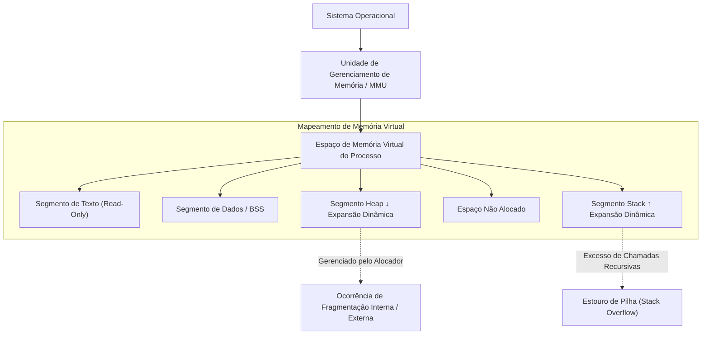
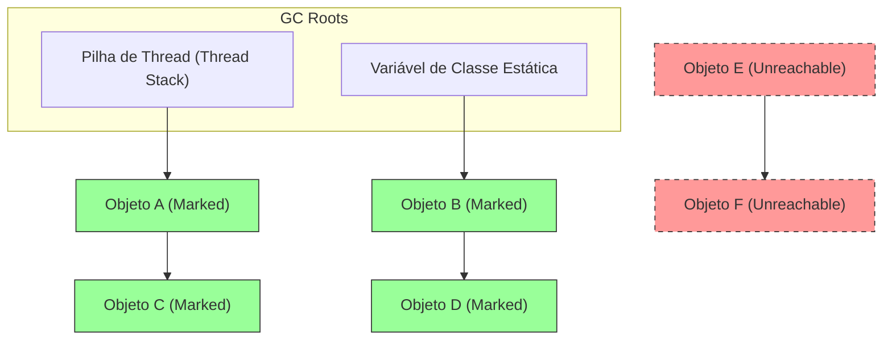
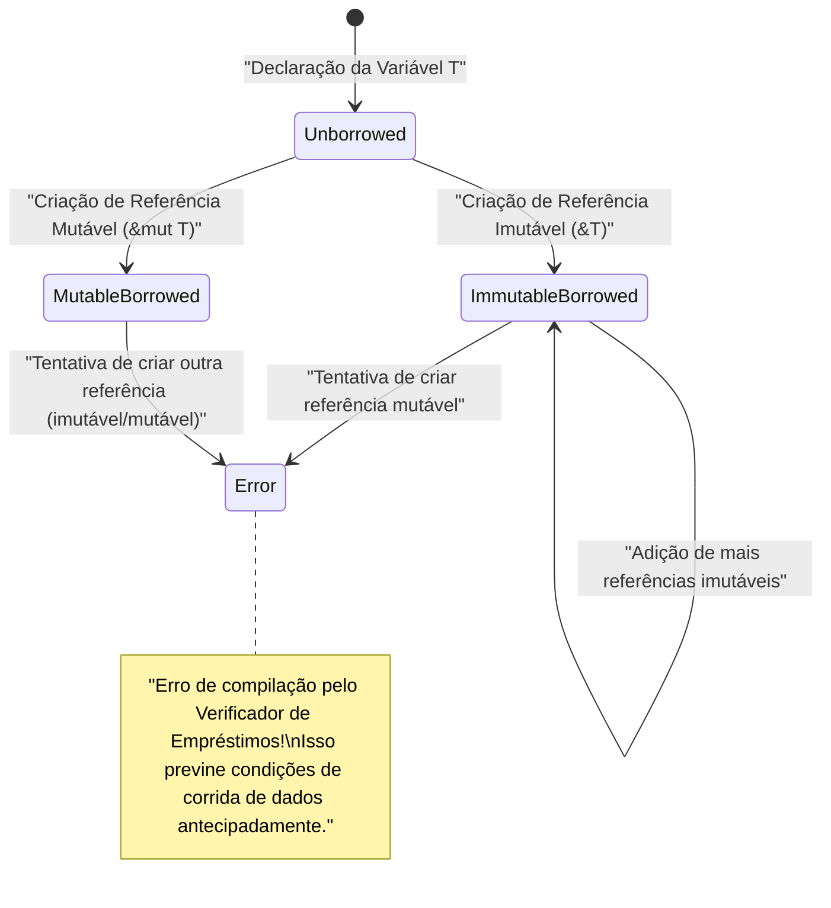

# Bem-vindo à Verdade do Gerenciamento de Memória: Desvendando o Abismo com C, [Java](https://kenji.blog/pt/p/programming-languages-history-paradigm-evolution/) e [Rust](https://kenji.blog/pt/p/webassembly-wasm-current-future/)

No desenvolvimento de software, o gerenciamento de memória é um tema eterno e inevitável, e um dos fatores mais cruciais que determinam o desempenho e a estabilidade de um sistema. Neste artigo, através de uma análise profunda equivalente a cerca de 20.000 caracteres, cobriremos de forma abrangente desde a teoria básica do gerenciamento de memória até as técnicas de otimização em arquiteturas modernas.

A liberdade e responsabilidade do **gerenciamento manual** trazidas pela linguagem C, a automação segura por meio do **Garbage Collection** (GC) popularizada pelo [Java](https://kenji.blog/pt/p/programming-languages-history-paradigm-evolution/), e o paradigma de verificação em tempo de compilação da **propriedade** (Ownership) apresentado pelo [Rust](https://kenji.blog/pt/p/programming-languages-history-paradigm-evolution/). Ao comparar e analisar essas três abordagens completamente diferentes, nos aproximamos da essência da **história e evolução** de como as linguagens de programação têm lidado com o recurso limitado que é a memória.

---

## 1. Estrutura Básica da Memória: [Stack](https://kenji.blog/pt/p/c-language-pointers-memory-management-stack-heap/), [Heap](https://kenji.blog/pt/p/c-language-pointers-memory-management-stack-heap/) e Memória Virtual

Quando um programa é executado, o sistema operacional (OS) aloca uma área de memória abstraída chamada "espaço de memória virtual" para o processo. Este espaço parece um espaço de memória enorme e contínuo do ponto de vista do programa, mas nos bastidores é mapeado para a memória física (RAM) e para o espaço de swap pelo mecanismo de paginação do OS.

O espaço de memória virtual é logicamente dividido nos seguintes segmentos principais, dependendo de sua função:

1. **Segmento de Texto (Text Segment)** : A área onde as instruções de linguagem de máquina compiladas (código executável) são armazenadas. Geralmente é definido como somente leitura para evitar adulteração.
2. **Segmento de Dados (Data Segment)** : A área onde variáveis globais inicializadas e variáveis estáticas (static) são alocadas.
3. **Segmento BSS (BSS Segment)** : Variáveis globais e estáticas não inicializadas são alocadas aqui e preenchidas com zeros no início da execução.
4. **Segmento de Pilha (Stack Segment)** : A área onde variáveis locais e o contexto da chamada de função (endereço de retorno, argumentos, etc.) são empilhados.
5. **Segmento de Heap (Heap Segment)** : Uma área para alocação dinâmica de memória em tempo de execução do programa.

### 1.1 Características e Limitações da Memória Stack

A pilha possui uma estrutura de dados LIFO (Último a Entrar, Primeiro a Sair), e a memória é alocada automaticamente como um quadro de pilha (stack frame) quando uma função é chamada e liberada automaticamente assim que a função retorna.
Como a alocação é concluída apenas movendo o ponteiro da pilha, ela é extremamente **rápida**.

No entanto, a pilha tem um limite crítico. O tamanho da pilha é limitado pelo OS (ex: geralmente 8 MB no Linux), e se você tentar alocar um array enorme na pilha ou fazer chamadas recursivas muito profundas, ocorrerá um **estouro de pilha** (Stack Overflow), e o programa irá falhar (crash).

### 1.2 Características e Complexidade da Memória Heap

O heap é uma vasta área para alocação dinâmica de memória. É usado para armazenar dados cujo tamanho é determinado em tempo de execução e dados que continuam vivos além do escopo de uma função.

O gerenciamento do heap é complexo e requer que o programador ou o tempo de execução (runtime) aloque e libere no momento apropriado. O gerenciamento inadequado do heap pode causar vazamentos de memória (memory leaks) e fragmentação, que serão discutidos mais adiante.



---

## 2. Linguagem C: Liberdade Extrema e Responsabilidade Pessoal

A linguagem C permite o controle de baixo nível próximo ao hardware, dando aos desenvolvedores **autoridade total** sobre o gerenciamento de memória. Embora isso extraia o melhor desempenho possível, também significa que um pequeno erro se traduz diretamente em bugs fatais e brechas de segurança.

### 2.1 O Mecanismo do malloc e free

A alocação dinâmica de memória heap na linguagem C é feita manualmente através de funções da biblioteca padrão, como `malloc` e `calloc`, e a liberação é feita com `free`. Nos bastidores, alocadores como `ptmalloc` e `jemalloc` operam solicitando memória ao OS através de chamadas de sistema (`brk` e `mmap`).

```c
#include <stdio.h>
#include <stdlib.h>
#include <string.h>

typedef struct {
    int id;
    char name[50];
} User;

int main() {
    // Aloca dinamicamente memória para a estrutura User na área de heap
    User *user_ptr = (User*)malloc(sizeof(User));
    
    if (user_ptr == NULL) {
        fprintf(stderr, "Falha na alocação de memória.\n");
        return 1;
    }
    
    // Escrevendo dados
    user_ptr->id = 1;
    strncpy(user_ptr->name, "Alice", sizeof(user_ptr->name) - 1);
    user_ptr->name[sizeof(user_ptr->name) - 1] = '\0';
    
    printf("User ID: %d, Name: %s\n", user_ptr->id, user_ptr->name);
    
    // Sempre libere manualmente a memória quando terminar de usá-la
    free(user_ptr);
    
    // O ponteiro após a liberação se torna um ponteiro pendente (dangling pointer), então atribua NULL para garantir a segurança
    user_ptr = NULL;
    
    return 0;
}
```

### 2.2 O Pesadelo Causado pelo Gerenciamento Manual de Memória

O gerenciamento de memória em C produz facilmente bugs típicos (vulnerabilidades de memória) como os seguintes:

1. **Vazamento de Memória (Memory Leak)** : Um fenômeno no qual esquecer de chamar o `free` deixa a memória não utilizada alocada. Se isso ocorrer em servidores que operam por longos períodos, pode consumir toda a memória do sistema e ser forçosamente encerrado pelo OOM (Out Of Memory) killer.
2. **Ponteiro Pendente (Dangling [Pointer](https://kenji.blog/pt/p/c-language-pointers-memory-management-stack-heap/))** : Um ponteiro que continua apontando para uma área de memória que já foi liberada pelo `free`. Tentar acessar a memória através deste ponteiro causará um comportamento indefinido (como uma falha de segmentação, ou Segmentation Fault).
3. **Liberação Dupla (Double Free)** : Um erro no qual o `free` é chamado duas vezes no mesmo ponteiro de área de heap. Isso destrói as estruturas internas do alocador (como a lista de áreas livres do heap) e se torna uma vulnerabilidade de segurança.
4. **Estouro de Buffer (Buffer Overflow)** : Um fenômeno em que os dados são gravados além da área de memória alocada. Ao reescrever dados importantes adjacentes ou endereços de retorno, pode ser o ponto de partida para ataques de execução de código malicioso (como [Stack](https://kenji.blog/pt/p/c-language-pointers-memory-management-stack-heap/) Smashing).

Vamos modelar isso matematicamente. Seja a quantidade total alocada no heap num determinado ponto $ t $ igual a $ A(t) $, e a quantidade total liberada igual a $ F(t) $. O uso de memória ativa $ M(t) $ no sistema é representado pela seguinte integral:

$ M(t) = \int_0^t (A(\tau) - F(\tau)) d\tau $

Idealmente, no momento $ T $ em que o programa termina normalmente, $ M(T) = 0 $ logicamente. No entanto, se o estado $ A(t) > F(t) $ continuar de forma constante, $ M(t) $ continuará a aumentar monotonicamente, excedendo o limite de memória física $ M_{max} $ do sistema. Esta é a definição matemática de um **Vazamento de Memória**.

---

## 3. [Java](https://kenji.blog/pt/p/programming-languages-history-paradigm-evolution/): A Revolução Trazida pelo Garbage Collection

O Java trouxe uma enorme mudança de paradigma para a indústria de software, que sofria de bugs de memória frequentes em C/C++. O Java retirou do programador a complexidade do gerenciamento de memória e a delegou ao **Garbage Collection** (GC) embutido na Máquina Virtual Java (JVM). Os desenvolvedores podiam focar apenas em escrever regras de negócios e criar objetos.

### 3.1 Fundamentos do GC: Acessibilidade e Mark-and-Sweep

O GC do Java é baseado no conceito de "Acessibilidade (Reachability)". Variáveis locais na pilha e variáveis estáticas são definidas como "Raízes do GC (GC Roots)", e objetos que podem ser rastreados a partir daí são julgados como **Vivos** (Alive), enquanto objetos que não podem ser rastreados são julgados como **Lixo** (Garbage).

O algoritmo mais clássico e básico é o "Mark-and-Sweep".

1. **Fase Mark (Marcação)** : Começa nas raízes do GC e percorre (traverse) o grafo de referência do objeto. Uma "marca de sobrevivência" é anexada a todos os objetos alcançáveis.
2. **Fase Sweep (Varredura)** : Verifica todo o heap e recupera áreas de memória de objetos não marcados para a "Lista de Espaços Livres (Free List)".



Na figura acima, os objetos verdes são marcados como alcançáveis e protegidos. Por outro lado, o conjunto de objetos indicados pela linha pontilhada vermelha não é referenciado de lugar nenhum, então a memória é recuperada automaticamente durante a fase de sweep.

### 3.2 Comportamento da Memória no Código [Java](https://kenji.blog/pt/p/programming-languages-history-paradigm-evolution/)

No Java, objetos são alocados no heap usando a palavra-chave `new`, mas não há comando de liberação equivalente ao `free` em C.

```java
import java.util.ArrayList;
import java.util.List;

public class GcExample {
    public static void main(String[] args) {
        // Aloca um objeto no heap e vincula sua referência a uma variável local
        List<String> activeList = new ArrayList<>();
        activeList.add("Important Data");
        
        // Cria um grande número de objetos de curta duração dentro do escopo
        for (int i = 0; i < 10000; i++) {
            // O objeto temp torna-se inacessível no final de cada iteração do loop
            String temp = new String("Temporary Data " + i);
        }
        
        // Ao chegar aqui, 10.000 objetos String são alvos de coleta pelo GC
        // activeList permanece acessível através do GC Root até o final do método main
        
        // Solicitação explícita de execução do GC (No entanto, não há garantia de que a JVM realmente o execute)
        System.gc();
        
        System.out.println("Programa encerrado");
    }
}
```

### 3.3 GC Geracional (Generational GC) e Stop-The-World

As JVMs modernas (como a HotSpot VM) dividem o heap em gerações (Generations) por questões de eficiência. Isso é baseado na regra empírica da **"Hipótese Geracional Fraca (Weak Generational Hypothesis) - de que a maioria dos objetos morre jovem"**.

O heap é amplamente dividido na "Geração Jovem (Young Generation, contendo os espaços Eden e Survivor)" e na "Geração Antiga (Old Generation, contendo o espaço Tenured)".

- **Minor GC** : É acionado quando a Geração Jovem fica cheia. Ele coleta rapidamente objetos de vida curta.
- **Major GC / Full GC** : Objetos que sobrevivem a vários Minor GCs são promovidos (Promote) para a Geração Antiga. Quando a Geração Antiga fica cheia, ocorre o Full GC, que é mais extenso e demorado.

Quando o GC é executado, todas as threads do aplicativo pausam para manter a consistência da memória. Isso é chamado de pausa **Stop-The-World (STW)**. Em sistemas de tempo real e sistemas financeiros que exigem baixa latência, esse STW é um problema fatal, por isso algoritmos de GC mais novos, como G1GC e ZGC, que tentam minimizar o STW tanto quanto possível, estão sendo pesquisados e adotados.

---

## 4. [Rust](https://kenji.blog/pt/p/webassembly-wasm-current-future/): A Terceira Via Trazida pelo Ownership e Borrowing

"Desempenho extremo através de gerenciamento manual" em C e "Segurança de memória através de gerenciamento automático" em [Java](https://kenji.blog/pt/p/programming-languages-history-paradigm-evolution/). Estes dois foram considerados uma relação de compromisso (trade-off) por muito tempo. No entanto, ao introduzir o modelo inovador de **"Propriedade (Ownership)"**, a linguagem [Rust](https://kenji.blog/pt/p/programming-languages-history-paradigm-evolution/) alcançou o feito de garantir a segurança da memória 100% em tempo de compilação e, ao mesmo tempo, eliminar o garbage collection.

### 4.1 Os 3 Princípios de Ownership

O sistema de propriedade, que é a espinha dorsal do gerenciamento de memória em Rust, consiste em três regras rígidas:

1. Cada valor em Rust tem uma variável que é chamada de sua **proprietária (owner)**.
2. Só pode haver **um proprietário** por vez.
3. Quando o proprietário **sai de escopo**, o valor é imediatamente descartado (dropped).

Devido a essa regra, Rust não obriga os desenvolvedores a escrever `malloc` ou `free`, em vez disso, chama automaticamente a função `drop` assim que a variável sai de escopo e libera a memória. Não existe uma thread de monitoramento em tempo de execução como um GC.

### 4.2 Transferência de Propriedade (Move)

No [Rust](https://kenji.blog/pt/p/webassembly-wasm-current-future/), se você atribuir uma variável a outra ou passar um valor para uma função, a propriedade "se move (Move)". A variável original não poderá mais ser acessada (ocorrerá um erro de compilação). Isso torna a liberação dupla (Double Free) estruturalmente impossível.

```rust
fn main() {
    // Aloca uma string no heap. s1 se torna o proprietário.
    let s1 = String::from("hello, rust");
    
    // A propriedade é movida (move) de s1 para s2.
    // A partir deste momento, s1 é invalidado. É uma cópia superficial (shallow copy), mas a variável original é invalidada para evitar liberação dupla.
    let s2 = s1; 
    
    // println!("{}", s1); // Erro de compilação! (value borrowed here after move)
    println!("s2 owns the data: {}", s2);
    
} // Fim de escopo. s2 é descartado (dropped) e a memória no heap é liberada de forma segura.
```

### 4.3 Empréstimo (Borrowing) e Tempo de Vida (Lifetime)

Se a propriedade fosse movida em cada operação, a programação se tornaria extremamente inconveniente. Para acessar dados sem assumir a propriedade, [Rust](https://kenji.blog/pt/p/webassembly-wasm-current-future/) possui os conceitos de **Referência (Reference)** e **Empréstimo (Borrowing)**.

Além disso, o **Verificador de Empréstimos (Borrow Checker)** embutido no compilador [Rust](https://kenji.blog/pt/p/programming-languages-history-paradigm-evolution/) impõe rigorosamente as seguintes regras em tempo de compilação:

- A qualquer momento, você pode ter **ou uma referência mutável (`&mut T`)** **ou qualquer número de referências imutáveis (`&T`)** (elas não podem coexistir ao mesmo tempo. Prevenção de Data Race).
- O tempo de vida (lifetime) da referência não deve exceder o tempo de vida dos dados originais (prevenção total de ponteiros pendentes).

```rust
fn main() {
    let mut data = String::from("Memory");
    
    // Empréstimo imutável (múltiplos podem ser criados)
    let r1 = &data;
    let r2 = &data;
    println!("Referências imutáveis: {} and {}", r1, r2);
    // O tempo de vida de r1 e r2 termina aqui (já que não são mais usados posteriormente)
    
    // Empréstimo mutável (apenas um pode ser criado)
    let r3 = &mut data;
    r3.push_str(" Management");
    println!("Após modificação com referência mutável: {}", r3);
    
    // Tentar usar r1 e r3 ao mesmo tempo fará com que o verificador de empréstimos acione um erro de compilação
    // println!("{}, {}", r1, r3); // Error!
}
```



---

## 5. Otimização de Ponta: Localidade de Dados e Cache da CPU

Para dominar o gerenciamento de memória, é importante ir além da simples "alocação e liberação" e estar alinhado com a arquitetura de hardware moderna. Esse é o conceito de **Localidade de Dados (Data Locality)**.

As CPUs modernas são extremamente rápidas, mas o acesso à memória principal (RAM) tem um atraso de centenas de ciclos de clock. Para esconder isso, a CPU está equipada com **caches de CPU** hierárquicos, como L1, L2 e L3.

Quando a CPU lê dados da memória, ela carrega não apenas esses dados, mas também um bloco de memória vizinho de um certo tamanho (linha de cache, normalmente 64 bytes) inteiro no cache. Isso é chamado de "Localidade Espacial (Spatial Locality)".

### 5.1 Diferenças na Eficiência de Cache por Linguagem

- **C / C++ / [Rust](https://kenji.blog/pt/p/webassembly-wasm-current-future/)** : Ao criar uma matriz (array) de estruturas (como `struct Array[100]` ou `Vec<MyStruct>`), os dados são colocados sequencialmente na memória sem lacunas. Ao iterar em loop sobre um array, o prefetcher de hardware da CPU funciona perfeitamente, aumentando drasticamente a taxa de acertos no cache (cache hit rate).
- **[Java](https://kenji.blog/pt/p/programming-languages-history-paradigm-evolution/)** : Matrizes de objetos em Java (`MyObject[]`) não são os objetos reais, mas sim uma matriz de "referências para os objetos (ponteiros)". Como cada objeto real é alocado em um local separado no heap, cada iteração do loop exigirá seguir ponteiros para acessar endereços de memória aleatórios, resultando em uma série de graves perdas de cache (Cache Miss).

O tempo médio efetivo de acesso à memória $ T_{avg} $ é expresso da seguinte forma:

$ T_{avg} = h \cdot T_{cache} + (1 - h) \cdot T_{memory} $

Onde $ h $ é a taxa de acertos de cache ($ 0 \le h \le 1 $), $ T_{cache} $ é o tempo de acesso ao cache (cerca de 1 a 4 ns), e $ T_{memory} $ é o tempo de acesso à memória principal (cerca de 100 ns).
A diferença em fazer $ h $ se tornar 0,99 (abordagem de C/[Rust](https://kenji.blog/pt/p/webassembly-wasm-current-future/)) ou cair para 0,5 (perseguição de ponteiros - pointer chasing - do [Java](https://kenji.blog/pt/p/programming-languages-history-paradigm-evolution/)) resultará em uma diferença de dezenas de vezes na velocidade de execução de loops de um aplicativo. Esta é a verdadeira razão pela qual C++ e [Rust](https://kenji.blog/pt/p/programming-languages-history-paradigm-evolution/) são escolhidos para engines de jogos e sistemas de negociação de alta frequência.

---

## 6. Conclusão: Rumo à Seleção de Tecnologias Adequada

Neste artigo, aprofundamo-nos em três paradigmas de gerenciamento de memória completamente diferentes.

| Linguagem | Abordagem | Vantagens | Desvantagens e Desafios |
|:---:|:---|:---|:---|
| **C** | Gerenciamento manual usando `malloc/free` | Velocidade máxima, maior eficiência de cache, leveza | Terreno fértil para vulnerabilidades (vazamentos, liberação dupla), alto custo de desenvolvimento |
| **[Java](https://kenji.blog/pt/p/programming-languages-history-paradigm-evolution/)** | GC (Garbage Collection) | Aumento da velocidade de desenvolvimento, garantia de segurança de memória | Flutuações de latência devido ao STW, deterioração da eficiência de cache |
| **[Rust](https://kenji.blog/pt/p/webassembly-wasm-current-future/)** | Ownership / Verificador de Empréstimos | Segurança sem custo de runtime, alta velocidade | Curva de aprendizado acentuada, dificuldade no design de tempo de vida (lifetime) |

A história do **gerenciamento de memória** tem sido uma gangorra oscilando entre desempenho e segurança. Para evitar tragédias causadas pelo gerenciamento manual, o GC nasceu, e para contornar as penalidades de desempenho do GC, o modelo de propriedade (Ownership) foi inventado.

Quando nós arquitetamos um sistema, o caminho para se tornar um engenheiro de primeira classe não está em tomar decisões precipitadas como "usar [Rust](https://kenji.blog/pt/p/programming-languages-history-paradigm-evolution/) porque é o mais rápido" ou "usar [Java](https://kenji.blog/pt/p/programming-languages-history-paradigm-evolution/) porque é seguro". Pelo contrário, trata-se de escolher a melhor tecnologia após confrontar os requisitos do sistema (estrita latência, recursos de desenvolvimento, facilidade de manutenção) com a **verdade** do gerenciamento de memória que existe por trás deles.
