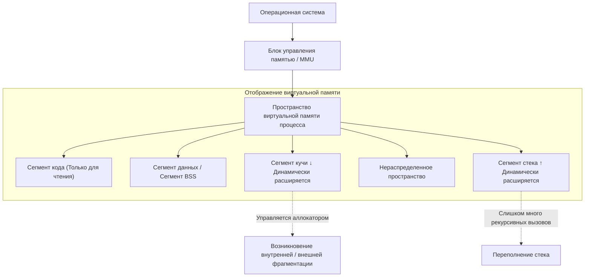
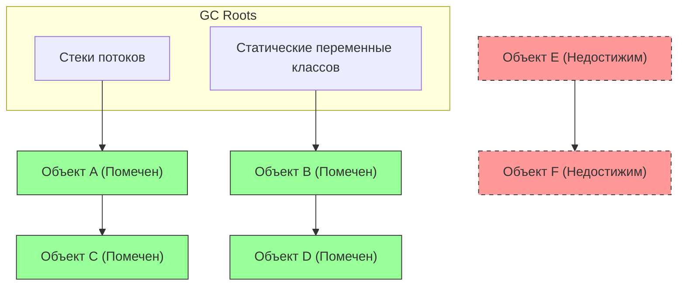
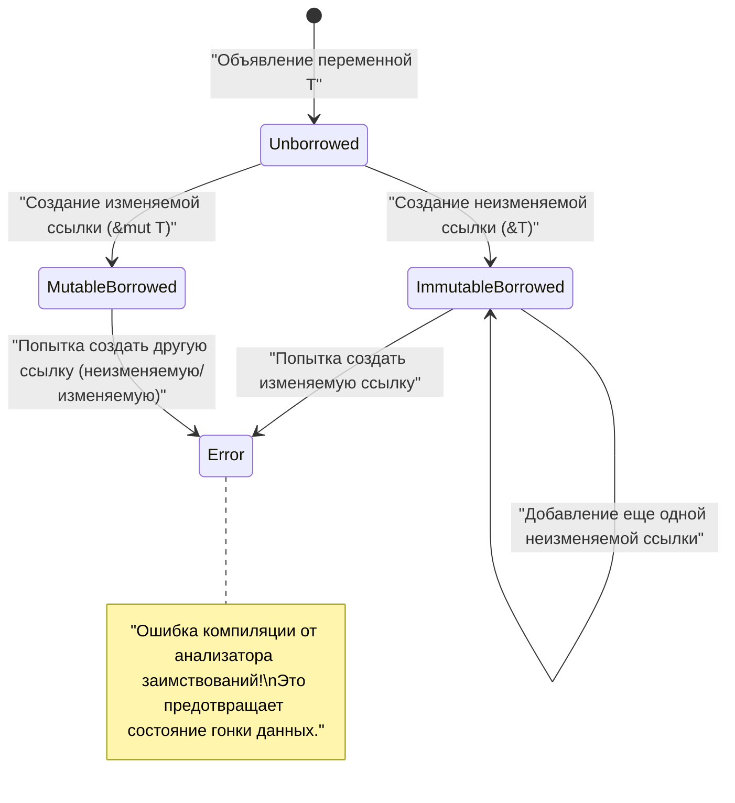

# Добро пожаловать в истину об управлении памятью: Разгадка тайн через C, [Java](https://kenji.blog/ru/p/programming-languages-history-paradigm-evolution/) и [Rust](https://kenji.blog/ru/p/webassembly-wasm-current-future/)

В разработке программного обеспечения управление памятью — это вечная тема, которую невозможно избежать. Это один из важнейших факторов, определяющих производительность и стабильность системы. В этой статье мы проведем глубокое погружение и полностью охватим как базовую теорию управления памятью, так и методы оптимизации в современных архитектурах.

**Ручное управление** с его свободой и ответственностью, привнесенное языком C, безопасная автоматизация посредством **сборки мусора** ( GC ), популяризованная [Java](https://kenji.blog/ru/p/programming-languages-history-paradigm-evolution/), и парадигма проверки во время компиляции через **владение** ( Ownership ), представленная [Rust](https://kenji.blog/ru/p/programming-languages-history-paradigm-evolution/). Сравнивая и анализируя эти три совершенно разных подхода, мы приблизимся к сути **истории и эволюции** того, как языки программирования справлялись с ограниченными ресурсами памяти.

---

## 1. Базовая структура памяти: Стек, Куча и Виртуальная память

При выполнении программы операционная система ( ОС ) выделяет процессу абстрактную область памяти, называемую «пространством виртуальной памяти». С точки зрения программы, это пространство выглядит как огромное непрерывное адресное пространство, но за кулисами механизм подкачки страниц ОС отображает его на физическую память ( RAM ) или область подкачки.

Пространство виртуальной памяти логически разделено на следующие сегменты в зависимости от их роли:

1. **Сегмент кода (Text Segment)** : Область, где хранятся скомпилированные машинные инструкции (исполняемый код). Обычно она доступна только для чтения, чтобы предотвратить несанкционированное изменение.
2. **Сегмент данных (Data Segment)** : Область, где размещаются инициализированные глобальные и статические ( static ) переменные.
3. **Сегмент BSS (BSS Segment)** : Здесь размещаются неинициализированные глобальные и статические переменные, при начале выполнения они инициализируются нулями.
4. **Сегмент стека ([Stack](https://kenji.blog/ru/p/c-language-pointers-memory-management-stack-heap/) Segment)** : Область, куда помещаются локальные переменные и контекст вызова функций (адрес возврата, аргументы и т.д.).
5. **Сегмент кучи ([Heap](https://kenji.blog/ru/p/c-language-pointers-memory-management-stack-heap/) Segment)** : Область для динамического выделения памяти во время выполнения программы.

### 1.1 Характеристики и ограничения стековой памяти

Стек имеет структуру данных LIFO (последним пришел — первым вышел), при вызове функции память автоматически выделяется в виде стекового кадра, а при выходе из функции автоматически освобождается.
Поскольку выделение памяти сводится лишь к перемещению указателя стека, это происходит чрезвычайно **быстро**.

Однако у стека есть критическое ограничение. Размер стека ограничен ОС (например, в Linux обычно 8 МБ), и попытка выделить в стеке огромный массив или слишком глубокая рекурсия приведет к **переполнению стека**, что вызовет сбой программы.

### 1.2 Характеристики и сложность кучи

Куча — это обширная область для динамического выделения памяти. Она используется для хранения данных, размер которых определяется во время выполнения, или данных, которые должны продолжать существовать за пределами области видимости функции.

Управление кучей сложно, и программист или среда выполнения должны выделять и освобождать память в подходящее время. Неправильное управление кучей является причиной утечек памяти и фрагментации ( Fragmentation ), о которых будет сказано ниже.



---

## 2. Язык C: Абсолютная свобода и личная ответственность

Язык C предоставляет низкоуровневый контроль, близкий к аппаратному обеспечению, предоставляя разработчику **полную власть** над управлением памятью. Это позволяет извлечь максимальную производительность, но также означает, что малейшая ошибка может привести к фатальным багам и уязвимостям в безопасности.

### 2.1 Механизмы malloc и free

В языке C динамическое выделение памяти в куче выполняется вручную с помощью функций стандартной библиотеки `malloc` или `calloc` , а освобождение — с помощью `free` . За кулисами работают аллокаторы, такие как `ptmalloc` или `jemalloc` , которые запрашивают память у ОС через системные вызовы ( `brk` или `mmap` ).

```c
#include <stdio.h>
#include <stdlib.h>
#include <string.h>

typedef struct {
    int id;
    char name[50];
} User;

int main() {
    // Динамическое выделение памяти в куче для структуры User
    User *user_ptr = (User*)malloc(sizeof(User));
    
    if (user_ptr == NULL) {
        fprintf(stderr, "Не удалось выделить память.\n");
        return 1;
    }
    
    // Запись данных
    user_ptr->id = 1;
    strncpy(user_ptr->name, "Alice", sizeof(user_ptr->name) - 1);
    user_ptr->name[sizeof(user_ptr->name) - 1] = '\0';
    
    printf("User ID: %d, Name: %s\n", user_ptr->id, user_ptr->name);
    
    // После завершения использования обязательно освобождаем память вручную
    free(user_ptr);
    
    // После освобождения указатель становится висячим (dangling pointer), поэтому для безопасности присваиваем ему NULL
    user_ptr = NULL;
    
    return 0;
}
```

### 2.2 Кошмары, вызванные ручным управлением памятью

Управление памятью в языке C легко порождает следующие типичные баги (уязвимости памяти):

1. **Утечка памяти (Memory Leak)** : Явление, при котором неиспользуемая память остается неосвобожденной из-за того, что забыли вызвать `free` . Если это происходит на длительно работающих серверах, это в конечном итоге исчерпывает всю память системы, и процесс принудительно завершается OOM (Out Of Memory) killer-ом.
2. **Висячий указатель (Dangling [Pointer](https://kenji.blog/ru/p/c-language-pointers-memory-management-stack-heap/))** : Указатель, который продолжает указывать на область памяти, уже освобожденную с помощью `free` . Попытка доступа к памяти через этот указатель приводит к неопределенному поведению (например, к ошибке сегментации).
3. **Двойное освобождение (Double Free)** : Ошибка двойного вызова `free` для одного и того же указателя в куче. Это разрушает внутреннюю структуру аллокатора (например, список свободных блоков кучи) и становится уязвимостью безопасности.
4. **Переполнение буфера (Buffer Overflow)** : Явление записи данных за пределами выделенной области памяти. Перезаписывая соседние важные данные или адреса возврата, это становится плацдармом для атак, выполняющих вредоносный код (например, stack smashing).

Давайте смоделируем это математически. Пусть общий объем выделенной памяти в куче в момент времени $ t $ будет $ A(t) $ , а общий объем освобожденной памяти $ F(t) $ . Активное использование памяти в системе $ M(t) $ выражается следующим интегралом:

$ M(t) = \int_0^t (A(\tau) - F(\tau)) d\tau $

В момент времени $ T $ , когда программа корректно завершается, логически идеально, если $ M(T) = 0 $ . Однако, если состояние $ A(t) > F(t) $ сохраняется постоянно, $ M(t) $ будет монотонно возрастать и превысит физический предел памяти системы $ M_{max} $ . Это математическое определение **утечки памяти**.

---

## 3. [Java](https://kenji.blog/ru/p/programming-languages-history-paradigm-evolution/): Революция, которую принесла сборка мусора

Java произвела огромный сдвиг парадигмы в индустрии программного обеспечения, которая страдала от частых ошибок памяти в C/C++. Java забрала у программистов сложность управления памятью, доверив ее **сборке мусора** ( GC ), встроенной в виртуальную машину Java ( JVM ). Разработчики смогли сосредоточиться исключительно на написании бизнес-логики и создании объектов.

### 3.1 Основы GC: Достижимость и Mark-and-Sweep

Сборка мусора в Java основана на концепции «Достижимости ( Reachability )». Локальные или статические переменные в стеке определяются как «корни GC», и объекты, к которым можно перейти по ссылкам оттуда, считаются **живыми** ( Alive ), а те, к которым нельзя — **мусором** ( Garbage ).

Самый классический и фундаментальный алгоритм — это «Mark-and-Sweep».

1. **Фаза пометки (Mark)** : Начиная от корней GC, происходит обход графа ссылок на объекты. Всем достижимым объектам присваивается «метка жизни».
2. **Фаза очистки (Sweep)** : Вся куча сканируется, и области памяти объектов без меток возвращаются в «список свободных блоков».



На приведенной выше диаграмме зеленые объекты помечены как достижимые и защищены. С другой стороны, набор объектов, обозначенный красными пунктирными линиями, ни на что не ссылается, поэтому память будет автоматически собрана в фазе очистки.

### 3.2 Поведение памяти в коде [Java](https://kenji.blog/ru/p/programming-languages-history-paradigm-evolution/)

В Java объекты выделяются в куче с помощью ключевого слова `new` , но команды освобождения, эквивалентной `free` в C, не существует.

```java
import java.util.ArrayList;
import java.util.List;

public class GcExample {
    public static void main(String[] args) {
        // Создание объекта в куче и связывание ссылки с локальной переменной
        List<String> activeList = new ArrayList<>();
        activeList.add("Важные данные");
        
        // Создание большого количества короткоживущих объектов в области видимости
        for (int i = 0; i < 10000; i++) {
            // Объект temp становится недостижимым в конце каждой итерации цикла
            String temp = new String("Временные данные " + i);
        }
        
        // В этот момент 10 000 объектов String становятся целями для сборки мусора (GC)
        // activeList остается достижимым из GC Roots до конца метода main
        
        // Явный запрос на выполнение GC (однако выполнение JVM не гарантируется)
        System.gc();
        
        System.out.println("Программа завершена");
    }
}
```

### 3.3 Поколенческая сборка мусора (Generational GC) и Stop-The-World

Современные JVM (такие как HotSpot VM) разделяют кучу на поколения ( Generation ) для повышения эффективности. Это основано на эмпирическом правиле **«большинство объектов становятся мусором вскоре после создания (слабая гипотеза о поколениях)»**.

Куча в основном делится на «Молодое поколение ( Eden, Survivor )» и «Старое поколение ( Tenured )».

- **Minor GC** : Запускается, когда Молодое поколение заполняется. Быстро собирает короткоживущие объекты.
- **Major GC / Full GC** : Объекты, пережившие несколько Minor GC, повышаются ( Promote ) до Старого поколения. Когда Старое поколение заполняется, запускается более масштабная и длительная Full GC.

Когда выполняется GC, все потоки приложения приостанавливаются для поддержания целостности памяти. Это называется паузой **Stop-The-World (STW)**. В системах реального времени и финансовых системах, где требуется низкая задержка, STW является критической проблемой, поэтому ведутся исследования и внедрение новейших алгоритмов GC, таких как G1GC и ZGC, чтобы максимально сократить время STW.

---

## 4. [Rust](https://kenji.blog/ru/p/webassembly-wasm-current-future/): Третий путь, открытый владением и заимствованием

«Экстремальная производительность благодаря ручному управлению» в C и «Безопасность памяти благодаря автоматическому управлению» в [Java](https://kenji.blog/ru/p/programming-languages-history-paradigm-evolution/). Долгое время считалось, что это компромисс. Однако язык [Rust](https://kenji.blog/ru/p/programming-languages-history-paradigm-evolution/) совершил подвиг, полностью устранив сборку мусора и на 100% гарантировав безопасность памяти во время компиляции, внедрив революционную модель **«владения ( Ownership )»**.

### 4.1 3 принципа владения (Ownership)

Система владения, являющаяся основой управления памятью в Rust, базируется на следующих трех строгих правилах:

1. Каждое значение в Rust имеет переменную, которая называется его **владельцем ( owner )**.
2. В любой момент времени может быть только **один владелец**.
3. Когда владелец **выходит из области видимости**, значение немедленно уничтожается (ドロップ - drop).

Благодаря этим правилам, Rust автоматически вызывает функцию `drop` и освобождает память в тот момент, когда переменная выходит из области видимости, не заставляя разработчика писать `malloc` или `free` . Здесь нет фонового потока времени выполнения, как в случае с GC.

### 4.2 Перемещение владения (Move)

В [Rust](https://kenji.blog/ru/p/webassembly-wasm-current-future/), если вы присваиваете переменную другой переменной или передаете значение в функцию, владение «перемещается ( Move )». Исходная переменная после этого становится недоступной (это вызовет ошибку компиляции). Это структурно делает невозможным двойное освобождение.

```rust
fn main() {
    // Выделение строки в куче. s1 становится владельцем.
    let s1 = String::from("hello, rust");
    
    // Владение перемещается (Move) из s1 в s2.
    // С этого момента s1 становится недействительной. Это поверхностное копирование (shallow copy), но чтобы предотвратить двойное освобождение, исходная переменная инвалидируется.
    let s2 = s1; 
    
    // println!("{}", s1); // Ошибка компиляции! (значение заимствовано здесь после перемещения)
    println!("s2 владеет данными: {}", s2);
    
} // Конец области видимости. s2 уничтожается (drop), и память в куче безопасно освобождается.
```

### 4.3 Заимствование (Borrowing) и время жизни

Если бы каждое действие требовало перемещения владения, программировать было бы крайне неудобно. Чтобы получить доступ к данным, не забирая владение, в [Rust](https://kenji.blog/ru/p/webassembly-wasm-current-future/) существуют концепции **ссылок ( Reference )** и **заимствования ( Borrowing )**.

Кроме того, **анализатор заимствований ( Borrow Checker )**, встроенный в компилятор [Rust](https://kenji.blog/ru/p/programming-languages-history-paradigm-evolution/), обеспечивает соблюдение следующих строгих правил во время компиляции:

- В любой момент времени вы можете иметь либо **одну изменяемую ссылку ( `&mut T` )**, либо **любое количество неизменяемых ссылок ( `&T` )** (одновременное существование невозможно. Предотвращение гонки данных).
- Время жизни (lifetime) ссылки не должно превышать время жизни исходных данных (полное предотвращение висячих указателей).

```rust
fn main() {
    let mut data = String::from("Memory");
    
    // Неизменяемое заимствование (можно создать несколько)
    let r1 = &data;
    let r2 = &data;
    println!("Неизменяемые ссылки: {} и {}", r1, r2);
    // Время жизни r1, r2 заканчивается здесь (поскольку дальше они не используются)
    
    // Изменяемое заимствование (можно создать только одно)
    let r3 = &mut data;
    r3.push_str(" Management");
    println!("После изменения по изменяемой ссылке: {}", r3);
    
    // Если попытаться использовать r1 и r3 одновременно, анализатор заимствований выдаст ошибку компиляции
    // println!("{}, {}", r1, r3); // Ошибка!
}
```



---

## 5. Передовая оптимизация: Локальность данных и кэш CPU

При освоении управления памятью важно выйти за рамки простого «выделения и освобождения» и адаптироваться к современной аппаратной архитектуре. Это концепция **локальности данных ( Data Locality )**.

Современные процессоры очень быстры, но доступ к основной памяти ( RAM ) занимает сотни тактовых циклов. Чтобы скрыть эту задержку, процессоры оснащены иерархическим **кэшем CPU**, таким как L1, L2 и L3.

Когда CPU считывает данные из памяти, он загружает в кэш не только эти данные, но и весь соседний блок памяти определенного размера (кэш-линия, обычно 64 байта). Это называется «пространственной локальностью ( Spatial Locality )».

### 5.1 Различия в эффективности кэша между языками

- **C / C++ / [Rust](https://kenji.blog/ru/p/webassembly-wasm-current-future/)** : При создании массива структур ( `struct Array[100]` или `Vec<MyStruct>` ) данные размещаются в памяти непрерывно, без промежутков. При обработке массива в цикле аппаратный предвыборщик процессора работает идеально, и вероятность попадания в кэш резко возрастает.
- **[Java](https://kenji.blog/ru/p/programming-languages-history-paradigm-evolution/)** : Массив объектов в Java ( `MyObject[]` ) — это массив «ссылок (указателей) на объекты», а не самих сущностей. Поскольку каждый фактический объект размещается в разбросанных местах кучи, каждый раз при обработке в цикле процессор следует по указателям, получая доступ к случайным адресам памяти, что приводит к серии серьезных промахов кэша ( Cache Miss ).

Эффективное среднее время доступа к памяти $ T_{avg} $ выражается следующим образом:

$ T_{avg} = h \cdot T_{cache} + (1 - h) \cdot T_{memory} $

Где $ h $ — коэффициент попадания в кэш ( $ 0 \le h \le 1 $ ), $ T_{cache} $ — время доступа к кэшу (около 1–4 нс), а $ T_{memory} $ — время доступа к основной памяти (около 100 нс).
В зависимости от того, сделаем ли мы $ h $ равным 0.99 (подход C/[Rust](https://kenji.blog/ru/p/webassembly-wasm-current-future/)) или опустим его до 0.5 (переход по указателям в Java), скорость выполнения цикла в приложении может различаться в десятки раз. Это истинная причина, по которой C++ и [Rust](https://kenji.blog/ru/p/programming-languages-history-paradigm-evolution/) выбирают для игровых движков и систем высокочастотного трейдинга.

---

## 6. Заключение: Выбор правильной технологии для конкретной задачи

В этой статье мы глубоко изучили три совершенно разные парадигмы управления памятью.

| Язык | Подход | Преимущества | Недостатки / Проблемы |
|:---:|:---|:---|:---|
| **C** | Ручное управление через `malloc/free` | Максимальная скорость, максимальная эффективность кэша, легковесность | Рассадник уязвимостей (утечки, двойное освобождение), высокая стоимость разработки |
| **[Java](https://kenji.blog/ru/p/programming-languages-history-paradigm-evolution/)** | GC (Сборка мусора) | Ускорение разработки, гарантия безопасности памяти | Колебания задержки из-за STW, ухудшение эффективности кэша |
| **[Rust](https://kenji.blog/ru/p/webassembly-wasm-current-future/)** | Владение и анализатор заимствований | Безопасность с нулевыми затратами во время выполнения, высокая скорость | Крутая кривая обучения, сложность проектирования времени жизни |

История **управления памятью** — это качели между производительностью и безопасностью. Сборка мусора была создана для предотвращения трагедий, вызванных ручным управлением, а модель владения была изобретена, чтобы избежать штрафов к производительности от GC.

Когда мы проектируем систему, путь к тому, чтобы стать первоклассным инженером, лежит не в принятии недальновидных решений вроде «Будем использовать [Rust](https://kenji.blog/ru/p/programming-languages-history-paradigm-evolution/), потому что он самый быстрый» или «Будем использовать [Java](https://kenji.blog/ru/p/programming-languages-history-paradigm-evolution/), потому что это безопасно», а в выборе оптимальной технологии после оценки требований системы (строгость к задержкам, ресурсы на разработку, ремонтопригодность) и **правды** об управлении памятью, стоящей за ними.
