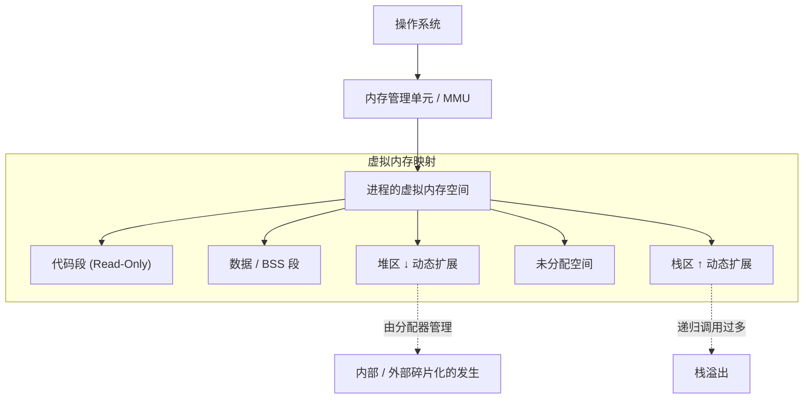
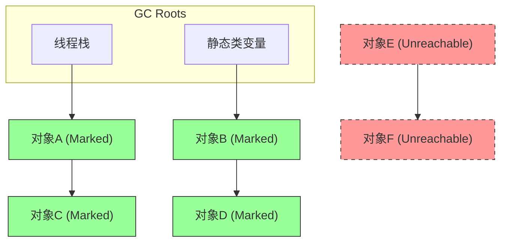
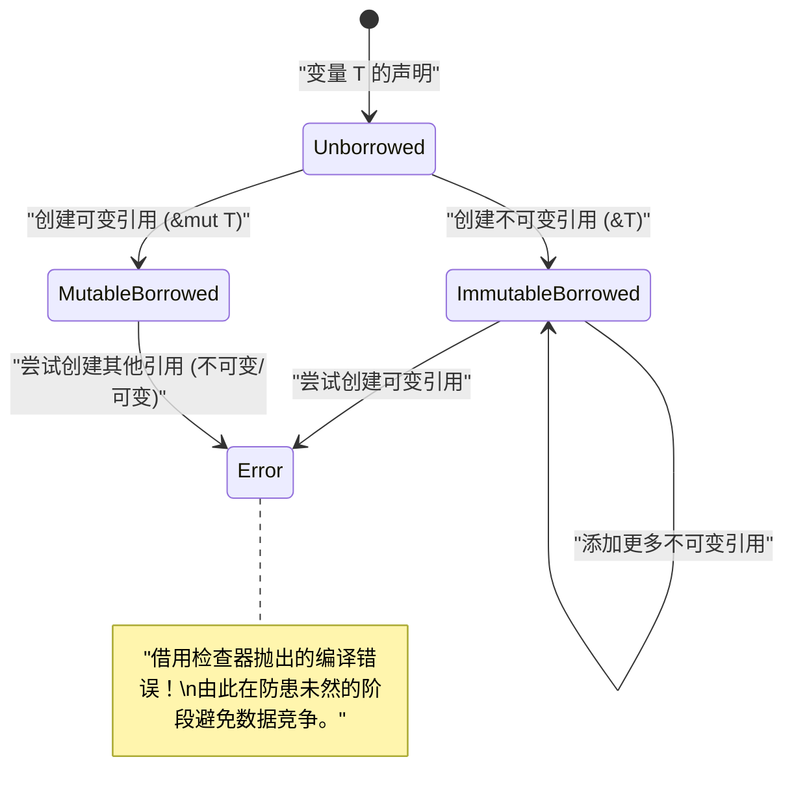

# 欢迎来到内存管理的真相：从 C、[Java](https://kenji.blog/zh-cn/p/programming-languages-history-paradigm-evolution/)、[Rust](https://kenji.blog/zh-cn/p/webassembly-wasm-current-future/) 探索深渊

在软件开发中，内存管理是无法回避的永恒主题，也是决定系统性能与稳定性的最重要因素之一。本文将通过堪比两万字的深度解析，从内存管理的基础理论到现代架构中的优化手法，进行全面涵盖。

C 语言带来的 **手动管理** 的自由与责任，[Java](https://kenji.blog/zh-cn/p/programming-languages-history-paradigm-evolution/) 普及的 **垃圾回收** （ GC ）所带来的安全自动化，以及 [Rust](https://kenji.blog/zh-cn/p/programming-languages-history-paradigm-evolution/) 提出的 **所有权** （ Ownership ）这一编译时验证范式。通过对比和分析这三种截然不同的方法，我们将深入探讨编程语言如何应对内存这一有限资源，揭示其 **历史与进化** 的本质。

---

## 1. 内存的基本结构：栈、堆以及虚拟内存

当程序执行时，操作系统（ OS ）会为进程分配一个被称为“虚拟内存空间”的抽象内存区域。从程序的角度来看，这个空间似乎是一个连续的巨大内存空间，但在背后，通过操作系统的分页机制，它被映射到物理内存（ RAM ）或交换区域。

虚拟内存空间根据其作用，主要在逻辑上划分为以下几个段。

1. **代码段 (Text Segment)** ：存储编译后的机器语言指令（可执行代码）的区域。通常设置为只读，以防止被篡改。
2. **数据段 (Data Segment)** ：分配已初始化的全局变量或静态（ static ）变量的区域。
3. **BSS 段 (BSS Segment)** ：分配未初始化的全局变量或静态变量，并在执行开始时清零。
4. **栈区 ([Stack](https://kenji.blog/zh-cn/p/c-language-pointers-memory-management-stack-heap/) Segment)** ：存放局部变量和函数调用时的上下文（返回地址、参数等）的区域。
5. **堆区 ([Heap](https://kenji.blog/zh-cn/p/c-language-pointers-memory-management-stack-heap/) Segment)** ：在程序执行时用于动态分配内存的区域。

### 1.1 栈内存的特性与局限性

栈具有 LIFO（后进先出）的数据结构，在函数调用时会自动分配内存作为栈帧，并在退出函数时自动释放。
因为只需移动栈指针即可完成分配，所以极其 **高速** 。

然而，栈有着决定性的局限性。栈的大小受到操作系统的限制（例如：Linux 中通常为 8MB），如果试图在栈上分配巨大的数组，或进行过深的递归调用，就会发生 **栈溢出** ，导致程序崩溃。

### 1.2 堆内存的特性与复杂性

堆是用于动态分配内存的广阔区域。用于存储在运行时决定大小的数据，或在超出函数作用域后继续存活的数据。

堆的管理非常复杂，需要程序员或运行时在适当的时机进行分配和释放。不恰当的堆管理会导致后文所述的内存泄漏和碎片化（ Fragmentation ）。



---

## 2. C 语言：极致的自由与自我负责

C 语言使接近硬件的底层控制成为可能，并赋予了开发者内存管理的 **完全权限** 。这意味着虽然可以发挥最高性能，但哪怕是一点小错误，也会直接导致致命的 bug 或安全漏洞。

### 2.1 malloc 与 free 的机制

在 C 语言中，堆内存的动态分配是通过标准库函数 `malloc` 或 `calloc` 手动进行的，而释放则是通过 `free` 进行。在背后，像 `ptmalloc` 或 `jemalloc` 等分配器在工作，它们通过系统调用（ `brk` 或 `mmap` ）向 OS 请求内存。

```c
#include <stdio.h>
#include <stdlib.h>
#include <string.h>

typedef struct {
    int id;
    char name[50];
} User;

int main() {
    // 在堆区为 User 结构体动态分配内存
    User *user_ptr = (User*)malloc(sizeof(User));
    
    if (user_ptr == NULL) {
        fprintf(stderr, "内存分配失败。\n");
        return 1;
    }
    
    // 写入数据
    user_ptr->id = 1;
    strncpy(user_ptr->name, "Alice", sizeof(user_ptr->name) - 1);
    user_ptr->name[sizeof(user_ptr->name) - 1] = '\0';
    
    printf("User ID: %d, Name: %s\n", user_ptr->id, user_ptr->name);
    
    // 使用结束后，务必手动释放内存
    free(user_ptr);
    
    // 释放后的指针成为悬垂指针，因此赋值为 NULL 以确保安全
    user_ptr = NULL;
    
    return 0;
}
```

### 2.2 手动内存管理引发的噩梦

在 C 语言中的内存管理很容易产生以下典型的 bug（内存漏洞）。

1. **内存泄漏 (Memory Leak)** ：因为忘记调用 `free` ，导致未使用的内存一直没有被释放而残留的现象。如果发生在长时间运行的服务器等环境中，最终会耗尽系统的所有内存，并被 OOM（Out Of Memory）Killer 强制终止。
2. **悬垂指针 (Dangling [Pointer](https://kenji.blog/zh-cn/p/c-language-pointers-memory-management-stack-heap/))** ：继续指向已被 `free` 释放的内存区域的指针。尝试通过该指针访问内存，会引发未定义行为（如段错误等）。
3. **重复释放 (Double Free)** ：对同一个堆区域的指针调用两次 `free` 的错误。这会破坏分配器的内部结构（如堆的空闲链表等），成为安全漏洞。
4. **缓冲区溢出 (Buffer Overflow)** ：将数据写入超出了所分配的内存区域的现象。通过覆盖相邻的重要数据或返回地址，会成为执行恶意代码攻击（如栈粉碎等）的突破口。

让我们用数学公式来建模。假设在某个时间点 $ t $ 堆的总分配量为 $ A(t) $ ，总释放量为 $ F(t) $ 。系统内活跃的内存使用量 $ M(t) $ 可由以下积分表示。

$ M(t) = \int_0^t (A(\tau) - F(\tau)) d\tau $

在程序正常结束的时间点 $ T $ ，理想情况下逻辑上应该有 $ M(T) = 0 $ 。然而，如果 $ A(t) > F(t) $ 的状态持续存在， $ M(t) $ 就会持续单调增加，突破系统的物理内存上限 $ M_{max} $ 。这就是 **内存泄漏** 的数学定义。

---

## 3. [Java](https://kenji.blog/zh-cn/p/programming-languages-history-paradigm-evolution/)：垃圾回收带来的革命

对于长期苦恼于 C/C++ 中频繁发生的内存 bug 的软件业界来说，Java 带来了一次重大的范式转变。Java 从程序员手中夺走了内存管理的复杂性，并将其委托给 Java 虚拟机（ JVM ）内置的 **垃圾回收** （ GC ）。开发者从而可以只专注于业务逻辑的编写和对象的创建。

### 3.1 GC 的基础：可达性与 Mark-and-Sweep

Java 的 GC 是基于“可达性（ Reachability ）”的概念的。栈上的局部变量和静态变量等被定义为“GC Root”，从那里可以通过引用追踪到的对象被判定为 **存活** （ Alive ），无法追踪到的对象被判定为 **垃圾** （ Garbage ）。

最经典且基础的算法就是“ Mark-and-Sweep ”。

1. **标记（Mark）阶段** : 从 GC Root 开始，遍历对象的引用图。给所有可达对象赋予“存活标记”。
2. **清除（Sweep）阶段** : 扫描整个堆，将未被赋予标记的对象所在的内存区域回收至“空闲链表（Free List）”中。



在上图中，绿色的对象被标记为可达并受到保护。另一方面，由红色虚线表示的对象集合因为未被任何地方引用，所以在清除阶段其内存将被自动回收。

### 3.2 [Java](https://kenji.blog/zh-cn/p/programming-languages-history-paradigm-evolution/) 代码中内存的行为

在 Java 中，通过 `new` 关键字在堆上分配对象，但不存在相当于 C 语言中 `free` 的释放指令。

```java
import java.util.ArrayList;
import java.util.List;

public class GcExample {
    public static void main(String[] args) {
        // 在堆上创建对象，并将引用绑定到局部变量
        List<String> activeList = new ArrayList<>();
        activeList.add("Important Data");
        
        // 在作用域内创建大量短命对象
        for (int i = 0; i < 10000; i++) {
            // temp 对象在每次循环迭代结束时变为不可达
            String temp = new String("Temporary Data " + i);
        }
        
        // 当执行到这里时，10,000个 String 对象已经成为 GC 的回收目标
        // activeList 直到 main 方法结束前，都可以从 GC Root 追踪到
        
        // 显式请求执行 GC (但 JVM 是否实际执行并无保证)
        System.gc();
        
        System.out.println("程序结束");
    }
}
```

### 3.3 分代 GC（Generational GC）与 Stop-The-World

现代的 JVM（如 HotSpot VM 等）为了提高效率，将堆按照代（ Generation ）进行了划分。这是基于 **“大部分对象在创建后很快就会变成垃圾（弱分代假说）”** 的经验法则。

堆主要分为“年轻代（ Eden 空间、Survivor 空间 ）”和“老年代（ Tenured 空间 ）”。

- **Minor GC** : 当年轻代被填满时触发。会快速回收短命的对象。
- **Major GC / Full GC** : 在多次 Minor GC 中存活下来的对象会被晋升（ Promote ）到老年代。当老年代被填满时，会触发规模更大、耗时更长的 Full GC。

在执行 GC 时，为了保持内存的一致性，应用程序的所有线程都会暂停。这被称为 **Stop-The-World (STW)** 停顿。在实时系统或要求低延迟的金融系统中，这种 STW 会成为致命的问题，因此，极力缩短 STW 时间的最新 GC 算法（如 G1GC 或 ZGC）的研究和引入正在不断推进。

---

## 4. [Rust](https://kenji.blog/zh-cn/p/webassembly-wasm-current-future/)：所有权和借用带来的第三条路

C 语言“通过手动管理实现的极限性能”和 [Java](https://kenji.blog/zh-cn/p/programming-languages-history-paradigm-evolution/)“通过自动管理实现的内存安全”。长期以来，人们认为这两者之间存在着权衡（Trade-off）关系。然而，[Rust](https://kenji.blog/zh-cn/p/programming-languages-history-paradigm-evolution/) 语言通过引入 **“所有权（ Ownership ）”** 这一革命性的模型，实现了在消除垃圾回收的同时，在编译时百分之百保证内存安全这一壮举。

### 4.1 所有权（Ownership）的三原则

构筑 Rust 内存管理根基的所有权系统，由以下三条严格的规则组成。

1. Rust 中的每一个值都有一个被称为其 **所有者（ owner ）** 的变量。
2. 值在任何时候都只能有 **一个所有者** 。
3. 当所有者（变量） **离开作用域** 时，该值将被立即销毁（丢弃）。

由于这些规则，Rust 不需要开发者去编写 `malloc` 或 `free` ，在变量离开作用域的瞬间，会自动调用 `drop` 函数释放内存。不存在像 GC 那样的运行时监视线程。

### 4.2 所有权的转移（Move）

在 [Rust](https://kenji.blog/zh-cn/p/webassembly-wasm-current-future/) 中，当你将变量赋值给另一个变量，或者通过值传递给函数时，所有权会“转移（ Move ）”。原来的变量在转移之后将无法访问（会导致编译错误）。这样，从结构上就避免了重复释放（Double Free）的可能性。

```rust
fn main() {
    // 在堆上分配字符串。s1 成为所有者。
    let s1 = String::from("hello, rust");
    
    // 所有权从 s1 转移（move）到 s2。
    // 从这一瞬间开始，s1 就失效了。虽然是浅拷贝（Shallow Copy），但为了防止重复释放，会使原变量失效。
    let s2 = s1; 
    
    // println!("{}", s1); // 编译错误！ (value borrowed here after move)
    println!("s2 owns the data: {}", s2);
    
} // 作用域结束。s2 被丢弃，堆上的内存被安全释放。
```

### 4.3 借用（Borrowing）与生命周期

如果在所有的操作中都转移所有权，那么编程将变得极其不便。为了能在不剥夺所有权的情况下访问数据，[Rust](https://kenji.blog/zh-cn/p/webassembly-wasm-current-future/) 引入了 **引用（ Reference ）** 和 **借用（ Borrowing ）** 的概念。

此外，[Rust](https://kenji.blog/zh-cn/p/programming-languages-history-paradigm-evolution/) 编译器内置的 **借用检查器（ Borrow Checker ）** ，会在编译时强制执行以下严格规则。

- 在任意给定的时间，你要么只能拥有 **一个可变引用（ `&mut T` ）** ，要么只能拥有 **任意数量的不可变引用（ `&T` ）** （两者不能同时共存。防止数据竞争）。
- 引用的生命周期（有效期）不得超过原数据的生命周期（完全防止悬垂指针）。

```rust
fn main() {
    let mut data = String::from("Memory");
    
    // 不可变借用（可以创建多个）
    let r1 = &data;
    let r2 = &data;
    println!("不可变引用: {} and {}", r1, r2);
    // r1, r2 的生命周期在这里结束（因为之后没有再被使用）
    
    // 可变借用（只能创建一个）
    let r3 = &mut data;
    r3.push_str(" Management");
    println!("通过可变引用修改后: {}", r3);
    
    // 如果试图同时使用 r1 和 r3，借用检查器会抛出编译错误
    // println!("{}, {}", r1, r3); // Error!
}
```



---

## 5. 最前沿的优化：数据局部性与 CPU 缓存

在追求极致内存管理的过程中，超越单纯的“分配与释放”的框架，贴合现代硬件架构是非常重要的。这就是 **数据局部性 (Data Locality)** 的概念。

现代 CPU 速度极快，但访问主内存（ RAM ）却会产生数百个时钟周期的延迟。为了掩盖这一延迟，CPU 搭载了 L1、L2、L3 等层级化的 **CPU 缓存** 。

当 CPU 从内存中读取数据时，不仅会读取该数据，还会将相邻的固定大小（缓存行，通常为 64 字节）的内存块整个加载到缓存中。这被称为“空间局部性（ Spatial Locality ）”。

### 5.1 不同语言的缓存效率差异

- **C / C++ / [Rust](https://kenji.blog/zh-cn/p/webassembly-wasm-current-future/)** : 当创建结构体数组（如 `struct Array[100]` 或 `Vec<MyStruct>` ）时，数据在内存中是没有间隙、连续排列的。在遍历数组时，CPU 的硬件预取器会完美发挥作用，缓存命中率将飞跃性地提升。
- **[Java](https://kenji.blog/zh-cn/p/programming-languages-history-paradigm-evolution/)** : Java 的对象数组（ `MyObject[]` ）并非实体，而是“指向对象的引用（指针）”的数组。由于作为实体的各个对象被分配在堆上零散的位置，因此在每次循环处理时都要顺着指针访问随机的内存地址，这会导致严重的连续缓存未命中（ Cache Miss ）。

内存访问的有效平均时间 $ T_{avg} $ 可表示如下。

$ T_{avg} = h \cdot T_{cache} + (1 - h) \cdot T_{memory} $

这里，$ h $ 是缓存命中率（ $ 0 \le h \le 1 $ ），$ T_{cache} $ 是缓存访问时间（约 1〜4 ns ），$ T_{memory} $ 是主内存访问时间（约 100 ns ）。
是像 C/[Rust](https://kenji.blog/zh-cn/p/webassembly-wasm-current-future/) 那样将 $ h $ 提升到 0.99，还是像 [Java](https://kenji.blog/zh-cn/p/programming-languages-history-paradigm-evolution/) 的指针追踪那样降到 0.5，这会让应用程序的循环执行速度产生数十倍的差距。这就是在游戏引擎或高频交易系统中选择 C++ 或 [Rust](https://kenji.blog/zh-cn/p/programming-languages-history-paradigm-evolution/) 的真正原因。

---

## 6. 总结：迈向适材适所的技术选型

在本文中，我们深入探讨了三种截然不同的内存管理范式。

| 语言 | 方法 | 优点 | 缺点・课题 |
|:---:|:---|:---|:---|
| **C** | 通过 `malloc/free` 手动管理 | 极致的速度，缓存效率最大化，轻量 | 漏洞的温床（泄漏、重复释放），开发成本高 |
| **[Java](https://kenji.blog/zh-cn/p/programming-languages-history-paradigm-evolution/)** | GC (垃圾回收) | 提升开发速度，确保内存安全 | STW 导致的延迟波动，缓存效率恶化 |
| **[Rust](https://kenji.blog/zh-cn/p/webassembly-wasm-current-future/)** | 所有权・借用检查器 | 零运行时成本的安全性，高速 | 学习曲线陡峭，生命周期设计困难 |

**内存管理** 的历史，是在性能与安全之间摇摆的跷跷板游戏。为了防止手动管理带来的惨剧，诞生了 GC；为了避免 GC 带来的性能损耗，又发明了所有权模型。

在设计系统时，并非做出“因为最快所以用 [Rust](https://kenji.blog/zh-cn/p/programming-languages-history-paradigm-evolution/)”、“因为安全所以用 [Java](https://kenji.blog/zh-cn/p/programming-languages-history-paradigm-evolution/)”这样短视的决定，而是要将系统的需求（对延迟的严格程度、开发资源、可维护性）与背后的内存管理 **真相** 相结合，从而选择最合适的技术，这才是通往一流工程师的道路。
