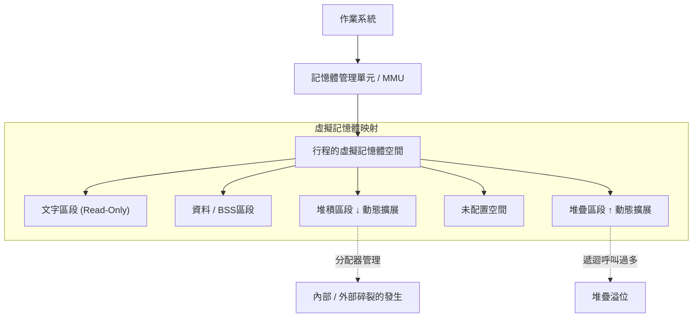
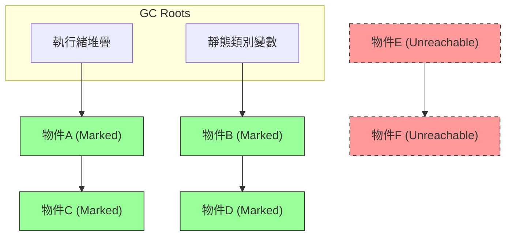
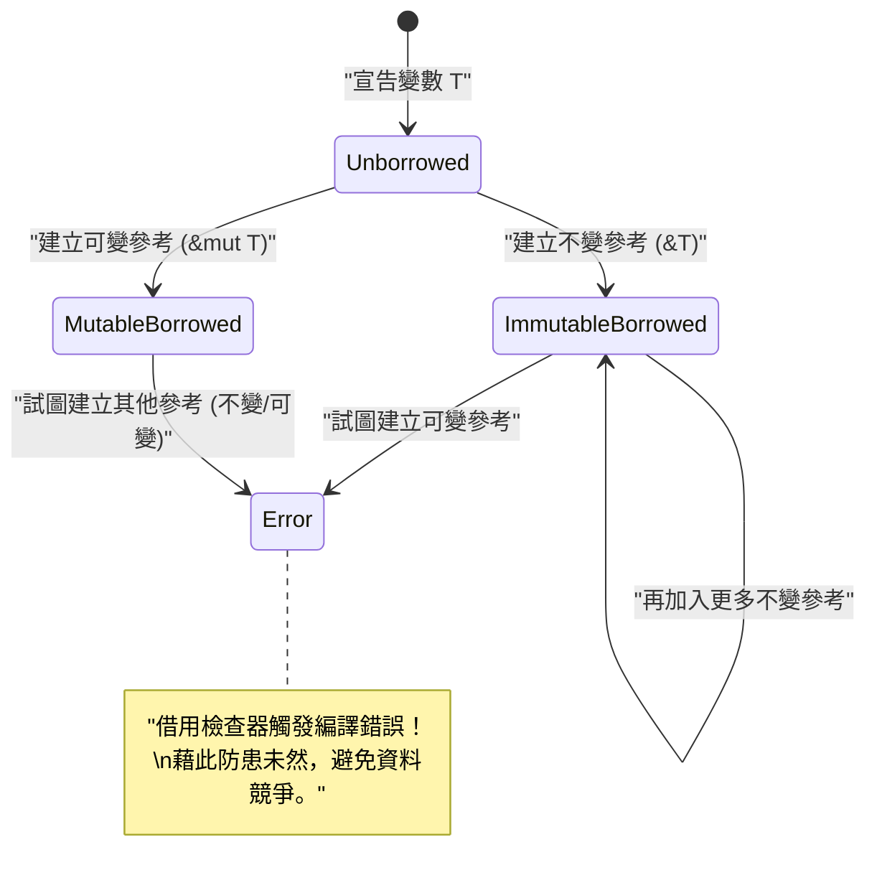

# 歡迎來到記憶體管理的真相：從 C、[Java](https://kenji.blog/zh-tw/p/programming-languages-history-paradigm-evolution/)、[Rust](https://kenji.blog/zh-tw/p/webassembly-wasm-current-future/) 探索深淵

在軟體開發中，記憶體管理是無法迴避的永恆主題，更是決定系統效能與穩定性最重要的因素之一。本篇文章將透過直逼兩萬字規模的壓倒性深度探索，完整涵蓋從記憶體管理的基礎理論，到現代架構中的最佳化手法。

C 語言帶來了 **手動管理** 的自由與責任，[Java](https://kenji.blog/zh-tw/p/programming-languages-history-paradigm-evolution/) 普及了 **垃圾回收** （ GC ）所帶來的安全自動化，而 [Rust](https://kenji.blog/zh-tw/p/programming-languages-history-paradigm-evolution/) 則提出了 **所有權** （ Ownership ）這種編譯期驗證的典範。藉由比較與分析這三種截然不同的方法，我們將逼近程式語言如何面對記憶體這項有限資源，以及其 **歷史與演進** 的本質。

---

## 1. 記憶體的基本結構：堆疊、堆積以及虛擬記憶體

當程式執行時，作業系統（ OS ）會分配一個稱為「虛擬記憶體空間」的抽象化記憶體區域給該行程（Process）。從程式的角度來看，這個空間看似是連續的巨大記憶體空間，但在背後，作業系統的記憶體分頁機制會將其映射到實體記憶體（ RAM ）或交換空間（Swap）。

虛擬記憶體空間根據其功能，在邏輯上主要分為以下幾個區段：

1. **文字區段 (Text Segment)** : 存放編譯後的機器語言指令（可執行程式碼）的區域。為了防止篡改，通常會被設定為唯讀。
2. **資料區段 (Data Segment)** : 存放已初始化的全域變數與靜態（ static ）變數的區域。
3. **BSS區段 (BSS Segment)** : 存放未初始化的全域變數與靜態變數，在執行開始時會自動清零。
4. **堆疊區段 ([Stack](https://kenji.blog/zh-tw/p/c-language-pointers-memory-management-stack-heap/) Segment)** : 存放區域變數與函式呼叫時的上下文（返回位址、引數等）的區域。
5. **堆積區段 ([Heap](https://kenji.blog/zh-tw/p/c-language-pointers-memory-management-stack-heap/) Segment)** : 用於程式執行時動態配置記憶體的區域。

### 1.1 堆疊記憶體的特性與極限

堆疊具有 LIFO（後進先出）的資料結構，在函式呼叫時會作為堆疊框（Stack Frame）自動配置記憶體，並在離開函式時自動釋放。
只要移動堆疊指標就能完成記憶體配置，因此速度極為 **快速** 。

然而，堆疊有著決定性的限制。堆疊大小受到作業系統的限制（例如：Linux 通常為 8MB），若試圖在堆疊中配置巨大的陣列，或是進行過深的遞迴呼叫，就會發生 **堆疊溢位 (Stack Overflow)** ，導致程式崩潰。

### 1.2 堆積記憶體的特性與複雜性

堆積是用來動態配置記憶體的廣大區域。它被用來存放執行時才決定大小的資料，或是生命週期超越函式作用域的資料。

堆積的管理相當複雜，程式設計師或執行時期（Runtime）必須在適當的時機進行配置與釋放。不當的堆積管理會導致後述的記憶體洩漏或記憶體碎裂（ Fragmentation ）等問題。



---

## 2. C 語言：極致的自由與自我責任

C 語言能實現貼近硬體的底層控制，賦予了開發者對記憶體管理的 **完全權限** 。這意味著雖然能發揮出最高效能，但些微的失誤就會直接導致致命的 Bug 或是安全漏洞。

### 2.1 malloc 與 free 的機制

在 C 語言中，動態配置堆積記憶體是透過標準函式庫的 `malloc` 或 `calloc` 來進行，而釋放則是手動呼叫 `free` 。背後有 `ptmalloc` 或 `jemalloc` 等分配器在運作，透過系統呼叫（ `brk` 或 `mmap` ）向作業系統請求記憶體。

```c
#include <stdio.h>
#include <stdlib.h>
#include <string.h>

typedef struct {
    int id;
    char name[50];
} User;

int main() {
    // 在堆積區段動態配置供 User 結構使用的記憶體
    User *user_ptr = (User*)malloc(sizeof(User));
    
    if (user_ptr == NULL) {
        fprintf(stderr, "記憶體配置失敗。\n");
        return 1;
    }
    
    // 寫入資料
    user_ptr->id = 1;
    strncpy(user_ptr->name, "Alice", sizeof(user_ptr->name) - 1);
    user_ptr->name[sizeof(user_ptr->name) - 1] = '\0';
    
    printf("User ID: %d, Name: %s\n", user_ptr->id, user_ptr->name);
    
    // 使用完畢後必須手動釋放記憶體
    free(user_ptr);
    
    // 釋放後的指標會變成懸垂指標，因此代入 NULL 以確保安全
    user_ptr = NULL;
    
    return 0;
}
```

### 2.2 手動記憶體管理所引發的惡夢

在 C 語言中進行記憶體管理，很容易產生以下典型的 Bug（記憶體漏洞）。

1. **記憶體洩漏 (Memory Leak)** : 忘記呼叫 `free` ，導致不再使用的記憶體殘留且未被釋放的現象。若發生在長時間運行的伺服器上，最終會耗盡系統整體的記憶體，並被 OOM (Out Of Memory) Killer 強制結束。
2. **懸垂指標 (Dangling [Pointer](https://kenji.blog/zh-tw/p/c-language-pointers-memory-management-stack-heap/))** : 持續指向已經透過 `free` 釋放的記憶體區域的指標。若試圖透過此指標存取記憶體，會引發未定義行為（例如記憶體區段錯誤 Segmentation Fault）。
3. **雙重釋放 (Double Free)** : 對同一個堆積區域的指標呼叫了兩次 `free` 的錯誤。這會破壞分配器的內部結構（例如堆積的空閒列表），成為安全上的漏洞。
4. **緩衝區溢位 (Buffer Overflow)** : 寫入資料超出了所配置的記憶體區域範圍的現象。透過覆寫相鄰的重要資料或返回位址，這將成為執行惡意程式碼攻擊（如堆疊粉碎 [Stack](https://kenji.blog/zh-tw/p/c-language-pointers-memory-management-stack-heap/) Smashing 等）的突破口。

我們試著用數學式來建立模型。假設在某個時間點 $ t $ ，堆積的總配置量為 $ A(t) $ ，總釋放量為 $ F(t) $ 。系統中活躍的記憶體使用量 $ M(t) $ 可用以下積分來表示。

$ M(t) = \int_0^t (A(\tau) - F(\tau)) d\tau $

在程式正常結束的時間點 $ T $ ，理想的邏輯狀態是 $ M(T) = 0 $ 。然而，如果 $ A(t) > F(t) $ 的狀態持續存在， $ M(t) $ 就會單調遞增，並突破系統實體記憶體的上限 $ M_{max} $ 。這就是 **記憶體洩漏** 的數學定義。

---

## 3. [Java](https://kenji.blog/zh-tw/p/programming-languages-history-paradigm-evolution/)：垃圾回收帶來的革命

Java 為苦於 C/C++ 頻發記憶體 Bug 的軟體業界帶來了巨大的典範轉移。Java 將記憶體管理的複雜性從程式設計師手中接管，交給了內建於 Java 虛擬機器（ JVM ）的 **垃圾回收** （ GC ）。開發者因此能夠專注於業務邏輯的撰寫與物件的生成。

### 3.1 GC 的基礎：可達性與 Mark-and-Sweep

Java 的 GC 是基於「可達性（ Reachability ）」的概念。將堆疊上的區域變數或靜態變數等定義為「GC Root」，從這些根節點可以追蹤到參考的物件會被判定為 **存活** （ Alive ），而無法追蹤到的物件則被判定為 **垃圾** （ Garbage ）。

最經典且基礎的演算法是「 Mark-and-Sweep 」。

1. **Mark (標記) 階段** : 從 GC Root 開始，遍歷（走訪）物件的參考圖。將所有可達的物件賦予「存活標記」。
2. **Sweep (清除) 階段** : 掃描整個堆積，將未被賦予標記的物件的記憶體區域回收至「空閒列表（Free List）」。



在上圖中，綠色的物件被標記為可達並受到保護。另一方面，以紅色虛線標示的物件集合因為不被任何地方參考，因此在 Sweep 階段會自動被回收記憶體。

### 3.2 [Java](https://kenji.blog/zh-tw/p/programming-languages-history-paradigm-evolution/) 程式碼中的記憶體行為

在 Java 中，會使用 `new` 關鍵字在堆積上配置物件，但不存在相當於 C 語言中 `free` 的釋放指令。

```java
import java.util.ArrayList;
import java.util.List;

public class GcExample {
    public static void main(String[] args) {
        // 在堆積上建立物件，並將參考綁定到區域變數
        List<String> activeList = new ArrayList<>();
        activeList.add("Important Data");
        
        // 在作用域內建立大量短命物件
        for (int i = 0; i < 10000; i++) {
            // temp 物件在每次迴圈迭代結束時會變成不可達
            String temp = new String("Temporary Data " + i);
        }
        
        // 當執行到這裡時，10,000 個 String 物件已成為 GC 的回收對象
        // activeList 則直到 main 方法結束前，都可從 GC Root 抵達
        
        // 明確要求執行 GC (但是否真正執行不保證，由 JVM 決定)
        System.gc();
        
        System.out.println("程式結束");
    }
}
```

### 3.3 世代別 GC (Generational GC) 與 Stop-The-World

現代的 JVM（如 HotSpot VM 等）為了提升效率，會將堆積分為不同的世代（ Generation ）。這是基於 **「大多數物件在建立後很快就會變得不再需要（弱世代假說）」** 的經驗法則。

堆積大致上可分為「年輕世代（ Young Generation：Eden 空間、Survivor 空間）」與「老年代（ Old Generation：Tenured 空間）」。

- **Minor GC** : 當年輕世代填滿時會觸發。能快速回收短命的物件。
- **Major GC / Full GC** : 在多次 Minor GC 中存活下來的物件會被晉升（ Promote ）到老年代。當老年代填滿時，就會觸發規模更大、耗時更長的 Full GC。

當執行 GC 時，為了保持記憶體的一致性，應用程式的所有執行緒都會暫停。這被稱為 **Stop-The-World (STW)** 暫停。在需要低延遲的即時系統或金融系統中，STW 是一個致命的問題，因此目前正積極研究與導入能盡可能縮短 STW 的最新 GC 演算法，例如 G1GC 或 ZGC。

---

## 4. [Rust](https://kenji.blog/zh-tw/p/webassembly-wasm-current-future/)：所有權與借用帶來的第三條路

C 語言「透過手動管理達到極限效能」與 [Java](https://kenji.blog/zh-tw/p/programming-languages-history-paradigm-evolution/)「透過自動管理保障記憶體安全」。這兩者長期以來被認為是需要權衡取捨（Trade-off）的關係。然而，[Rust](https://kenji.blog/zh-tw/p/programming-languages-history-paradigm-evolution/) 語言導入了 **「所有權（ Ownership ）」** 這個劃時代的模型，成功達成排除了垃圾回收，卻能在編譯期 100% 保證記憶體安全的創舉。

### 4.1 所有權（Ownership）的三大原則

構成 Rust 記憶體管理核心的所有權系統，是由以下三個嚴格的規則所組成。

1. Rust 中的每個值，都有一個被稱為 **擁有者（ owner ）** 的變數與之綁定。
2. 在任何時候，一個值只會有 **一個擁有者** 。
3. 當擁有者 **離開作用域** 時，該值就會立即被丟棄（ Drop ）。

藉由這些規則，Rust 不需要開發者撰寫 `malloc` 或 `free` ，當變數離開作用域的瞬間，就會自動呼叫 `drop` 函式並釋放記憶體。系統中也不存在如同 GC 般的執行時期監控執行緒。

### 4.2 所有權的轉移（Move）

在 [Rust](https://kenji.blog/zh-tw/p/webassembly-wasm-current-future/) 中，若將變數賦值給其他變數，或是將值傳遞給函式，所有權就會發生「轉移（ Move ）」。失去所有權的變數在之後將無法被存取（會產生編譯錯誤）。這使得雙重釋放（Double Free）在結構上變得不可能發生。

```rust
fn main() {
    // 在堆積上配置字串。s1 成為擁有者。
    let s1 = String::from("hello, rust");
    
    // 所有權從 s1 轉移 (Move) 給 s2。
    // 從這一刻起，s1 被無效化。雖然底層是淺複製 (Shallow Copy)，但為了防止雙重釋放，原來的變數會失效。
    let s2 = s1; 
    
    // println!("{}", s1); // 編譯錯誤！ (value borrowed here after move)
    println!("s2 owns the data: {}", s2);
    
} // 作用域結束。s2 被丟棄，堆積上的記憶體被安全釋放。
```

### 4.3 借用（Borrowing）與生命週期

如果所有的操作都會轉移所有權，那程式設計將變得極度不便。為了在不奪走所有權的情況下存取資料，[Rust](https://kenji.blog/zh-tw/p/webassembly-wasm-current-future/) 引入了 **參考（ Reference ）** 與 **借用（ Borrowing ）** 的概念。

此外，內建於 [Rust](https://kenji.blog/zh-tw/p/programming-languages-history-paradigm-evolution/) 編譯器中的 **借用檢查器（ Borrow Checker ）** ，會在編譯時強制執行以下嚴格的規則。

- 在任意時間點，只能擁有 **一個可變參考（ `&mut T` ）** ，或者 **任意數量的不變參考（ `&T` ）** 的其中一種（兩者無法同時共存，以防止資料競爭 Data Race）。
- 參考的生命週期（有效期間）不能超過原始資料的生命週期（完全防止懸垂指標）。

```rust
fn main() {
    let mut data = String::from("Memory");
    
    // 不變的借用（可建立多個）
    let r1 = &data;
    let r2 = &data;
    println!("不變參考: {} and {}", r1, r2);
    // r1, r2 的生命週期在此結束（因為之後不再使用）
    
    // 可變的借用（只能建立一個）
    let r3 = &mut data;
    r3.push_str(" Management");
    println!("透過可變參考修改後: {}", r3);
    
    // 若試圖同時使用 r1 和 r3，借用檢查器會給出編譯錯誤
    // println!("{}, {}", r1, r3); // Error!
}
```



---

## 5. 最尖端的最佳化：資料局部性與 CPU 快取

在鑽研記憶體管理時，超越單純「配置與釋放」的框架，貼近現代硬體架構是相當重要的。這就是 **資料局部性 (Data Locality)** 的概念。

現代的 CPU 速度極快，但存取主記憶體（ RAM ）卻會產生數百個時脈週期的延遲。為了隱藏這種延遲，CPU 內部搭載了 L1、L2、L3 等階層式的 **CPU 快取** 。

當 CPU 從記憶體讀取資料時，不只會讀取該筆資料，還會將相鄰的一定大小（快取線，通常為 64 位元組）的記憶體區塊整個載入快取中。這被稱為「空間局部性（ Spatial Locality ）」。

### 5.1 不同語言的快取效率差異

- **C / C++ / [Rust](https://kenji.blog/zh-tw/p/webassembly-wasm-current-future/)** : 當建立結構的陣列（如 `struct Array[100]` 或 `Vec<MyStruct>` ）時，資料會在記憶體上緊密連續地排列。當對陣列進行迴圈處理時，CPU 的硬體預取器（Hardware Prefetcher）能完美發揮作用，使快取命中率（Cache Hit Rate）飛躍性地提升。
- **[Java](https://kenji.blog/zh-tw/p/programming-languages-history-paradigm-evolution/)** : Java 的物件陣列（如 `MyObject[]` ）並非實體陣列，而是「物件參考（指標）」的陣列。作為實體的每個物件會被分配在堆積上零散的位置，因此每次執行迴圈時都必須追蹤指標存取隨機的記憶體位址，進而引發嚴重的快取未命中（ Cache Miss ）。

記憶體存取的實際平均時間 $ T_{avg} $ 可用下列公式表示。

$ T_{avg} = h \cdot T_{cache} + (1 - h) \cdot T_{memory} $

這裡的 $ h $ 代表快取命中率（ $ 0 \le h \le 1 $ ），$ T_{cache} $ 是快取存取時間（約 1〜4 ns ），$ T_{memory} $ 是主記憶體存取時間（約 100 ns ）。
究竟是將 $ h $ 提升至 0.99（如 C/[Rust](https://kenji.blog/zh-tw/p/webassembly-wasm-current-future/) 的做法），還是降至 0.5（如 [Java](https://kenji.blog/zh-tw/p/programming-languages-history-paradigm-evolution/) 的指標追蹤），會讓應用程式的迴圈執行速度產生數十倍的差距。這正是遊戲引擎或高頻交易系統選擇 C++ 或 [Rust](https://kenji.blog/zh-tw/p/programming-languages-history-paradigm-evolution/) 的真正原因。

---

## 6. 總結：邁向適材適所的技術選型

本篇文章深入探討了三種截然不同的記憶體管理典範。

| 語言 | 方法 | 優勢 | 劣勢與挑戰 |
|:---:|:---|:---|:---|
| **C** | 透過 `malloc/free` 進行手動管理 | 極致的速度、快取效率最大化、輕量 | 漏洞的溫床（洩漏、雙重釋放）、開發成本高 |
| **[Java](https://kenji.blog/zh-tw/p/programming-languages-history-paradigm-evolution/)** | GC (垃圾回收) | 提升開發速度、確保記憶體安全 | STW 導致延遲波動、快取效率惡化 |
| **[Rust](https://kenji.blog/zh-tw/p/webassembly-wasm-current-future/)** | 所有權與借用檢查器 | 零執行時期成本的安全性、高速 | 學習曲線陡峭、生命週期設計困難 |

**記憶體管理** 的歷史，是一場在效能與安全性之間搖擺的翹翹板遊戲。為了防止手動管理引發的慘劇而誕生了 GC，而為了迴避 GC 帶來的效能懲罰，又發明了所有權模型。

當我們在設計系統時，不應該做出「因為最快所以用 [Rust](https://kenji.blog/zh-tw/p/programming-languages-history-paradigm-evolution/)」、「因為安全所以用 [Java](https://kenji.blog/zh-tw/p/programming-languages-history-paradigm-evolution/)」這種短視的決定，而是應該結合系統的需求（對延遲的嚴格程度、開發資源、可維護性），並對照背後記憶體管理的 **真相** ，進而選擇最合適的技術，這才是通往一流工程師的道路。
