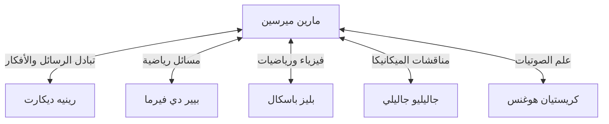

## مقدمة

كان [مارين ميرسين](https://kenji.blog/ar/p/mersenne/) (1588-1648) عالم لاهوت وفيلسوف وعالم رياضيات ومنظر موسيقي فرنسي في القرن السابع عشر. على الرغم من أنه قام باكتشافات رياضية خاصة به، إلا أنه معروف على نطاق واسع بدوره كـ **"صندوق بريد أوروبا"**، حيث ربط بين كبار العلماء في عصره.

في هذا المقال، سنستكشف حياة ميرسين، والشبكة الفكرية الضخمة التي بناها، و **أعداد ميرسين الأولية** المرتبطة ارتباطًا وثيقًا بالتشفير الحديث. علاوة على ذلك، سنتعمق في مساهماته في علم الصوتيات وتأثيره على المنهجية العلمية.

## حياته المبكرة وحياته الرهبانية

ولد [مارين ميرسين](https://kenji.blog/ar/p/mersenne/) في 8 سبتمبر 1588 لعائلة فلاحية في أويزيه، منطقة ماين، فرنسا. بعد تلقيه التعليم الأساسي في كلية في لومان، التحق بكلية لافليش اليسوعية في عام 1604. هناك التقى ب[رينيه ديكارت](https://kenji.blog/ar/p/descartes/)، الذي سيصبح لاحقًا أبًا للفلسفة الحديثة، وكون معه صداقة عميقة مدى الحياة.

في عام 1611، انضم ميرسين إلى رهبنة المينيم (Order of Minims). كانت رهبنة المينيم ذات انضباط صارم (مثل الصوم والنباتية)، لكنهم عززوا ثقافة تشجع على السعي وراء المعرفة. في عام 1619، استقر في دير أنونسياد في باريس، والذي أصبح قاعدته للانغماس في اللاهوت والفلسفة والعلوم الطبيعية.

تتميز كتاباته بالاستعداد لدمج الاكتشافات العلمية الجديدة في ذلك الوقت بنشاط مع الالتزام بالعقيدة الدينية. لعب موقفه الذي يهدف إلى التوفيق بين الدين والعلم دورًا مهمًا في المناخ الفكري للقرن السابع عشر.

## صندوق بريد أوروبا: شبكة ميرسين

في أوائل القرن السابع عشر، لم تكن المجلات والمجلات العلمية والأكاديميات كما نعرفها اليوم موجودة بعد. كانت الوسيلة الوحيدة لمشاركة الاكتشافات والنظريات الجديدة هي الرسائل (المراسلات) بين العلماء.

مستفيدًا من فضوله الفطري وقدرته على التواصل الاجتماعي، انخرط ميرسين في قدر هائل من المراسلات مع العلماء في جميع أنحاء أوروبا. كانت غرفته الرهبانية أشبه بأكاديمية علمية، من خلالها تبادل العديد من العلماء الأفكار. غالبًا ما يُشار إلى هذه الشبكة باسم "شبكة ميرسين".



في قلب هذه الشبكة، عندما يكتشف شخص ما نظرية جديدة، كان ميرسين ينقلها إلى علماء آخرين، لتشجيع النقد والتحقق. على سبيل المثال، كان ميرسين هو من نقل الاكتشافات الرياضية ل[بيير دي فيرما](https://kenji.blog/ar/p/fermat/) إلى ديكارت، مما أثار نقاشًا حادًا بين الاثنين. ويُعرف أيضًا بترجمته لأعمال جاليليو جاليلي (مثل *حوار حول النظامين الرئيسيين للكون*) إلى الفرنسية، وجعلها معروفة على نطاق واسع على الرغم من الرقابة الصارمة للكنيسة الكاثوليكية. يقيم بعض المؤرخين أنه لولاه، ربما كانت الثورة العلمية في القرن السابع عشر ستتأخر لعقود.

## الإنجازات الرياضية: أعداد ميرسين الأولية

لا شك أن اسم ميرسين هو الأكثر تذكرًا اليوم في شكل **أعداد ميرسين الأولية**.

يُعرّف عدد ميرسين على النحو التالي:

$$
M_n = 2^n - 1 \quad (\text{حيث } n \text{ عدد طبيعي})
$$

عندما يكون $M_n$ هذا عددًا أوليًا، يُطلق عليه "عدد ميرسين الأولي".

### شروط كونه عددًا أوليًا

لكي يكون $2^n - 1$ أوليًا، فمن الشروط الضرورية (وإن لم يكن كافيًا) أن يكون $n$ نفسه عددًا أوليًا.

على سبيل المثال:
- بالنسبة لـ $n = 2$، $M_2 = 2^2 - 1 = 3$ (أولي)
- بالنسبة لـ $n = 3$، $M_3 = 2^3 - 1 = 7$ (أولي)
- بالنسبة لـ $n = 5$، $M_5 = 2^5 - 1 = 31$ (أولي)
- بالنسبة لـ $n = 7$، $M_7 = 2^7 - 1 = 127$ (أولي)

ومع ذلك، بالنسبة لـ $n = 11$،
$$
M_{11} = 2^{11} - 1 = 2047 = 23 \times 89 \quad (\text{عدد مؤلف})
$$
وبالتالي فهو ليس أوليًا.

### التخمين الجريء لعام 1644

في كتابه *Cogitata Physico-Mathematica* الصادر عام 1644، ادعى ميرسين أنه بالنسبة لـ $n \le 257$، يكون $M_n$ أوليًا فقط في الحالات التالية:

$$
\text{أولي عندما } n = 2, 3, 5, 7, 13, 17, 19, 31, 67, 127, 257
$$

في ذلك الوقت، كان التحقق من أولية الأعداد الضخمة يدويًا شبه مستحيل، لذا قوبل هذا الادعاء الجريء بدهشة كبيرة. اعترف ميرسين نفسه بأنه لم يقم بحساب جميع الأرقام بدقة.

كشف التحقق من قبل علماء الرياضيات اللاحقين أن هناك العديد من الأخطاء في قائمة ميرسين ($n = 67$ و $257$ هما عددان مؤلفان، بينما في الواقع هو أولي بالنسبة لـ $n = 61, 89, 107$). استغرق الأمر حوالي ثلاثة قرون (حتى عام 1947) حتى تم تصحيح القائمة بالكامل. ومع ذلك، استمرت المشكلة التي طرحها في جذب علماء الرياضيات لقرون.

### التطبيقات في التشفير الحديث ومشروع GIMPS

اليوم، يستمر استكشاف أعداد ميرسين الأولية بواسطة "GIMPS" (بحث الإنترنت العظيم عن أعداد ميرسين الأولية)، وهو مشروع مخصص للعثور على أكبر الأعداد الأولية في العالم. نظرًا لوجود اختبار أولية خاص وسريع يسمى اختبار لوكاس-ليهمر (Lucas-Lehmer test)، فإن أعداد ميرسين مناسبة تمامًا لاكتشاف الأعداد الأولية العملاقة.

```python
# اختبار لوكاس-ليهمر لأعداد ميرسين الأولية
def is_mersenne_prime(p):
    """
    يتحقق مما إذا كان M_p = 2^p - 1 أوليًا باستخدام اختبار لوكاس-ليهمر.
    يعيد True إذا كان أوليًا، و False بخلاف ذلك.
    """
    if p == 2:
        return True
    
    m = (1 << p) - 1
    s = 4
    for _ in range(p - 2):
        s = (s * s - 2) % m
        
    return s == 0
```

تلعب الأعداد الأولية العملاقة المكتشفة دورًا حاسمًا في دعم مجتمع المعلومات، حيث تعمل كأساس لتقييم أمان أنظمة تشفير المفتاح العام الحديثة مثل [RSA](https://kenji.blog/ar/p/modern-cryptography-public-key-hash-signature/)، وخوارزميات توليد الأرقام العشوائية (مثل [Mersenne](https://kenji.blog/ar/p/mersenne/) Twister).

## المساهمات في علم الصوتيات ونظرية الموسيقى: قوانين ميرسين

إلى جانب الرياضيات، يُطلق على ميرسين أيضًا اسم **"أبو علم الصوتيات"**. كتابه *Harmonie Universelle* (الانسجام العالمي)، الذي نُشر عام 1636، هو العمل الأكثر شمولاً في نظرية الموسيقى والآلات في عصره. في هذا الكتاب، استكشف الأسس الفيزيائية لطبقة الصوت والتناغم.

لقد اكتشف "قوانين ميرسين" المتعلقة بتردد الأوتار المهتزة. يتم التعبير عن التردد الأساسي $f$ للوتر بالمعادلة التالية بناءً على طول الوتر $L$، والشد $T$، والكثافة الخطية $\mu$ (الكتلة لكل وحدة طول).

$$
\text{التردد الأساسي } f = \frac{1}{2L} \sqrt{\frac{T}{\mu}}
$$

يعد هذا القانون مبدأ فيزيائيًا حاسمًا يشكل الأساس لتصميم وضبط الآلات الوترية مثل الجيتار والبيانو. ومن خلال توسيع بحث فينتشنزو جاليلي (والد جاليليو)، أصبح من أوائل الذين أثبتوا بالتجربة أن طبقة الصوت تعتمد بشكل مباشر على تردد اهتزازات الهواء. وحاول أيضًا قياس سرعة الصوت، وفتح الباب أمام علم الصوتيات الحديث.

## الفلسفة والدين: العلاقة مع ديكارت

ترك ميرسين بصمات فلسفية مهمة أيضًا. لقد عارض التشكيك الشديد والأفكار السحرية أو الصوفية (مثل الهرمسية في عصر النهضة)، ودافع عن العلم العقلاني والتجريبي.

عندما نشر صديقه المقرب ديكارت كتابه *تأملات في الفلسفة الأولى*، أرسل ميرسين المخطوطة إلى كبار المفكرين في جميع أنحاء أوروبا (مثل توماس هوبز وبيير جاسندي) لجمع اعتراضاتهم. ثم قام بتجميعها في كتاب مع ردود ديكارت الخاصة، ولعب دورًا يمكن اعتباره مقدمة لنظام المراجعة النظيرة (peer-review) الحديث.

كان ميرسين يؤمن إيمانًا راسخًا بأن التقدم العلمي يثبت عظمة العالم الذي خلقه الله، معتبرًا أنه لا يوجد تعارض بين الدين والعلم.

## خاتمة

لم يمتلك [مارين ميرسين](https://kenji.blog/ar/p/mersenne/) حدسًا رياضيًا متميزًا فحسب، بل امتلك أيضًا موهبة نادرة لربط الناس والمعرفة. أدت الشبكة الفكرية التي أنشأها في النهاية إلى ولادة الجمعيات العلمية الرسمية، مثل الأكاديمية الفرنسية للعلوم والجمعية الملكية في إنجلترا.

حُفر اسمه إلى الأبد في تاريخ الرياضيات في شكل أعداد ميرسين الأولية، لكن دوره كـ "ميسر فكري" في الثورة العلمية في القرن السابع عشر هو أيضًا إنجاز عظيم لا ينبغي نسيانه أبدًا. تعلمنا حياته أن العلم يتطور ليس فقط من خلال عبقرية الأفراد ولكن أيضًا من خلال التواصل المفتوح والتعاون.
