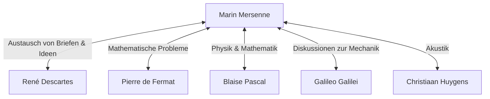

## Einführung

[Marin Mersenne](https://kenji.blog/de/p/mersenne/) (1588–1648) war ein französischer Theologe, Philosoph, Mathematiker und Musiktheoretiker des 17. Jahrhunderts. Obwohl er eigene mathematische Entdeckungen machte, ist er vor allem für seine Rolle als **„Postamt Europas“** bekannt, das die großen Gelehrten seiner Zeit miteinander verband.

In diesem Artikel werden wir das Leben von [Mersenne](https://kenji.blog/de/p/mersenne/), das riesige intellektuelle Netzwerk, das er aufgebaut hat, und die **[Mersenne](https://kenji.blog/de/p/mersenne/)-Primzahlen**, die tief mit der modernen Kryptographie verbunden sind, untersuchen. Darüber hinaus werden wir uns mit seinen Beiträgen zur Akustik und seinem Einfluss auf die wissenschaftliche Methodik befassen.

## Frühes Leben und klösterliches Leben

[Marin Mersenne](https://kenji.blog/de/p/mersenne/) wurde am 8. September 1588 in einer Bauernfamilie in Oizé, Maine, Frankreich, geboren. Nach einer Grundausbildung an einem Collège in Le Mans trat er 1604 in das Jesuitenkolleg von La Flèche ein. Dort lernte er [René Descartes](https://kenji.blog/de/p/descartes/) kennen, der später zum Vater der modernen Philosophie werden sollte, und schloss mit ihm eine lebenslange Freundschaft.

Im Jahr 1611 trat [Mersenne](https://kenji.blog/de/p/mersenne/) dem Paulanerorden (Minimen) bei. Die Minimen waren ein Orden mit strengen Disziplinen (wie Fasten und Vegetarismus), förderten aber eine Kultur, die das Streben nach Gelehrsamkeit ermutigte. 1619 ließ er sich im Kloster L'Annonciade in Paris nieder, das zu seiner Basis wurde, um sich in Theologie, Philosophie und Naturwissenschaften zu vertiefen.

Seine Schriften zeichnen sich durch die Bereitschaft aus, neue wissenschaftliche Entdeckungen der Zeit aktiv einzubeziehen und gleichzeitig an der religiösen Doktrin festzuhalten. Seine Haltung, die darauf abzielte, Religion und Wissenschaft in Einklang zu bringen, spielte eine wichtige Rolle im intellektuellen Klima des 17. Jahrhunderts.

## Das Postamt Europas: Das [Mersenne](https://kenji.blog/de/p/mersenne/)-Netzwerk

Zu Beginn des 17. Jahrhunderts gab es wissenschaftliche Zeitschriften und Akademien in der heutigen Form noch nicht. Die einzige Möglichkeit, neue Entdeckungen und Theorien auszutauschen, war der Briefwechsel (Korrespondenz) zwischen Gelehrten.

[Mersenne](https://kenji.blog/de/p/mersenne/) nutzte seine angeborene Neugier und Kontaktfreudigkeit und führte eine enorme Korrespondenz mit Gelehrten in ganz Europa. Seine Klosterzelle glich einer wissenschaftlichen Akademie, über die viele Gelehrte Ideen austauschten. Dieses Netzwerk wird oft als „[Mersenne](https://kenji.blog/de/p/mersenne/)-Netzwerk“ bezeichnet.



Im Zentrum dieses Netzwerks gab [Mersenne](https://kenji.blog/de/p/mersenne/), wenn jemand ein neues Theorem entdeckte, es an andere Gelehrte weiter und förderte Kritik und Überprüfung. So war es beispielsweise [Mersenne](https://kenji.blog/de/p/mersenne/), der die mathematischen Entdeckungen von [Pierre de Fermat](https://kenji.blog/de/p/fermat/) an [Descartes](https://kenji.blog/de/p/descartes/) weiterleitete und damit eine heftige Debatte zwischen den beiden auslöste. Er ist auch dafür bekannt, Werke von Galileo Galilei (wie den *Dialog über die beiden wichtigsten Weltsysteme*) ins Französische übersetzt und trotz strenger Zensur durch die katholische Kirche weithin bekannt gemacht zu haben. Einige Historiker schätzen, dass sich die wissenschaftliche Revolution des 17. Jahrhunderts ohne ihn um Jahrzehnte hätte verzögern können.

## Mathematische Errungenschaften: [Mersenne](https://kenji.blog/de/p/mersenne/)-Primzahlen

[Mersenne](https://kenji.blog/de/p/mersenne/)s Name ist heute zweifellos am besten in Form der **[Mersenne](https://kenji.blog/de/p/mersenne/)-Primzahlen** in Erinnerung geblieben.

Eine [Mersenne](https://kenji.blog/de/p/mersenne/)-Zahl ist wie folgt definiert:

$$
M_n = 2^n - 1 \quad (\text{wobei } n \text{ eine natürliche Zahl ist})
$$

Wenn dieses $M_n$ eine Primzahl ist, wird es als „[Mersenne](https://kenji.blog/de/p/mersenne/)-Primzahl“ bezeichnet.

### Bedingungen für die Eigenschaft als Primzahl

Damit $2^n - 1$ eine Primzahl ist, ist es eine notwendige (wenn auch nicht hinreichende) Bedingung, dass $n$ selbst eine Primzahl ist.

Zum Beispiel:
- Für $n = 2$ gilt $M_2 = 2^2 - 1 = 3$ (Primzahl)
- Für $n = 3$ gilt $M_3 = 2^3 - 1 = 7$ (Primzahl)
- Für $n = 5$ gilt $M_5 = 2^5 - 1 = 31$ (Primzahl)
- Für $n = 7$ gilt $M_7 = 2^7 - 1 = 127$ (Primzahl)

Für $n = 11$ gilt jedoch:
$$
M_{11} = 2^{11} - 1 = 2047 = 23 \times 89 \quad (\text{Zusammengesetzte Zahl})
$$
Somit ist sie keine Primzahl.

### Die kühne Vermutung von 1644

In seinem Buch *Cogitata Physico-Mathematica* von 1644 behauptete [Mersenne](https://kenji.blog/de/p/mersenne/), dass für $n \le 257$ $M_n$ nur für die folgenden Werte von $n$ prim ist:

$$
\text{Primzahl, wenn } n = 2, 3, 5, 7, 13, 17, 19, 31, 67, 127, 257
$$

Damals war die Überprüfung der Primzahleigenschaft riesiger Zahlen von Hand praktisch unmöglich, so dass diese kühne Behauptung auf großes Erstaunen stieß. [Mersenne](https://kenji.blog/de/p/mersenne/) selbst gab zu, dass er nicht alle Zahlen streng berechnet hatte.

Überprüfungen durch spätere Mathematiker ergaben, dass [Mersenne](https://kenji.blog/de/p/mersenne/)s Liste mehrere Fehler aufwies ($n = 67$ und $257$ sind zusammengesetzt, während sie in Wirklichkeit für $n = 61, 89, 107$ prim ist). Es dauerte etwa drei Jahrhunderte (bis 1947), bis die Liste vollständig korrigiert war. Dennoch faszinierte das von ihm aufgeworfene Problem Mathematiker über Jahrhunderte hinweg.

### Anwendungen in der modernen Kryptographie und GIMPS

Heute werden [Mersenne](https://kenji.blog/de/p/mersenne/)-Primzahlen weiterhin von „GIMPS“ (Great Internet [Mersenne](https://kenji.blog/de/p/mersenne/) Prime Search) erforscht, einem Projekt, das sich der Suche nach den größten Primzahlen der Welt widmet. Da es einen speziellen, schnellen Primzahltest namens Lucas-Lehmer-Test gibt, eignen sich [Mersenne](https://kenji.blog/de/p/mersenne/)-Zahlen hervorragend für die Entdeckung gigantischer Primzahlen.

```python
# Lucas-Lehmer-Test für Mersenne-Primzahlen
def is_mersenne_prime(p):
    """
    Überprüft, ob M_p = 2^p - 1 eine Primzahl ist, unter Verwendung des Lucas-Lehmer-Tests.
    Gibt True zurück, wenn es sich um eine Primzahl handelt, ansonsten False.
    """
    if p == 2:
        return True
    
    m = (1 << p) - 1
    s = 4
    for _ in range(p - 2):
        s = (s * s - 2) % m
        
    return s == 0
```

Die entdeckten gigantischen Primzahlen spielen eine entscheidende Rolle bei der Unterstützung der Informationsgesellschaft und dienen als Grundlage für die Sicherheitsbewertung moderner Public-Key-Kryptographiesysteme wie RSA und von Algorithmen zur Zufallszahlengenerierung (wie dem [Mersenne](https://kenji.blog/de/p/mersenne/)-Twister).

## Beiträge zur Akustik und Musiktheorie: [Mersenne](https://kenji.blog/de/p/mersenne/)-Gesetze

Neben der Mathematik wird [Mersenne](https://kenji.blog/de/p/mersenne/) auch als **„Vater der Akustik“** bezeichnet. Sein 1636 veröffentlichtes Werk *Harmonie Universelle* ist das umfassendste Werk zur Musiktheorie und zu den Instrumenten seiner Zeit. In diesem Buch erforschte er die physikalischen Grundlagen von Tonhöhe und Konsonanz.

Er entdeckte die „[Mersenne](https://kenji.blog/de/p/mersenne/)-Gesetze“ bezüglich der Frequenz vibrierender Saiten. Die Grundfrequenz $f$ einer Saite wird durch die folgende Gleichung ausgedrückt, basierend auf der Saitenlänge $L$, der Spannung $T$ und der linearen Dichte $\mu$ (Masse pro Längeneinheit).

$$
\text{Grundfrequenz } f = \frac{1}{2L} \sqrt{\frac{T}{\mu}}
$$

Dieses Gesetz ist ein grundlegendes physikalisches Prinzip, das die Basis für die Konstruktion und Stimmung von Saiteninstrumenten wie Gitarren und Klavieren bildet. Aufbauend auf den Forschungen von Vincenzo Galilei (dem Vater von Galileo) war er einer der Ersten, der durch Experimente nachwies, dass die Tonhöhe direkt von der Frequenz von Luftschwingungen abhängt. Er versuchte auch, die Schallgeschwindigkeit zu messen und öffnete damit die Tür zur modernen Akustik.

## Philosophie und Religion: Beziehung zu [Descartes](https://kenji.blog/de/p/descartes/)

[Mersenne](https://kenji.blog/de/p/mersenne/) hinterließ auch philosophisch bedeutende Spuren. Er wandte sich gegen extremen Skeptizismus und magische oder mystische Ideen (wie den Hermetismus der Renaissance) und setzte sich für eine rationale und empirische Wissenschaft ein.

Als sein enger Freund [Descartes](https://kenji.blog/de/p/descartes/) seine *Meditationen über die Erste Philosophie* veröffentlichte, schickte [Mersenne](https://kenji.blog/de/p/mersenne/) das Manuskript an prominente Denker in ganz Europa (wie Thomas Hobbes und Pierre Gassendi), um deren Einwände zu sammeln. Anschließend stellte er sie zusammen mit [Descartes](https://kenji.blog/de/p/descartes/)' eigenen Antworten zu einem Buch zusammen und spielte damit eine Rolle, die als Vorläufer des modernen Peer-Review-Systems angesehen werden kann.

[Mersenne](https://kenji.blog/de/p/mersenne/) glaubte fest daran, dass der wissenschaftliche Fortschritt die Größe der von Gott geschaffenen Welt beweise, und sah keinen Widerspruch zwischen Religion und Wissenschaft.

## Fazit

[Marin Mersenne](https://kenji.blog/de/p/mersenne/) besaß nicht nur eine herausragende mathematische Intuition, sondern auch ein seltenes Talent, Menschen und Wissen miteinander zu verbinden. Das von ihm aufgebaute intellektuelle Netzwerk führte schließlich zur Gründung formeller wissenschaftlicher Gesellschaften wie der Académie des Sciences in Frankreich und der Royal Society in England.

Sein Name hat sich in Form der [Mersenne](https://kenji.blog/de/p/mersenne/)-Primzahlen für immer in die Geschichte der Mathematik eingeprägt, aber seine Rolle als „intellektueller Vermittler“ in der wissenschaftlichen Revolution des 17. Jahrhunderts ist ebenfalls eine große Errungenschaft, die niemals vergessen werden darf. Sein Leben lehrt uns, dass sich Wissenschaft nicht nur durch das Genie des Einzelnen entwickelt, sondern auch durch offene Kommunikation und Zusammenarbeit.
