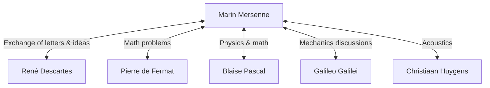

## Introduction

Marin Mersenne (1588–1648) was a 17th-century French theologian, philosopher, mathematician, and music theorist. While he made his own mathematical discoveries, he is most widely known for his role as the **"post-box of Europe"**, connecting the great scholars of his time.

In this article, we will explore Mersenne's life, the massive intellectual network he built, and the **Mersenne primes** that are deeply connected to modern cryptography. Furthermore, we will delve into his contributions to acoustics and his influence on scientific methodology.

## Early Life and Monastic Life

Marin Mersenne was born on September 8, 1588, to a peasant family in Oizé, Maine, France. After receiving basic education at a college in Le Mans, he entered the Jesuit college of La Flèche in 1604. There, he met René Descartes, who would later become the father of modern philosophy, and forged a lifelong friendship with him.

In 1611, Mersenne joined the Order of Minims. The Minims were an order with strict disciplines (such as fasting and vegetarianism), but they fostered a culture that encouraged the pursuit of scholarship. In 1619, he settled at the Convent of L'Annonciade in Paris, which became his base for immersing himself in theology, philosophy, and natural sciences.

His writings are characterized by a willingness to actively incorporate new scientific discoveries of the time while adhering to religious doctrine. His stance aimed at harmonizing religion and science played an important role in the intellectual climate of the 17th century.

## The Post-Box of Europe: The Mersenne Network

In the early 17th century, scientific journals and academies as we know them today did not yet exist. The only means of sharing new discoveries and theories was through letters (correspondence) between scholars.

Leveraging his innate curiosity and sociability, Mersenne engaged in an enormous amount of correspondence with scholars across Europe. His monastic cell was akin to a scientific academy, through which many scholars exchanged ideas. This network is often referred to as the "Mersenne network".



At the center of this network, when someone discovered a new theorem, Mersenne would relay it to other scholars, encouraging critique and verification. For example, it was Mersenne who communicated Pierre de Fermat's mathematical discoveries to Descartes, sparking a fierce debate between the two. He is also known for translating Galileo Galilei's works (such as *Dialogue Concerning the Two Chief World Systems*) into French, introducing them widely despite strict censorship by the Catholic Church. Some historians assess that without him, the Scientific Revolution of the 17th century might have been delayed by decades.

## Mathematical Achievements: Mersenne Primes

Mersenne's name is undoubtedly best remembered today in the form of **Mersenne primes**.

A Mersenne number is defined as follows:

$$
M_n = 2^n - 1 \quad (\text{where } n \text{ is a natural number})
$$

When this $M_n$ is a prime number, it is called a "Mersenne prime".

### Conditions for Being Prime

For $2^n - 1$ to be prime, it is a necessary condition (though not a sufficient one) that $n$ itself is a prime number.

For example:
- For $n = 2$, $M_2 = 2^2 - 1 = 3$ (Prime)
- For $n = 3$, $M_3 = 2^3 - 1 = 7$ (Prime)
- For $n = 5$, $M_5 = 2^5 - 1 = 31$ (Prime)
- For $n = 7$, $M_7 = 2^7 - 1 = 127$ (Prime)

However, for $n = 11$,
$$
M_{11} = 2^{11} - 1 = 2047 = 23 \times 89 \quad (\text{Composite number})
$$
Thus, it is not prime.

### The Bold Conjecture of 1644

In his 1644 book *Cogitata Physico-Mathematica*, Mersenne claimed that for $n \le 257$, $M_n$ is prime only for:

$$
\text{Prime when } n = 2, 3, 5, 7, 13, 17, 19, 31, 67, 127, 257
$$

At the time, checking the primality of huge numbers by hand was practically impossible, so this bold claim was met with great astonishment. Mersenne himself admitted that he had not rigorously calculated all the numbers.

Verification by later mathematicians revealed that there were several errors in Mersenne's list ($n = 67$ and $257$ are composite, while in reality it is prime for $n = 61, 89, 107$). It took about three centuries (until 1947) for the list to be completely corrected. Nevertheless, the problem he posed continued to fascinate mathematicians for centuries.

### Applications to Modern Cryptography and GIMPS

Today, Mersenne primes continue to be explored by "GIMPS" (Great Internet Mersenne Prime Search), a project dedicated to finding the world's largest prime numbers. Because there is a special, fast primality test called the Lucas-Lehmer test, Mersenne numbers are extremely well-suited for discovering gigantic primes.

```python
# Lucas-Lehmer test for Mersenne primes
def is_mersenne_prime(p):
    """
    Checks if M_p = 2^p - 1 is prime using the Lucas-Lehmer test.
    Returns True if prime, False otherwise.
    """
    if p == 2:
        return True
    
    m = (1 << p) - 1
    s = 4
    for _ in range(p - 2):
        s = (s * s - 2) % m
        
    return s == 0
```

The gigantic primes discovered play a critical role in supporting the information society, serving as the foundation for the security evaluation of modern public-key cryptography systems like RSA, and random number generation algorithms (such as the Mersenne Twister).

## Contributions to Acoustics and Music Theory: Mersenne's Laws

Beyond mathematics, Mersenne is also called the **"father of acoustics"**. His *Harmonie Universelle*, published in 1636, is the most comprehensive work on music theory and instruments of its time. In this book, he explored the physical foundations of pitch and consonance.

He discovered "Mersenne's laws" regarding the frequency of vibrating strings. The fundamental frequency $f$ of a string is expressed by the following equation based on the string's length $L$, tension $T$, and linear density $\mu$ (mass per unit length).

$$
\text{Fundamental frequency } f = \frac{1}{2L} \sqrt{\frac{T}{\mu}}
$$

This law is a crucial physical principle that forms the basis for designing and tuning string instruments like guitars and pianos. Expanding on the research of Vincenzo Galilei (Galileo's father), he became one of the first to demonstrate through experiment that pitch directly depends on the frequency of air vibrations. He also attempted to measure the speed of sound, opening the door to modern acoustics.

## Philosophy and Religion: Relationship with Descartes

Mersenne also left significant footprints philosophically. He opposed extreme skepticism and magical or mystical ideas (such as Renaissance Hermeticism), championing rational and empirical science.

When his close friend Descartes published *Meditations on First Philosophy*, Mersenne sent the manuscript to prominent thinkers across Europe (such as Thomas Hobbes and Pierre Gassendi) to collect their objections. He then compiled them into a book along with Descartes' own replies, playing a role that could be considered a precursor to the modern peer-review system.

Mersenne firmly believed that scientific progress proved the greatness of the world created by God, considering that there was no contradiction between religion and science.

## Conclusion

Marin Mersenne possessed not only outstanding mathematical intuition but also a rare talent for connecting people and knowledge. The intellectual network he established eventually led to the birth of formal scientific societies, such as the French Academy of Sciences and the Royal Society in England.

His name is forever etched in the history of mathematics in the form of Mersenne primes, but his role as an "intellectual facilitator" in the 17th-century Scientific Revolution is also a great achievement that must never be forgotten. His life teaches us that science develops not only through the genius of individuals but also through open communication and collaboration.
