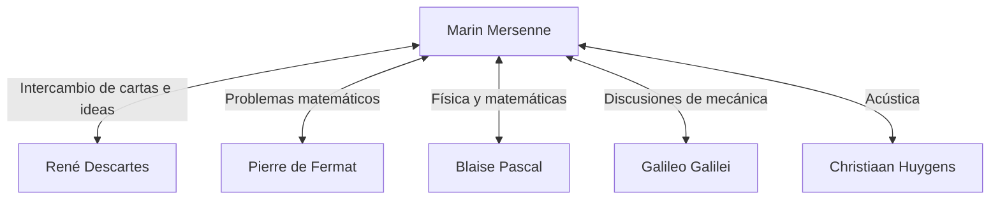

## Introducción

[Marin Mersenne](https://kenji.blog/es/p/mersenne/) (1588–1648) fue un teólogo, filósofo, matemático y teórico de la música francés del siglo XVII. Si bien hizo sus propios descubrimientos matemáticos, es más conocido por su papel como el **"cartero de Europa"**, conectando a los grandes eruditos de su tiempo.

En este artículo, exploraremos la vida de [Mersenne](https://kenji.blog/es/p/mersenne/), la enorme red intelectual que construyó y los **números primos de [Mersenne](https://kenji.blog/es/p/mersenne/)**, que están profundamente conectados con la criptografía moderna. Además, profundizaremos en sus contribuciones a la acústica y su influencia en la metodología científica.

## Primeros años y vida monástica

[Marin Mersenne](https://kenji.blog/es/p/mersenne/) nació el 8 de septiembre de 1588 en una familia de campesinos en Oizé, Maine, Francia. Después de recibir educación básica en un colegio en Le Mans, ingresó al colegio jesuita de La Flèche en 1604. Allí conoció a [René Descartes](https://kenji.blog/es/p/descartes/), quien más tarde se convertiría en el padre de la filosofía moderna, y forjó una profunda amistad de por vida con él.

En 1611, [Mersenne](https://kenji.blog/es/p/mersenne/) se unió a la Orden de los Mínimos. Los Mínimos eran una orden con disciplinas estrictas (como el ayuno y el vegetarianismo), pero fomentaban una cultura que animaba la búsqueda de la erudición. En 1619, se instaló en el Convento de L'Annonciade en París, que se convirtió en su base para sumergirse en la teología, la filosofía y las ciencias naturales.

Sus escritos se caracterizan por una disposición a incorporar activamente los nuevos descubrimientos científicos de la época mientras se adhieren a la doctrina religiosa. Su postura, que apuntaba a armonizar la religión y la ciencia, jugó un papel importante en el clima intelectual del siglo XVII.

## El cartero de Europa: la red de [Mersenne](https://kenji.blog/es/p/mersenne/)

A principios del siglo XVII, las revistas científicas y las academias tal como las conocemos hoy aún no existían. El único medio de compartir nuevos descubrimientos y teorías era a través de cartas (correspondencia) entre eruditos.

Aprovechando su curiosidad innata y su sociabilidad, [Mersenne](https://kenji.blog/es/p/mersenne/) entabló una enorme correspondencia con eruditos de toda Europa. Su celda monástica era similar a una academia científica, a través de la cual muchos eruditos intercambiaban ideas. Esta red a menudo se conoce como la "red de [Mersenne](https://kenji.blog/es/p/mersenne/)".



En el centro de esta red, cuando alguien descubría un nuevo teorema, [Mersenne](https://kenji.blog/es/p/mersenne/) lo transmitía a otros eruditos, fomentando la crítica y la verificación. Por ejemplo, fue [Mersenne](https://kenji.blog/es/p/mersenne/) quien comunicó los descubrimientos matemáticos de [Pierre de Fermat](https://kenji.blog/es/p/fermat/) a [Descartes](https://kenji.blog/es/p/descartes/), provocando un intenso debate entre los dos. También es conocido por traducir al francés las obras de Galileo Galilei (como los *Diálogos sobre los dos máximos sistemas del mundo*), dándolas a conocer ampliamente a pesar de la estricta censura de la Iglesia Católica. Algunos historiadores evalúan que sin él, la Revolución Científica del siglo XVII podría haberse retrasado décadas.

## Logros matemáticos: números primos de [Mersenne](https://kenji.blog/es/p/mersenne/)

El nombre de [Mersenne](https://kenji.blog/es/p/mersenne/) sin duda se recuerda mejor hoy en la forma de los **números primos de [Mersenne](https://kenji.blog/es/p/mersenne/)**.

Un número de [Mersenne](https://kenji.blog/es/p/mersenne/) se define de la siguiente manera:

$$
M_n = 2^n - 1 \quad (\text{donde } n \text{ es un número natural})
$$

Cuando este $M_n$ es un número primo, se le llama "número primo de [Mersenne](https://kenji.blog/es/p/mersenne/)".

### Condiciones para ser primo

Para que $2^n - 1$ sea primo, es una condición necesaria (aunque no suficiente) que $n$ en sí mismo sea un número primo.

Por ejemplo:
- Para $n = 2$, $M_2 = 2^2 - 1 = 3$ (Primo)
- Para $n = 3$, $M_3 = 2^3 - 1 = 7$ (Primo)
- Para $n = 5$, $M_5 = 2^5 - 1 = 31$ (Primo)
- Para $n = 7$, $M_7 = 2^7 - 1 = 127$ (Primo)

Sin embargo, para $n = 11$,
$$
M_{11} = 2^{11} - 1 = 2047 = 23 \times 89 \quad (\text{Número compuesto})
$$
Por lo tanto, no es primo.

### La audaz conjetura de 1644

En su libro de 1644 *Cogitata Physico-Mathematica*, [Mersenne](https://kenji.blog/es/p/mersenne/) afirmó que para $n \le 257$, $M_n$ es primo solo para:

$$
\text{Primo cuando } n = 2, 3, 5, 7, 13, 17, 19, 31, 67, 127, 257
$$

En ese momento, verificar la primalidad de números enormes a mano era prácticamente imposible, por lo que esta audaz afirmación fue recibida con gran asombro. El propio [Mersenne](https://kenji.blog/es/p/mersenne/) admitió que no había calculado rigurosamente todos los números.

La verificación por parte de matemáticos posteriores reveló que había varios errores en la lista de [Mersenne](https://kenji.blog/es/p/mersenne/) ($n = 67$ y $257$ son compuestos, mientras que en realidad es primo para $n = 61, 89, 107$). Tomó alrededor de tres siglos (hasta 1947) para que la lista fuera corregida por completo. Sin embargo, el problema que planteó continuó fascinando a los matemáticos durante siglos.

### Aplicaciones a la criptografía moderna y GIMPS

Hoy en día, los números primos de [Mersenne](https://kenji.blog/es/p/mersenne/) continúan siendo explorados por "GIMPS" (Great Internet [Mersenne](https://kenji.blog/es/p/mersenne/) Prime Search), un proyecto dedicado a encontrar los números primos más grandes del mundo. Debido a que existe una prueba de primalidad especial y rápida llamada prueba de Lucas-Lehmer, los números de [Mersenne](https://kenji.blog/es/p/mersenne/) son extremadamente adecuados para el descubrimiento de primos gigantescos.

```python
# Prueba de Lucas-Lehmer para números primos de Mersenne
def is_mersenne_prime(p):
    """
    Verifica si M_p = 2^p - 1 es primo usando la prueba de Lucas-Lehmer.
    Devuelve True si es primo, False en caso contrario.
    """
    if p == 2:
        return True
    
    m = (1 << p) - 1
    s = 4
    for _ in range(p - 2):
        s = (s * s - 2) % m
        
    return s == 0
```

Los primos gigantescos descubiertos juegan un papel crítico en el apoyo a la sociedad de la información, sirviendo como base para la evaluación de seguridad de los sistemas modernos de criptografía de clave pública como RSA, y los algoritmos de generación de números aleatorios (como el [Mersenne](https://kenji.blog/es/p/mersenne/) Twister).

## Contribuciones a la acústica y la teoría musical: leyes de [Mersenne](https://kenji.blog/es/p/mersenne/)

Más allá de las matemáticas, [Mersenne](https://kenji.blog/es/p/mersenne/) también es llamado el **"padre de la acústica"**. Su *Harmonie Universelle*, publicada en 1636, es la obra más completa sobre teoría musical e instrumentos de su tiempo. En este libro, exploró los fundamentos físicos del tono y la consonancia.

Descubrió las "leyes de [Mersenne](https://kenji.blog/es/p/mersenne/)" con respecto a la frecuencia de las cuerdas vibrantes. La frecuencia fundamental $f$ de una cuerda se expresa mediante la siguiente ecuación basada en la longitud de la cuerda $L$, la tensión $T$ y la densidad lineal $\mu$ (masa por unidad de longitud).

$$
\text{Frecuencia fundamental } f = \frac{1}{2L} \sqrt{\frac{T}{\mu}}
$$

Esta ley es un principio físico crucial que forma la base para el diseño y la afinación de instrumentos de cuerda como guitarras y pianos. Ampliando la investigación de Vincenzo Galilei (el padre de Galileo), se convirtió en uno de los primeros en demostrar a través del experimento que el tono depende directamente de la frecuencia de las vibraciones del aire. También intentó medir la velocidad del sonido, abriendo la puerta a la acústica moderna.

## Filosofía y religión: relación con [Descartes](https://kenji.blog/es/p/descartes/)

[Mersenne](https://kenji.blog/es/p/mersenne/) también dejó huellas significativas a nivel filosófico. Se opuso al escepticismo extremo y a las ideas mágicas o místicas (como el hermetismo renacentista), defendiendo la ciencia racional y empírica.

Cuando su amigo íntimo [Descartes](https://kenji.blog/es/p/descartes/) publicó las *Meditaciones metafísicas*, [Mersenne](https://kenji.blog/es/p/mersenne/) envió el manuscrito a pensadores prominentes de toda Europa (como Thomas Hobbes y Pierre Gassendi) para recoger sus objeciones. Luego las recopiló en un libro junto con las propias respuestas de [Descartes](https://kenji.blog/es/p/descartes/), desempeñando un papel que podría considerarse un precursor del sistema moderno de revisión por pares.

[Mersenne](https://kenji.blog/es/p/mersenne/) creía firmemente que el progreso científico demostraba la grandeza del mundo creado por Dios, considerando que no había contradicción entre la religión y la ciencia.

## Conclusión

[Marin Mersenne](https://kenji.blog/es/p/mersenne/) poseía no solo una intuición matemática sobresaliente, sino también un talento raro para conectar a las personas y el conocimiento. La red intelectual que estableció condujo finalmente al nacimiento de sociedades científicas formales, como la Academia de Ciencias de Francia y la Royal Society en Inglaterra.

Su nombre está grabado para siempre en la historia de las matemáticas en forma de los números primos de [Mersenne](https://kenji.blog/es/p/mersenne/), pero su papel como "facilitador intelectual" en la Revolución Científica del siglo XVII es también un gran logro que nunca debe ser olvidado. Su vida nos enseña que la ciencia se desarrolla no solo a través del genio de los individuos, sino también a través de la comunicación abierta y la colaboración.
