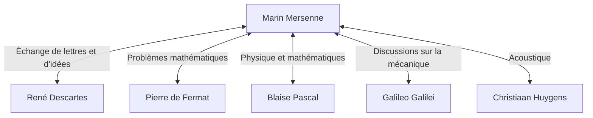

## Introduction

[Marin Mersenne](https://kenji.blog/fr/p/mersenne/) (1588-1648) était un théologien, philosophe, mathématicien et théoricien de la musique français du XVIIe siècle. Bien qu'il ait fait ses propres découvertes mathématiques, il est surtout connu pour son rôle de **« chef de poste de l'Europe »** (le facteur de l'Europe), reliant les grands savants de son temps.

Dans cet article, nous explorerons la vie de [Mersenne](https://kenji.blog/fr/p/mersenne/), l'immense réseau intellectuel qu'il a construit, et les **nombres premiers de [Mersenne](https://kenji.blog/fr/p/mersenne/)** qui sont profondément liés à la cryptographie moderne. De plus, nous nous pencherons sur ses contributions à l'acoustique et son influence sur la méthodologie scientifique.

## Jeunesse et vie monastique

[Marin Mersenne](https://kenji.blog/fr/p/mersenne/) est né le 8 septembre 1588 dans une famille de paysans à Oizé, dans le Maine, en France. Après avoir reçu une éducation de base au collège du Mans, il entre au collège jésuite de La Flèche en 1604. C'est là qu'il rencontre [René Descartes](https://kenji.blog/fr/p/descartes/), qui deviendra plus tard le père de la philosophie moderne, et noue avec lui une amitié de toute une vie.

En 1611, [Mersenne](https://kenji.blog/fr/p/mersenne/) rejoint l'Ordre des Minimes. Les Minimes étaient un ordre aux règles strictes (comme le jeûne et le végétarisme), mais ils favorisaient une culture qui encourageait la poursuite des études. En 1619, il s'installe au couvent de l'Annonciade à Paris, qui devient sa base pour se plonger dans la théologie, la philosophie et les sciences naturelles.

Ses écrits se caractérisent par une volonté d'intégrer activement les nouvelles découvertes scientifiques de l'époque tout en respectant la doctrine religieuse. Sa position visant à harmoniser la religion et la science a joué un rôle important dans le climat intellectuel du XVIIe siècle.

## Le chef de poste de l'Europe : le réseau de [Mersenne](https://kenji.blog/fr/p/mersenne/)

Au début du XVIIe siècle, les revues scientifiques et les académies telles que nous les connaissons aujourd'hui n'existaient pas encore. Le seul moyen de partager de nouvelles découvertes et théories était l'échange de lettres (correspondance) entre savants.

Tirant parti de sa curiosité innée et de sa sociabilité, [Mersenne](https://kenji.blog/fr/p/mersenne/) a entretenu une correspondance énorme avec des savants de toute l'Europe. Sa cellule monastique s'apparentait à une académie scientifique, à travers laquelle de nombreux érudits échangeaient des idées. Ce réseau est souvent appelé le « réseau de [Mersenne](https://kenji.blog/fr/p/mersenne/) ».



Au centre de ce réseau, lorsque quelqu'un découvrait un nouveau théorème, [Mersenne](https://kenji.blog/fr/p/mersenne/) le transmettait à d'autres savants, encourageant la critique et la vérification. Par exemple, c'est Mersenne qui a communiqué les découvertes mathématiques de [Pierre de Fermat](/fr/p/fermat/) à [Descartes](https://kenji.blog/fr/p/descartes/), déclenchant un débat féroce entre les deux. Il est également connu pour avoir traduit en français les œuvres de Galileo Galilei (comme le *Dialogue sur les deux grands systèmes du monde*), les faisant largement connaître malgré la stricte censure de l'Église catholique. Certains historiens estiment que sans lui, la révolution scientifique du XVIIe siècle aurait pu être retardée de plusieurs décennies.

## Réalisations mathématiques : les nombres premiers de [Mersenne](https://kenji.blog/fr/p/mersenne/)

Le nom de [Mersenne](https://kenji.blog/fr/p/mersenne/) est sans doute aujourd'hui le plus mémorisé sous la forme des **nombres premiers de [Mersenne](https://kenji.blog/fr/p/mersenne/)**.

Un nombre de [Mersenne](https://kenji.blog/fr/p/mersenne/) est défini comme suit :

$$
M_n = 2^n - 1 \quad (\text{où } n \text{ est un entier naturel})
$$

Lorsque ce $M_n$ est un nombre premier, il est appelé « nombre premier de [Mersenne](https://kenji.blog/fr/p/mersenne/) ».

### Conditions pour être un nombre premier

Pour que $2^n - 1$ soit premier, il est nécessaire (bien que non suffisant) que $n$ lui-même soit un nombre premier.

Par exemple :
- Pour $n = 2$, $M_2 = 2^2 - 1 = 3$ (Premier)
- Pour $n = 3$, $M_3 = 2^3 - 1 = 7$ (Premier)
- Pour $n = 5$, $M_5 = 2^5 - 1 = 31$ (Premier)
- Pour $n = 7$, $M_7 = 2^7 - 1 = 127$ (Premier)

Cependant, pour $n = 11$,
$$
M_{11} = 2^{11} - 1 = 2047 = 23 \times 89 \quad (\text{Nombre composé})
$$
Ainsi, ce n'est pas un nombre premier.

### La conjecture audacieuse de 1644

Dans son livre *Cogitata Physico-Mathematica* de 1644, [Mersenne](https://kenji.blog/fr/p/mersenne/) affirmait que pour $n \le 257$, $M_n$ est premier seulement pour :

$$
\text{Premier lorsque } n = 2, 3, 5, 7, 13, 17, 19, 31, 67, 127, 257
$$

À l'époque, vérifier la primalité de nombres énormes à la main était pratiquement impossible, de sorte que cette affirmation audacieuse a suscité un grand étonnement. [Mersenne](https://kenji.blog/fr/p/mersenne/) a lui-même admis qu'il n'avait pas rigoureusement calculé tous les nombres.

Les vérifications par des mathématiciens ultérieurs ont révélé qu'il y avait plusieurs erreurs dans la liste de [Mersenne](https://kenji.blog/fr/p/mersenne/) ($n = 67$ et $257$ sont composés, alors qu'en réalité c'est premier pour $n = 61, 89, 107$). Il a fallu environ trois siècles (jusqu'en 1947) pour que la liste soit complètement corrigée. Néanmoins, le problème qu'il a posé a continué de fasciner les mathématiciens pendant des siècles.

### Applications à la cryptographie moderne et GIMPS

Aujourd'hui, les nombres premiers de [Mersenne](https://kenji.blog/fr/p/mersenne/) continuent d'être explorés par « GIMPS » (Great Internet Mersenne Prime Search), un projet dédié à la recherche des plus grands nombres premiers du monde. Parce qu'il existe un test de primalité spécial et rapide appelé le test de Lucas-Lehmer, les nombres de [Mersenne](https://kenji.blog/fr/p/mersenne/) sont extrêmement bien adaptés à la découverte de nombres premiers gigantesques.

```python
# Test de Lucas-Lehmer pour les nombres premiers de Mersenne
def is_mersenne_prime(p):
    """
    Vérifie si M_p = 2^p - 1 est un nombre premier en utilisant le test de Lucas-Lehmer.
    Renvoie True si c'est un nombre premier, False sinon.
    """
    if p == 2:
        return True
    
    m = (1 << p) - 1
    s = 4
    for _ in range(p - 2):
        s = (s * s - 2) % m
        
    return s == 0
```

Les gigantesques nombres premiers découverts jouent un rôle essentiel dans le soutien de la société de l'information, servant de fondement à l'évaluation de la sécurité des systèmes modernes de cryptographie à clé publique comme [RSA](https://kenji.blog/fr/p/modern-cryptography-public-key-hash-signature/), et des algorithmes de génération de nombres aléatoires (comme le [Mersenne](https://kenji.blog/fr/p/mersenne/) Twister).

## Contributions à l'acoustique et à la théorie musicale : les lois de [Mersenne](https://kenji.blog/fr/p/mersenne/)

Au-delà des mathématiques, [Mersenne](https://kenji.blog/fr/p/mersenne/) est également appelé le **« père de l'acoustique »**. Son *Harmonie Universelle*, publiée en 1636, est l'œuvre la plus complète sur la théorie musicale et les instruments de son époque. Dans ce livre, il a exploré les fondements physiques de la hauteur et de la consonance.

Il a découvert les « lois de [Mersenne](https://kenji.blog/fr/p/mersenne/) » concernant la fréquence des cordes vibrantes. La fréquence fondamentale $f$ d'une corde est exprimée par l'équation suivante basée sur la longueur de la corde $L$, la tension $T$ et la densité linéaire $\mu$ (masse par unité de longueur).

$$
\text{Fréquence fondamentale } f = \frac{1}{2L} \sqrt{\frac{T}{\mu}}
$$

Cette loi est un principe physique crucial qui constitue la base de la conception et de l'accordage des instruments à cordes comme les guitares et les pianos. S'appuyant sur les recherches de Vincenzo Galilei (le père de Galilée), il fut l'un des premiers à démontrer par l'expérience que la hauteur dépend directement de la fréquence des vibrations de l'air. Il a également tenté de mesurer la vitesse du son, ouvrant la voie à l'acoustique moderne.

## Philosophie et religion : relation avec [Descartes](https://kenji.blog/fr/p/descartes/)

[Mersenne](https://kenji.blog/fr/p/mersenne/) a également laissé des empreintes importantes sur le plan philosophique. Il s'opposait au scepticisme extrême et aux idées magiques ou mystiques (telles que l'hermétisme de la Renaissance), défendant la science rationnelle et empirique.

Lorsque son ami intime [Descartes](https://kenji.blog/fr/p/descartes/) a publié ses *Méditations métaphysiques*, Mersenne a envoyé le manuscrit à des penseurs éminents de toute l'Europe (tels que Thomas Hobbes et Pierre Gassendi) pour recueillir leurs objections. Il les a ensuite compilées dans un livre avec les propres réponses de [Descartes](https://kenji.blog/fr/p/descartes/), jouant un rôle qui pourrait être considéré comme un précurseur du système moderne d'évaluation par les pairs (peer-review).

[Mersenne](https://kenji.blog/fr/p/mersenne/) croyait fermement que les progrès scientifiques prouvaient la grandeur du monde créé par Dieu, considérant qu'il n'y avait aucune contradiction entre la religion et la science.

## Conclusion

[Marin Mersenne](https://kenji.blog/fr/p/mersenne/) possédait non seulement une intuition mathématique exceptionnelle, mais aussi un talent rare pour relier les personnes et les connaissances. Le réseau intellectuel qu'il a mis en place a finalement conduit à la naissance de sociétés scientifiques formelles, telles que l'Académie des sciences en France et la Royal Society en Angleterre.

Son nom est à jamais gravé dans l'histoire des mathématiques sous la forme des nombres premiers de [Mersenne](https://kenji.blog/fr/p/mersenne/), mais son rôle de « facilitateur intellectuel » dans la révolution scientifique du XVIIe siècle est également une grande réalisation qui ne doit jamais être oubliée. Sa vie nous enseigne que la science se développe non seulement grâce au génie des individus, mais aussi grâce à une communication et une collaboration ouvertes.
