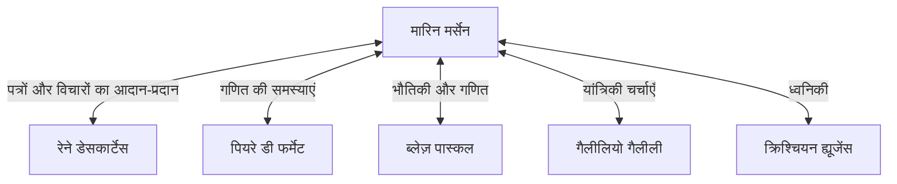

## परिचय

[मारिन मर्सेन](https://kenji.blog/hi/p/mersenne/) (1588-1648) 17वीं सदी के एक फ्रांसीसी धर्मशास्त्री, दार्शनिक, गणितज्ञ और संगीत सिद्धांतकार थे। हालांकि उन्होंने स्वयं की गणितीय खोजें भी कीं, लेकिन उन्हें अपने समय के महान विद्वानों को जोड़ने वाले **"यूरोप के पोस्ट-बॉक्स"** के रूप में उनकी भूमिका के लिए सबसे अधिक जाना जाता है।

इस लेख में, हम मर्सेन के जीवन, उनके द्वारा बनाए गए विशाल बौद्धिक नेटवर्क और **मर्सेन अभाज्य संख्याओं** का पता लगाएंगे, जो आधुनिक क्रिप्टोग्राफी से गहराई से जुड़ी हैं। इसके अलावा, हम ध्वनिकी में उनके योगदान और वैज्ञानिक पद्धति पर उनके प्रभाव को भी समझेंगे।

## प्रारंभिक जीवन और मठवासी जीवन

[मारिन मर्सेन](https://kenji.blog/hi/p/mersenne/) का जन्म 8 सितंबर, 1588 को ओइज़े, मेन, फ्रांस में एक किसान परिवार में हुआ था। ले मैंस में एक कॉलेज में बुनियादी शिक्षा प्राप्त करने के बाद, उन्होंने 1604 में ला फ्लेचे के जेसुइट कॉलेज में प्रवेश लिया। वहां उनकी मुलाकात [रेने डेसकार्टेस](https://kenji.blog/hi/p/descartes/) से हुई, जो बाद में आधुनिक दर्शन के जनक बने, और उनके साथ उन्होंने जीवन भर की गहरी दोस्ती बनाई।

1611 में, मर्सेन ऑर्डर ऑफ मिनिम्स में शामिल हो गए। मिनिम्स सख्त अनुशासन (जैसे उपवास और शाकाहार) वाले आदेश थे, लेकिन उन्होंने एक ऐसी संस्कृति को बढ़ावा दिया जिसने विद्वता को प्रोत्साहित किया। 1619 में, वह पेरिस में L'Annonciade के कॉन्वेंट में बस गए, जो धर्मशास्त्र, दर्शन और प्राकृतिक विज्ञान में खुद को डुबोने के लिए उनका आधार बन गया।

उनके लेखन में धार्मिक सिद्धांतों का पालन करते हुए उस समय की नई वैज्ञानिक खोजों को सक्रिय रूप से शामिल करने की इच्छा की विशेषता है। धर्म और विज्ञान में सामंजस्य स्थापित करने के उनके रुख ने 17वीं सदी के बौद्धिक माहौल में महत्वपूर्ण भूमिका निभाई।

## यूरोप का पोस्ट-बॉक्स: मर्सेन नेटवर्क

17वीं शताब्दी की शुरुआत में, वैज्ञानिक पत्रिकाएँ और अकादमियाँ जैसी आज हम जानते हैं, उनका अस्तित्व नहीं था। नई खोजों और सिद्धांतों को साझा करने का एकमात्र साधन विद्वानों के बीच पत्रों (पत्राचार) के माध्यम से था।

अपनी जन्मजात जिज्ञासा और सामाजिकता का लाभ उठाते हुए, मर्सेन ने पूरे यूरोप के विद्वानों के साथ बड़े पैमाने पर पत्राचार किया। उनका मठवासी कक्ष एक वैज्ञानिक अकादमी के समान था, जिसके माध्यम से कई विद्वान विचारों का आदान-प्रदान करते थे। इस नेटवर्क को अक्सर "मर्सेन नेटवर्क" कहा जाता है।



इस नेटवर्क के केंद्र में, जब कोई नई प्रमेय खोजता था, तो मर्सेन उसे अन्य विद्वानों तक पहुँचाते थे, आलोचना और सत्यापन को प्रोत्साहित करते थे। उदाहरण के लिए, यह मर्सेन ही थे जिन्होंने पियरे डी फर्मेट की गणितीय खोजों को डेसकार्टेस तक पहुँचाया, जिससे उन दोनों के बीच एक भयंकर बहस छिड़ गई। वे गैलीलियो गैलीली के कार्यों (जैसे *डायलॉग कंसर्निंग द टू चीफ वर्ल्ड सिस्टम्स*) का फ्रेंच में अनुवाद करने और कैथोलिक चर्च द्वारा सख्त सेंसरशिप के बावजूद उन्हें व्यापक रूप से परिचित कराने के लिए भी जाने जाते हैं। कुछ इतिहासकारों का आकलन है कि उनके बिना, 17वीं सदी की वैज्ञानिक क्रांति दशकों पीछे हो सकती थी।

## गणितीय उपलब्धियां: मर्सेन अभाज्य संख्याएँ

आज के समय में मर्सेन का नाम निस्संदेह **मर्सेन अभाज्य संख्याओं** के रूप में सबसे ज्यादा याद किया जाता है।

मर्सेन संख्या को इस प्रकार परिभाषित किया गया है:

$$
M_n = 2^n - 1 \quad (\text{जहाँ } n \text{ एक प्राकृत संख्या है})
$$

जब यह $M_n$ एक अभाज्य संख्या होती है, तो इसे "मर्सेन अभाज्य" कहा जाता है।

### अभाज्य होने की शर्तें

$2^n - 1$ के अभाज्य होने के लिए, यह एक आवश्यक शर्त (यद्यपि पर्याप्त नहीं) है कि $n$ स्वयं एक अभाज्य संख्या हो।

उदाहरण के लिए:
- $n = 2$ के लिए, $M_2 = 2^2 - 1 = 3$ (अभाज्य)
- $n = 3$ के लिए, $M_3 = 2^3 - 1 = 7$ (अभाज्य)
- $n = 5$ के लिए, $M_5 = 2^5 - 1 = 31$ (अभाज्य)
- $n = 7$ के लिए, $M_7 = 2^7 - 1 = 127$ (अभाज्य)

हालाँकि, $n = 11$ के लिए,
$$
M_{11} = 2^{11} - 1 = 2047 = 23 \times 89 \quad (\text{भाज्य संख्या})
$$
अतः, यह अभाज्य नहीं है।

### 1644 का साहसिक अनुमान

अपनी 1644 की पुस्तक *Cogitata Physico-Mathematica* में, मर्सेन ने दावा किया कि $n \le 257$ के लिए, $M_n$ केवल निम्नलिखित के लिए अभाज्य है:

$$
\text{अभाज्य जब } n = 2, 3, 5, 7, 13, 17, 19, 31, 67, 127, 257
$$

उस समय, हाथ से विशाल संख्याओं की अभाज्यता की जांच करना लगभग असंभव था, इसलिए इस साहसिक दावे का बहुत आश्चर्य के साथ स्वागत किया गया। स्वयं मर्सेन ने स्वीकार किया कि उन्होंने सभी संख्याओं की कठोरता से गणना नहीं की थी।

बाद के गणितज्ञों द्वारा किए गए सत्यापन से पता चला कि मर्सेन की सूची में कई त्रुटियाँ थीं ($n = 67$ और $257$ भाज्य हैं, जबकि वास्तव में यह $n = 61, 89, 107$ के लिए अभाज्य है)। सूची को पूरी तरह से सुधारे जाने में लगभग तीन सदियां (1947 तक) लग गईं। फिर भी, उनके द्वारा खड़ी की गई समस्या सदियों तक गणितज्ञों को आकर्षित करती रही।

### आधुनिक क्रिप्टोग्राफी और GIMPS में अनुप्रयोग

आज, "GIMPS" (ग्रेट इंटरनेट मर्सेन प्राइम सर्च) द्वारा मर्सेन अभाज्य संख्याओं का अन्वेषण जारी है, जो दुनिया की सबसे बड़ी अभाज्य संख्याओं को खोजने के लिए समर्पित एक परियोजना है। क्योंकि लुकास-लेहमर परीक्षण नामक एक विशेष, तेज अभाज्यता परीक्षण है, विशाल अभाज्य संख्याओं की खोज के लिए मर्सेन संख्याएँ अत्यंत उपयुक्त हैं।

```python
# मर्सेन अभाज्य संख्याओं के लिए लुकास-लेहमर परीक्षण
def is_mersenne_prime(p):
    """
    लुकास-लेहमर परीक्षण का उपयोग करके जांचता है कि क्या M_p = 2^p - 1 अभाज्य है।
    यदि अभाज्य है तो True देता है, अन्यथा False देता है।
    """
    if p == 2:
        return True
    
    m = (1 << p) - 1
    s = 4
    for _ in range(p - 2):
        s = (s * s - 2) % m
        
    return s == 0
```

खोजी गई विशाल अभाज्य संख्याएँ सूचना समाज का समर्थन करने में महत्वपूर्ण भूमिका निभाती हैं, जो RSA जैसे आधुनिक पब्लिक-की क्रिप्टोग्राफी सिस्टम की सुरक्षा मूल्यांकन और यादृच्छिक संख्या जनरेशन एल्गोरिदम (जैसे मर्सेन ट्विस्टर) के लिए नींव के रूप में काम करती हैं।

## ध्वनिकी और संगीत सिद्धांत में योगदान: मर्सेन के नियम

गणित से परे, मर्सेन को **"ध्वनिकी का जनक"** भी कहा जाता है। 1636 में प्रकाशित उनकी *Harmonie Universelle*, संगीत सिद्धांत और उनके समय के वाद्ययंत्रों पर सबसे व्यापक कार्य है। इस पुस्तक में, उन्होंने पिच (सुर) और कॉन्सोनेंस के भौतिक आधारों का पता लगाया।

उन्होंने कंपन करने वाले तारों की आवृत्ति के संबंध में "मर्सेन के नियम" खोजे। एक तार की मौलिक आवृत्ति $f$, तार की लंबाई $L$, तनाव $T$, और रैखिक घनत्व $\mu$ (द्रव्यमान प्रति इकाई लंबाई) के आधार पर निम्नलिखित समीकरण द्वारा व्यक्त की जाती है।

$$
\text{मौलिक आवृत्ति } f = \frac{1}{2L} \sqrt{\frac{T}{\mu}}
$$

यह नियम एक महत्वपूर्ण भौतिक सिद्धांत है जो गिटार और पियानो जैसे तार वाले वाद्ययंत्रों को डिजाइन करने और ट्यून करने का आधार बनाता है। विन्सेन्ज़ो गैलीलियो (गैलीलियो के पिता) के शोध का विस्तार करते हुए, वे प्रयोग के माध्यम से यह प्रदर्शित करने वाले पहले व्यक्तियों में से एक बने कि पिच सीधे हवा के कंपन की आवृत्ति पर निर्भर करती है। उन्होंने ध्वनि की गति को मापने का भी प्रयास किया, जिससे आधुनिक ध्वनिकी का द्वार खुला।

## दर्शन और धर्म: डेसकार्टेस के साथ संबंध

मर्सेन ने दार्शनिक रूप से भी महत्वपूर्ण पदचिह्न छोड़े। उन्होंने चरम संदेहवाद और जादुई या रहस्यमय विचारों (जैसे पुनर्जागरण हर्मेटिसिज्म) का विरोध किया, तर्कसंगत और अनुभवजन्य विज्ञान का समर्थन किया।

जब उनके करीबी दोस्त डेसकार्टेस ने *Meditations on First Philosophy* प्रकाशित की, तो मर्सेन ने यूरोप भर के प्रमुख विचारकों (जैसे थॉमस हॉब्स और पियरे गासेंडी) को आपत्तियां एकत्र करने के लिए पांडुलिपि भेजी। फिर उन्होंने डेसकार्टेस के स्वयं के उत्तरों के साथ उन्हें एक पुस्तक में संकलित किया, जिससे एक ऐसी भूमिका निभाई जिसे आधुनिक सहकर्मी-समीक्षा (peer-review) प्रणाली का अग्रदूत माना जा सकता है।

मर्सेन का दृढ़ विश्वास था कि वैज्ञानिक प्रगति ईश्वर द्वारा निर्मित दुनिया की महानता को साबित करती है, यह मानते हुए कि धर्म और विज्ञान के बीच कोई विरोधाभास नहीं था।

## निष्कर्ष

[मारिन मर्सेन](https://kenji.blog/hi/p/mersenne/) के पास न केवल उत्कृष्ट गणितीय अंतर्ज्ञान था, बल्कि लोगों और ज्ञान को जोड़ने की एक दुर्लभ प्रतिभा भी थी। उनके द्वारा स्थापित बौद्धिक नेटवर्क ने अंततः औपचारिक वैज्ञानिक समाजों के जन्म का मार्ग प्रशस्त किया, जैसे फ्रांस में एकेडमी ऑफ साइंसेज और इंग्लैंड में रॉयल सोसाइटी।

उनका नाम मर्सेन अभाज्य संख्याओं के रूप में गणित के इतिहास में हमेशा के लिए उकेरा गया है, लेकिन 17वीं सदी की वैज्ञानिक क्रांति में एक "बौद्धिक सुगमकर्ता" के रूप में उनकी भूमिका भी एक महान उपलब्धि है जिसे कभी नहीं भुलाया जाना चाहिए। उनका जीवन हमें सिखाता है कि विज्ञान न केवल व्यक्तियों की प्रतिभा के माध्यम से बल्कि खुले संचार और सहयोग के माध्यम से भी विकसित होता है।
