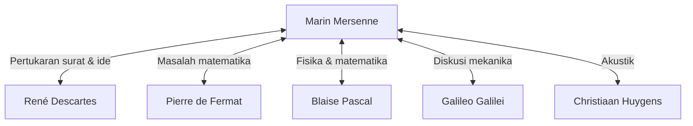

## Pengantar

[Marin Mersenne](https://kenji.blog/id/p/mersenne/) (1588–1648) adalah seorang teolog, filsuf, matematikawan, dan ahli teori musik Prancis abad ke-17. Meskipun ia membuat penemuan matematikanya sendiri, ia paling dikenal luas karena perannya sebagai **"kotak pos Eropa"**, menghubungkan para sarjana hebat pada masanya.

Dalam artikel ini, kita akan menjelajahi kehidupan [Mersenne](https://kenji.blog/id/p/mersenne/), jaringan intelektual besar yang ia bangun, dan **bilangan prima [Mersenne](https://kenji.blog/id/p/mersenne/)** yang sangat terhubung dengan kriptografi modern. Lebih jauh lagi, kita akan menyelami kontribusinya pada akustik dan pengaruhnya terhadap metodologi ilmiah.

## Kehidupan Awal dan Kehidupan Monastik

[Marin Mersenne](https://kenji.blog/id/p/mersenne/) lahir pada tanggal 8 September 1588, di keluarga petani di Oizé, Maine, Prancis. Setelah menerima pendidikan dasar di sebuah perguruan tinggi di Le Mans, ia memasuki perguruan tinggi Jesuit di La Flèche pada tahun 1604. Di sana, ia bertemu [René Descartes](https://kenji.blog/id/p/descartes/), yang kemudian akan menjadi bapak filsafat modern, dan menjalin persahabatan seumur hidup yang mendalam dengannya.

Pada tahun 1611, [Mersenne](https://kenji.blog/id/p/mersenne/) bergabung dengan Ordo Minims. Ordo Minims adalah ordo dengan disiplin yang ketat (seperti puasa dan vegetarianisme), tetapi mereka menumbuhkan budaya yang mendorong pengejaran keilmuan. Pada tahun 1619, ia menetap di Biara L'Annonciade di Paris, yang menjadi basisnya untuk membenamkan diri dalam teologi, filsafat, dan ilmu alam.

Tulisan-tulisannya dicirikan oleh kesediaan untuk secara aktif menggabungkan penemuan-penemuan ilmiah baru pada masa itu sambil berpegang pada doktrin agama. Sikapnya yang bertujuan menyelaraskan agama dan sains memainkan peran penting dalam iklim intelektual abad ke-17.

## Kotak Pos Eropa: Jaringan [Mersenne](https://kenji.blog/id/p/mersenne/)

Pada awal abad ke-17, jurnal ilmiah dan akademi seperti yang kita kenal sekarang belum ada. Satu-satunya sarana untuk berbagi penemuan dan teori baru adalah melalui surat (korespondensi) antar sarjana.

Memanfaatkan rasa ingin tahu dan kemampuan bersosialisasinya yang bawaan, [Mersenne](https://kenji.blog/id/p/mersenne/) terlibat dalam sejumlah besar korespondensi dengan para sarjana di seluruh Eropa. Sel biara miliknya mirip dengan akademi ilmiah, di mana banyak sarjana bertukar pikiran. Jaringan ini sering disebut sebagai "jaringan [Mersenne](https://kenji.blog/id/p/mersenne/)".



Di pusat jaringan ini, ketika seseorang menemukan teorema baru, [Mersenne](https://kenji.blog/id/p/mersenne/) akan menyampaikannya kepada sarjana lain, mendorong kritik dan verifikasi. Misalnya, Mersennyalah yang mengkomunikasikan penemuan matematika Pierre de Fermat kepada [Descartes](https://kenji.blog/id/p/descartes/), yang memicu perdebatan sengit di antara keduanya. Ia juga dikenal karena menerjemahkan karya-karya Galileo Galilei (seperti *Dialog Mengenai Dua Sistem Dunia Utama*) ke dalam bahasa Prancis, memperkenalkannya secara luas meskipun ada penyensoran ketat dari Gereja Katolik. Beberapa sejarawan menilai bahwa tanpa dirinya, Revolusi Ilmiah abad ke-17 mungkin akan tertunda puluhan tahun.

## Pencapaian Matematika: Bilangan Prima [Mersenne](https://kenji.blog/id/p/mersenne/)

Nama [Mersenne](https://kenji.blog/id/p/mersenne/) tidak diragukan lagi paling diingat saat ini dalam bentuk **bilangan prima [Mersenne](https://kenji.blog/id/p/mersenne/)**.

Bilangan [Mersenne](https://kenji.blog/id/p/mersenne/) didefinisikan sebagai berikut:

$$
M_n = 2^n - 1 \quad (\text{di mana } n \text{ adalah bilangan asli})
$$

Ketika $M_n$ ini adalah bilangan prima, ia disebut "bilangan prima [Mersenne](https://kenji.blog/id/p/mersenne/)".

### Syarat Menjadi Prima

Agar $2^n - 1$ menjadi prima, ini adalah syarat perlu (meskipun bukan syarat cukup) bahwa $n$ itu sendiri adalah bilangan prima.

Misalnya:
- Untuk $n = 2$, $M_2 = 2^2 - 1 = 3$ (Prima)
- Untuk $n = 3$, $M_3 = 2^3 - 1 = 7$ (Prima)
- Untuk $n = 5$, $M_5 = 2^5 - 1 = 31$ (Prima)
- Untuk $n = 7$, $M_7 = 2^7 - 1 = 127$ (Prima)

Namun, untuk $n = 11$,
$$
M_{11} = 2^{11} - 1 = 2047 = 23 \times 89 \quad (\text{Bilangan komposit})
$$
Jadi, ia bukan prima.

### Konjektur Berani Tahun 1644

Dalam bukunya tahun 1644 *Cogitata Physico-Mathematica*, [Mersenne](https://kenji.blog/id/p/mersenne/) mengklaim bahwa untuk $n \le 257$, $M_n$ adalah prima hanya untuk:

$$
\text{Prima ketika } n = 2, 3, 5, 7, 13, 17, 19, 31, 67, 127, 257
$$

Pada masa itu, memeriksa keprimaan bilangan-bilangan raksasa dengan tangan hampir tidak mungkin, sehingga klaim berani ini disambut dengan keheranan yang luar biasa. [Mersenne](https://kenji.blog/id/p/mersenne/) sendiri mengakui bahwa ia tidak menghitung semua bilangan secara ketat.

Verifikasi oleh matematikawan kemudian mengungkapkan bahwa ada beberapa kesalahan dalam daftar [Mersenne](https://kenji.blog/id/p/mersenne/) ($n = 67$ dan $257$ adalah komposit, sedangkan pada kenyataannya itu prima untuk $n = 61, 89, 107$). Butuh sekitar tiga abad (hingga tahun 1947) agar daftar itu benar-benar dikoreksi. Namun, masalah yang ia ajukan terus memikat para matematikawan selama berabad-abad.

### Aplikasi pada Kriptografi Modern dan GIMPS

Saat ini, bilangan prima [Mersenne](https://kenji.blog/id/p/mersenne/) terus dieksplorasi oleh "GIMPS" (Great Internet Mersenne Prime Search), sebuah proyek yang didedikasikan untuk menemukan bilangan prima terbesar di dunia. Karena ada tes keprimaan khusus dan cepat yang disebut uji Lucas-Lehmer, bilangan [Mersenne](https://kenji.blog/id/p/mersenne/) sangat cocok untuk penemuan bilangan prima raksasa.

```python
# Uji Lucas-Lehmer untuk bilangan prima Mersenne
def is_mersenne_prime(p):
    """
    Memeriksa apakah M_p = 2^p - 1 adalah prima menggunakan uji Lucas-Lehmer.
    Mengembalikan True jika prima, False jika sebaliknya.
    """
    if p == 2:
        return True
    
    m = (1 << p) - 1
    s = 4
    for _ in range(p - 2):
        s = (s * s - 2) % m
        
    return s == 0
```

Bilangan prima raksasa yang ditemukan memainkan peran penting dalam mendukung masyarakat informasi, berfungsi sebagai fondasi untuk evaluasi keamanan sistem kriptografi kunci publik modern seperti [RSA](https://kenji.blog/id/p/modern-cryptography-public-key-hash-signature/), dan algoritma pembuatan angka acak (seperti [Mersenne](https://kenji.blog/id/p/mersenne/) Twister).

## Kontribusi pada Akustik dan Teori Musik: Hukum [Mersenne](https://kenji.blog/id/p/mersenne/)

Selain matematika, [Mersenne](https://kenji.blog/id/p/mersenne/) juga disebut sebagai **"bapak akustik"**. Karyanya *Harmonie Universelle*, yang diterbitkan pada tahun 1636, adalah karya paling komprehensif tentang teori musik dan instrumen pada masanya. Dalam buku ini, ia mengeksplorasi dasar-dasar fisik titinada (pitch) dan konsonansi.

Ia menemukan "Hukum [Mersenne](https://kenji.blog/id/p/mersenne/)" mengenai frekuensi senar yang bergetar. Frekuensi dasar $f$ dari sebuah senar dinyatakan oleh persamaan berikut berdasarkan panjang senar $L$, tegangan $T$, dan massa jenis linear $\mu$ (massa per satuan panjang).

$$
\text{Frekuensi dasar } f = \frac{1}{2L} \sqrt{\frac{T}{\mu}}
$$

Hukum ini adalah prinsip fisik penting yang membentuk dasar untuk merancang dan menyetem alat musik dawai seperti gitar dan piano. Mengembangkan penelitian Vincenzo Galilei (ayah Galileo), ia menjadi salah satu orang pertama yang mendemonstrasikan melalui eksperimen bahwa titinada secara langsung bergantung pada frekuensi getaran udara. Ia juga mencoba mengukur kecepatan suara, membuka pintu ke akustik modern.

## Filsafat dan Agama: Hubungan dengan [Descartes](https://kenji.blog/id/p/descartes/)

[Mersenne](https://kenji.blog/id/p/mersenne/) juga meninggalkan jejak filosofis yang signifikan. Ia menentang skeptisisme ekstrem dan ide-ide magis atau mistis (seperti Hermetisisme Renaisans), memperjuangkan sains rasional dan empiris.

Ketika teman dekatnya [Descartes](https://kenji.blog/id/p/descartes/) menerbitkan *Meditasi tentang Filsafat Pertama*, Mersenne mengirim manuskrip itu kepada para pemikir terkemuka di seluruh Eropa (seperti Thomas Hobbes dan Pierre Gassendi) untuk mengumpulkan keberatan mereka. Ia kemudian menyusunnya menjadi sebuah buku beserta balasan dari [Descartes](https://kenji.blog/id/p/descartes/) sendiri, memainkan peran yang bisa dibilang sebagai cikal bakal sistem penilaian sejawat (peer-review) modern.

[Mersenne](https://kenji.blog/id/p/mersenne/) sangat percaya bahwa kemajuan ilmiah membuktikan kebesaran dunia yang diciptakan oleh Tuhan, mengingat tidak ada kontradiksi antara agama dan sains.

## Kesimpulan

[Marin Mersenne](https://kenji.blog/id/p/mersenne/) memiliki tidak hanya intuisi matematika yang luar biasa tetapi juga bakat langka untuk menghubungkan orang-orang dan pengetahuan. Jaringan intelektual yang ia dirikan pada akhirnya mengarah pada kelahiran masyarakat ilmiah formal, seperti Akademi Sains Prancis dan Royal Society di Inggris.

Namanya selamanya terukir dalam sejarah matematika dalam bentuk bilangan prima [Mersenne](https://kenji.blog/id/p/mersenne/), tetapi perannya sebagai "fasilitator intelektual" dalam Revolusi Ilmiah abad ke-17 juga merupakan pencapaian besar yang tidak boleh dilupakan. Kehidupannya mengajarkan kepada kita bahwa sains berkembang tidak hanya melalui kejeniusan individu tetapi juga melalui komunikasi dan kolaborasi terbuka.
