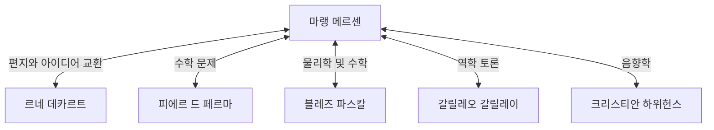

## 서론

[마랭 메르센](https://kenji.blog/ko/p/mersenne/)([Marin Mersenne](https://kenji.blog/ko/p/mersenne/), 1588~1648)은 17세기 프랑스의 신학자, 철학자, 수학자이자 음악 이론가입니다. 그는 자신만의 수학적 발견도 해냈지만, 당대의 위대한 학자들을 연결해 준 **'유럽의 지식 우체국장'** (the post-box of Europe)으로서의 역할로 가장 널리 알려져 있습니다.

이 글에서는 메르센의 생애, 그가 구축한 거대한 지적 네트워크, 그리고 현대 암호학과 깊은 관련이 있는 **'메르센 소수'** 에 대해 자세히 알아볼 것입니다. 또한, 그의 음향학에 대한 기여와 과학적 방법론에 미친 영향에 대해서도 심도 있게 다루겠습니다.

## 어린 시절과 수도원 생활

[마랭 메르센](https://kenji.blog/ko/p/mersenne/)은 1588년 9월 8일 프랑스 멘 지방의 우아즈에 있는 농부 가정에서 태어났습니다. 르망의 콜레주에서 기초 교육을 받은 후, 1604년 예수회가 설립한 라 플레슈의 콜레주에 입학했습니다. 그곳에서 그는 훗날 근대 철학의 아버지가 될 르네 데카르트([René Descartes](https://kenji.blog/ko/p/descartes/))를 만나 평생의 깊은 우정을 맺게 됩니다.

1611년, 메르센은 미님 수도회(Order of Minims)에 입회합니다. 미님회는 금식과 채식주의 등 엄격한 규율을 가진 수도회였지만, 학문 탐구를 장려하는 문화를 조성했습니다. 1619년, 그는 파리의 랑농시아드 수도원에 정착하였고, 이곳은 신학, 철학, 자연과학에 몰두하기 위한 그의 근거지가 되었습니다.

그의 저서는 종교적 교리를 고수하면서도 당시의 새로운 과학적 발견을 적극적으로 수용하려는 태도를 특징으로 합니다. 종교와 과학을 조화시키려 했던 그의 입장은 17세기 지적 풍토에서 중요한 역할을 했습니다.

## 유럽의 우체국장: 메르센 네트워크

17세기 초반에는 오늘날 우리가 알고 있는 과학 저널이나 학술원이 아직 존재하지 않았습니다. 새로운 발견과 이론을 공유하는 유일한 수단은 학자들 간의 편지(서신 교환)뿐이었습니다.

타고난 호기심과 사교성을 바탕으로 메르센은 유럽 전역의 학자들과 엄청난 양의 서신을 주고받았습니다. 그의 수도원 방은 마치 과학 아카데미와 같았으며, 많은 학자가 그를 통해 아이디어를 교환했습니다. 이 네트워크는 흔히 '메르센 네트워크'라고 불립니다.



이 네트워크의 중심에 있던 메르센은 누군가가 새로운 정리를 발견하면 이를 다른 학자들에게 전달하여 비판과 검증을 장려했습니다. 예를 들어, [피에르 드 페르마](https://kenji.blog/ko/p/fermat/)의 수학적 발견을 데카르트에게 전달하여 두 사람 사이에 치열한 논쟁을 촉발시킨 사람도 바로 메르센이었습니다. 그는 또한 가톨릭 교회의 엄격한 검열에도 불구하고 갈릴레오 갈릴레이의 저서(『천문대화』 등)를 프랑스어로 번역하여 널리 소개한 것으로도 유명합니다. 일부 역사가들은 그가 없었다면 17세기 과학 혁명이 수십 년은 지연되었을 것이라고 평가하기도 합니다.

## 수학적 업적: 메르센 소수

오늘날 메르센의 이름이 가장 잘 기억되는 형태는 의심할 여지 없이 **메르센 소수** ([Mersenne](https://kenji.blog/ko/p/mersenne/) prime)일 것입니다.

메르센 수는 다음과 같이 정의됩니다.

$$
M_n = 2^n - 1 \quad (\text{여기서 } n \text{ 은 자연수})
$$

이 $M_n$이 소수일 때, 이를 '메르센 소수'라고 부릅니다.

### 소수가 되기 위한 조건

$2^n - 1$이 소수가 되기 위해서는 $n$ 자신이 소수여야 한다는 것이 필요조건입니다(충분조건은 아닙니다).

예를 들어:
- $n = 2$일 때, $M_2 = 2^2 - 1 = 3$ (소수)
- $n = 3$일 때, $M_3 = 2^3 - 1 = 7$ (소수)
- $n = 5$일 때, $M_5 = 2^5 - 1 = 31$ (소수)
- $n = 7$일 때, $M_7 = 2^7 - 1 = 127$ (소수)

하지만, $n = 11$일 때,
$$
M_{11} = 2^{11} - 1 = 2047 = 23 \times 89 \quad (\text{합성수})
$$
이므로 소수가 아닙니다.

### 1644년의 대담한 추측

1644년 저서 『물리수학적 고찰』(Cogitata Physico-Mathematica)에서 메르센은 $n \le 257$ 범위에서 $M_n$이 소수가 되는 경우는 오직 다음과 같다고 주장했습니다.

$$
\text{소수가 되는 } n = 2, 3, 5, 7, 13, 17, 19, 31, 67, 127, 257
$$

당시에는 거대한 수의 소수 여부를 손으로 확인하는 것이 사실상 불가능했기 때문에, 이 대담한 주장은 큰 놀라움을 안겨주었습니다. 메르센 자신도 모든 수를 엄밀하게 계산하지는 않았다고 인정했습니다.

후대 수학자들의 검증 결과, 메르센의 목록에는 몇 가지 오류가 있음이 밝혀졌습니다($n = 67$과 $257$은 합성수이고, 실제로는 $n = 61, 89, 107$일 때 소수입니다). 이 목록이 완전히 수정되기까지는 무려 약 3세기(1947년까지)가 걸렸습니다. 그럼에도 불구하고 그가 제기한 문제는 수 세기 동안 수학자들을 매료시켰습니다.

### 현대 암호학과 GIMPS에의 응용

오늘날 메르센 소수는 세계에서 가장 큰 소수를 찾는 프로젝트인 'GIMPS'(Great Internet [Mersenne](https://kenji.blog/ko/p/mersenne/) Prime Search)에 의해 계속해서 탐구되고 있습니다. 루카스-레머 판정법(Lucas-Lehmer test)이라는 특별하고 빠른 소수 판정법이 존재하기 때문에 메르센 수는 거대한 소수를 발견하는 데 매우 적합합니다.

```python
# 메르센 소수를 위한 루카스-레머 판정법
def is_mersenne_prime(p):
    """
    루카스-레머 판정법을 사용하여 M_p = 2^p - 1이 소수인지 확인합니다.
    소수이면 True, 그렇지 않으면 False를 반환합니다.
    """
    if p == 2:
        return True
    
    m = (1 << p) - 1
    s = 4
    for _ in range(p - 2):
        s = (s * s - 2) % m
        
    return s == 0
```

발견된 거대한 소수는 [RSA](https://kenji.blog/ko/p/modern-cryptography-public-key-hash-signature/)와 같은 현대 공개키 암호 시스템의 안전성 평가와 난수 생성 알고리즘(메르센 트위스터 등)의 기초로 작용하여 정보화 사회를 지탱하는 중요한 역할을 합니다.

## 음향학과 음악 이론에 대한 기여: 메르센의 법칙

수학 외에도 메르센은 **'음향학의 아버지'** 라고도 불립니다. 1636년에 출판된 그의 『보편 음악』(Harmonie Universelle)은 당시 음악 이론과 악기에 관한 가장 포괄적인 저작입니다. 이 책에서 그는 음고와 협화음의 물리적 기초를 탐구했습니다.

그는 진동하는 현의 진동수에 관한 '메르센의 법칙'([Mersenne](https://kenji.blog/ko/p/mersenne/)'s laws)을 발견했습니다. 현의 기본 주파수 $f$는 현의 길이 $L$, 장력 $T$, 선밀도 $\mu$(단위 길이당 질량)를 바탕으로 다음 방정식으로 표현됩니다.

$$
\text{기본 주파수 } f = \frac{1}{2L} \sqrt{\frac{T}{\mu}}
$$

이 법칙은 기타나 피아노 같은 현악기의 설계 및 조율의 기초를 형성하는 매우 중요한 물리적 원리입니다. 그는 빈첸초 갈릴레이(갈릴레오의 아버지)의 연구를 바탕으로, 음의 높이가 공기 진동수에 직접적으로 의존한다는 것을 실험을 통해 증명한 최초의 인물 중 하나가 되었습니다. 또한 그는 소리의 속도를 측정하려고 시도하여 현대 음향학의 문을 열었습니다.

## 철학과 종교: 데카르트와의 관계

메르센은 철학적으로도 중요한 발자취를 남겼습니다. 그는 극단적인 회의주의와 마술적·신비주의적 사상(르네상스 헤르메스주의 등)에 반대하며 합리적이고 경험적인 과학을 옹호했습니다.

그의 친한 친구 데카르트가 『제1철학에 관한 성찰』을 출판할 때, 메르센은 유럽 전역의 저명한 사상가들(토머스 홉스, 피에르 가상디 등)에게 원고를 보내 반론을 수집했습니다. 그런 다음 데카르트 자신의 답변과 함께 이를 책으로 엮어냈는데, 이는 현대 동료 평가(peer-review) 시스템의 선구자로 볼 수 있는 역할을 한 것입니다.

메르센은 과학의 진보가 신이 창조한 세계의 위대함을 증명한다고 굳게 믿었으며, 종교와 과학 사이에 아무런 모순이 없다고 여겼습니다.

## 결론

[마랭 메르센](https://kenji.blog/ko/p/mersenne/)은 뛰어난 수학적 직관력뿐만 아니라 사람과 지식을 연결하는 드문 재능을 가지고 있었습니다. 그가 확립한 지적 네트워크는 결국 프랑스 과학 아카데미나 영국의 왕립학회와 같은 공식적인 과학 학회의 탄생으로 이어졌습니다.

그의 이름은 메르센 소수라는 형태로 수학사에 영원히 새겨져 있지만, 17세기 과학 혁명에서 '지식의 촉진자'로서의 역할 또한 결코 잊혀져서는 안 될 위대한 업적입니다. 그의 삶은 과학이 개인의 천재성뿐만 아니라 열린 소통과 협력을 통해서 발전한다는 것을 우리에게 가르쳐 줍니다.
