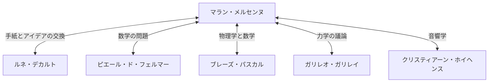

## はじめに

[マラン・メルセンヌ](https://kenji.blog/p/mersenne/)（[Marin Mersenne](https://kenji.blog/p/mersenne/), 1588年 - 1648年）は、17世紀フランスの神学者、哲学者、数学者、そして音楽理論家です。彼自身の数学的発見もさることながら、同時代の偉大な学者たちをつなぐ **「ヨーロッパの知の郵便局長」** （the post-box of Europe）としての役割を果たしたことで広く知られています。

本記事では、[メルセンヌ](https://kenji.blog/p/mersenne/)の生涯、彼が構築した巨大な知的ネットワーク、そして現代の暗号理論にも深く関わる **「[メルセンヌ](https://kenji.blog/p/mersenne/)素数」** について詳しく解説します。さらに、彼の音響学への貢献や、科学的方法論への影響についても深掘りします。

## [メルセンヌ](https://kenji.blog/p/mersenne/)の生涯と修道院生活

[マラン・メルセンヌ](https://kenji.blog/p/mersenne/)は1588年9月8日、フランスのメーヌ州ウワーズで農家の家庭に生まれました。彼はル・マンのコレージュで基礎教育を受けた後、1604年にイエズス会が設立したラ・フレーシュのコレージュに入学します。ここで彼は、後に近代哲学の祖となる[ルネ・デカルト](/p/descartes/)（[René Descartes](https://kenji.blog/p/descartes/)）と出会い、生涯にわたる深い友情を築きました。

1611年、[メルセンヌ](https://kenji.blog/p/mersenne/)はミニム修道会（Order of Minims）に入会します。ミニム会は厳格な規律（断食や菜食主義など）を持つ修道会でしたが、学問の追求を奨励する風土がありました。1619年、彼はパリのランノンシアード修道院に定住し、そこを拠点として神学や哲学、そして自然科学の研究に没頭することになります。

彼の著作は、宗教的な教義を守りつつも、当時の新しい科学的発見を積極的に取り入れようとする姿勢が特徴です。宗教と科学の調和を目指した彼のスタンスは、17世紀の知的風土において重要な役割を果たしました。

## 知の郵便局長：[メルセンヌ](https://kenji.blog/p/mersenne/)・ネットワーク

17世紀初頭、現在のような科学雑誌や学会（アカデミー）はまだ存在していませんでした。新しい発見や理論を共有する手段は、学者同士の手紙のやり取り（書簡）に限られていました。

[メルセンヌ](https://kenji.blog/p/mersenne/)は、持ち前の好奇心と人当たりの良さを活かし、ヨーロッパ中の学者と膨大な文通を行いました。彼の修道院の部屋は、さながら科学アカデミーのようであり、彼を通じて多くの学者が意見を交換しました。このネットワークは、「[メルセンヌ](https://kenji.blog/p/mersenne/)・ネットワーク」とも呼ばれます。



このネットワークの中心にいた[メルセンヌ](https://kenji.blog/p/mersenne/)は、誰かが新しい定理を発見するとそれを別の学者に伝え、批判や検証を促しました。たとえば、[ピエール・ド・フェルマー](/p/fermat/)の数学的発見をデカルトに伝え、二人の間で激しい論争を引き起こしたのも[メルセンヌ](https://kenji.blog/p/mersenne/)です。また、ガリレオ・ガリレイの著作（『天文対話』など）をフランス語に翻訳し、カトリック教会の検閲の厳しい中でも広く紹介したことでも知られています。彼がいなければ、17世紀の科学革命は数十年遅れていたかもしれないと評価する歴史家もいます。

## 数学的業績：[メルセンヌ](https://kenji.blog/p/mersenne/)素数

[メルセンヌ](https://kenji.blog/p/mersenne/)の名を現代に最も強く残しているのは、間違いなく **メルセンヌ素数** （[Mersenne](https://kenji.blog/p/mersenne/) prime）でしょう。

[メルセンヌ](https://kenji.blog/p/mersenne/)数は以下のように定義されます。

$$
M_n = 2^n - 1 \quad (\text{ここで } n \text{ は自然数})
$$

この $M_n$ が素数であるとき、それを「[メルセンヌ](https://kenji.blog/p/mersenne/)素数」と呼びます。

### 素数となる条件

$2^n - 1$ が素数になるためには、$n$ 自身が素数であることが必要条件です（ただし、十分条件ではありません）。

たとえば：
- $n = 2$ のとき、$M_2 = 2^2 - 1 = 3$ （素数）
- $n = 3$ のとき、$M_3 = 2^3 - 1 = 7$ （素数）
- $n = 5$ のとき、$M_5 = 2^5 - 1 = 31$ （素数）
- $n = 7$ のとき、$M_7 = 2^7 - 1 = 127$ （素数）

しかし、$n = 11$ のとき、
$$
M_{11} = 2^{11} - 1 = 2047 = 23 \times 89 \quad (\text{合成数})
$$
となり、素数にはなりません。

### 1644年の大胆な予想

[メルセンヌ](https://kenji.blog/p/mersenne/)は1644年に出版した著書『物理数学的考察』（Cogitata Physico-Mathematica）の中で、$n \le 257$ の範囲で $M_n$ が素数となるのは、

$$
\text{素数となる } n = 2, 3, 5, 7, 13, 17, 19, 31, 67, 127, 257
$$

のときだけであると主張しました。当時、巨大な数の素数判定は手計算ではほぼ不可能であったため、この大胆な主張は大きな驚きをもって迎えられました。[メルセンヌ](https://kenji.blog/p/mersenne/)自身も、すべての数を厳密に計算したわけではないと認めています。

後世の数学者たちの検証により、[メルセンヌ](https://kenji.blog/p/mersenne/)のリストにはいくつかの誤り（$n = 67, 257$ は合成数であり、実際には $n = 61, 89, 107$ のときに素数となる）があることが判明しました。完全に修正されるまでには、なんと約3世紀（1947年まで）もの時間を要しました。しかし、彼が提示した問題は数世紀にわたり数学者たちを魅了し続けました。

### 現代の暗号理論とGIMPSへの応用

現在、世界最大の素数を見つけるプロジェクトである「GIMPS（Great Internet [Mersenne](https://kenji.blog/p/mersenne/) Prime Search）」では、メルセンヌ素数が探求され続けています。リュカ・レーマー・テスト（Lucas-Lehmer test）と呼ばれる特殊で高速な素数判定法が存在するため、巨大な素数の発見には[メルセンヌ](https://kenji.blog/p/mersenne/)数が極めて適しているのです。

```python
# メルセンヌ素数のためのリュカ・レーマー・テスト
def is_mersenne_prime(p):
    """
    リュカ・レーマー・テストを用いて M_p = 2^p - 1 が素数かどうかを確認します。
    素数の場合は True を、それ以外の場合は False を返します。
    """
    if p == 2:
        return True
    
    m = (1 << p) - 1
    s = 4
    for _ in range(p - 2):
        s = (s * s - 2) % m
        
    return s == 0
```

発見された巨大な素数は、[RSA](https://kenji.blog/p/modern-cryptography-public-key-hash-signature/)暗号などの現代の公開鍵暗号システムの安全性評価や、乱数生成アルゴリズム（[メルセンヌ](https://kenji.blog/p/mersenne/)・ツイスタなど）の基盤として、情報化社会を支える重要な役割を果たしています。

## 音響学と音楽理論への貢献：[メルセンヌ](https://kenji.blog/p/mersenne/)の法則

数学だけでなく、[メルセンヌ](https://kenji.blog/p/mersenne/)は **「音響学の父」** とも呼ばれています。1636年に出版された『普遍音楽』（Harmonie Universelle）は、当時の音楽理論と楽器に関する最も包括的な著作です。この書物の中で彼は、音の高さや協和音の物理的基礎を探求しました。

彼は弦の振動数に関する「[メルセンヌ](https://kenji.blog/p/mersenne/)の法則」（[Mersenne](https://kenji.blog/p/mersenne/)'s laws）を発見しました。弦の基本周波数 $f$ は、弦の長さ $L$、張力 $T$、線密度 $\mu$（単位長さあたりの質量）によって以下の式で表されます。

$$
\text{基本周波数 } f = \frac{1}{2L} \sqrt{\frac{T}{\mu}}
$$

この法則は、ギターやピアノなどの弦楽器の設計や調律の基礎となる、極めて重要な物理法則です。彼はガリレオの父であるヴィンチェンツォ・ガリレイの研究を発展させ、実験を通じて、音の高さが空気の振動数に直接依存していることを実証した最初の人物の一人となりました。また、音速の測定にも挑戦し、近代的な音響学の扉を開きました。

## 哲学と宗教：[デカルト](https://kenji.blog/p/descartes/)との関係

[メルセンヌ](https://kenji.blog/p/mersenne/)は哲学的にも重要な足跡を残しました。彼は極端な懐疑主義や魔術的・神秘主義的な思想（ルネサンス・ヘルメス主義など）に反対し、理性的かつ経験的な科学を擁護しました。

親友である[デカルト](https://kenji.blog/p/descartes/)が『省察』（Meditationes de prima philosophia）を出版する際、メルセンヌは原稿をヨーロッパ中の著名な思想家（トマス・ホッブズやピエール・ガッサンディなど）に送り、彼らからの反論を集めました。そして、[デカルト](https://kenji.blog/p/descartes/)自身の再反論とともに書籍としてまとめるという、現代の査読（ピアレビュー）システムの先駆けとも言える役割を果たしました。

[メルセンヌ](https://kenji.blog/p/mersenne/)は、科学の進歩が神の創造した世界の偉大さを証明するものであると固く信じており、宗教と科学の間に矛盾はないと考えていました。

## 結論

[マラン・メルセンヌ](https://kenji.blog/p/mersenne/)は、卓越した数学的直感を持っていただけでなく、人々と知識をつなぐ類まれな才能を持っていました。彼が整備した知的ネットワークは、やがてフランス科学アカデミーやイギリスの王立協会（ロイヤル・ソサエティ）といった、公式な科学学会の誕生へとつながっていきました。

[メルセンヌ](https://kenji.blog/p/mersenne/)素数という形で彼の名前は永遠に数学史に刻まれていますが、彼が17世紀の科学革命において果たした「知のファシリテーター」としての役割もまた、決して忘れてはならない偉大な業績なのです。彼の生涯は、科学が個人の天才だけでなく、開かれたコミュニケーションと協力によって発展することを私たちに教えてくれます。
