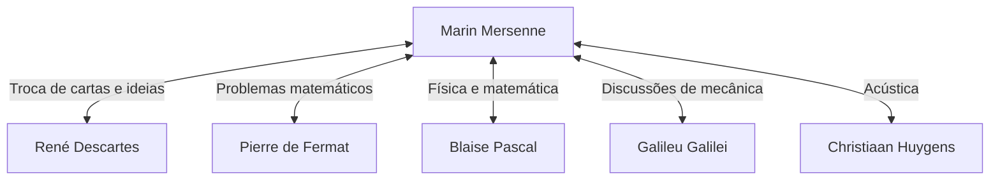

## Introdução

[Marin Mersenne](https://kenji.blog/pt/p/mersenne/) (1588–1648) foi um teólogo, filósofo, matemático e teórico musical francês do século XVII. Embora tenha feito suas próprias descobertas matemáticas, ele é mais conhecido por seu papel como o **"correio da Europa"**, conectando os grandes estudiosos de seu tempo.

Neste artigo, exploraremos a vida de [Mersenne](https://kenji.blog/pt/p/mersenne/), a enorme rede intelectual que ele construiu e os **números primos de [Mersenne](https://kenji.blog/pt/p/mersenne/)** que estão profundamente conectados à criptografia moderna. Além disso, nos aprofundaremos em suas contribuições para a acústica e sua influência na metodologia científica.

## Início de vida e vida monástica

[Marin Mersenne](https://kenji.blog/pt/p/mersenne/) nasceu em 8 de setembro de 1588, em uma família de camponeses em Oizé, Maine, França. Após receber educação básica em um colégio em Le Mans, ele ingressou no colégio jesuíta de La Flèche em 1604. Lá, ele conheceu [René Descartes](https://kenji.blog/pt/p/descartes/), que mais tarde se tornaria o pai da filosofia moderna, e forjou uma profunda amizade para toda a vida com ele.

Em 1611, [Mersenne](https://kenji.blog/pt/p/mersenne/) ingressou na Ordem dos Mínimos. Os Mínimos eram uma ordem com disciplinas estritas (como jejum e vegetarianismo), mas promoviam uma cultura que encorajava a busca da erudição. Em 1619, ele se estabeleceu no Convento de L'Annonciade em Paris, que se tornou sua base para mergulhar na teologia, filosofia e ciências naturais.

Seus escritos são caracterizados por uma disposição de incorporar ativamente as novas descobertas científicas da época, ao mesmo tempo em que aderem à doutrina religiosa. Sua postura, que visava harmonizar religião e ciência, desempenhou um papel importante no clima intelectual do século XVII.

## O correio da Europa: A Rede de [Mersenne](https://kenji.blog/pt/p/mersenne/)

No início do século XVII, as revistas científicas e as academias como as conhecemos hoje ainda não existiam. O único meio de compartilhar novas descobertas e teorias era por meio de cartas (correspondência) entre estudiosos.

Aproveitando sua curiosidade inata e sociabilidade, [Mersenne](https://kenji.blog/pt/p/mersenne/) se envolveu em uma enorme quantidade de correspondência com estudiosos de toda a Europa. Sua cela monástica era semelhante a uma academia científica, por meio da qual muitos estudiosos trocavam ideias. Essa rede é frequentemente chamada de "rede de [Mersenne](https://kenji.blog/pt/p/mersenne/)".



No centro dessa rede, quando alguém descobria um novo teorema, [Mersenne](https://kenji.blog/pt/p/mersenne/) o repassava a outros estudiosos, encorajando a crítica e a verificação. Por exemplo, foi [Mersenne](https://kenji.blog/pt/p/mersenne/) quem comunicou as descobertas matemáticas de [Pierre de Fermat](https://kenji.blog/pt/p/fermat/) a [Descartes](https://kenji.blog/pt/p/descartes/), provocando um intenso debate entre os dois. Ele também é conhecido por traduzir as obras de Galileu Galilei (como o *Diálogo sobre os Dois Principais Sistemas do Mundo*) para o francês, tornando-as amplamente conhecidas, apesar da rigorosa censura da Igreja Católica. Alguns historiadores avaliam que, sem ele, a Revolução Científica do século XVII poderia ter sido atrasada em décadas.

## Realizações matemáticas: Números primos de [Mersenne](https://kenji.blog/pt/p/mersenne/)

O nome de [Mersenne](https://kenji.blog/pt/p/mersenne/) é sem dúvida mais bem lembrado hoje na forma dos **números primos de [Mersenne](https://kenji.blog/pt/p/mersenne/)**.

Um número de [Mersenne](https://kenji.blog/pt/p/mersenne/) é definido da seguinte forma:

$$
M_n = 2^n - 1 \quad (\text{onde } n \text{ é um número natural})
$$

Quando este $M_n$ é um número primo, ele é chamado de "número primo de [Mersenne](https://kenji.blog/pt/p/mersenne/)".

### Condições para ser primo

Para que $2^n - 1$ seja primo, é uma condição necessária (embora não suficiente) que o próprio $n$ seja um número primo.

Por exemplo:
- Para $n = 2$, $M_2 = 2^2 - 1 = 3$ (Primo)
- Para $n = 3$, $M_3 = 2^3 - 1 = 7$ (Primo)
- Para $n = 5$, $M_5 = 2^5 - 1 = 31$ (Primo)
- Para $n = 7$, $M_7 = 2^7 - 1 = 127$ (Primo)

No entanto, para $n = 11$,
$$
M_{11} = 2^{11} - 1 = 2047 = 23 \times 89 \quad (\text{Número composto})
$$
Assim, não é primo.

### A Ousada Conjectura de 1644

Em seu livro de 1644 *Cogitata Physico-Mathematica*, [Mersenne](https://kenji.blog/pt/p/mersenne/) afirmou que para $n \le 257$, $M_n$ é primo apenas para:

$$
\text{Primo quando } n = 2, 3, 5, 7, 13, 17, 19, 31, 67, 127, 257
$$

Na época, verificar a primalidade de números enormes à mão era virtualmente impossível, então essa afirmação ousada foi recebida com grande espanto. O próprio [Mersenne](https://kenji.blog/pt/p/mersenne/) admitiu que não havia calculado rigorosamente todos os números.

A verificação por matemáticos posteriores revelou que havia vários erros na lista de [Mersenne](https://kenji.blog/pt/p/mersenne/) ($n = 67$ e $257$ são compostos, enquanto na realidade é primo para $n = 61, 89, 107$). Levou cerca de três séculos (até 1947) para que a lista fosse completamente corrigida. No entanto, o problema que ele propôs continuou a fascinar os matemáticos por séculos.

### Aplicações à criptografia moderna e GIMPS

Hoje, os números primos de [Mersenne](https://kenji.blog/pt/p/mersenne/) continuam a ser explorados pelo "GIMPS" (Great Internet [Mersenne](https://kenji.blog/pt/p/mersenne/) Prime Search), um projeto dedicado a encontrar os maiores números primos do mundo. Como existe um teste de primalidade especial e rápido chamado teste de Lucas-Lehmer, os números de [Mersenne](https://kenji.blog/pt/p/mersenne/) são extremamente adequados para a descoberta de primos gigantescos.

```python
# Teste de Lucas-Lehmer para números primos de Mersenne
def is_mersenne_prime(p):
    """
    Verifica se M_p = 2^p - 1 é primo usando o teste de Lucas-Lehmer.
    Retorna True se for primo, False caso contrário.
    """
    if p == 2:
        return True
    
    m = (1 << p) - 1
    s = 4
    for _ in range(p - 2):
        s = (s * s - 2) % m
        
    return s == 0
```

Os primos gigantescos descobertos desempenham um papel crítico no apoio à sociedade da informação, servindo como base para a avaliação de segurança de sistemas modernos de criptografia de chave pública como o [RSA](https://kenji.blog/pt/p/modern-cryptography-public-key-hash-signature/), e algoritmos de geração de números aleatórios (como o [Mersenne](https://kenji.blog/pt/p/mersenne/) Twister).

## Contribuições para acústica e teoria musical: Leis de [Mersenne](https://kenji.blog/pt/p/mersenne/)

Além da matemática, [Mersenne](https://kenji.blog/pt/p/mersenne/) também é chamado de o **"pai da acústica"**. Sua *Harmonie Universelle*, publicada em 1636, é a obra mais abrangente sobre teoria musical e instrumentos de sua época. Neste livro, ele explorou os fundamentos físicos do tom e da consonância.

Ele descobriu as "leis de [Mersenne](https://kenji.blog/pt/p/mersenne/)" sobre a frequência de cordas vibrantes. A frequência fundamental $f$ de uma corda é expressa pela seguinte equação com base no comprimento da corda $L$, tensão $T$ e densidade linear $\mu$ (massa por unidade de comprimento).

$$
\text{Frequência fundamental } f = \frac{1}{2L} \sqrt{\frac{T}{\mu}}
$$

Esta lei é um princípio físico crucial que forma a base para o design e a afinação de instrumentos de cordas como guitarras e pianos. Expandindo a pesquisa de Vincenzo Galilei (pai de Galileu), ele se tornou um dos primeiros a demonstrar, por meio de experimentos, que o tom depende diretamente da frequência das vibrações do ar. Ele também tentou medir a velocidade do som, abrindo a porta para a acústica moderna.

## Filosofia e religião: Relação com [Descartes](https://kenji.blog/pt/p/descartes/)

[Mersenne](https://kenji.blog/pt/p/mersenne/) também deixou pegadas significativas filosoficamente. Ele se opôs ao ceticismo extremo e às ideias mágicas ou místicas (como o hermetismo renascentista), defendendo a ciência racional e empírica.

Quando seu amigo íntimo [Descartes](https://kenji.blog/pt/p/descartes/) publicou as *Meditações sobre a Filosofia Primeira*, [Mersenne](https://kenji.blog/pt/p/mersenne/) enviou o manuscrito a pensadores proeminentes de toda a Europa (como Thomas Hobbes e Pierre Gassendi) para reunir suas objeções. Ele então as compilou em um livro, juntamente com as próprias respostas de [Descartes](https://kenji.blog/pt/p/descartes/), desempenhando um papel que poderia ser considerado um precursor do moderno sistema de revisão por pares.

[Mersenne](https://kenji.blog/pt/p/mersenne/) acreditava firmemente que o progresso científico provava a grandeza do mundo criado por Deus, considerando que não havia contradição entre religião e ciência.

## Conclusão

[Marin Mersenne](https://kenji.blog/pt/p/mersenne/) possuía não apenas intuição matemática notável, mas também um talento raro para conectar pessoas e conhecimento. A rede intelectual que ele estabeleceu acabou levando ao nascimento de sociedades científicas formais, como a Academia Francesa de Ciências e a Royal Society na Inglaterra.

Seu nome está eternamente gravado na história da matemática na forma dos números primos de [Mersenne](https://kenji.blog/pt/p/mersenne/), mas seu papel como "facilitador intelectual" na Revolução Científica do século XVII também é uma grande conquista que nunca deve ser esquecida. Sua vida nos ensina que a ciência se desenvolve não apenas pelo gênio dos indivíduos, mas também pela comunicação aberta e colaboração.
