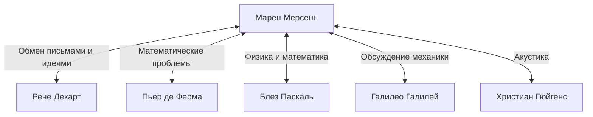

## Введение

Марен Мерсенн (1588–1648) был французским богословом, философом, математиком и теоретиком музыки XVII века. Хотя он совершил собственные математические открытия, он наиболее известен своей ролью **«почтальона Европы»**, связывающего великих ученых своего времени.

В этой статье мы исследуем жизнь Мерсенна, огромную интеллектуальную сеть, которую он создал, и **простые числа Мерсенна**, которые тесно связаны с современной криптографией. Кроме того, мы углубимся в его вклад в акустику и его влияние на научную методологию.

## Ранние годы и монашеская жизнь

Марен Мерсенн родился 8 сентября 1588 года в крестьянской семье в Уазе, штат Мэн, Франция. Получив базовое образование в колледже в Ле-Мане, в 1604 году он поступил в иезуитский колледж Ла-Флеш. Там он познакомился с Рене Декартом, который позже станет отцом современной философии, и завязал с ним глубокую дружбу на всю жизнь.

В 1611 году Мерсенн присоединился к ордену минимов. Минимы были орденом со строгой дисциплиной (такой как пост и вегетарианство), но они поощряли культуру, стимулирующую стремление к знаниям. В 1619 году он поселился в монастыре Л'Аннонсиад в Париже, который стал его базой для погружения в теологию, философию и естественные науки.

Его труды характеризуются готовностью активно использовать новые научные открытия того времени, придерживаясь при этом религиозной доктрины. Его позиция, направленная на гармонизацию религии и науки, сыграла важную роль в интеллектуальном климате XVII века.

## Почтальон Европы: Сеть Мерсенна

В начале XVII века научных журналов и академий в том виде, в каком мы их знаем сегодня, еще не существовало. Единственным способом обмена новыми открытиями и теориями были письма (переписка) между учеными.

Опираясь на свое врожденное любопытство и общительность, Мерсенн вел огромную переписку с учеными по всей Европе. Его монашеская келья была похожа на научную академию, через которую многие ученые обменивались идеями. Эту сеть часто называют «сетью Мерсенна».



Находясь в центре этой сети, Мерсенн, когда кто-то открывал новую теорему, передавал ее другим ученым, поощряя критику и проверку. Например, именно Мерсенн сообщил о математических открытиях Пьера де Ферма Декарту, вызвав между ними жаркие споры. Он также известен тем, что перевел на французский язык труды Галилео Галилея (такие как *«Диалог о двух главнейших системах мира»*), сделав их широко известными, несмотря на строгую цензуру католической церкви. Некоторые историки считают, что без него Научная революция XVII века могла бы задержаться на десятилетия.

## Математические достижения: простые числа Мерсенна

Имя Мерсенна, несомненно, лучше всего помнят сегодня в виде **простых чисел Мерсенна**.

Число Мерсенна определяется следующим образом:

$$
M_n = 2^n - 1 \quad (\text{где } n \text{ — натуральное число})
$$

Когда это $M_n$ является простым числом, оно называется «простым числом Мерсенна».

### Условия для того, чтобы быть простым числом

Для того чтобы $2^n - 1$ было простым, необходимое (хотя и недостаточное) условие состоит в том, чтобы само $n$ было простым числом.

Например:
- При $n = 2$, $M_2 = 2^2 - 1 = 3$ (Простое)
- При $n = 3$, $M_3 = 2^3 - 1 = 7$ (Простое)
- При $n = 5$, $M_5 = 2^5 - 1 = 31$ (Простое)
- При $n = 7$, $M_7 = 2^7 - 1 = 127$ (Простое)

Однако при $n = 11$,
$$
M_{11} = 2^{11} - 1 = 2047 = 23 \times 89 \quad (\text{Составное число})
$$
Таким образом, оно не является простым.

### Смелая гипотеза 1644 года

В своей книге 1644 года *Cogitata Physico-Mathematica* Мерсенн утверждал, что для $n \le 257$, $M_n$ является простым только для:

$$
\text{Простое при } n = 2, 3, 5, 7, 13, 17, 19, 31, 67, 127, 257
$$

В то время проверка простоты огромных чисел вручную была практически невозможна, поэтому это смелое утверждение было встречено с большим изумлением. Сам Мерсенн признавал, что он не вычислял строго все числа.

Проверка более поздними математиками показала, что в списке Мерсенна было несколько ошибок ($n = 67$ и $257$ являются составными, тогда как в реальности они простые для $n = 61, 89, 107$). Потребовалось около трех столетий (до 1947 года), чтобы список был полностью исправлен. Тем не менее, проблема, которую он поставил, продолжала увлекать математиков на протяжении веков.

### Применение в современной криптографии и GIMPS

Сегодня простые числа Мерсенна продолжают исследоваться в рамках проекта «GIMPS» (Great Internet Mersenne Prime Search), посвященного поиску крупнейших простых чисел в мире. Поскольку существует специальный быстрый тест на простоту, называемый тестом Люка — Лемера, числа Мерсенна чрезвычайно хорошо подходят для обнаружения гигантских простых чисел.

```python
# Тест Люка — Лемера для простых чисел Мерсенна
def is_mersenne_prime(p):
    """
    Проверяет, является ли M_p = 2^p - 1 простым, используя тест Люка — Лемера.
    Возвращает True, если простое, и False в противном случае.
    """
    if p == 2:
        return True
    
    m = (1 << p) - 1
    s = 4
    for _ in range(p - 2):
        s = (s * s - 2) % m
        
    return s == 0
```

Обнаруженные гигантские простые числа играют критически важную роль в поддержке информационного общества, служа основой для оценки безопасности современных систем криптографии с открытым ключом, таких как RSA, и алгоритмов генерации случайных чисел (таких как Вихрь Мерсенна).

## Вклад в акустику и теорию музыки: Законы Мерсенна

Помимо математики, Мерсенна также называют **«отцом акустики»**. Его труд *Harmonie Universelle*, опубликованный в 1636 году, является наиболее полным произведением по теории музыки и инструментам своего времени. В этой книге он исследовал физические основы высоты тона и консонанса.

Он открыл «законы Мерсенна» относительно частоты колебаний струн. Основная частота $f$ струны выражается следующим уравнением, основанным на длине струны $L$, натяжении $T$ и линейной плотности $\mu$ (масса на единицу длины).

$$
\text{Основная частота } f = \frac{1}{2L} \sqrt{\frac{T}{\mu}}
$$

Этот закон является важнейшим физическим принципом, который лежит в основе конструирования и настройки струнных инструментов, таких как гитары и пианино. Опираясь на исследования Винченцо Галилея (отца Галилео), он стал одним из первых, кто опытным путем доказал, что высота звука напрямую зависит от частоты колебаний воздуха. Он также попытался измерить скорость звука, открыв дверь в современную акустику.

## Философия и религия: Отношения с Декартом

Мерсенн также оставил значительный философский след. Он выступал против крайнего скептицизма и магических или мистических идей (таких как ренессансный герметизм), защищая рациональную и эмпирическую науку.

Когда его близкий друг Декарт опубликовал *«Размышления о первой философии»*, Мерсенн разослал рукопись видным мыслителям по всей Европе (таким как Томас Гоббс и Пьер Гассенди), чтобы собрать их возражения. Затем он скомпилировал их в книгу вместе с ответами самого Декарта, сыграв роль, которую можно считать предшественником современной системы экспертной оценки (peer-review).

Мерсенн твердо верил, что научный прогресс доказывает величие созданного Богом мира, считая, что между религией и наукой нет противоречий.

## Заключение

Марен Мерсенн обладал не только выдающейся математической интуицией, но и редким талантом объединять людей и знания. Созданная им интеллектуальная сеть в конечном итоге привела к рождению формальных научных обществ, таких как Французская академия наук и Лондонское королевское общество.

Его имя навсегда запечатлено в истории математики в виде простых чисел Мерсенна, но его роль «интеллектуального посредника» в Научной революции XVII века также является великим достижением, о котором никогда не следует забывать. Его жизнь учит нас тому, что наука развивается не только благодаря гению отдельных людей, но и благодаря открытому общению и сотрудничеству.
