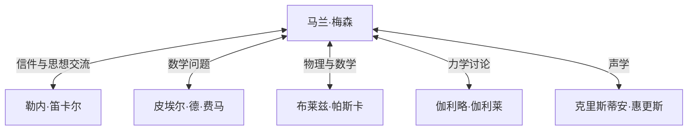

## 引言

[马兰·梅森](https://kenji.blog/zh-cn/p/mersenne/)（[Marin Mersenne](https://kenji.blog/zh-cn/p/mersenne/)，1588年–1648年）是17世纪法国的神学家、哲学家、数学家和音乐理论家。虽然他自己在数学上也有所发现，但他最广为人知的身份是作为连接当时伟大人类学者的 **“欧洲学术信箱”** （the post-box of Europe）。

在这篇文章中，我们将探讨梅森的一生，他建立的庞大知识网络，以及与现代密码学息息相关的 **梅森素数** 。此外，我们还将深入研究他在声学方面的贡献及其对科学方法论的影响。

## 早年与修道院生活

[马兰·梅森](https://kenji.blog/zh-cn/p/mersenne/)于1588年9月8日出生在法国曼恩省瓦泽的一个农民家庭。在勒芒的一所学院接受基础教育后，他于1604年进入耶稣会创办的拉弗莱什学院。在那里，他结识了后来成为现代哲学之父的[勒内·笛卡尔](https://kenji.blog/zh-cn/p/descartes/)（[René Descartes](https://kenji.blog/zh-cn/p/descartes/)），并与他建立了一生的深厚友谊。

1611年，梅森加入了最小兄弟会（Order of Minims）。这是一个纪律严明（如禁食和素食）的修会，但他们有着鼓励追求学问的文化。1619年，他定居在巴黎的圣母领报修道院，这里成了他潜心研究神学、哲学和自然科学的大本营。

他的著作的特点是，在坚持宗教教义的同时，愿意积极地吸收当时新的科学发现。他旨在调和宗教与科学的立场在17世纪的知识环境中发挥了重要作用。

## 欧洲的信箱：梅森网络

在17世纪初，我们今天所熟知的科学期刊和学术机构还不存在。分享新发现和理论的唯一方式是学者之间的书信（通信）。

梅森利用他与生俱来的好奇心和善于交际的特点，与整个欧洲的学者进行了大量的通信。他的修道院房间就像一个科学院，许多学者通过他交流思想。这个网络通常被称为“梅森网络”。



处于这个网络的中心，当有人发现一个新定理时，梅森就会将其转达给其他学者，鼓励批评和验证。例如，正是梅森将[皮埃尔·德·费马](https://kenji.blog/zh-cn/p/fermat/)的数学发现传达给了笛卡尔，引发了两人之间的激烈辩论。他还以将伽利略的著作（如《关于托勒密和哥白尼两大世界体系的对话》）翻译成法语而闻名，不顾天主教会的严格审查而将其广泛介绍。一些历史学家评价说，如果没有他，17世纪的科学革命可能会被推迟几十年。

## 数学成就：梅森素数

毋庸置疑，今天人们最容易通过 **梅森素数** （[Mersenne](https://kenji.blog/zh-cn/p/mersenne/) primes）记住梅森的名字。

梅森数的定义如下：

$$
M_n = 2^n - 1 \quad （\text{其中 } n \text{ 为自然数}）
$$

当这个 $M_n$ 是一个素数时，它就被称为“梅森素数”。

### 成为素数的条件

为了使 $2^n - 1$ 是素数，$n$ 本身必须是素数，这是一个必要条件（尽管不是充分条件）。

例如：
- 当 $n = 2$ 时，$M_2 = 2^2 - 1 = 3$ （素数）
- 当 $n = 3$ 时，$M_3 = 2^3 - 1 = 7$ （素数）
- 当 $n = 5$ 时，$M_5 = 2^5 - 1 = 31$ （素数）
- 当 $n = 7$ 时，$M_7 = 2^7 - 1 = 127$ （素数）

然而，当 $n = 11$ 时，
$$
M_{11} = 2^{11} - 1 = 2047 = 23 \times 89 \quad （\text{合数}）
$$
因此，它不是素数。

### 1644年的大胆猜想

在1644年出版的《物理数学沉思录》（Cogitata Physico-Mathematica）一书中，梅森声称在 $n \le 257$ 的范围内，$M_n$ 仅在以下情况为素数：

$$
\text{素数条件：} n = 2, 3, 5, 7, 13, 17, 19, 31, 67, 127, 257
$$

在当时，手工验证巨大数字的素性几乎是不可能的，因此这一大胆的主张引起了极大的惊叹。梅森自己也承认，他并没有严格计算所有的数字。

后来的数学家的验证表明，梅森的列表中有几个错误（$n = 67$ 和 $257$ 是合数，而实际上在 $n = 61, 89, 107$ 时是素数）。直到大约三个世纪后（1947年），这个列表才被完全纠正。尽管如此，他提出的问题仍然在几个世纪里一直吸引着数学家。

### 现代密码学与GIMPS的应用

今天，致力于寻找世界上最大素数的项目“GIMPS”（互联网梅森素数大搜索）继续探索着梅森素数。因为存在一种称为卢卡斯-莱默检验的特殊、快速的素性检验方法，梅森数非常适合用于发现巨大的素数。

```python
# 针对梅森素数的卢卡斯-莱默检验
def is_mersenne_prime(p):
    """
    使用卢卡斯-莱默检验检查 M_p = 2^p - 1 是否为素数。
    如果是素数返回 True，否则返回 False。
    """
    if p == 2:
        return True
    
    m = (1 << p) - 1
    s = 4
    for _ in range(p - 2):
        s = (s * s - 2) % m
        
    return s == 0
```

发现的巨大素数在支持信息社会方面发挥着关键作用，可作为现代公钥密码系统（如RSA）安全性评估以及随机数生成算法（如梅森旋转算法）的基础。

## 声学与音乐理论的贡献：梅森定律

除了数学，梅森还被称为 **“声学之父”** 。他于1636年出版的《普遍和声》（Harmonie Universelle）是那个时代关于音乐理论和乐器的最全面的著作。在这本书中，他探索了音高和协和音的物理基础。

他发现了关于振动弦频率的“梅森定律”。弦的基频 $f$ 可以根据弦长 $L$、张力 $T$ 和线密度 $\mu$（单位长度的质量）由以下公式表示。

$$
\text{基频 } f = \frac{1}{2L} \sqrt{\frac{T}{\mu}}
$$

该定律是一个至关重要的物理原理，为设计和调音吉他、钢琴等弦乐器奠定了基础。在文森佐·伽利略（伽利略的父亲）的研究基础之上，他成为首批通过实验证明音高直接取决于空气振动频率的人之一。他还尝试测量音速，打开了现代声学的大门。

## 哲学与宗教：与笛卡尔的关系

梅森在哲学上也留下了重要的足迹。他反对极端的怀疑论以及魔法或神秘主义思想（如文艺复兴时期的赫尔墨斯主义），捍卫理性与经验科学。

当他的密友笛卡尔出版《第一哲学沉思集》时，梅森将手稿寄给了欧洲各地的著名思想家（如托马斯·霍布斯和皮埃尔·伽桑狄）以收集他们的反对意见。然后，他将这些意见连同笛卡尔本人的回复汇编成书，扮演了一个可以说是现代同行评审制度先驱的角色。

梅森坚信科学的进步证明了上帝创造的世界的伟大，认为宗教与科学之间没有矛盾。

## 结论

[马兰·梅森](https://kenji.blog/zh-cn/p/mersenne/)不仅拥有杰出的数学直觉，还具备一种将人和知识联系起来的罕见天赋。他建立的知识网络最终促成了正式科学学会的诞生，例如法国科学院和英国皇家学会。

他的名字以梅森素数的形式永远铭刻在数学史上，但他在17世纪科学革命中作为“知识促进者”的角色也是一项绝不应被遗忘的伟大成就。他的一生告诉我们，科学的发展不仅依靠个人的天才，还需要开放的交流与合作。
