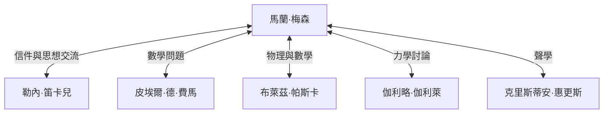

## 引言

馬蘭·梅森（Marin Mersenne，1588年–1648年）是17世紀法國的神學家、哲學家、數學家和音樂理論家。雖然他自己在數學上也有所發現，但他最廣為人知的身份是作為連接當時偉大學者的 **「歐洲學術信箱」** （the post-box of Europe）。

在這篇文章中，我們將探討梅森的一生，他建立的龐大知識網絡，以及與現代密碼學息息相關的 **梅森質數** 。此外，我們還將深入研究他在聲學方面的貢獻及其對科學方法論的影響。

## 早年與修道院生活

馬蘭·梅森於1588年9月8日出生在法國曼恩省瓦澤的一個農民家庭。在勒芒的一所學院接受基礎教育後，他於1604年進入耶穌會創辦的拉弗萊什學院。在那裡，他結識了後來成為現代哲學之父的勒內·笛卡兒（René Descartes），並與他建立了一生的深厚友誼。

1611年，梅森加入了最小兄弟會（Order of Minims）。這是一個紀律嚴明（如禁食和素食）的修會，但他們有著鼓勵追求學問的文化。1619年，他定居在巴黎的聖母領報修道院，這裡成了他潛心研究神學、哲學和自然科學的大本營。

他的著作的特點是，在堅持宗教教義的同時，願意積極地吸收當時新的科學發現。他旨在調和宗教與科學的立場在17世紀的知識環境中發揮了重要作用。

## 歐洲的信箱：梅森網絡

在17世紀初，我們今天所熟知的科學期刊和學術機構還不存在。分享新發現和理論的唯一方式是學者之間的書信（通信）。

梅森利用他與生俱來的好奇心和善於交際的特點，與整個歐洲的學者進行了大量的通信。他的修道院房間就像一個科學院，許多學者透過他交流思想。這個網絡通常被稱為「梅森網絡」。



處於這個網絡的中心，當有人發現一個新定理時，梅森就會將其轉達給其他學者，鼓勵批評和驗證。例如，正是梅森將皮埃爾·德·費馬的數學發現傳達給了笛卡兒，引發了兩人之間的激烈辯論。他還以將伽利略的著作（如《關於托勒密和哥白尼兩大世界體系的對話》）翻譯成法語而聞名，不顧天主教會的嚴格審查而將其廣泛介紹。一些歷史學家評價說，如果沒有他，17世紀的科學革命可能會被推遲幾十年。

## 數學成就：梅森質數

毋庸置疑，今天人們最容易透過 **梅森質數** （Mersenne primes）記住梅森的名字。

梅森數的定義如下：

$$
M_n = 2^n - 1 \quad （\text{其中 } n \text{ 為自然數}）
$$

當這個 $M_n$ 是一個質數時，它就被稱為「梅森質數」。

### 成為質數的條件

為了使 $2^n - 1$ 是質數，$n$ 本身必須是質數，這是一個必要條件（儘管不是充分條件）。

例如：
- 當 $n = 2$ 時，$M_2 = 2^2 - 1 = 3$ （質數）
- 當 $n = 3$ 時，$M_3 = 2^3 - 1 = 7$ （質數）
- 當 $n = 5$ 時，$M_5 = 2^5 - 1 = 31$ （質數）
- 當 $n = 7$ 時，$M_7 = 2^7 - 1 = 127$ （質數）

然而，當 $n = 11$ 時，
$$
M_{11} = 2^{11} - 1 = 2047 = 23 \times 89 \quad （\text{合數}）
$$
因此，它不是質數。

### 1644年的大膽猜想

在1644年出版的《物理數學沉思錄》（Cogitata Physico-Mathematica）一書中，梅森聲稱在 $n \le 257$ 的範圍內，$M_n$ 僅在以下情況為質數：

$$
\text{質數條件：} n = 2, 3, 5, 7, 13, 17, 19, 31, 67, 127, 257
$$

在當時，手工驗證巨大數字的質數性幾乎是不可能的，因此這一大膽的主張引起了極大的驚嘆。梅森自己也承認，他並沒有嚴格計算所有的數字。

後來的數學家的驗證表明，梅森的列表中有幾個錯誤（$n = 67$ 和 $257$ 是合數，而實際上在 $n = 61, 89, 107$ 時是質數）。直到大約三個世紀後（1947年），這個列表才被完全糾正。儘管如此，他提出的問題仍然在幾個世紀裡一直吸引著數學家。

### 現代密碼學與GIMPS的應用

今天，致力於尋找世界上最大質數的項目「GIMPS」（互聯網梅森質數大搜索）繼續探索著梅森質數。因為存在一種稱為盧卡斯-萊默檢驗的特殊、快速的質數性檢驗方法，梅森數非常適合用於發現巨大的質數。

```python
# 針對梅森質數的盧卡斯-萊默檢驗
def is_mersenne_prime(p):
    """
    使用盧卡斯-萊默檢驗檢查 M_p = 2^p - 1 是否為質數。
    如果是質數返回 True，否則返回 False。
    """
    if p == 2:
        return True
    
    m = (1 << p) - 1
    s = 4
    for _ in range(p - 2):
        s = (s * s - 2) % m
        
    return s == 0
```

發現的巨大質數在支持資訊社會方面發揮著關鍵作用，可作為現代公鑰密碼系統（如RSA）安全性評估以及隨機數生成演算法（如梅森旋轉演算法）的基礎。

## 聲學與音樂理論的貢獻：梅森定律

除了數學，梅森還被稱為 **「聲學之父」** 。他於1636年出版的《普遍和聲》（Harmonie Universelle）是那個時代關於音樂理論和樂器的最全面的著作。在這本書中，他探索了音高和協和音的物理基礎。

他發現了關於振動弦頻率的「梅森定律」。弦的基頻 $f$ 可以根據弦長 $L$、張力 $T$ 和線密度 $\mu$（單位長度的質量）由以下公式表示。

$$
\text{基頻 } f = \frac{1}{2L} \sqrt{\frac{T}{\mu}}
$$

該定律是一個至關重要的物理原理，為設計和調音吉他、鋼琴等弦樂器奠定了基礎。在文森佐·伽利略（伽利略的父親）的研究基礎之上，他成為首批透過實驗證明音高直接取決於空氣振動頻率的人之一。他還嘗試測量音速，打開了現代聲學的大門。

## 哲學與宗教：與笛卡兒的關係

梅森在哲學上也留下了重要的足跡。他反對極端的懷疑論以及魔法或神秘主義思想（如文藝復興時期的赫爾墨斯主義），捍衛理性與經驗科學。

當他的密友笛卡兒出版《第一哲學沉思集》時，梅森將手稿寄給了歐洲各地的著名思想家（如托馬斯·霍布斯和皮埃爾·伽桑狄）以收集他們的反對意見。然後，他將這些意見連同笛卡兒本人的回覆彙編成書，扮演了一個可以說是現代同行評審制度先驅的角色。

梅森堅信科學的進步證明了上帝創造的世界的偉大，認為宗教與科學之間沒有矛盾。

## 結論

馬蘭·梅森不僅擁有傑出的數學直覺，還具備一種將人和知識聯繫起來的罕見天賦。他建立的知識網絡最終促成了正式科學學會的誕生，例如法國科學院和英國皇家學會。

他的名字以梅森質數的形式永遠銘刻在數學史上，但他在17世紀科學革命中作為「知識促進者」的角色也是一項絕不應被遺忘的偉大成就。他的一生告訴我們，科學的發展不僅依靠個人的天才，還需要開放的交流與合作。
