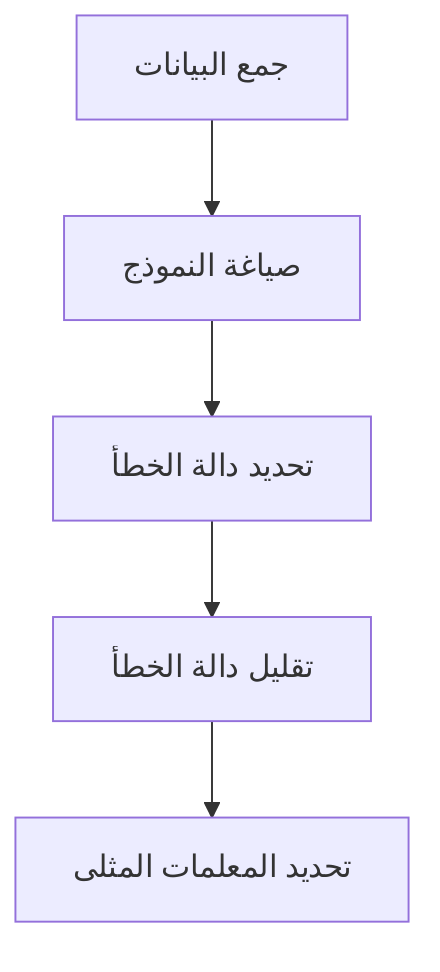
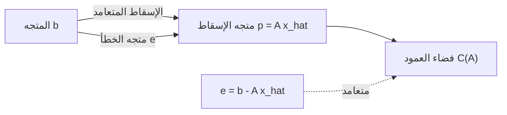

## 1. مقدمة: بيانات العالم الحقيقي والنموذج "الأمثل"

البيانات التي تتم ملاحظتها في العالم الحقيقي تحتوي دائمًا تقريبًا على "ضوضاء" أو "تباين". للعثور على القواعد الأساسية من هذه البيانات والتنبؤ بالمستقبل أو تقدير البيانات غير المعروفة، نحتاج إلى بناء نموذج رياضي **يناسب** البيانات بأفضل شكل.

الطريقة الأساسية التي لا تزال تلعب دورًا في غاية الأهمية كأساس لتعلم الآلة الحديث هي **[طريقة المربعات الصغرى](https://kenji.blog/ar/p/method-of-least-squares/)** ([Method of Least Squares](https://kenji.blog/ar/p/method-of-least-squares/)).

في هذا المقال، بدلاً من مجرد حفظ الصيغ، سوف نستكشف بعمق **"لماذا يجد هذا الحساب الخط الأفضل ملاءمة"** من المنظور الهندسي الجميل للجبر الخطي (الإسقاط المتعامد).

## 2. الفكرة البديهية ل[طريقة المربعات الصغرى](https://kenji.blog/ar/p/method-of-least-squares/)

لنفترض أن لدينا $n$ من نقاط البيانات $(x_1, y_1), (x_2, y_2), \dots, (x_n, y_n)$. عند رسم هذه النقاط على مخطط التشتت، قد لا تصطف بشكل مستقيم تمامًا، لكنها بشكل عام تبدو وكأنها تتبع اتجاه خط معين.

في هذا الوقت، ليكن معادلة الخط الذي يقارب البيانات هو $y = c + dx$. (هنا، نقطة التقاطع هي $c$ والميل هو $d$).

لكل نقطة بيانات $x_i$، القيمة التي يتنبأ بها هذا الخط هي $\hat{y}_i = c + d x_i$. يحدث خطأ (متبقي) $e_i$ بين القيمة الملاحظة الفعلية $y_i$ والقيمة المتوقعة $\hat{y}_i$.

$$ e_i = y_i - \hat{y}_i = y_i - (c + d x_i) $$

[طريقة المربعات الصغرى](https://kenji.blog/ar/p/method-of-least-squares/) هي تقنية للعثور على المعلمات $c$ و $d$ التي تقلل من **مجموع مربعات** الأخطاء. يتم تعريف مجموع الأخطاء المربعة $E$ على النحو التالي:

$$ E = \sum_{i=1}^{n} e_i^2 = \sum_{i=1}^{n} (y_i - c - d x_i)^2 \quad (\text{تعريف دالة الخطأ}) $$

السبب في التربيع هو منع الأخطاء الإيجابية والسلبية من إلغاء بعضها البعض، ولأن لها ميزة قوية تتمثل في كونها قابلة للاشتقاق رياضيًا وسهلة التعامل معها.



## 3. الصياغة باستخدام الجبر الخطي و "المعادلات التي لا يمكن حلها"

يظهر الجمال الحقيقي ل[طريقة المربعات الصغرى](https://kenji.blog/ar/p/method-of-least-squares/) عندما نعيد كتابة هذا باستخدام لغة المصفوفات والمتجهات، أي **الجبر الخطي**.

بافتراض أن جميع نقاط البيانات تقع تمامًا على الخط $y = c + dx$، نحصل على المعادلات الـ $n$ التالية:

$$
\begin{cases}
c + d x_1 = y_1 \\
c + d x_2 = y_2 \\
\vdots \\
c + d x_n = y_n
\end{cases}
$$

بالتعبير عن هذا في شكل مصفوفة، نحصل على:

$$
\begin{bmatrix}
1 & x_1 \\
1 & x_2 \\
\vdots & \vdots \\
1 & x_n
\end{bmatrix}
\begin{bmatrix}
c \\
d
\end{bmatrix}
=
\begin{bmatrix}
y_1 \\
y_2 \\
\vdots \\
y_n
\end{bmatrix}
$$

نكتب هذا ببساطة كـ $A\mathbf{x} = \mathbf{b}$. هنا،
- $A$ هي **مصفوفة تصميم** بحجم $n \times 2$
- $\mathbf{x} = \begin{bmatrix} c \\ d \end{bmatrix}$ هو **متجه المعلمات** الذي نريد العثور عليه
- $\mathbf{b}$ هو **متجه المتغير المستهدف** للقيم الملاحظة

عندما تحتوي البيانات على تباين (3 نقاط أو أكثر ليست على خط مستقيم)، لا يوجد حل $\mathbf{x}$ يلبي هذه المعادلة $A\mathbf{x} = \mathbf{b}$ تمامًا. أي أن نظام المعادلات **غير متسق**.

## 4. المنظور الهندسي: فضاء العمود والإسقاط المتعامد

ماذا يعني هندسيًا أن المعادلة $A\mathbf{x} = \mathbf{b}$ لا يمكن حلها؟

ضرب المصفوفة $A$ بالمتجه $\mathbf{x}$ يعني إنشاء تركيبة خطية من كل متجه عمود في $A$. الفضاء الذي تم إنشاؤه بواسطة جميع التراكيب الخطية الممكنة لـ $A$ يسمى **فضاء العمود** لـ $A$، ويُكتب كـ $C(A)$.

$$ A\mathbf{x} \in C(A) $$

غياب الحل يعني أن المتجه $\mathbf{b}$ يقع **خارج** فضاء العمود هذا $C(A)$.

ما نبحث عنه ليس حلاً مثاليًا، بل متجه داخل $C(A)$ أقرب ما يمكن إلى $\mathbf{b}$. دعنا نسمي هذا $A\hat{\mathbf{x}}$. في هذا الوقت، يتم تقليل المسافة (المربعة) بين المتجه $\mathbf{b}$ و $A\hat{\mathbf{x}}$. هذه هي بالضبط [طريقة المربعات الصغرى](https://kenji.blog/ar/p/method-of-least-squares/).

هندسيًا، النقطة التي تعطي أقصر مسافة من نقطة معينة $\mathbf{b}$ في الفضاء إلى مستوى معين $C(A)$ ليست سوى **موقع العمود** الساقط من $\mathbf{b}$ إلى $C(A)$. يُسمى هذا **الإسقاط المتعامد**.

بجعل متجه الخطأ هو $\mathbf{e} = \mathbf{b} - A\hat{\mathbf{x}}$، فإن شرط المسافة الأقصر هو أن "متجه الخطأ $\mathbf{e}$ متعامد مع فضاء العمود $C(A)$".

التعامد مع فضاء العمود $C(A)$ يعني التعامد مع جميع متجهات العمود في $A$. هذا يعني أن متجه الخطأ $\mathbf{e}$ ينتمي إلى **الفضاء الصفري الأيسر** للمصفوفة المنقولة $A^T$ للمصفوفة $A$. أي،

$$ A^T \mathbf{e} = \mathbf{0} \quad (\text{شرط التعامد}) $$

## 5. اشتقاق المعادلة العادية

دعونا نعوض $\mathbf{e} = \mathbf{b} - A\hat{\mathbf{x}}$ في شرط التعامد أعلاه.

$$ A^T (\mathbf{b} - A\hat{\mathbf{x}}) = \mathbf{0} $$
$$ A^T \mathbf{b} - A^T A \hat{\mathbf{x}} = \mathbf{0} $$

بإعادة ترتيب هذا، نحصل على المعادلة التالية المهمة للغاية.

$$ A^T A \hat{\mathbf{x}} = A^T \mathbf{b} \quad (\text{المعادلة العادية}) $$

تسمى هذه المعادلة **المعادلة العادية**. لم يكن للمعادلة الأصلية $A\mathbf{x} = \mathbf{b}$ حل، لكن هذه المعادلة العادية المضروبة في $A^T$ من اليسار على كلا الجانبين لها دائمًا حل. علاوة على ذلك، إذا كانت متجهات العمود في $A$ مستقلة خطيًا، فإن $A^T A$ يصبح قابلاً للانعكاس (له مصفوفة عكسية)، ويتم تحديد الحل الأمثل $\hat{\mathbf{x}}$ بشكل فريد على النحو التالي:

$$ \hat{\mathbf{x}} = (A^T A)^{-1} A^T \mathbf{b} $$

هذه الصيغة هي واحدة من أجمل النتائج في الإحصاء وتعلم الآلة. يمكنك الوصول إلى هذا الاستنتاج فقط من خلال المفهوم الهندسي للتعامد دون استخدام التفاضل والتكامل.



## 6. مثال التنفيذ في لغة بايثون

دعونا نحسب هذا فعليًا باستخدام برنامج، وليس فقط نظريًا. باستخدام مكتبة بايثون للحساب العددي NumPy، يمكنك تنفيذ المعادلة العادية بسهولة شديدة.

```python
import numpy as np

# بيانات العينة (x و y)
x_data = np.array([1, 2, 3, 4, 5])
y_data = np.array([2.1, 3.9, 6.2, 8.1, 9.8])

# إنشاء مصفوفة التصميم A
# دمج أعمدة x_data وعمود من الآحاد لنقطة التقاطع
# استخدام np.c_ للدمج على طول اتجاه العمود
A = np.c_[np.ones(len(x_data)), x_data]
b = y_data

# حل المعادلة العادية: (A^T A) x_hat = A^T b
# A.T هو منقول A، و @ يمثل ضرب المصفوفات
A_T_A = A.T @ A
A_T_b = A.T @ b

# حل نظام المعادلات باستخدام np.linalg.solve
# أكثر استقرارًا عدديًا من حساب المصفوفة العكسية مباشرة
x_hat = np.linalg.solve(A_T_A, A_T_b)

c_hat, d_hat = x_hat
print(f"نقطة التقاطع المثلى: {c_hat:.4f}")
print(f"الميل الأمثل: {d_hat:.4f}")
```

تشغيل هذا الكود يحسب نقطة التقاطع وميل الخط الذي يناسب نقاط البيانات المحددة بأفضل شكل. خلف الكواليس، يتم تنفيذ حساب المصفوفة المشتق سابقًا كما هو تمامًا.

## 7. الخاتمة والتطوير المستقبلي

[طريقة المربعات الصغرى](https://kenji.blog/ar/p/method-of-least-squares/) هي التقنية الأكثر قوة ومعيارية لتقدير معلمات النموذج من البيانات. باستخدام معرفة التفاضل والتكامل، يمكن اشتقاقها على أنها "النقطة التي يصبح فيها تدرج دالة الخطأ 0"، ولكن من خلال فهمها من منظور الجبر الخطي على أنها "إسقاط متعامد على فضاء العمود"، يبرز جمال بنيتها الرياضية.

لا تقتصر هذه الطريقة على تركيب الخط البسيط (الانحدار البسيط). بإضافة مصطلحات مثل $x^2, x^3$ إلى أعمدة مصفوفة التصميم $A$، يمكن توسيعها بشكل طبيعي إلى **الانحدار متعدد الحدود**، ويمكن أيضًا تطويرها إلى **[طريقة المربعات الصغرى](https://kenji.blog/ar/p/method-of-least-squares/) المرجحة**، والتي ترجح أهمية كل نقطة بيانات.

كخطوة أولى للاقتراب من الحقيقة الكامنة وراء البيانات، فإن الفهم الأساسي ل[طريقة المربعات الصغرى](https://kenji.blog/ar/p/method-of-least-squares/) له قيمة لا تقاس.
