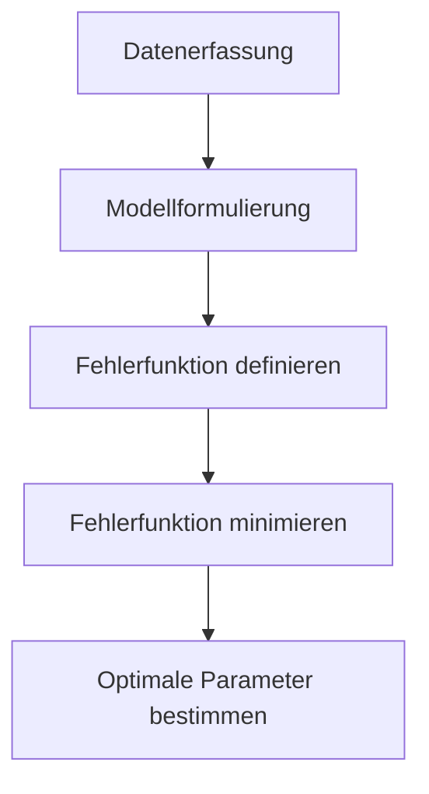
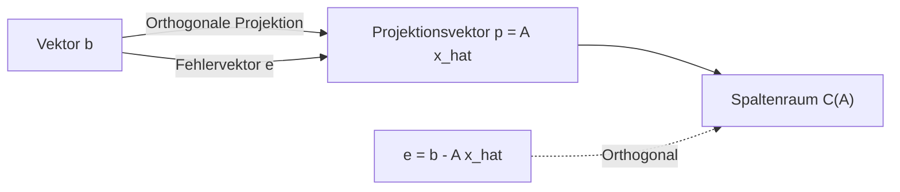

## 1. Einführung: Reale Daten und das "optimale" Modell

In der realen Welt beobachtete Daten enthalten fast immer "Rauschen" oder "Varianz". Um aus solchen Daten die zugrunde liegenden Regeln zu finden und die Zukunft vorherzusagen oder unbekannte Daten zu schätzen, müssen wir ein mathematisches Modell erstellen, das **am besten** zu den Daten passt.

Die grundlegendste Methode, die auch heute noch als Basis des modernen maschinellen Lernens eine extrem wichtige Rolle spielt, ist die **[Methode der kleinsten Quadrate](https://kenji.blog/de/p/method-of-least-squares/)** ([Method of Least Squares](https://kenji.blog/de/p/method-of-least-squares/)).

In diesem Artikel werden wir, anstatt nur Formeln auswendig zu lernen, tiefgründig untersuchen, **"warum diese Berechnung die am besten passende Gerade findet"**, und zwar aus der wunderbaren geometrischen Perspektive der linearen Algebra (orthogonale Projektion).

## 2. Intuitive Idee der [Methode der kleinsten Quadrate](https://kenji.blog/de/p/method-of-least-squares/)

Angenommen, wir haben $n$ Datenpunkte $(x_1, y_1), (x_2, y_2), \dots, (x_n, y_n)$. Wenn man diese Punkte in einem Streudiagramm aufträgt, liegen sie vielleicht nicht perfekt auf einer geraden Linie, folgen aber insgesamt dem Trend einer bestimmten Geraden.

Lassen Sie uns zu diesem Zeitpunkt die Gleichung der Geraden, die die Daten annähert, als $y = c + dx$ annehmen. (Hier ist der y-Achsenabschnitt $c$ und die Steigung $d$).

Für jeden Datenpunkt $x_i$ ist der von dieser Geraden vorhergesagte Wert $\hat{y}_i = c + d x_i$. Zwischen dem tatsächlichen Beobachtungswert $y_i$ und dem vorhergesagten Wert $\hat{y}_i$ tritt ein Fehler (Residuum) $e_i$ auf.

$$ e_i = y_i - \hat{y}_i = y_i - (c + d x_i) $$

Die [Methode der kleinsten Quadrate](https://kenji.blog/de/p/method-of-least-squares/) ist eine Technik, um die Parameter $c$ und $d$ zu finden, die die **Summe der quadratischen** Fehler minimieren. Die Summe der quadratischen Fehler $E$ ist wie folgt definiert:

$$ E = \sum_{i=1}^{n} e_i^2 = \sum_{i=1}^{n} (y_i - c - d x_i)^2 \quad (\text{Definition der Fehlerfunktion}) $$

Der Grund für das Quadrieren besteht darin, zu verhindern, dass sich positive und negative Fehler gegenseitig aufheben, und weil es den starken Vorteil hat, mathematisch differenzierbar und leicht handhabbar zu sein.



## 3. Formulierung mittels linearer Algebra und "unlösbaren Gleichungen"

Die wahre Schönheit der [Methode der kleinsten Quadrate](https://kenji.blog/de/p/method-of-least-squares/) zeigt sich, wenn wir dies in der Sprache von Matrizen und Vektoren, also der **linearen Algebra**, umschreiben.

Unter der Annahme, dass alle Datenpunkte perfekt auf der Geraden $y = c + dx$ liegen, erhalten wir die folgenden $n$ Gleichungen:

$$
\begin{cases}
c + d x_1 = y_1 \\\\
c + d x_2 = y_2 \\\\
\vdots \\\\
c + d x_n = y_n
\end{cases}
$$

Ausgedrückt in Matrixform erhalten wir:

$$
\begin{bmatrix}
1 & x_1 \\\\
1 & x_2 \\\\
\vdots & \vdots \\\\
1 & x_n
\end{bmatrix}
\begin{bmatrix}
c \\\\
d
\end{bmatrix}
=
\begin{bmatrix}
y_1 \\\\
y_2 \\\\
\vdots \\\\
y_n
\end{bmatrix}
$$

Wir schreiben dies einfach als $A\mathbf{x} = \mathbf{b}$. Hier ist:
- $A$ eine $n \times 2$ **Designmatrix**
- $\mathbf{x} = \begin{bmatrix} c \\\\ d \end{bmatrix}$ der **Parametervektor**, den wir finden wollen
- $\mathbf{b}$ der **Zielvariablenvektor** der beobachteten Werte

Wenn die Daten Varianz aufweisen (3 oder mehr Punkte liegen nicht auf einer geraden Linie), gibt es keine Lösung $\mathbf{x}$, die diese Gleichung $A\mathbf{x} = \mathbf{b}$ perfekt erfüllt. Das heißt, das Gleichungssystem ist **inkonsistent**.

## 4. Geometrische Perspektive: Spaltenraum und orthogonale Projektion

Was bedeutet es geometrisch, dass die Gleichung $A\mathbf{x} = \mathbf{b}$ nicht gelöst werden kann?

Die Multiplikation der Matrix $A$ mit dem Vektor $\mathbf{x}$ bedeutet, eine Linearkombination jedes Spaltenvektors von $A$ zu erstellen. Der Raum, der durch alle möglichen Linearkombinationen von $A$ aufgespannt wird, wird als **Spaltenraum** von $A$ bezeichnet und als $C(A)$ geschrieben.

$$ A\mathbf{x} \in C(A) $$

Das Fehlen einer Lösung bedeutet, dass der Vektor $\mathbf{b}$ **außerhalb** dieses Spaltenraums $C(A)$ liegt.

Was wir suchen, ist keine perfekte Lösung, sondern ein Vektor innerhalb von $C(A)$, der so nah wie möglich an $\mathbf{b}$ liegt. Nennen wir dies $A\hat{\mathbf{x}}$. Zu diesem Zeitpunkt ist der Abstand (zum Quadrat) zwischen dem Vektor $\mathbf{b}$ und $A\hat{\mathbf{x}}$ minimiert. Dies ist genau die [Methode der kleinsten Quadrate](https://kenji.blog/de/p/method-of-least-squares/).

Geometrisch gesehen ist der Punkt, der den kürzesten Abstand von einem bestimmten Punkt $\mathbf{b}$ im Raum zu einer bestimmten Ebene $C(A)$ angibt, nichts anderes als der **Fußpunkt des Lotes**, das von $\mathbf{b}$ auf $C(A)$ gefällt wird. Dies wird als **orthogonale Projektion** bezeichnet.

Wenn der Fehlervektor $\mathbf{e} = \mathbf{b} - A\hat{\mathbf{x}}$ ist, ist die Bedingung für den kürzesten Abstand, dass "der Fehlervektor $\mathbf{e}$ orthogonal zum Spaltenraum $C(A)$ ist".

Orthogonal zum Spaltenraum $C(A)$ zu sein bedeutet, orthogonal zu allen Spaltenvektoren von $A$ zu sein. Dies bedeutet, dass der Fehlervektor $\mathbf{e}$ zum **Linksnullraum** der transponierten Matrix $A^T$ der Matrix $A$ gehört. Das heißt:

$$ A^T \mathbf{e} = \mathbf{0} \quad (\text{Orthogonalitätsbedingung}) $$

## 5. Ableitung der Normalengleichung

Setzen wir $\mathbf{e} = \mathbf{b} - A\hat{\mathbf{x}}$ in die obige Orthogonalitätsbedingung ein.

$$ A^T (\mathbf{b} - A\hat{\mathbf{x}}) = \mathbf{0} $$
$$ A^T \mathbf{b} - A^T A \hat{\mathbf{x}} = \mathbf{0} $$

Durch Umstellen erhalten wir die folgende äußerst wichtige Gleichung.

$$ A^T A \hat{\mathbf{x}} = A^T \mathbf{b} \quad (\text{Normalengleichung}) $$

Diese Gleichung wird als **Normalengleichung** bezeichnet. Die ursprüngliche $A\mathbf{x} = \mathbf{b}$ hatte keine Lösung, aber diese Normalengleichung, die von links mit $A^T$ multipliziert wurde, hat immer eine Lösung. Wenn darüber hinaus die Spaltenvektoren von $A$ linear unabhängig sind, wird $A^T A$ invertierbar (hat eine inverse Matrix), und die optimale Lösung $\hat{\mathbf{x}}$ wird wie folgt eindeutig bestimmt:

$$ \hat{\mathbf{x}} = (A^T A)^{-1} A^T \mathbf{b} $$

Diese Formel ist eines der schönsten Ergebnisse in Statistik und maschinellem Lernen. Sie können diese Schlussfolgerung allein durch das geometrische Konzept der Orthogonalität ohne Verwendung von Infinitesimalrechnung erreichen.



## 6. Implementierungsbeispiel in Python

Lassen Sie uns dies tatsächlich mit einem Programm berechnen, nicht nur in der Theorie. Mit NumPy, einer numerischen Berechnungsbibliothek in Python, können Sie die Normalengleichung sehr einfach implementieren.

```python
import numpy as np

# Beispieldaten (x und y)
x_data = np.array([1, 2, 3, 4, 5])
y_data = np.array([2.1, 3.9, 6.2, 8.1, 9.8])

# Designmatrix A erstellen
# Kombinieren Sie Spalten von x_data und eine Spalte aus Einsen für den y-Achsenabschnitt
# Verwenden Sie np.c_, um entlang der Spaltenrichtung zu verketten
A = np.c_[np.ones(len(x_data)), x_data]
b = y_data

# Die Normalengleichung lösen: (A^T A) x_hat = A^T b
# A.T ist die Transponierte von A, @ steht für Matrixmultiplikation
A_T_A = A.T @ A
A_T_b = A.T @ b

# Das Lösen des Gleichungssystems mit np.linalg.solve
# ist numerisch stabiler als die direkte Berechnung der inversen Matrix
x_hat = np.linalg.solve(A_T_A, A_T_b)

c_hat, d_hat = x_hat
print(f"Optimaler y-Achsenabschnitt: {c_hat:.4f}")
print(f"Optimale Steigung: {d_hat:.4f}")
```

Die Ausführung dieses Codes berechnet den y-Achsenabschnitt und die Steigung der Geraden, die am besten zu den gegebenen Datenpunkten passt. Hinter den Kulissen wird genau die zuvor abgeleitete Matrixberechnung ausgeführt.

## 7. Fazit und zukünftige Entwicklung

Die [Methode der kleinsten Quadrate](https://kenji.blog/de/p/method-of-least-squares/) ist die stärkste und gebräuchlichste Technik zur Schätzung von Modellparametern aus Daten. Mit Kenntnissen der Infinitesimalrechnung kann sie als "der Punkt, an dem der Gradient der Fehlerfunktion 0 wird" abgeleitet werden, aber indem man sie aus der Perspektive der linearen Algebra als "orthogonale Projektion auf den Spaltenraum" versteht, tritt die Schönheit ihrer mathematischen Struktur hervor.

Diese Methode ist nicht auf einfache Geradenanpassung (einfache Regression) beschränkt. Durch Hinzufügen von Termen wie $x^2, x^3$ zu den Spalten der Designmatrix $A$ kann sie natürlich auf die **polynomielle Regression** erweitert werden, und sie kann auch zur **gewichteten [Methode der kleinsten Quadrate](https://kenji.blog/de/p/method-of-least-squares/)** entwickelt werden, die die Bedeutung jedes Datenpunkts gewichtet.

Als erster Schritt, um der Wahrheit hinter den Daten näher zu kommen, ist ein wesentliches Verständnis der [Methode der kleinsten Quadrate](https://kenji.blog/de/p/method-of-least-squares/) von unschätzbarem Wert.
