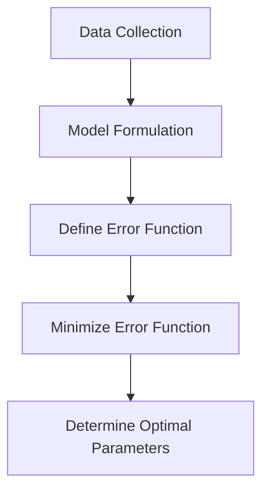
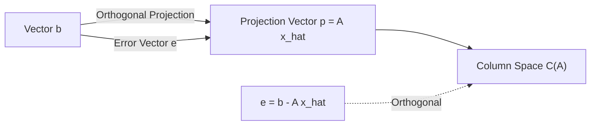

## 1. Introduction: Real-world Data and the "Optimal" Model

Data observed in the real world almost always contains "noise" or "variance". To find the underlying rules from such data and predict the future or estimate unknown data, we need to build a mathematical model that **best fits** the data.

The most fundamental method, which still plays an extremely important role as the foundation of modern machine learning, is the **[Method of Least Squares](https://kenji.blog/en/p/method-of-least-squares/)**.

In this article, rather than just memorizing formulas, we will deeply explore **"why this calculation finds the best fitting line"** from the beautiful geometric perspective of linear algebra (orthogonal projection).

## 2. Intuitive Idea of the [Method of Least Squares](https://kenji.blog/en/p/method-of-least-squares/)

Suppose we have $n$ data points $(x_1, y_1), (x_2, y_2), \dots, (x_n, y_n)$. When plotting these points on a scatter plot, they may not line up perfectly straight, but overall they seem to follow the trend of a certain line.

At this time, let the equation of the line that approximates the data be $y = c + dx$. (Here, the intercept is $c$ and the slope is $d$).

For each data point $x_i$, the value predicted by this line is $\hat{y}_i = c + d x_i$. An error (residual) $e_i$ occurs between the actual observed value $y_i$ and the predicted value $\hat{y}_i$.

$$ e_i = y_i - \hat{y}_i = y_i - (c + d x_i) $$

The [Method of Least Squares](https://kenji.blog/en/p/method-of-least-squares/) is a technique to find the parameters $c$ and $d$ that minimize the **sum of squared** errors. The sum of squared errors $E$ is defined as follows:

$$ E = \sum_{i=1}^{n} e_i^2 = \sum_{i=1}^{n} (y_i - c - d x_i)^2 \quad (\text{Definition of error function}) $$

The reason for squaring is to prevent positive and negative errors from canceling each other out, and because it has the powerful advantage of being mathematically differentiable and easy to handle.



## 3. Formulation using Linear Algebra and "Unsolvable Equations"

The true beauty of the method of least squares emerges when we rewrite this using the language of matrices and vectors, that is, **linear algebra**.

Assuming all data points lie perfectly on the line $y = c + dx$, we get the following $n$ equations:

$$
\begin{cases}
c + d x_1 = y_1 \\\\
c + d x_2 = y_2 \\\\
\vdots \\\\
c + d x_n = y_n
\end{cases}
$$

Expressing this in matrix form, we get:

$$
\begin{bmatrix}
1 & x_1 \\\\
1 & x_2 \\\\
\vdots & \vdots \\\\
1 & x_n
\end{bmatrix}
\begin{bmatrix}
c \\\\
d
\end{bmatrix}
=
\begin{bmatrix}
y_1 \\\\
y_2 \\\\
\vdots \\\\
y_n
\end{bmatrix}
$$

We write this simply as $A\mathbf{x} = \mathbf{b}$. Here,
- $A$ is an $n \times 2$ **Design Matrix**
- $\mathbf{x} = \begin{bmatrix} c \\\\ d \end{bmatrix}$ is the **parameter vector** we want to find
- $\mathbf{b}$ is the **target variable vector** of observed values

When the data has variance (3 or more points are not on a straight line), there is no solution $\mathbf{x}$ that perfectly satisfies this equation $A\mathbf{x} = \mathbf{b}$. That is, the system of equations is **inconsistent**.

## 4. Geometric Perspective: Column Space and Orthogonal Projection

What does it geometrically mean that the equation $A\mathbf{x} = \mathbf{b}$ cannot be solved?

Multiplying matrix $A$ by vector $\mathbf{x}$ means creating a linear combination of each column vector of $A$. The space created by all possible linear combinations of $A$ is called the **Column Space** of $A$, and is written as $C(A)$.

$$ A\mathbf{x} \in C(A) $$

The absence of a solution means that the vector $\mathbf{b}$ lies **outside** this column space $C(A)$.

What we are looking for is not a perfect solution, but a vector within $C(A)$ that is as close to $\mathbf{b}$ as possible. Let's call this $A\hat{\mathbf{x}}$. At this time, the distance (squared) between the vector $\mathbf{b}$ and $A\hat{\mathbf{x}}$ is minimized. This is exactly the method of least squares.

Geometrically, the point that gives the shortest distance from a certain point $\mathbf{b}$ in space to a certain plane $C(A)$ is nothing but the **foot of the perpendicular** dropped from $\mathbf{b}$ to $C(A)$. This is called **Orthogonal Projection**.

Letting the error vector be $\mathbf{e} = \mathbf{b} - A\hat{\mathbf{x}}$, the condition for the shortest distance is that "the error vector $\mathbf{e}$ is orthogonal to the column space $C(A)$".

Being orthogonal to the column space $C(A)$ means being orthogonal to all column vectors of $A$. This means that the error vector $\mathbf{e}$ belongs to the **Left Nullspace** of the transpose matrix $A^T$ of matrix $A$. That is,

$$ A^T \mathbf{e} = \mathbf{0} \quad (\text{Orthogonality condition}) $$

## 5. Derivation of the Normal Equation

Let's substitute $\mathbf{e} = \mathbf{b} - A\hat{\mathbf{x}}$ into the orthogonality condition above.

$$ A^T (\mathbf{b} - A\hat{\mathbf{x}}) = \mathbf{0} $$
$$ A^T \mathbf{b} - A^T A \hat{\mathbf{x}} = \mathbf{0} $$

Rearranging this, we obtain the following extremely important equation.

$$ A^T A \hat{\mathbf{x}} = A^T \mathbf{b} \quad (\text{Normal Equation}) $$

This equation is called the **Normal Equation**. The original $A\mathbf{x} = \mathbf{b}$ had no solution, but this normal equation multiplied by $A^T$ from the left on both sides always has a solution. Furthermore, if the column vectors of $A$ are linearly independent, $A^T A$ becomes invertible (has an inverse matrix), and the optimal solution $\hat{\mathbf{x}}$ is uniquely determined as follows:

$$ \hat{\mathbf{x}} = (A^T A)^{-1} A^T \mathbf{b} $$

This formula is one of the most beautiful results in statistics and machine learning. You can reach this conclusion solely through the geometric concept of orthogonality without using calculus.



## 6. Implementation Example in Python

Let's actually calculate it with a program, not just theory. Using NumPy, a numerical computation library in Python, you can implement the normal equation very easily.

```python
import numpy as np

# Sample data (x and y)
x_data = np.array([1, 2, 3, 4, 5])
y_data = np.array([2.1, 3.9, 6.2, 8.1, 9.8])

# Create Design Matrix A
# Combine columns of x_data and a column of 1s for the intercept
# Use np.c_ to concatenate along the column direction
A = np.c_[np.ones(len(x_data)), x_data]
b = y_data

# Solve the Normal Equation: (A^T A) x_hat = A^T b
# A.T is the transpose of A, @ represents matrix multiplication
A_T_A = A.T @ A
A_T_b = A.T @ b

# Solving the system of equations using np.linalg.solve
# is numerically more stable than calculating the inverse matrix directly
x_hat = np.linalg.solve(A_T_A, A_T_b)

c_hat, d_hat = x_hat
print(f"Optimal Intercept: {c_hat:.4f}")
print(f"Optimal Slope: {d_hat:.4f}")
```

Running this code calculates the intercept and slope of the line that best fits the given data points. Behind the scenes, the matrix calculation derived earlier is executed exactly as is.

## 7. Conclusion and Future Development

The method of least squares is the most powerful and standard technique for estimating model parameters from data. Using the knowledge of calculus, it can be derived as "the point where the gradient of the error function becomes 0", but by understanding it from the perspective of linear algebra as an "orthogonal projection onto the column space", the beauty of its mathematical structure stands out.

This method is not limited to simple line fitting (simple regression). By adding terms like $x^2, x^3$ to the columns of the design matrix $A$, it can be naturally extended to **Polynomial Regression**, and it can also be developed into **Weighted Least Squares**, which weights the importance of each data point.

As a first step to getting closer to the truth behind the data, an essential understanding of the method of least squares has immeasurable value.
