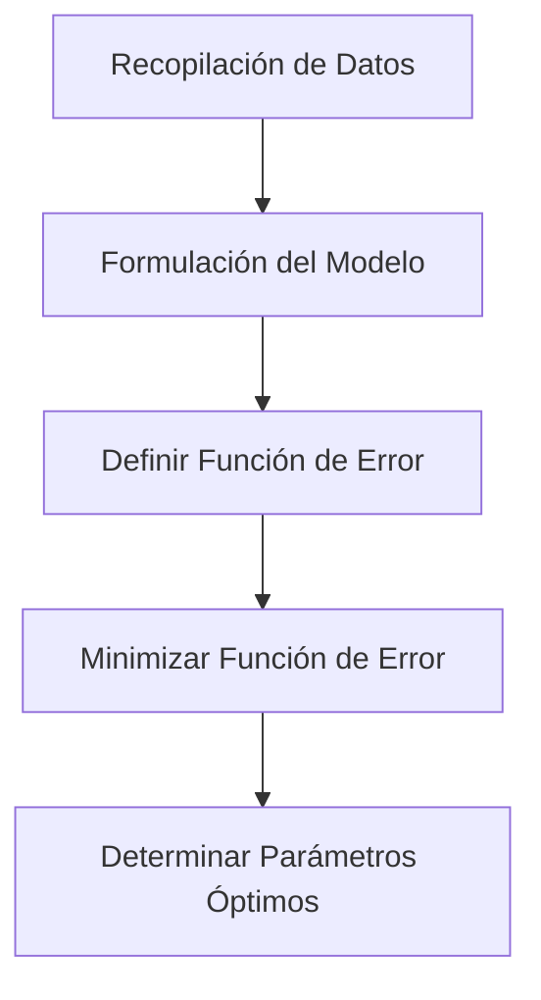

## 1. Introducción: Datos del Mundo Real y el Modelo "Óptimo"

Los datos observados en el mundo real casi siempre contienen "ruido" o "varianza". Para encontrar las reglas subyacentes de dichos datos y predecir el futuro o estimar datos desconocidos, necesitamos construir un modelo matemático que **mejor se ajuste** a los datos.

El método más fundamental, que aún juega un papel extremadamente importante como la base del aprendizaje automático moderno, es el **[Método de Mínimos Cuadrados](https://kenji.blog/es/p/method-of-least-squares/)** ([Method of Least Squares](https://kenji.blog/es/p/method-of-least-squares/)).

En este artículo, en lugar de simplemente memorizar fórmulas, exploraremos profundamente **"por qué este cálculo encuentra la línea de mejor ajuste"** desde la hermosa perspectiva geométrica del álgebra lineal (proyección ortogonal).

## 2. Idea Intuitiva del [Método de Mínimos Cuadrados](https://kenji.blog/es/p/method-of-least-squares/)

Supongamos que tenemos $n$ puntos de datos $(x_1, y_1), (x_2, y_2), \dots, (x_n, y_n)$. Al trazar estos puntos en un diagrama de dispersión, es posible que no se alineen perfectamente rectos, pero en general parecen seguir la tendencia de una cierta línea.

En este momento, sea la ecuación de la línea que aproxima los datos $y = c + dx$. (Aquí, la intersección es $c$ y la pendiente es $d$).

Para cada punto de datos $x_i$, el valor predicho por esta línea es $\hat{y}_i = c + d x_i$. Un error (residuo) $e_i$ ocurre entre el valor observado real $y_i$ y el valor predicho $\hat{y}_i$.

$$ e_i = y_i - \hat{y}_i = y_i - (c + d x_i) $$

El [Método de Mínimos Cuadrados](https://kenji.blog/es/p/method-of-least-squares/) es una técnica para encontrar los parámetros $c$ y $d$ que minimizan la **suma de los cuadrados** de los errores. La suma de los errores al cuadrado $E$ se define de la siguiente manera:

$$ E = \sum_{i=1}^{n} e_i^2 = \sum_{i=1}^{n} (y_i - c - d x_i)^2 \quad (\text{Definición de la función de error}) $$

La razón para cuadrar es evitar que los errores positivos y negativos se cancelen entre sí, y porque tiene la poderosa ventaja de ser matemáticamente diferenciable y fácil de manejar.



## 3. Formulación usando Álgebra Lineal y "Ecuaciones Sin Solución"

La verdadera belleza del método de mínimos cuadrados emerge cuando reescribimos esto utilizando el lenguaje de matrices y vectores, es decir, **álgebra lineal**.

Suponiendo que todos los puntos de datos se encuentran perfectamente en la línea $y = c + dx$, obtenemos las siguientes $n$ ecuaciones:

$$
\begin{cases}
c + d x_1 = y_1 \\\\
c + d x_2 = y_2 \\\\
\vdots \\\\
c + d x_n = y_n
\end{cases}
$$

Expresando esto en forma matricial, obtenemos:

$$
\begin{bmatrix}
1 & x_1 \\\\
1 & x_2 \\\\
\vdots & \vdots \\\\
1 & x_n
\end{bmatrix}
\begin{bmatrix}
c \\\\
d
\end{bmatrix}
=
\begin{bmatrix}
y_1 \\\\
y_2 \\\\
\vdots \\\\
y_n
\end{bmatrix}
$$

Escribimos esto simplemente como $A\mathbf{x} = \mathbf{b}$. Aquí,
- $A$ es una **Matriz de Diseño** de $n \times 2$
- $\mathbf{x} = \begin{bmatrix} c \\\\ d \end{bmatrix}$ es el **vector de parámetros** que queremos encontrar
- $\mathbf{b}$ es el **vector de variables objetivo** de los valores observados

Cuando los datos tienen varianza (3 o más puntos no están en una línea recta), no hay solución $\mathbf{x}$ que satisfaga perfectamente esta ecuación $A\mathbf{x} = \mathbf{b}$. Es decir, el sistema de ecuaciones es **inconsistente**.

## 4. Perspectiva Geométrica: Espacio de Columnas y Proyección Ortogonal

¿Qué significa geométricamente que la ecuación $A\mathbf{x} = \mathbf{b}$ no se puede resolver?

Multiplicar la matriz $A$ por el vector $\mathbf{x}$ significa crear una combinación lineal de cada vector columna de $A$. El espacio creado por todas las posibles combinaciones lineales de $A$ se llama el **Espacio de Columnas** de $A$, y se escribe como $C(A)$.

$$ A\mathbf{x} \in C(A) $$

La ausencia de una solución significa que el vector $\mathbf{b}$ se encuentra **fuera** de este espacio de columnas $C(A)$.

Lo que estamos buscando no es una solución perfecta, sino un vector dentro de $C(A)$ que esté lo más cerca posible de $\mathbf{b}$. Llamemos a esto $A\hat{\mathbf{x}}$. En este momento, la distancia (al cuadrado) entre el vector $\mathbf{b}$ y $A\hat{\mathbf{x}}$ se minimiza. Esto es exactamente el método de mínimos cuadrados.

Geométricamente, el punto que da la distancia más corta desde un cierto punto $\mathbf{b}$ en el espacio a un cierto plano $C(A)$ no es más que el **pie de la perpendicular** caída desde $\mathbf{b}$ a $C(A)$. Esto se llama **Proyección Ortogonal**.

Dejando que el vector de error sea $\mathbf{e} = \mathbf{b} - A\hat{\mathbf{x}}$, la condición para la distancia más corta es que "el vector de error $\mathbf{e}$ es ortogonal al espacio de columnas $C(A)$".

Ser ortogonal al espacio de columnas $C(A)$ significa ser ortogonal a todos los vectores columna de $A$. Esto significa que el vector de error $\mathbf{e}$ pertenece al **Espacio Nulo Izquierdo** de la matriz transpuesta $A^T$ de la matriz $A$. Es decir,

$$ A^T \mathbf{e} = \mathbf{0} \quad (\text{Condición de ortogonalidad}) $$

## 5. Derivación de la Ecuación Normal

Sustituyamos $\mathbf{e} = \mathbf{b} - A\hat{\mathbf{x}}$ en la condición de ortogonalidad anterior.

$$ A^T (\mathbf{b} - A\hat{\mathbf{x}}) = \mathbf{0} $$
$$ A^T \mathbf{b} - A^T A \hat{\mathbf{x}} = \mathbf{0} $$

Reordenando esto, obtenemos la siguiente ecuación extremadamente importante.

$$ A^T A \hat{\mathbf{x}} = A^T \mathbf{b} \quad (\text{Ecuación Normal}) $$

Esta ecuación se llama la **Ecuación Normal**. El original $A\mathbf{x} = \mathbf{b}$ no tenía solución, pero esta ecuación normal multiplicada por $A^T$ desde la izquierda en ambos lados siempre tiene una solución. Además, si los vectores columna de $A$ son linealmente independientes, $A^T A$ se vuelve invertible (tiene una matriz inversa), y la solución óptima $\hat{\mathbf{x}}$ se determina de forma única de la siguiente manera:

$$ \hat{\mathbf{x}} = (A^T A)^{-1} A^T \mathbf{b} $$

Esta fórmula es uno de los resultados más hermosos de la estadística y el aprendizaje automático. Puede llegar a esta conclusión basándose únicamente en el concepto geométrico de ortogonalidad sin usar cálculo.

```mermaid
flowchart LR
    b["Vector b"] -->|"Proyección Ortogonal"| p["Vector de Proyección p = A x_hat"]
    p --> C["Espacio de Columnas C("A")"]
    b -->|"Vector de Error e"| p
    e["e = b - A x_hat"] -.->|"Ortogonal"| C
```

## 6. Ejemplo de Implementación en Python

Vamos a calcularlo realmente con un programa, no solo en teoría. Usando NumPy, una biblioteca de computación numérica en Python, puede implementar la ecuación normal muy fácilmente.

```python
import numpy as np

# Datos de muestra (x e y)
x_data = np.array([1, 2, 3, 4, 5])
y_data = np.array([2.1, 3.9, 6.2, 8.1, 9.8])

# Crear Matriz de Diseño A
# Combine columnas de x_data y una columna de 1s para la intersección
# Use np.c_ para concatenar a lo largo de la dirección de la columna
A = np.c_[np.ones(len(x_data)), x_data]
b = y_data

# Resolver la Ecuación Normal: (A^T A) x_hat = A^T b
# A.T es la transpuesta de A, @ representa la multiplicación de matrices
A_T_A = A.T @ A
A_T_b = A.T @ b

# Resolver el sistema de ecuaciones usando np.linalg.solve
# es numéricamente más estable que calcular la matriz inversa directamente
x_hat = np.linalg.solve(A_T_A, A_T_b)

c_hat, d_hat = x_hat
print(f"Intersección Óptima: {c_hat:.4f}")
print(f"Pendiente Óptima: {d_hat:.4f}")
```

La ejecución de este código calcula la intersección y la pendiente de la línea que mejor se ajusta a los puntos de datos proporcionados. Detrás de escena, el cálculo de la matriz derivado anteriormente se ejecuta exactamente como es.

## 7. Conclusión y Desarrollo Futuro

El método de mínimos cuadrados es la técnica más poderosa y estándar para estimar los parámetros del modelo a partir de los datos. Usando el conocimiento del cálculo, puede derivarse como "el punto donde el gradiente de la función de error se convierte en 0", pero al entenderlo desde la perspectiva del álgebra lineal como una "proyección ortogonal sobre el espacio de columnas", destaca la belleza de su estructura matemática.

Este método no se limita al ajuste de líneas simples (regresión simple). Al agregar términos como $x^2, x^3$ a las columnas de la matriz de diseño $A$, puede extenderse naturalmente a la **Regresión Polinomial**, y también puede desarrollarse en el **[Método de Mínimos Cuadrados](https://kenji.blog/es/p/method-of-least-squares/) Ponderados**, que pondera la importancia de cada punto de datos.

Como primer paso para acercarse a la verdad detrás de los datos, una comprensión esencial del método de mínimos cuadrados tiene un valor inmensurable.
