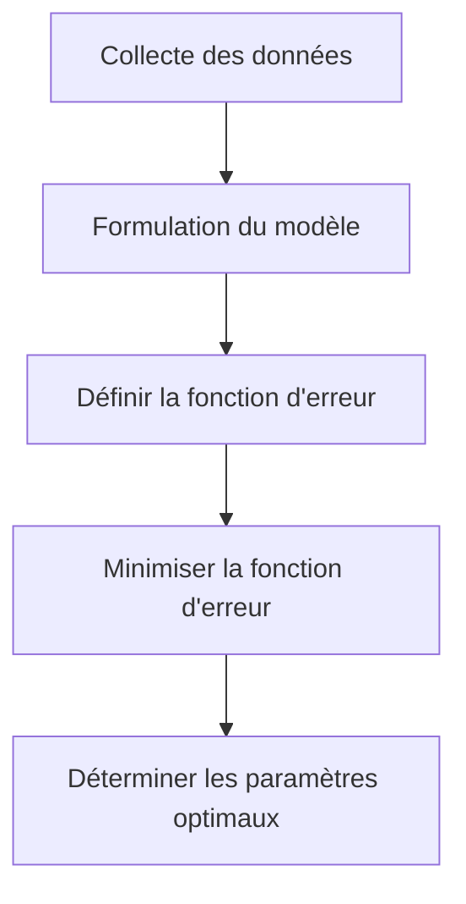
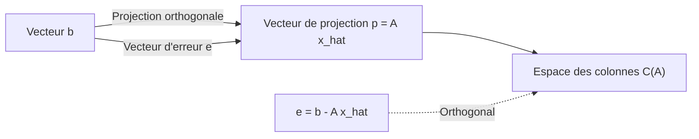

## 1. Introduction : Les données du monde réel et le modèle "optimal"

Les données observées dans le monde réel contiennent presque toujours du "bruit" ou de la "variance". Pour trouver les règles sous-jacentes de ces données et prédire l'avenir ou estimer des données inconnues, nous devons construire un modèle mathématique qui s'**ajuste le mieux** aux données.

La méthode la plus fondamentale, qui joue toujours un rôle extrêmement important en tant que base de l'apprentissage automatique moderne, est la **[Méthode des moindres carrés](https://kenji.blog/fr/p/method-of-least-squares/)** ([Method of Least Squares](https://kenji.blog/fr/p/method-of-least-squares/)).

Dans cet article, plutôt que de simplement mémoriser des formules, nous explorerons en profondeur **"pourquoi ce calcul trouve la droite qui s'ajuste le mieux"** du point de vue géométrique magnifique de l'algèbre linéaire (projection orthogonale).

## 2. Idée intuitive de la méthode des moindres carrés

Supposons que nous ayons $n$ points de données $(x_1, y_1), (x_2, y_2), \dots, (x_n, y_n)$. Lorsque l'on trace ces points sur un nuage de points, ils peuvent ne pas s'aligner parfaitement de manière droite, mais dans l'ensemble ils semblent suivre la tendance d'une certaine ligne.

À ce moment, soit l'équation de la droite qui approche les données $y = c + dx$. (Ici, l'ordonnée à l'origine est $c$ et la pente est $d$).

Pour chaque point de données $x_i$, la valeur prédite par cette droite est $\hat{y}_i = c + d x_i$. Une erreur (résidu) $e_i$ se produit entre la valeur observée réelle $y_i$ et la valeur prédite $\hat{y}_i$.

$$ e_i = y_i - \hat{y}_i = y_i - (c + d x_i) $$

La méthode des moindres carrés est une technique pour trouver les paramètres $c$ et $d$ qui minimisent la **somme des carrés** des erreurs. La somme des erreurs au carré $E$ est définie comme suit :

$$ E = \sum_{i=1}^{n} e_i^2 = \sum_{i=1}^{n} (y_i - c - d x_i)^2 \quad (\text{Définition de la fonction d'erreur}) $$

La raison de l'élévation au carré est d'empêcher les erreurs positives et négatives de s'annuler mutuellement, et parce que cela présente l'avantage puissant d'être mathématiquement différentiable et facile à manipuler.



## 3. Formulation utilisant l'algèbre linéaire et "équations insolubles"

La véritable beauté de la méthode des moindres carrés émerge lorsque nous réécrivons cela en utilisant le langage des matrices et des vecteurs, c'est-à-dire l'**algèbre linéaire**.

En supposant que tous les points de données se trouvent parfaitement sur la ligne $y = c + dx$, nous obtenons les $n$ équations suivantes :

$$
\begin{cases}
c + d x_1 = y_1 \\\\
c + d x_2 = y_2 \\\\
\vdots \\\\
c + d x_n = y_n
\end{cases}
$$

En exprimant cela sous forme matricielle, nous obtenons :

$$
\begin{bmatrix}
1 & x_1 \\\\
1 & x_2 \\\\
\vdots & \vdots \\\\
1 & x_n
\end{bmatrix}
\begin{bmatrix}
c \\\\
d
\end{bmatrix}
=
\begin{bmatrix}
y_1 \\\\
y_2 \\\\
\vdots \\\\
y_n
\end{bmatrix}
$$

Nous écrivons cela simplement comme $A\mathbf{x} = \mathbf{b}$. Ici,
- $A$ est une **Matrice de conception** de $n \times 2$
- $\mathbf{x} = \begin{bmatrix} c \\\\ d \end{bmatrix}$ est le **vecteur de paramètres** que nous voulons trouver
- $\mathbf{b}$ est le **vecteur de variable cible** des valeurs observées

Lorsque les données présentent une variance (3 points ou plus ne sont pas sur une ligne droite), il n'y a pas de solution $\mathbf{x}$ qui satisfait parfaitement cette équation $A\mathbf{x} = \mathbf{b}$. C'est-à-dire que le système d'équations est **inconsistant**.

## 4. Perspective géométrique : Espace des colonnes et projection orthogonale

Que signifie géométriquement que l'équation $A\mathbf{x} = \mathbf{b}$ ne peut pas être résolue ?

Multiplier la matrice $A$ par le vecteur $\mathbf{x}$ signifie créer une combinaison linéaire de chaque vecteur colonne de $A$. L'espace créé par toutes les combinaisons linéaires possibles de $A$ s'appelle l'**Espace des colonnes** de $A$, et s'écrit $C(A)$.

$$ A\mathbf{x} \in C(A) $$

L'absence d'une solution signifie que le vecteur $\mathbf{b}$ se trouve **en dehors** de cet espace des colonnes $C(A)$.

Ce que nous recherchons n'est pas une solution parfaite, mais un vecteur dans $C(A)$ qui soit le plus proche possible de $\mathbf{b}$. Appelons cela $A\hat{\mathbf{x}}$. À ce moment, la distance (au carré) entre le vecteur $\mathbf{b}$ et $A\hat{\mathbf{x}}$ est minimisée. C'est exactement la méthode des moindres carrés.

Géométriquement, le point qui donne la distance la plus courte d'un certain point $\mathbf{b}$ dans l'espace à un certain plan $C(A)$ n'est rien d'autre que le **pied de la perpendiculaire** abaissée de $\mathbf{b}$ vers $C(A)$. Cela s'appelle la **Projection orthogonale**.

En laissant le vecteur d'erreur être $\mathbf{e} = \mathbf{b} - A\hat{\mathbf{x}}$, la condition pour la distance la plus courte est que "le vecteur d'erreur $\mathbf{e}$ soit orthogonal à l'espace des colonnes $C(A)$".

Être orthogonal à l'espace des colonnes $C(A)$ signifie être orthogonal à tous les vecteurs colonnes de $A$. Cela signifie que le vecteur d'erreur $\mathbf{e}$ appartient à l'**Espace nul à gauche** de la matrice transposée $A^T$ de la matrice $A$. C'est-à-dire,

$$ A^T \mathbf{e} = \mathbf{0} \quad (\text{Condition d'orthogonalité}) $$

## 5. Dérivation de l'équation normale

Substituons $\mathbf{e} = \mathbf{b} - A\hat{\mathbf{x}}$ dans la condition d'orthogonalité ci-dessus.

$$ A^T (\mathbf{b} - A\hat{\mathbf{x}}) = \mathbf{0} $$
$$ A^T \mathbf{b} - A^T A \hat{\mathbf{x}} = \mathbf{0} $$

En réorganisant cela, nous obtenons l'équation extrêmement importante suivante.

$$ A^T A \hat{\mathbf{x}} = A^T \mathbf{b} \quad (\text{Équation normale}) $$

Cette équation s'appelle l'**Équation normale**. L'original $A\mathbf{x} = \mathbf{b}$ n'avait pas de solution, mais cette équation normale multipliée par $A^T$ par la gauche des deux côtés a toujours une solution. De plus, si les vecteurs colonnes de $A$ sont linéairement indépendants, $A^T A$ devient inversible (possède une matrice inverse), et la solution optimale $\hat{\mathbf{x}}$ est déterminée de manière unique comme suit :

$$ \hat{\mathbf{x}} = (A^T A)^{-1} A^T \mathbf{b} $$

Cette formule est l'un des plus beaux résultats des statistiques et de l'apprentissage automatique. Vous pouvez arriver à cette conclusion uniquement grâce au concept géométrique de l'orthogonalité sans utiliser le calcul différentiel.



## 6. Exemple d'implémentation en Python

Calculons cela réellement avec un programme, pas seulement en théorie. En utilisant NumPy, une bibliothèque de calcul numérique en Python, vous pouvez implémenter l'équation normale très facilement.

```python
import numpy as np

# Données d'échantillon (x et y)
x_data = np.array([1, 2, 3, 4, 5])
y_data = np.array([2.1, 3.9, 6.2, 8.1, 9.8])

# Créer la matrice de conception A
# Combiner les colonnes de x_data et une colonne de 1 pour l'ordonnée à l'origine
# Utiliser np.c_ pour concaténer dans la direction de la colonne
A = np.c_[np.ones(len(x_data)), x_data]
b = y_data

# Résoudre l'équation normale : (A^T A) x_hat = A^T b
# A.T est la transposée de A, @ représente la multiplication matricielle
A_T_A = A.T @ A
A_T_b = A.T @ b

# Résoudre le système d'équations en utilisant np.linalg.solve
# est numériquement plus stable que de calculer la matrice inverse directement
x_hat = np.linalg.solve(A_T_A, A_T_b)

c_hat, d_hat = x_hat
print(f"Ordonnée à l'origine optimale : {c_hat:.4f}")
print(f"Pente optimale : {d_hat:.4f}")
```

L'exécution de ce code calcule l'ordonnée à l'origine et la pente de la ligne qui s'ajuste le mieux aux points de données donnés. En arrière-plan, le calcul matriciel dérivé précédemment est exécuté tel quel.

## 7. Conclusion et développement futur

La méthode des moindres carrés est la technique la plus puissante et la plus standard pour estimer les paramètres d'un modèle à partir de données. En utilisant les connaissances du calcul, elle peut être dérivée comme "le point où le gradient de la fonction d'erreur devient 0", mais en la comprenant du point de vue de l'algèbre linéaire comme une "projection orthogonale sur l'espace des colonnes", la beauté de sa structure mathématique ressort.

Cette méthode ne se limite pas à un simple ajustement de ligne (régression simple). En ajoutant des termes tels que $x^2, x^3$ aux colonnes de la matrice de conception $A$, elle peut être naturellement étendue à la **Régression polynomiale**, et elle peut également être développée en **[Méthode des moindres carrés](https://kenji.blog/fr/p/method-of-least-squares/) pondérés**, qui pondère l'importance de chaque point de données.

En tant que première étape pour se rapprocher de la vérité derrière les données, une compréhension essentielle de la méthode des moindres carrés a une valeur inestimable.
