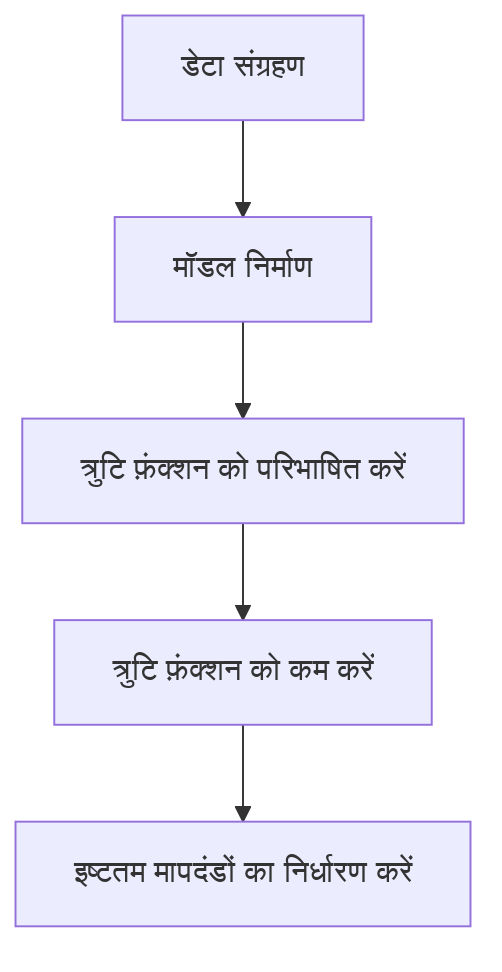
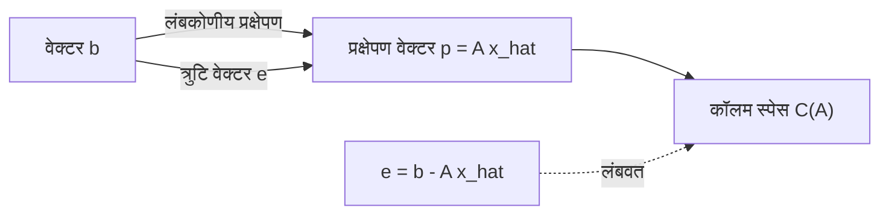

## 1. परिचय: वास्तविक दुनिया का डेटा और "इष्टतम" मॉडल

वास्तविक दुनिया में देखे गए डेटा में लगभग हमेशा "शोर" या "भिन्नता" होती है। ऐसे डेटा से अंतर्निहित नियम खोजने और भविष्य की भविष्यवाणी करने या अज्ञात डेटा का अनुमान लगाने के लिए, हमें एक गणितीय मॉडल बनाने की आवश्यकता है जो डेटा के लिए **सबसे उपयुक्त** हो।

सबसे बुनियादी विधि, जो अभी भी आधुनिक मशीन लर्निंग की नींव के रूप में अत्यंत महत्वपूर्ण भूमिका निभाती है, **[न्यूनतम वर्ग विधि](https://kenji.blog/hi/p/method-of-least-squares/)** ([Method of Least Squares](https://kenji.blog/hi/p/method-of-least-squares/)) है।

इस लेख में, केवल सूत्रों को याद करने के बजाय, हम रैखिक बीजगणित (लंबकोणीय प्रक्षेपण) के सुंदर ज्यामितीय दृष्टिकोण से गहराई से अन्वेषण करेंगे कि **"यह गणना सबसे उपयुक्त रेखा को क्यों ढूंढती है"**।

## 2. [न्यूनतम वर्ग विधि](https://kenji.blog/hi/p/method-of-least-squares/) का सहज विचार

मान लें कि हमारे पास $n$ डेटा बिंदु $(x_1, y_1), (x_2, y_2), \dots, (x_n, y_n)$ हैं। इन बिंदुओं को स्कैटर प्लॉट पर प्लॉट करते समय, हो सकता है कि वे पूरी तरह से सीधे न हों, लेकिन कुल मिलाकर वे एक निश्चित रेखा की प्रवृत्ति का पालन करते हैं।

इस समय, उस रेखा का समीकरण जो डेटा का अनुमान लगाता है, $y = c + dx$ होने दें। (यहाँ, अवरोध (intercept) $c$ है और ढलान (slope) $d$ है)।

प्रत्येक डेटा बिंदु $x_i$ के लिए, इस रेखा द्वारा अनुमानित मूल्य $\hat{y}_i = c + d x_i$ है। वास्तविक देखे गए मूल्य $y_i$ और अनुमानित मूल्य $\hat{y}_i$ के बीच एक त्रुटि (अवशिष्ट) $e_i$ होती है।

$$ e_i = y_i - \hat{y}_i = y_i - (c + d x_i) $$

[न्यूनतम वर्ग विधि](https://kenji.blog/hi/p/method-of-least-squares/) मापदंडों $c$ और $d$ को खोजने की एक तकनीक है जो त्रुटियों के **वर्गों के योग** को कम करती है। वर्ग त्रुटियों का योग $E$ निम्नानुसार परिभाषित किया गया है:

$$ E = \sum_{i=1}^{n} e_i^2 = \sum_{i=1}^{n} (y_i - c - d x_i)^2 \quad (\text{त्रुटि फ़ंक्शन की परिभाषा}) $$

वर्ग करने का कारण सकारात्मक और नकारात्मक त्रुटियों को एक-दूसरे को रद्द करने से रोकना है, और क्योंकि इसका गणितीय रूप से भिन्न और संभालने में आसान होने का शक्तिशाली लाभ है।



## 3. रैखिक बीजगणित और "अनसुलझे समीकरणों" का उपयोग करके निर्माण

न्यूनतम वर्गों की विधि की सच्ची सुंदरता तब सामने आती है जब हम इसे मैट्रिक्स और वैक्टर की भाषा, यानी **रैखिक बीजगणित** का उपयोग करके फिर से लिखते हैं।

यह मानते हुए कि सभी डेटा बिंदु पूरी तरह से $y = c + dx$ लाइन पर हैं, हमें निम्नलिखित $n$ समीकरण मिलते हैं:

$$
\begin{cases}
c + d x_1 = y_1 \\\\
c + d x_2 = y_2 \\\\
\vdots \\\\
c + d x_n = y_n
\end{cases}
$$

इसे मैट्रिक्स रूप में व्यक्त करने पर, हमें मिलता है:

$$
\begin{bmatrix}
1 & x_1 \\\\
1 & x_2 \\\\
\vdots & \vdots \\\\
1 & x_n
\end{bmatrix}
\begin{bmatrix}
c \\\\
d
\end{bmatrix}
=
\begin{bmatrix}
y_1 \\\\
y_2 \\\\
\vdots \\\\
y_n
\end{bmatrix}
$$

हम इसे केवल $A\mathbf{x} = \mathbf{b}$ के रूप में लिखते हैं। यहाँ,
- $A$ एक $n \times 2$ **डिज़ाइन मैट्रिक्स** है
- $\mathbf{x} = \begin{bmatrix} c \\\\ d \end{bmatrix}$ वह **पैरामीटर वेक्टर** है जिसे हम खोजना चाहते हैं
- $\mathbf{b}$ देखे गए मूल्यों का **लक्ष्य चर वेक्टर** है

जब डेटा में भिन्नता होती है (3 या अधिक बिंदु सीधी रेखा में नहीं होते हैं), तो कोई समाधान $\mathbf{x}$ नहीं होता है जो इस समीकरण $A\mathbf{x} = \mathbf{b}$ को पूरी तरह से संतुष्ट करता हो। अर्थात्, समीकरणों की प्रणाली **असंगत** है।

## 4. ज्यामितीय परिप्रेक्ष्य: कॉलम स्पेस और लंबकोणीय प्रक्षेपण

ज्यामितीय रूप से इसका क्या अर्थ है कि समीकरण $A\mathbf{x} = \mathbf{b}$ हल नहीं किया जा सकता है?

वेक्टर $\mathbf{x}$ द्वारा मैट्रिक्स $A$ को गुणा करने का अर्थ है $A$ के प्रत्येक कॉलम वेक्टर का रैखिक संयोजन बनाना। $A$ के सभी संभावित रैखिक संयोजनों द्वारा बनाए गए स्थान को $A$ का **कॉलम स्पेस** कहा जाता है, और इसे $C(A)$ के रूप में लिखा जाता है।

$$ A\mathbf{x} \in C(A) $$

समाधान के अभाव का अर्थ है कि वेक्टर $\mathbf{b}$ इस कॉलम स्पेस $C(A)$ के **बाहर** स्थित है।

हम जो खोज रहे हैं वह एक आदर्श समाधान नहीं है, बल्कि $C(A)$ के भीतर एक वेक्टर है जो जितना संभव हो $\mathbf{b}$ के करीब हो। आइए इसे $A\hat{\mathbf{x}}$ कहते हैं। इस समय, वेक्टर $\mathbf{b}$ और $A\hat{\mathbf{x}}$ के बीच की दूरी (वर्ग) कम हो जाती है। यह बिल्कुल [न्यूनतम वर्ग विधि](https://kenji.blog/hi/p/method-of-least-squares/) है।

ज्यामितीय रूप से, जो बिंदु अंतरिक्ष में एक निश्चित बिंदु $\mathbf{b}$ से एक निश्चित तल $C(A)$ तक सबसे कम दूरी देता है, वह $\mathbf{b}$ से $C(A)$ पर गिराए गए **लंब का पैर** के अलावा और कुछ नहीं है। इसे **लंबकोणीय प्रक्षेपण** (Orthogonal Projection) कहा जाता है।

त्रुटि वेक्टर $\mathbf{e} = \mathbf{b} - A\hat{\mathbf{x}}$ को देखते हुए, सबसे कम दूरी की स्थिति यह है कि "त्रुटि वेक्टर $\mathbf{e}$ कॉलम स्पेस $C(A)$ के लंबवत है"।

कॉलम स्पेस $C(A)$ के लंबवत होने का अर्थ है $A$ के सभी कॉलम वैक्टर के लंबवत होना। इसका मतलब है कि त्रुटि वेक्टर $\mathbf{e}$ मैट्रिक्स $A$ के ट्रांसपोज़ मैट्रिक्स $A^T$ के **लेफ्ट नलस्पेस** से संबंधित है। अर्थात,

$$ A^T \mathbf{e} = \mathbf{0} \quad (\text{लंबकोणीयता की स्थिति}) $$

## 5. सामान्य समीकरण की व्युत्पत्ति

आइए उपरोक्त लंबकोणीयता की स्थिति में $\mathbf{e} = \mathbf{b} - A\hat{\mathbf{x}}$ को प्रतिस्थापित करें।

$$ A^T (\mathbf{b} - A\hat{\mathbf{x}}) = \mathbf{0} $$
$$ A^T \mathbf{b} - A^T A \hat{\mathbf{x}} = \mathbf{0} $$

इसे पुनर्व्यवस्थित करने पर, हमें निम्नलिखित अत्यंत महत्वपूर्ण समीकरण प्राप्त होता है।

$$ A^T A \hat{\mathbf{x}} = A^T \mathbf{b} \quad (\text{सामान्य समीकरण}) $$

इस समीकरण को **सामान्य समीकरण** (Normal Equation) कहा जाता है। मूल $A\mathbf{x} = \mathbf{b}$ का कोई समाधान नहीं था, लेकिन दोनों तरफ बाईं ओर से $A^T$ से गुणा किए गए इस सामान्य समीकरण का हमेशा एक समाधान होता है। इसके अलावा, यदि $A$ के कॉलम वैक्टर रैखिक रूप से स्वतंत्र हैं, तो $A^T A$ व्युत्क्रमणीय हो जाता है (एक व्युत्क्रम मैट्रिक्स होता है), और इष्टतम समाधान $\hat{\mathbf{x}}$ विशिष्ट रूप से निम्नानुसार निर्धारित किया जाता है:

$$ \hat{\mathbf{x}} = (A^T A)^{-1} A^T \mathbf{b} $$

यह सूत्र सांख्यिकी और मशीन लर्निंग में सबसे सुंदर परिणामों में से एक है। आप कलन का उपयोग किए बिना केवल लंबकोणीयता की ज्यामितीय अवधारणा के माध्यम से इस निष्कर्ष पर पहुंच सकते हैं।



## 6. Python में कार्यान्वयन का उदाहरण

आइए वास्तव में इसकी गणना एक प्रोग्राम के साथ करें, न कि केवल सिद्धांत में। पायथन में एक संख्यात्मक गणना पुस्तकालय NumPy का उपयोग करके, आप सामान्य समीकरण को बहुत आसानी से लागू कर सकते हैं।

```python
import numpy as np

# नमूना डेटा (x और y)
x_data = np.array([1, 2, 3, 4, 5])
y_data = np.array([2.1, 3.9, 6.2, 8.1, 9.8])

# डिज़ाइन मैट्रिक्स A बनाएँ
# x_data के कॉलम और अवरोध (intercept) के लिए 1s का कॉलम संयोजित करें
# कॉलम दिशा के साथ संयोजित करने के लिए np.c_ का उपयोग करें
A = np.c_[np.ones(len(x_data)), x_data]
b = y_data

# सामान्य समीकरण को हल करें: (A^T A) x_hat = A^T b
# A.T, A का ट्रांसपोज़ है, @ मैट्रिक्स गुणन का प्रतिनिधित्व करता है
A_T_A = A.T @ A
A_T_b = A.T @ b

# np.linalg.solve का उपयोग करके समीकरणों की प्रणाली को हल करना
# सीधे व्युत्क्रम मैट्रिक्स की गणना करने की तुलना में संख्यात्मक रूप से अधिक स्थिर है
x_hat = np.linalg.solve(A_T_A, A_T_b)

c_hat, d_hat = x_hat
print(f"इष्टतम अवरोध (Intercept): {c_hat:.4f}")
print(f"इष्टतम ढलान (Slope): {d_hat:.4f}")
```

इस कोड को चलाने से उस रेखा के अवरोध और ढलान की गणना होती है जो दिए गए डेटा बिंदुओं के लिए सबसे उपयुक्त है। पर्दे के पीछे, पहले प्राप्त की गई मैट्रिक्स गणना ठीक वैसे ही निष्पादित की जाती है।

## 7. निष्कर्ष और भविष्य का विकास

[न्यूनतम वर्ग विधि](https://kenji.blog/hi/p/method-of-least-squares/) डेटा से मॉडल मापदंडों का अनुमान लगाने के लिए सबसे शक्तिशाली और मानक तकनीक है। कलन के ज्ञान का उपयोग करते हुए, इसे "उस बिंदु के रूप में प्राप्त किया जा सकता है जहां त्रुटि फ़ंक्शन का ग्रेडिएंट 0 हो जाता है", लेकिन इसे रैखिक बीजगणित के दृष्टिकोण से "कॉलम स्पेस पर लंबकोणीय प्रक्षेपण" के रूप में समझकर, इसकी गणितीय संरचना की सुंदरता सामने आती है।

यह विधि केवल सरल रेखा फिटिंग (सरल प्रतिगमन) तक सीमित नहीं है। डिज़ाइन मैट्रिक्स $A$ के कॉलम में $x^2, x^3$ जैसे पदों को जोड़कर, इसे स्वाभाविक रूप से **बहुपद प्रतिगमन** में विस्तारित किया जा सकता है, और इसे **भारित [न्यूनतम वर्ग विधि](https://kenji.blog/hi/p/method-of-least-squares/)** में भी विकसित किया जा सकता है, जो प्रत्येक डेटा बिंदु के महत्व को तौलता है।

डेटा के पीछे की सच्चाई के करीब पहुंचने के पहले कदम के रूप में, [न्यूनतम वर्ग विधि](https://kenji.blog/hi/p/method-of-least-squares/) की एक आवश्यक समझ का अपार मूल्य है।
