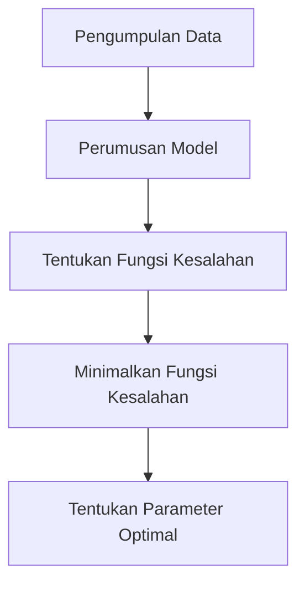
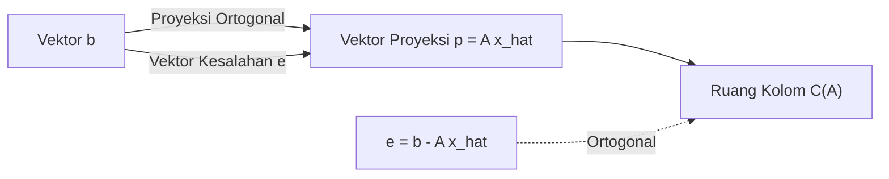

## 1. Pendahuluan: Data Dunia Nyata dan Model "Optimal"

Data yang diamati di dunia nyata hampir selalu mengandung "kebisingan" atau "varians". Untuk menemukan aturan yang mendasari dari data tersebut dan memprediksi masa depan atau memperkirakan data yang tidak diketahui, kita perlu membangun model matematika yang **paling sesuai** dengan data tersebut.

Metode paling mendasar, yang masih memainkan peran yang sangat penting sebagai fondasi pembelajaran mesin modern, adalah **Metode Kuadrat Terkecil** (Method of Least Squares).

Dalam artikel ini, daripada sekadar menghafal rumus, kita akan mengeksplorasi secara mendalam **"mengapa perhitungan ini menemukan garis yang paling sesuai"** dari perspektif geometris yang indah dari aljabar linier (proyeksi ortogonal).

## 2. Ide Intuitif tentang Metode Kuadrat Terkecil

Misalkan kita memiliki $n$ titik data $(x_1, y_1), (x_2, y_2), \dots, (x_n, y_n)$. Saat memplot titik-titik ini pada plot sebaran, mereka mungkin tidak berbaris lurus dengan sempurna, tetapi secara keseluruhan tampaknya mengikuti tren garis tertentu.

Pada saat ini, misalkan persamaan garis yang mendekati data adalah $y = c + dx$. (Di sini, titik potong adalah $c$ dan kemiringannya adalah $d$).

Untuk setiap titik data $x_i$, nilai yang diprediksi oleh garis ini adalah $\hat{y}_i = c + d x_i$. Kesalahan (residu) $e_i$ terjadi antara nilai pengamatan aktual $y_i$ dan nilai prediksi $\hat{y}_i$.

$$ e_i = y_i - \hat{y}_i = y_i - (c + d x_i) $$

Metode Kuadrat Terkecil adalah teknik untuk menemukan parameter $c$ dan $d$ yang meminimalkan **jumlah kuadrat** kesalahan. Jumlah kesalahan kuadrat $E$ didefinisikan sebagai berikut:

$$ E = \sum_{i=1}^{n} e_i^2 = \sum_{i=1}^{n} (y_i - c - d x_i)^2 \quad (\text{Definisi fungsi kesalahan}) $$

Alasan pengkuadratan adalah untuk mencegah kesalahan positif dan negatif saling menghilangkan, dan karena memiliki keuntungan kuat secara matematis dapat dibedakan dan mudah ditangani.



## 3. Perumusan menggunakan Aljabar Linier dan "Persamaan yang Tidak Dapat Diselesaikan"

Keindahan sejati dari metode kuadrat terkecil muncul ketika kita menulis ulang ini menggunakan bahasa matriks dan vektor, yaitu **aljabar linier**.

Dengan asumsi semua titik data terletak sempurna pada garis $y = c + dx$, kita mendapatkan $n$ persamaan berikut:

$$
\begin{cases}
c + d x_1 = y_1 \\
c + d x_2 = y_2 \\
\vdots \\
c + d x_n = y_n
\end{cases}
$$

Mengekspresikan ini dalam bentuk matriks, kita mendapatkan:

$$
\begin{bmatrix}
1 & x_1 \\
1 & x_2 \\
\vdots & \vdots \\
1 & x_n
\end{bmatrix}
\begin{bmatrix}
c \\
d
\end{bmatrix}
=
\begin{bmatrix}
y_1 \\
y_2 \\
\vdots \\
y_n
\end{bmatrix}
$$

Kita menulis ini secara sederhana sebagai $A\mathbf{x} = \mathbf{b}$. Di sini,
- $A$ adalah **Matriks Desain** berukuran $n \times 2$
- $\mathbf{x} = \begin{bmatrix} c \\ d \end{bmatrix}$ adalah **vektor parameter** yang ingin kita temukan
- $\mathbf{b}$ adalah **vektor variabel target** dari nilai yang diamati

Bila data memiliki varians (3 titik atau lebih tidak berada pada garis lurus), tidak ada solusi $\mathbf{x}$ yang secara sempurna memenuhi persamaan $A\mathbf{x} = \mathbf{b}$ ini. Artinya, sistem persamaannya **tidak konsisten**.

## 4. Perspektif Geometris: Ruang Kolom dan Proyeksi Ortogonal

Apa arti geometris bahwa persamaan $A\mathbf{x} = \mathbf{b}$ tidak dapat diselesaikan?

Mengalikan matriks $A$ dengan vektor $\mathbf{x}$ berarti membuat kombinasi linier dari setiap vektor kolom dari $A$. Ruang yang diciptakan oleh semua kombinasi linier yang mungkin dari $A$ disebut **Ruang Kolom** dari $A$, dan ditulis sebagai $C(A)$.

$$ A\mathbf{x} \in C(A) $$

Tidak adanya solusi berarti vektor $\mathbf{b}$ terletak **di luar** ruang kolom $C(A)$ ini.

Yang kita cari bukanlah solusi yang sempurna, melainkan sebuah vektor di dalam $C(A)$ yang sedekat mungkin dengan $\mathbf{b}$. Mari sebut ini $A\hat{\mathbf{x}}$. Pada saat ini, jarak (kuadrat) antara vektor $\mathbf{b}$ dan $A\hat{\mathbf{x}}$ diminimalkan. Ini persis metode kuadrat terkecil.

Secara geometris, titik yang memberikan jarak terpendek dari titik tertentu $\mathbf{b}$ di ruang angkasa ke bidang tertentu $C(A)$ tidak lain adalah **kaki tegak lurus** yang dijatuhkan dari $\mathbf{b}$ ke $C(A)$. Hal ini disebut **Proyeksi Ortogonal**.

Jika vektor kesalahan dibiarkan sebagai $\mathbf{e} = \mathbf{b} - A\hat{\mathbf{x}}$, kondisi untuk jarak terpendek adalah bahwa "vektor kesalahan $\mathbf{e}$ ortogonal terhadap ruang kolom $C(A)$".

Menjadi ortogonal terhadap ruang kolom $C(A)$ berarti ortogonal terhadap semua vektor kolom dari $A$. Hal ini berarti vektor kesalahan $\mathbf{e}$ milik **Ruang Nol Kiri** dari matriks transpos $A^T$ dari matriks $A$. Yaitu,

$$ A^T \mathbf{e} = \mathbf{0} \quad (\text{Kondisi ortogonalitas}) $$

## 5. Derivasi Persamaan Normal

Mari kita substitusikan $\mathbf{e} = \mathbf{b} - A\hat{\mathbf{x}}$ ke dalam kondisi ortogonalitas di atas.

$$ A^T (\mathbf{b} - A\hat{\mathbf{x}}) = \mathbf{0} $$
$$ A^T \mathbf{b} - A^T A \hat{\mathbf{x}} = \mathbf{0} $$

Dengan mengatur ulang ini, kita memperoleh persamaan yang sangat penting berikut ini.

$$ A^T A \hat{\mathbf{x}} = A^T \mathbf{b} \quad (\text{Persamaan Normal}) $$

Persamaan ini disebut **Persamaan Normal**. Persamaan asli $A\mathbf{x} = \mathbf{b}$ tidak memiliki solusi, tetapi persamaan normal ini dikalikan dengan $A^T$ dari kiri di kedua sisi selalu memiliki solusi. Selanjutnya, jika vektor kolom dari $A$ secara linier independen, $A^T A$ menjadi dapat dibalik (memiliki matriks invers), dan solusi optimal $\hat{\mathbf{x}}$ secara unik ditentukan sebagai berikut:

$$ \hat{\mathbf{x}} = (A^T A)^{-1} A^T \mathbf{b} $$

Rumus ini adalah salah satu hasil terindah dalam statistik dan pembelajaran mesin. Anda dapat mencapai kesimpulan ini semata-mata melalui konsep geometris ortogonalitas tanpa menggunakan kalkulus.



## 6. Contoh Implementasi dengan Python

Mari kita benar-benar menghitungnya dengan program, bukan hanya teori. Menggunakan NumPy, pustaka komputasi numerik di Python, Anda dapat mengimplementasikan persamaan normal dengan sangat mudah.

```python
import numpy as np

# Data sampel (x dan y)
x_data = np.array([1, 2, 3, 4, 5])
y_data = np.array([2.1, 3.9, 6.2, 8.1, 9.8])

# Buat Matriks Desain A
# Gabungkan kolom dari x_data dan satu kolom angka 1 untuk titik potong
# Gunakan np.c_ untuk menggabungkan di sepanjang arah kolom
A = np.c_[np.ones(len(x_data)), x_data]
b = y_data

# Selesaikan Persamaan Normal: (A^T A) x_hat = A^T b
# A.T adalah transpos dari A, @ mewakili perkalian matriks
A_T_A = A.T @ A
A_T_b = A.T @ b

# Menyelesaikan sistem persamaan menggunakan np.linalg.solve
# secara numerik lebih stabil daripada menghitung matriks invers secara langsung
x_hat = np.linalg.solve(A_T_A, A_T_b)

c_hat, d_hat = x_hat
print(f"Titik Potong Optimal: {c_hat:.4f}")
print(f"Kemiringan Optimal: {d_hat:.4f}")
```

Menjalankan kode ini akan menghitung titik potong dan kemiringan garis yang paling sesuai dengan titik data yang diberikan. Di belakang layar, perhitungan matriks yang diturunkan sebelumnya dieksekusi persis seperti adanya.

## 7. Kesimpulan dan Pengembangan Lebih Lanjut

Metode kuadrat terkecil adalah teknik yang paling kuat dan standar untuk memperkirakan parameter model dari data. Dengan menggunakan pengetahuan tentang kalkulus, ini dapat diturunkan sebagai "titik di mana gradien fungsi kesalahan menjadi 0", tetapi dengan memahaminya dari perspektif aljabar linier sebagai "proyeksi ortogonal ke ruang kolom", keindahan struktur matematisnya menonjol.

Metode ini tidak terbatas pada pencocokan garis sederhana (regresi sederhana). Dengan menambahkan suku-suku seperti $x^2, x^3$ ke kolom matriks desain $A$, secara alami dapat diperluas ke **Regresi Polinomial**, dan juga dapat dikembangkan menjadi **Metode Kuadrat Terkecil Tertimbang**, yang membobotkan pentingnya setiap titik data.

Sebagai langkah pertama untuk lebih dekat dengan kebenaran di balik data, pemahaman penting tentang metode kuadrat terkecil memiliki nilai yang tak terukur.
