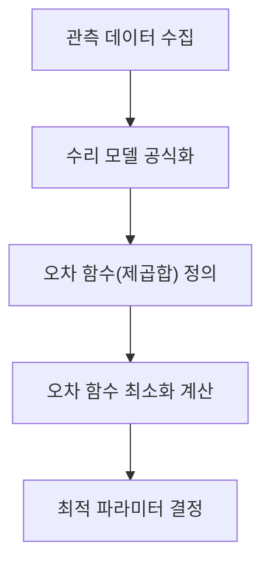
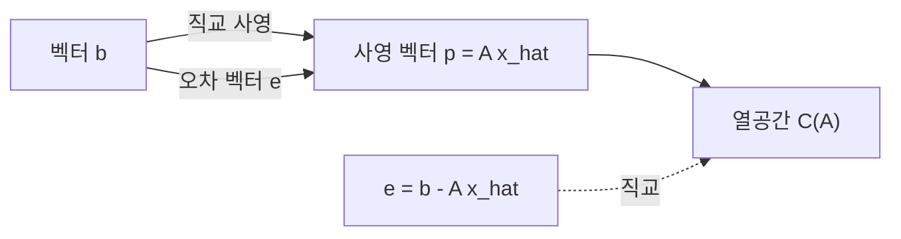

## 1. 들어가며: 현실의 데이터와 "최적"의 모델

현실 세계에서 관찰되는 데이터에는 거의 항상 "노이즈"나 "산포"가 포함되어 있습니다. 이러한 데이터에서 이면의 법칙성을 찾아내어 미래를 예측하거나 미지의 데이터를 추정하기 위해서는, 데이터에 **가장 잘 맞는** (피팅되는) 수리 모델을 구축해야 합니다.

그 가장 기본적이며 현재의 기계학습 기초로서도 극히 중요한 역할을 하고 있는 기법이 바로 **[최소제곱법](https://kenji.blog/p/method-of-least-squares/)** ([Method of Least Squares](https://kenji.blog/p/method-of-least-squares/))입니다.

이 글에서는 단순히 미분 공식을 적용하는 것뿐만 아니라, 선형대수의 아름다운 기하학적 관점, 특히 **직교 사영** (Orthogonal Projection)의 개념을 이용하여 **"왜 그 계산으로 가장 잘 맞는 직선을 구할 수 있는지"**를 깊이 파고들어 해설합니다.

## 2. [최소제곱법](https://kenji.blog/p/method-of-least-squares/)의 직관적인 아이디어

$n$ 개의 데이터 포인트 $(x_1, y_1), (x_2, y_2), \dots, (x_n, y_n)$가 있다고 가정해 봅시다. 이 점들을 산점도에 플롯했을 때, 완전히 일직선 위에 배열되어 있지는 않지만 전체적으로 어떤 직선의 경향을 따르는 것처럼 보이는 경우가 있습니다.

이때 데이터를 근사하는 직선의 식을 $y = c + dx$라고 둡니다. (여기서 절편은 $c$ , 기울기는 $d$ 입니다)

각 데이터 포인트 $x_i$에 대해, 이 직선이 예측하는 값은 $\hat{y}_i = c + d x_i$입니다. 실제 관측값 $y_i$와 예측값 $\hat{y}_i$ 사이에는 오차(잔차) $e_i$가 발생합니다.

$$ e_i = y_i - \hat{y}_i = y_i - (c + d x_i) $$

[최소제곱법](https://kenji.blog/p/method-of-least-squares/)은 이러한 오차들의 **제곱합**을 최소로 만드는 파라미터 $c$와 $d$를 찾는 기법입니다. 오차의 제곱합 $E$는 다음과 같이 정의됩니다.

$$ E = \sum_{i=1}^{n} e_i^2 = \sum_{i=1}^{n} (y_i - c - d x_i)^2 \quad (\text{오차 함수의 정의}) $$

제곱을 계산하는 이유는 양의 오차와 음의 오차가 서로 상쇄되는 것을 막기 위함이며, 수학적으로 미분 가능하여 다루기 쉽다는 강력한 이점이 있기 때문입니다.



## 3. 선형대수에 의한 공식화와 "풀 수 없는 연립방정식"

[최소제곱법](https://kenji.blog/p/method-of-least-squares/)의 진정한 아름다움은 이것을 행렬과 벡터의 언어, 즉 **선형대수학**을 사용하여 다시 썼을 때 나타납니다.

모든 데이터 포인트가 직선 $y = c + dx$ 위에 완벽하게 올라가 있다고 가정하면, 다음과 같은 $n$ 개의 방정식을 얻을 수 있습니다.

$$
\begin{cases}
c + d x_1 = y_1 \\
c + d x_2 = y_2 \\
\vdots \\
c + d x_n = y_n
\end{cases}
$$

이것을 행렬 형태로 표현하면 다음과 같습니다.

$$
\begin{bmatrix}
1 & x_1 \\
1 & x_2 \\
\vdots & \vdots \\
1 & x_n
\end{bmatrix}
\begin{bmatrix}
c \\
d
\end{bmatrix}
=
\begin{bmatrix}
y_1 \\
y_2 \\
\vdots \\
y_n
\end{bmatrix}
$$

이것을 $A\mathbf{x} = \mathbf{b}$로 간결하게 표기합니다. 여기서,
- $A$는 $n \times 2$의 **계획 행렬** (Design Matrix)
- $\mathbf{x} = \begin{bmatrix} c \\ d \end{bmatrix}$는 구하고자 하는 **파라미터 벡터**
- $\mathbf{b}$는 관측값의 **목적 변수 벡터**

데이터에 산포가 있는(3점 이상이 일직선상에 없는) 경우, 이 방정식 $A\mathbf{x} = \mathbf{b}$를 완전히 만족하는 해 $\mathbf{x}$는 존재하지 않습니다. 즉, 연립방정식은 **불능** (inconsistent)이 됩니다.

## 4. 기하학적 관점: 열공간과 직교 사영

방정식 $A\mathbf{x} = \mathbf{b}$를 풀 수 없다는 것은 기하학적으로 무엇을 의미할까요?

행렬 $A$에 벡터 $\mathbf{x}$를 곱하는 조작은 $A$의 각 열벡터의 선형 결합을 만드는 것을 의미합니다. $A$의 모든 가능한 선형 결합이 만드는 공간을 $A$의 **열공간** (Column Space)이라고 부르며, $C(A)$라고 씁니다.

$$ A\mathbf{x} \in C(A) $$

해가 존재하지 않는다는 것은 벡터 $\mathbf{b}$가 이 열공간 $C(A)$의 **바깥쪽**에 있다는 것입니다.

우리가 찾고 있는 것은 완벽한 해가 아니라, 가능한 한 $\mathbf{b}$에 가까운 $C(A)$ 안의 벡터를 찾는 것입니다. 이것을 $A\hat{\mathbf{x}}$라고 합시다. 이때 벡터 $\mathbf{b}$와 $A\hat{\mathbf{x}}$의 거리(의 제곱)가 최소가 됩니다. 이것이 바로 [최소제곱법](https://kenji.blog/p/method-of-least-squares/)입니다.

기하학적으로 공간 내의 어떤 점 $\mathbf{b}$에서 어떤 평면 $C(A)$까지의 최단 거리를 주는 점은, $\mathbf{b}$에서 $C(A)$로 내린 **수선의 발**에 다름 아닙니다. 이것을 **직교 사영** (Orthogonal Projection)이라고 부릅니다.

오차 벡터를 $\mathbf{e} = \mathbf{b} - A\hat{\mathbf{x}}$라고 하면, 최단 거리의 조건은 "오차 벡터 $\mathbf{e}$가 열공간 $C(A)$와 직교하는 것"입니다.

열공간 $C(A)$와 직교한다는 것은 $A$의 모든 열벡터와 직교한다는 것입니다. 이것은 오차 벡터 $\mathbf{e}$가 행렬 $A$의 전치 행렬 $A^T$의 **좌영공간** (Left Nullspace)에 속함을 의미합니다. 즉,

$$ A^T \mathbf{e} = \mathbf{0} \quad (\text{직교 조건}) $$

## 5. 정규 방정식의 도출

위의 직교 조건에 $\mathbf{e} = \mathbf{b} - A\hat{\mathbf{x}}$를 대입해 봅시다.

$$ A^T (\mathbf{b} - A\hat{\mathbf{x}}) = \mathbf{0} $$
$$ A^T \mathbf{b} - A^T A \hat{\mathbf{x}} = \mathbf{0} $$

정리하면, 다음과 같은 극히 중요한 방정식을 얻을 수 있습니다.

$$ A^T A \hat{\mathbf{x}} = A^T \mathbf{b} \quad (\text{정규 방정식}) $$

이 방정식은 **정규 방정식** (Normal Equation)이라고 불립니다. 원래의 $A\mathbf{x} = \mathbf{b}$는 해가 존재하지 않았지만, 양변의 왼쪽에 $A^T$를 곱한 이 정규 방정식은 항상 해를 갖습니다. 게다가 $A$의 열벡터들이 서로 선형 독립이라면, $A^T A$는 정칙(역행렬을 가짐)이 되고 최적해 $\hat{\mathbf{x}}$는 다음과 같이 유일하게 구해집니다.

$$ \hat{\mathbf{x}} = (A^T A)^{-1} A^T \mathbf{b} $$

이 수식은 통계학이나 기계학습에서 가장 아름다운 결과 중 하나입니다. 미분을 사용하지 않고 기하학적인 직교성 개념만으로 이 결론에 도달할 수 있습니다.



## 6. Python 구현 예제

이론뿐만 아니라 실제로 프로그램으로 계산해 봅시다. Python의 수치 계산 라이브러리인 NumPy를 사용하면 정규 방정식을 매우 쉽게 구현할 수 있습니다.

```python
import numpy as np

# 샘플 데이터 (x와 y)
x_data = np.array([1, 2, 3, 4, 5])
y_data = np.array([2.1, 3.9, 6.2, 8.1, 9.8])

# 계획 행렬 A의 작성
# x_data의 열과 절편을 위한 1의 열을 결합한다
# np.c_를 사용하여 열 방향으로 결합
A = np.c_[np.ones(len(x_data)), x_data]
b = y_data

# 정규 방정식을 푼다: (A^T A) x_hat = A^T b
# A.T는 A의 전치, @는 행렬의 곱을 나타낸다
A_T_A = A.T @ A
A_T_b = A.T @ b

# np.linalg.solve를 이용하여 연립방정식을 푸는 편이
# 역행렬을 직접 계산하는 것보다 수치적으로 안정된다
x_hat = np.linalg.solve(A_T_A, A_T_b)

c_hat, d_hat = x_hat
print(f"최적의 절편: {c_hat:.4f}")
print(f"최적의 기울기: {d_hat:.4f}")
```

이 코드를 실행하면 주어진 데이터 포인트에 가장 잘 맞는 직선의 절편과 기울기가 계산됩니다. 이면에서는 앞서 도출한 행렬 계산이 그대로 실행되고 있습니다.

## 7. 정리와 발전

[최소제곱법](https://kenji.blog/p/method-of-least-squares/)은 데이터로부터 모델의 파라미터를 추정하는 가장 강력하고 표준적인 기법입니다. 미분 지식을 사용하면 "오차 함수의 기울기가 0이 되는 점"으로 도출할 수 있지만, 선형대수의 관점에서 "열공간으로의 직교 사영"으로 이해함으로써 그 수리적 구조의 아름다움이 돋보입니다.

이 기법은 단순한 직선에 대한 피팅(단순 회귀)에 그치지 않습니다. 계획 행렬 $A$의 열에 $x^2, x^3$ 등의 항을 추가하면 **다항식 회귀**로 자연스럽게 확장할 수 있으며, 각 데이터 포인트에 중요도의 가중치를 두는 **가중 [최소제곱법](https://kenji.blog/p/method-of-least-squares/)** 등으로 발전시킬 수도 있습니다.

데이터 이면의 진리에 다가가기 위한 첫걸음으로서, [최소제곱법](https://kenji.blog/p/method-of-least-squares/)의 본질적인 이해는 헤아릴 수 없는 가치를 지닙니다.
