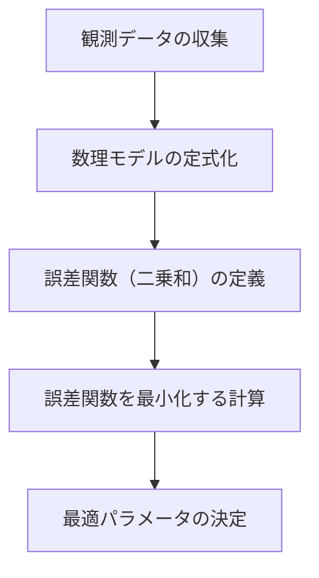

## 1. はじめに：現実のデータと「最適」なモデル

現実世界で観測されるデータには、必ずと言っていいほど「ノイズ」や「ばらつき」が含まれています。これらのデータから背後にある法則性を見つけ出し、未来を予測したり未知のデータを推定したりするためには、データに **最もよく当てはまる** （フィットする）数理モデルを構築する必要があります。

その最も基本的であり、かつ現代の機械学習の基礎としても極めて重要な役割を果たしている手法が **[最小二乗法](https://kenji.blog/p/method-of-least-squares/)** ([Method of Least Squares](https://kenji.blog/p/method-of-least-squares/)) です。

この記事では、単に微分の公式を適用するだけでなく、線形代数の美しい幾何学的な視点、特に **直交射影** (Orthogonal Projection) の概念を用いて、 **「なぜその計算で最もフィットする直線が求まるのか」** を深く掘り下げて解説します。

## 2. [最小二乗法](https://kenji.blog/p/method-of-least-squares/)の直観的なアイデア

$n$ 個のデータポイント $(x_1, y_1), (x_2, y_2), \dots, (x_n, y_n)$ があるとします。これらの点を散布図にプロットしたとき、それらが完全な直線上には並んでいないものの、全体としてある直線の傾向に従っているように見える場合があります。

このとき、データを近似する直線の式を $y = c + dx$ と置きます。（ここでは切片を $c$ 、傾きを $d$ とします）

各データポイント $x_i$ に対して、この直線が予測する値は $\hat{y}_i = c + d x_i$ です。実際の観測値 $y_i$ と予測値 $\hat{y}_i$ の間には、誤差（残差） $e_i$ が生じます。

$$ e_i = y_i - \hat{y}_i = y_i - (c + d x_i) $$

[最小二乗法](https://kenji.blog/p/method-of-least-squares/)は、これらの誤差の **二乗和** を最小にするようなパラメータ $c$ と $d$ を見つける手法です。誤差の二乗和 $E$ は次のように定義されます。

$$ E = \sum_{i=1}^{n} e_i^2 = \sum_{i=1}^{n} (y_i - c - d x_i)^2 \quad (\text{誤差関数の定義}) $$

二乗を計算する理由は、正の誤差と負の誤差が相殺し合うのを防ぐためであり、また数学的に微分可能で扱いやすいという強力な利点があるためです。



## 3. 線形代数による定式化と「解けない連立方程式」

[最小二乗法](https://kenji.blog/p/method-of-least-squares/)の真の美しさは、これを行列とベクトルの言葉、すなわち **線形代数** を用いて書き直したときに現れます。

すべてのデータポイントが直線 $y = c + dx$ 上に完全に乗っていると仮定すると、次のような $n$ 個の方程式が得られます。

$$
\begin{cases}
c + d x_1 = y_1 \\\\
c + d x_2 = y_2 \\\\
\vdots \\\\
c + d x_n = y_n
\end{cases}
$$

これを行列の形で表現すると、次のようになります。

$$
\begin{bmatrix}
1 & x_1 \\\\
1 & x_2 \\\\
\vdots & \vdots \\\\
1 & x_n
\end{bmatrix}
\begin{bmatrix}
c \\\\
d
\end{bmatrix}
=
\begin{bmatrix}
y_1 \\\\
y_2 \\\\
\vdots \\\\
y_n
\end{bmatrix}
$$

これを $A\mathbf{x} = \mathbf{b}$ と簡潔に表記します。ここで、
- $A$ は $n \times 2$ の **計画行列** (Design Matrix)
- $\mathbf{x} = \begin{bmatrix} c \\\\ d \end{bmatrix}$ は求めたい **パラメータベクトル**
- $\mathbf{b}$ は観測値の **目的変数ベクトル**

データにばらつきがある（3点以上が一直線上にない）場合、この方程式 $A\mathbf{x} = \mathbf{b}$ を完全に満たす解 $\mathbf{x}$ は存在しません。つまり、連立方程式は **不能** (inconsistent) となります。

## 4. 幾何学的視点：列空間と直交射影

方程式 $A\mathbf{x} = \mathbf{b}$ が解けないということは、幾何学的に何を意味しているのでしょうか。

行列 $A$ にベクトル $\mathbf{x}$ を掛けるという操作は、$A$ の各列ベクトルの線形結合を作ることを意味します。$A$ のすべての可能な線形結合が作る空間を、 $A$ の **列空間** (Column Space) と呼び、$C(A)$ と書きます。

$$ A\mathbf{x} \in C(A) $$

解が存在しないということは、ベクトル $\mathbf{b}$ がこの列空間 $C(A)$ の **外側** にあるということです。

我々が探しているのは、完全な解ではなく、可能な限り $\mathbf{b}$ に近い $C(A)$ 内のベクトルを見つけることです。これを $A\hat{\mathbf{x}}$ としましょう。このとき、ベクトル $\mathbf{b}$ と $A\hat{\mathbf{x}}$ の距離（の二乗）が最小になります。これがまさに[最小二乗法](https://kenji.blog/p/method-of-least-squares/)です。

幾何学的には、空間内のある点 $\mathbf{b}$ から、ある平面 $C(A)$ への最短距離を与える点は、 $\mathbf{b}$ から $C(A)$ へ下ろした **垂線の足** に他なりません。これを **直交射影** (Orthogonal Projection) と呼びます。

誤差ベクトルを $\mathbf{e} = \mathbf{b} - A\hat{\mathbf{x}}$ とすると、最短距離の条件は「誤差ベクトル $\mathbf{e}$ が列空間 $C(A)$ と直交すること」です。

列空間 $C(A)$ と直交するということは、$A$ のすべての列ベクトルと直交するということです。これは、誤差ベクトル $\mathbf{e}$ が行列 $A$ の転置行列 $A^T$ の **左零空間** (Left Nullspace) に属することを意味します。すなわち、

$$ A^T \mathbf{e} = \mathbf{0} \quad (\text{直交条件}) $$

## 5. 正規方程式の導出

上記の直交条件に $\mathbf{e} = \mathbf{b} - A\hat{\mathbf{x}}$ を代入してみましょう。

$$ A^T (\mathbf{b} - A\hat{\mathbf{x}}) = \mathbf{0} $$
$$ A^T \mathbf{b} - A^T A \hat{\mathbf{x}} = \mathbf{0} $$

整理すると、次の極めて重要な方程式が得られます。

$$ A^T A \hat{\mathbf{x}} = A^T \mathbf{b} \quad (\text{正規方程式}) $$

この方程式は **正規方程式** (Normal Equation) と呼ばれます。元の $A\mathbf{x} = \mathbf{b}$ は解が存在しませんでしたが、両辺の左から $A^T$ を掛けたこの正規方程式は、常に解を持ちます。さらに、$A$ の列ベクトルが互いに線形独立であれば、$A^T A$ は正則（逆行列を持つ）となり、最適解 $\hat{\mathbf{x}}$ は次のように一意に求まります。

$$ \hat{\mathbf{x}} = (A^T A)^{-1} A^T \mathbf{b} $$

この数式は、統計学や機械学習において最も美しい結果の一つです。微分を使わずに、幾何学的な直交性の概念だけでこの結論に辿り着くことができます。

```mermaid
flowchart LR
    b["ベクトル b"] -->|"直交射影"| p["射影ベクトル p = A x_hat"]
    p --> C["列空間 C("A")"]
    b -->|"誤差ベクトル e"| p
    e["e = b - A x_hat"] -.->|"直交"| C
```

## 6. Pythonでの実装例

理論だけでなく、実際にプログラムで計算してみましょう。Pythonの数値計算ライブラリである NumPy を使うと、正規方程式を非常に簡単に実装できます。

```python
import numpy as np

# サンプルデータ（xとy）
x_data = np.array([1, 2, 3, 4, 5])
y_data = np.array([2.1, 3.9, 6.2, 8.1, 9.8])

# 計画行列 A の作成
# x_data の列と、切片のための 1 の列を結合する
# np.c_ を使って列方向に結合
A = np.c_[np.ones(len(x_data)), x_data]
b = y_data

# 正規方程式を解く：(A^T A) x_hat = A^T b
# A.T は Aの転置、@ は行列の積を表す
A_T_A = A.T @ A
A_T_b = A.T @ b

# np.linalg.solve を用いて連立方程式を解く方が、
# 逆行列を直接計算するより数値的に安定する
x_hat = np.linalg.solve(A_T_A, A_T_b)

c_hat, d_hat = x_hat
print(f"最適な切片: {c_hat:.4f}")
print(f"最適な傾き: {d_hat:.4f}")
```

このコードを実行すると、与えられたデータポイントに最もフィットする直線の切片と傾きが計算されます。背後では先ほど導出した行列計算がそのまま実行されています。

## 7. まとめと発展

[最小二乗法](https://kenji.blog/p/method-of-least-squares/)は、データからモデルのパラメータを推定する最も強力で標準的な手法です。微分の知識を使えば「誤差関数の勾配が0になる点」として導出できますが、線形代数の観点から「列空間への直交射影」として理解することで、その数理的な構造の美しさが際立ちます。

この手法は、単なる直線へのフィッティング（単回帰）にとどまりません。計画行列 $A$ の列に $x^2, x^3$ などの項を追加すれば **多項式回帰** に自然と拡張できますし、各データポイントに重要度の重み付けをする **重み付き[最小二乗法](https://kenji.blog/p/method-of-least-squares/)** などへも発展させることができます。

データの背後にある真理に近づくための第一歩として、[最小二乗法](https://kenji.blog/p/method-of-least-squares/)の本質的な理解は計り知れない価値を持っています。
