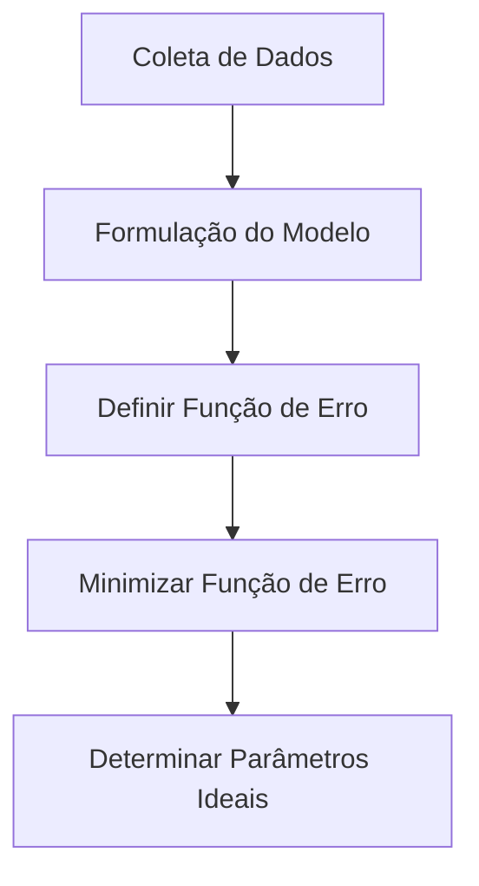
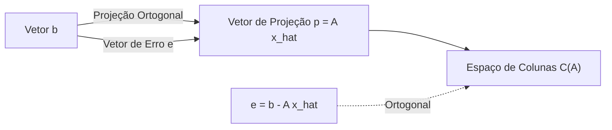

## 1. Introdução: Dados do Mundo Real e o Modelo "Ideal"

Os dados observados no mundo real quase sempre contêm "ruído" ou "variância". Para encontrar as regras subjacentes a partir de tais dados e prever o futuro ou estimar dados desconhecidos, precisamos construir um modelo matemático que **melhor se ajuste** aos dados.

O método mais fundamental, que ainda desempenha um papel extremamente importante como base do aprendizado de máquina moderno, é o **[Método dos Mínimos Quadrados](https://kenji.blog/pt/p/method-of-least-squares/)** ([Method of Least Squares](https://kenji.blog/pt/p/method-of-least-squares/)).

Neste artigo, em vez de apenas memorizar fórmulas, exploraremos profundamente **"por que esse cálculo encontra a linha de melhor ajuste"** a partir da bela perspectiva geométrica da álgebra linear (projeção ortogonal).

## 2. Ideia Intuitiva do [Método dos Mínimos Quadrados](https://kenji.blog/pt/p/method-of-least-squares/)

Suponha que temos $n$ pontos de dados $(x_1, y_1), (x_2, y_2), \dots, (x_n, y_n)$. Ao plotar esses pontos em um gráfico de dispersão, eles podem não se alinhar perfeitamente retos, mas no geral parecem seguir a tendência de uma certa linha.

Nesse momento, seja a equação da linha que aproxima os dados $y = c + dx$. (Aqui, a interceptação é $c$ e a inclinação é $d$).

Para cada ponto de dados $x_i$, o valor previsto por esta linha é $\hat{y}_i = c + d x_i$. Um erro (resíduo) $e_i$ ocorre entre o valor observado real $y_i$ e o valor previsto $\hat{y}_i$.

$$ e_i = y_i - \hat{y}_i = y_i - (c + d x_i) $$

O [Método dos Mínimos Quadrados](https://kenji.blog/pt/p/method-of-least-squares/) é uma técnica para encontrar os parâmetros $c$ e $d$ que minimizam a **soma dos quadrados** dos erros. A soma dos erros quadráticos $E$ é definida da seguinte forma:

$$ E = \sum_{i=1}^{n} e_i^2 = \sum_{i=1}^{n} (y_i - c - d x_i)^2 \quad (\text{Definição da função de erro}) $$

O motivo da elevação ao quadrado é evitar que erros positivos e negativos se cancelem, e porque tem a poderosa vantagem de ser matematicamente diferenciável e fácil de manusear.



## 3. Formulação usando Álgebra Linear e "Equações Sem Solução"

A verdadeira beleza do método dos mínimos quadrados surge quando reescrevemos isso usando a linguagem de matrizes e vetores, ou seja, **álgebra linear**.

Assumindo que todos os pontos de dados estejam perfeitamente na linha $y = c + dx$, obtemos as seguintes $n$ equações:

$$
\begin{cases}
c + d x_1 = y_1 \\
c + d x_2 = y_2 \\
\vdots \\
c + d x_n = y_n
\end{cases}
$$

Expressando isso em forma de matriz, obtemos:

$$
\begin{bmatrix}
1 & x_1 \\
1 & x_2 \\
\vdots & \vdots \\
1 & x_n
\end{bmatrix}
\begin{bmatrix}
c \\
d
\end{bmatrix}
=
\begin{bmatrix}
y_1 \\
y_2 \\
\vdots \\
y_n
\end{bmatrix}
$$

Escrevemos isso simplesmente como $A\mathbf{x} = \mathbf{b}$. Aqui,
- $A$ é uma **Matriz de Design** $n \times 2$
- $\mathbf{x} = \begin{bmatrix} c \\ d \end{bmatrix}$ é o **vetor de parâmetros** que queremos encontrar
- $\mathbf{b}$ é o **vetor de variável de destino** dos valores observados

Quando os dados têm variância (3 ou mais pontos não estão em uma linha reta), não há solução $\mathbf{x}$ que satisfaça perfeitamente essa equação $A\mathbf{x} = \mathbf{b}$. Ou seja, o sistema de equações é **inconsistente**.

## 4. Perspectiva Geométrica: Espaço de Colunas e Projeção Ortogonal

O que significa geometricamente que a equação $A\mathbf{x} = \mathbf{b}$ não pode ser resolvida?

Multiplicar a matriz $A$ pelo vetor $\mathbf{x}$ significa criar uma combinação linear de cada vetor coluna de $A$. O espaço criado por todas as combinações lineares possíveis de $A$ é chamado de **Espaço de Colunas** de $A$, e é escrito como $C(A)$.

$$ A\mathbf{x} \in C(A) $$

A ausência de uma solução significa que o vetor $\mathbf{b}$ está **fora** deste espaço de colunas $C(A)$.

O que estamos procurando não é uma solução perfeita, mas um vetor dentro de $C(A)$ que esteja o mais próximo possível de $\mathbf{b}$. Vamos chamar isso de $A\hat{\mathbf{x}}$. Neste momento, a distância (ao quadrado) entre o vetor $\mathbf{b}$ e $A\hat{\mathbf{x}}$ é minimizada. Este é exatamente o método dos mínimos quadrados.

Geometricamente, o ponto que dá a distância mais curta de um certo ponto $\mathbf{b}$ no espaço a um certo plano $C(A)$ nada mais é do que o **pé da perpendicular** caída de $\mathbf{b}$ para $C(A)$. Isso é chamado de **Projeção Ortogonal**.

Deixando o vetor de erro ser $\mathbf{e} = \mathbf{b} - A\hat{\mathbf{x}}$, a condição para a distância mais curta é que "o vetor de erro $\mathbf{e}$ é ortogonal ao espaço de colunas $C(A)$".

Ser ortogonal ao espaço de colunas $C(A)$ significa ser ortogonal a todos os vetores coluna de $A$. Isso significa que o vetor de erro $\mathbf{e}$ pertence ao **Espaço Nulo Esquerdo** da matriz transposta $A^T$ da matriz $A$. Ou seja,

$$ A^T \mathbf{e} = \mathbf{0} \quad (\text{Condição de ortogonalidade}) $$

## 5. Derivação da Equação Normal

Vamos substituir $\mathbf{e} = \mathbf{b} - A\hat{\mathbf{x}}$ na condição de ortogonalidade acima.

$$ A^T (\mathbf{b} - A\hat{\mathbf{x}}) = \mathbf{0} $$
$$ A^T \mathbf{b} - A^T A \hat{\mathbf{x}} = \mathbf{0} $$

Reorganizando isso, obtemos a seguinte equação extremamente importante.

$$ A^T A \hat{\mathbf{x}} = A^T \mathbf{b} \quad (\text{Equação Normal}) $$

Esta equação é chamada de **Equação Normal**. O $A\mathbf{x} = \mathbf{b}$ original não tinha solução, mas esta equação normal multiplicada por $A^T$ da esquerda em ambos os lados sempre tem uma solução. Além disso, se os vetores coluna de $A$ forem linearmente independentes, $A^T A$ se torna invertível (tem uma matriz inversa), e a solução ideal $\hat{\mathbf{x}}$ é determinada exclusivamente da seguinte forma:

$$ \hat{\mathbf{x}} = (A^T A)^{-1} A^T \mathbf{b} $$

Esta fórmula é um dos resultados mais belos em estatística e aprendizado de máquina. Você pode chegar a essa conclusão apenas por meio do conceito geométrico de ortogonalidade, sem usar cálculo.



## 6. Exemplo de Implementação em Python

Vamos realmente calcular isso com um programa, não apenas na teoria. Usando NumPy, uma biblioteca de computação numérica em Python, você pode implementar a equação normal muito facilmente.

```python
import numpy as np

# Dados de amostra (x e y)
x_data = np.array([1, 2, 3, 4, 5])
y_data = np.array([2.1, 3.9, 6.2, 8.1, 9.8])

# Criar Matriz de Design A
# Combine colunas de x_data e uma coluna de 1s para a interceptação
# Use np.c_ para concatenar ao longo da direção da coluna
A = np.c_[np.ones(len(x_data)), x_data]
b = y_data

# Resolver a Equação Normal: (A^T A) x_hat = A^T b
# A.T é a transposta de A, @ representa multiplicação de matrizes
A_T_A = A.T @ A
A_T_b = A.T @ b

# Resolver o sistema de equações usando np.linalg.solve
# é numericamente mais estável do que calcular a matriz inversa diretamente
x_hat = np.linalg.solve(A_T_A, A_T_b)

c_hat, d_hat = x_hat
print(f"Interceptação Ideal: {c_hat:.4f}")
print(f"Inclinação Ideal: {d_hat:.4f}")
```

A execução deste código calcula a interceptação e a inclinação da linha que melhor se ajusta aos pontos de dados fornecidos. Nos bastidores, o cálculo de matriz derivado anteriormente é executado exatamente como está.

## 7. Conclusão e Desenvolvimento Futuro

O método dos mínimos quadrados é a técnica mais poderosa e padrão para estimar parâmetros de modelo a partir de dados. Usando o conhecimento de cálculo, ele pode ser derivado como "o ponto onde o gradiente da função de erro se torna 0", mas ao entendê-lo da perspectiva da álgebra linear como uma "projeção ortogonal no espaço de colunas", a beleza de sua estrutura matemática se destaca.

Este método não se limita ao simples ajuste de linha (regressão simples). Adicionando termos como $x^2, x^3$ às colunas da matriz de design $A$, ele pode ser estendido naturalmente à **Regressão Polinomial**, e também pode ser desenvolvido no **[Método dos Mínimos Quadrados](https://kenji.blog/pt/p/method-of-least-squares/) Ponderados**, que pesa a importância de cada ponto de dados.

Como primeiro passo para se aproximar da verdade por trás dos dados, uma compreensão essencial do método dos mínimos quadrados tem um valor imensurável.
