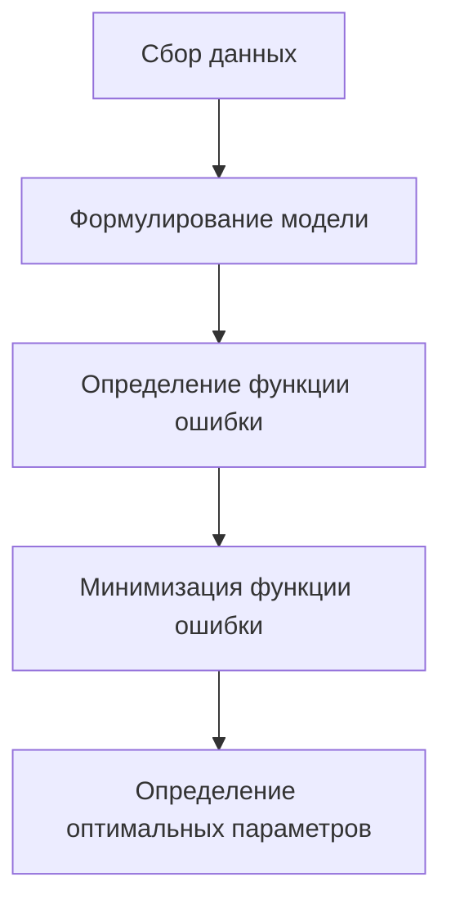
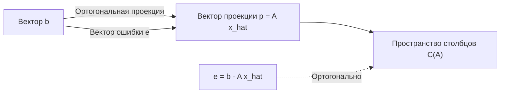

## 1. Введение: Реальные данные и "оптимальная" модель

Данные, наблюдаемые в реальном мире, почти всегда содержат "шум" или "дисперсию". Чтобы найти скрытые закономерности в таких данных и предсказать будущее или оценить неизвестные данные, нам необходимо построить математическую модель, которая **наилучшим образом** соответствует данным.

Самым фундаментальным методом, который до сих пор играет чрезвычайно важную роль в качестве основы современного машинного обучения, является **метод наименьших квадратов** (Method of Least Squares).

В этой статье, вместо того чтобы просто заучивать формулы, мы глубоко исследуем, **"почему это вычисление находит линию наилучшего соответствия"** с прекрасной геометрической точки зрения линейной алгебры (ортогональная проекция).

## 2. Интуитивная идея метода наименьших квадратов

Предположим, у нас есть $n$ точек данных $(x_1, y_1), (x_2, y_2), \dots, (x_n, y_n)$. При построении этих точек на диаграмме рассеяния они могут не выстраиваться в идеальную прямую, но в целом они, кажется, следуют тенденции определенной линии.

В это время пусть уравнение прямой, аппроксимирующей данные, будет $y = c + dx$. (Здесь точка пересечения с осью $y$ — $c$, а наклон — $d$).

Для каждой точки данных $x_i$ значение, предсказанное этой линией, равно $\hat{y}_i = c + d x_i$. Ошибка (остаток) $e_i$ возникает между фактическим наблюдаемым значением $y_i$ и предсказанным значением $\hat{y}_i$.

$$ e_i = y_i - \hat{y}_i = y_i - (c + d x_i) $$

Метод наименьших квадратов — это метод поиска параметров $c$ и $d$, которые минимизируют **сумму квадратов** ошибок. Сумма квадратов ошибок $E$ определяется следующим образом:

$$ E = \sum_{i=1}^{n} e_i^2 = \sum_{i=1}^{n} (y_i - c - d x_i)^2 \quad (\text{Определение функции ошибки}) $$

Причина возведения в квадрат заключается в предотвращении взаимного уничтожения положительных и отрицательных ошибок, а также в том, что оно обладает мощным преимуществом — математически дифференцируемо и легко поддается обработке.



## 3. Формулировка с использованием линейной алгебры и "Неразрешимые уравнения"

Истинная красота метода наименьших квадратов проявляется, когда мы переписываем это, используя язык матриц и векторов, то есть **линейную алгебру**.

Предполагая, что все точки данных идеально лежат на прямой $y = c + dx$, мы получаем следующие $n$ уравнений:

$$
\begin{cases}
c + d x_1 = y_1 \\
c + d x_2 = y_2 \\
\vdots \\
c + d x_n = y_n
\end{cases}
$$

Выражая это в матричной форме, получаем:

$$
\begin{bmatrix}
1 & x_1 \\
1 & x_2 \\
\vdots & \vdots \\
1 & x_n
\end{bmatrix}
\begin{bmatrix}
c \\
d
\end{bmatrix}
=
\begin{bmatrix}
y_1 \\
y_2 \\
\vdots \\
y_n
\end{bmatrix}
$$

Мы записываем это просто как $A\mathbf{x} = \mathbf{b}$. Здесь,
- $A$ — это $n \times 2$ **Матрица плана** (Design Matrix)
- $\mathbf{x} = \begin{bmatrix} c \\ d \end{bmatrix}$ — это **вектор параметров**, который мы хотим найти
- $\mathbf{b}$ — это **вектор целевой переменной** наблюдаемых значений

Когда данные имеют дисперсию (3 или более точек не лежат на одной прямой), не существует решения $\mathbf{x}$, которое идеально удовлетворяет этому уравнению $A\mathbf{x} = \mathbf{b}$. То есть система уравнений **несовместна**.

## 4. Геометрическая перспектива: Пространство столбцов и ортогональная проекция

Что геометрически означает, что уравнение $A\mathbf{x} = \mathbf{b}$ не может быть решено?

Умножение матрицы $A$ на вектор $\mathbf{x}$ означает создание линейной комбинации каждого вектора-столбца матрицы $A$. Пространство, созданное всеми возможными линейными комбинациями $A$, называется **пространством столбцов** $A$ и записывается как $C(A)$.

$$ A\mathbf{x} \in C(A) $$

Отсутствие решения означает, что вектор $\mathbf{b}$ лежит **вне** этого пространства столбцов $C(A)$.

То, что мы ищем, — это не идеальное решение, а вектор в пределах $C(A)$, который находится как можно ближе к $\mathbf{b}$. Назовем его $A\hat{\mathbf{x}}$. В это время расстояние (в квадрате) между вектором $\mathbf{b}$ и $A\hat{\mathbf{x}}$ минимизируется. Это в точности метод наименьших квадратов.

Геометрически точка, дающая кратчайшее расстояние от определенной точки $\mathbf{b}$ в пространстве до определенной плоскости $C(A)$, есть не что иное, как **основание перпендикуляра**, опущенного из $\mathbf{b}$ на $C(A)$. Это называется **ортогональной проекцией**.

Если пусть вектор ошибки будет $\mathbf{e} = \mathbf{b} - A\hat{\mathbf{x}}$, условием кратчайшего расстояния является то, что "вектор ошибки $\mathbf{e}$ ортогонален пространству столбцов $C(A)$".

Быть ортогональным пространству столбцов $C(A)$ означает быть ортогональным всем векторам-столбцам матрицы $A$. Это означает, что вектор ошибки $\mathbf{e}$ принадлежит **левому нуль-пространству** транспонированной матрицы $A^T$ матрицы $A$. То есть,

$$ A^T \mathbf{e} = \mathbf{0} \quad (\text{Условие ортогональности}) $$

## 5. Вывод нормального уравнения

Подставим $\mathbf{e} = \mathbf{b} - A\hat{\mathbf{x}}$ в приведенное выше условие ортогональности.

$$ A^T (\mathbf{b} - A\hat{\mathbf{x}}) = \mathbf{0} $$
$$ A^T \mathbf{b} - A^T A \hat{\mathbf{x}} = \mathbf{0} $$

Перегруппировав это, мы получим следующее чрезвычайно важное уравнение.

$$ A^T A \hat{\mathbf{x}} = A^T \mathbf{b} \quad (\text{Нормальное уравнение}) $$

Это уравнение называется **нормальным уравнением**. Исходное $A\mathbf{x} = \mathbf{b}$ не имело решения, но это нормальное уравнение, умноженное на $A^T$ слева с обеих сторон, всегда имеет решение. Более того, если векторы-столбцы $A$ линейно независимы, $A^T A$ становится обратимой (имеет обратную матрицу), и оптимальное решение $\hat{\mathbf{x}}$ однозначно определяется следующим образом:

$$ \hat{\mathbf{x}} = (A^T A)^{-1} A^T \mathbf{b} $$

Эта формула — один из самых красивых результатов в статистике и машинном обучении. Вы можете прийти к этому выводу исключительно через геометрическую концепцию ортогональности без использования математического анализа.



## 6. Пример реализации на Python

Давайте на самом деле вычислим это с помощью программы, а не только в теории. Используя NumPy, библиотеку численных вычислений на Python, вы можете реализовать нормальное уравнение очень легко.

```python
import numpy as np

# Примеры данных (x и y)
x_data = np.array([1, 2, 3, 4, 5])
y_data = np.array([2.1, 3.9, 6.2, 8.1, 9.8])

# Создание матрицы плана A
# Объедините столбцы x_data и столбец единиц для точки пересечения
# Используйте np.c_ для конкатенации вдоль направления столбца
A = np.c_[np.ones(len(x_data)), x_data]
b = y_data

# Решение нормального уравнения: (A^T A) x_hat = A^T b
# A.T - транспонированная A, @ обозначает матричное умножение
A_T_A = A.T @ A
A_T_b = A.T @ b

# Решение системы уравнений с использованием np.linalg.solve
# численно более стабильно, чем прямое вычисление обратной матрицы
x_hat = np.linalg.solve(A_T_A, A_T_b)

c_hat, d_hat = x_hat
print(f"Оптимальная точка пересечения: {c_hat:.4f}")
print(f"Оптимальный наклон: {d_hat:.4f}")
```

Запуск этого кода вычисляет точку пересечения и наклон прямой, которая наилучшим образом соответствует заданным точкам данных. За кулисами вычисление матрицы, полученное ранее, выполняется в точности так, как есть.

## 7. Заключение и дальнейшее развитие

Метод наименьших квадратов — самый мощный и стандартный метод оценки параметров модели на основе данных. Используя знания математического анализа, его можно вывести как "точку, где градиент функции ошибки становится равным 0", но при понимании его с точки зрения линейной алгебры как "ортогональной проекции на пространство столбцов", красота его математической структуры выделяется.

Этот метод не ограничивается простой подгонкой прямой (простая регрессия). Добавляя такие члены, как $x^2, x^3$, к столбцам матрицы плана $A$, его можно естественным образом расширить до **полиномиальной регрессии**, а также его можно развить в **взвешенный метод наименьших квадратов**, который взвешивает важность каждой точки данных.

В качестве первого шага к приближению к истине, стоящей за данными, существенное понимание метода наименьших квадратов имеет неизмеримую ценность.
