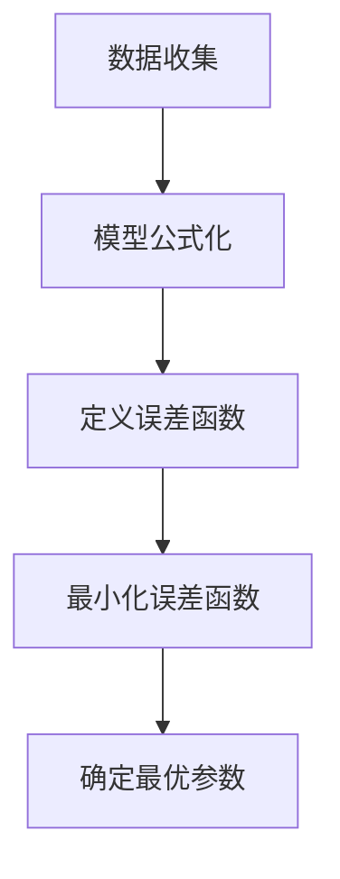
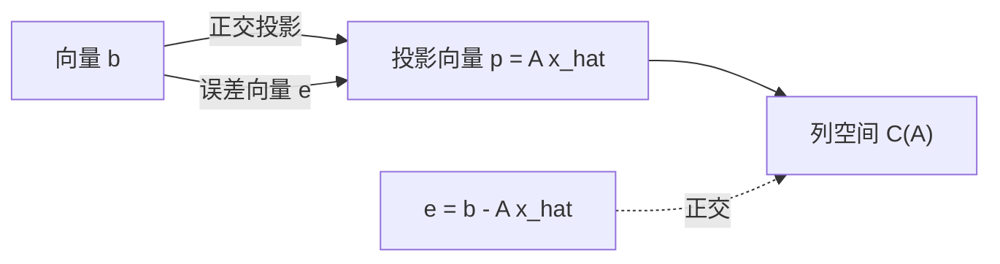

## 1. 引言：现实世界的数据与“最优”模型

现实世界中观察到的数据几乎总是包含“噪声”或“方差”。为了从这些数据中找出潜在的规律并预测未来或估计未知数据，我们需要建立一个能 **最好地** 拟合数据的数学模型。

最基础的方法，至今仍作为现代机器学习基础发挥着极其重要作用的，就是 **最小二乘法** (Method of Least Squares)。

在这篇文章中，我们不再仅仅是死记硬背公式，而是从线性代数（正交投影）这一优美的几何视角，深入探讨 **“为什么这种计算能找到最佳拟合直线”**。

## 2. 最小二乘法的直观概念

假设我们有 $n$ 个数据点 $(x_1, y_1), (x_2, y_2), \dots, (x_n, y_n)$。将这些点绘制在散点图上时，它们可能并没有完美地排成一条直线，但总体上似乎遵循着某条直线的趋势。

此时，设近似数据的直线方程为 $y = c + dx$。（这里，截距为 $c$ ，斜率为 $d$ ）。

对于每个数据点 $x_i$，该直线预测的值为 $\hat{y}_i = c + d x_i$。实际观测值 $y_i$ 与预测值 $\hat{y}_i$ 之间会产生一个误差（残差） $e_i$。

$$ e_i = y_i - \hat{y}_i = y_i - (c + d x_i) $$

最小二乘法是一种寻找能够使误差的 **平方和** 最小化的参数 $c$ 和 $d$ 的技术。误差的平方和 $E$ 定义如下：

$$ E = \sum_{i=1}^{n} e_i^2 = \sum_{i=1}^{n} (y_i - c - d x_i)^2 \quad (\text{误差函数的定义}) $$

平方的原因是为了防止正负误差相互抵消，而且它具有在数学上可微且易于处理的强大优势。



## 3. 使用线性代数进行公式化与“无解的方程”

当我们使用矩阵和向量的语言，即 **线性代数** 来重写这一点时，最小二乘法的真正优美之处便显现出来了。

假设所有数据点都完美地位于直线 $y = c + dx$ 上，我们得到以下 $n$ 个方程：

$$
\begin{cases}
c + d x_1 = y_1 \\
c + d x_2 = y_2 \\
\vdots \\
c + d x_n = y_n
\end{cases}
$$

用矩阵形式表示，我们得到：

$$
\begin{bmatrix}
1 & x_1 \\
1 & x_2 \\
\vdots & \vdots \\
1 & x_n
\end{bmatrix}
\begin{bmatrix}
c \\
d
\end{bmatrix}
=
\begin{bmatrix}
y_1 \\
y_2 \\
\vdots \\
y_n
\end{bmatrix}
$$

我们将其简写为 $A\mathbf{x} = \mathbf{b}$。这里，
- $A$ 是一个 $n \times 2$ 的 **设计矩阵** (Design Matrix)
- $\mathbf{x} = \begin{bmatrix} c \\ d \end{bmatrix}$ 是我们想要寻找的 **参数向量**
- $\mathbf{b}$ 是观测值的 **目标变量向量**

当数据具有方差时（3个或更多点不在同一直线上），不存在完美满足此方程 $A\mathbf{x} = \mathbf{b}$ 的解 $\mathbf{x}$。也就是说，方程组是 **不一致的** (inconsistent)。

## 4. 几何视角：列空间与正交投影

方程 $A\mathbf{x} = \mathbf{b}$ 无法求解在几何上意味着什么？

将矩阵 $A$ 乘以向量 $\mathbf{x}$ 意味着创建 $A$ 的每个列向量的线性组合。由 $A$ 的所有可能的线性组合所创建的空间称为 $A$ 的 **列空间** (Column Space)，记作 $C(A)$。

$$ A\mathbf{x} \in C(A) $$

无解意味着向量 $\mathbf{b}$ 位于这个列空间 $C(A)$ 的 **外部**。

我们正在寻找的不是一个完美的解，而是在 $C(A)$ 内一个尽可能接近 $\mathbf{b}$ 的向量。我们称之为 $A\hat{\mathbf{x}}$。此时，向量 $\mathbf{b}$ 与 $A\hat{\mathbf{x}}$ 之间的距离（的平方）最小。这正是最小二乘法。

在几何上，给出空间中某点 $\mathbf{b}$ 到某个平面 $C(A)$ 的最短距离的点，正是从 $\mathbf{b}$ 到 $C(A)$ 所作的 **垂足**。这被称为 **正交投影** (Orthogonal Projection)。

设误差向量为 $\mathbf{e} = \mathbf{b} - A\hat{\mathbf{x}}$，最短距离的条件是“误差向量 $\mathbf{e}$ 正交于列空间 $C(A)$”。

正交于列空间 $C(A)$ 意味着正交于 $A$ 的所有列向量。这意味着误差向量 $\mathbf{e}$ 属于矩阵 $A$ 的转置矩阵 $A^T$ 的 **左零空间** (Left Nullspace)。即，

$$ A^T \mathbf{e} = \mathbf{0} \quad (\text{正交条件}) $$

## 5. 正规方程的推导

让我们将 $\mathbf{e} = \mathbf{b} - A\hat{\mathbf{x}}$ 代入上述的正交条件。

$$ A^T (\mathbf{b} - A\hat{\mathbf{x}}) = \mathbf{0} $$
$$ A^T \mathbf{b} - A^T A \hat{\mathbf{x}} = \mathbf{0} $$

整理后，我们得到以下极其重要的方程。

$$ A^T A \hat{\mathbf{x}} = A^T \mathbf{b} \quad (\text{正规方程}) $$

这个方程被称为 **正规方程** (Normal Equation)。最初的 $A\mathbf{x} = \mathbf{b}$ 没有解，但这个在等式两边左乘 $A^T$ 的正规方程总是有解的。此外，如果 $A$ 的列向量是线性无关的，$A^T A$ 就是可逆的（具有逆矩阵），并且最优解 $\hat{\mathbf{x}}$ 被唯一确定如下：

$$ \hat{\mathbf{x}} = (A^T A)^{-1} A^T \mathbf{b} $$

这个公式是统计学和机器学习中最优美的结果之一。你可以仅仅通过正交性的几何概念得出这个结论，而无需使用微积分。



## 6. Python中的实现示例

让我们实际用程序来计算一下，而不仅仅是理论。使用 Python 中的数值计算库 NumPy，你可以非常容易地实现正规方程。

```python
import numpy as np

# 样本数据 (x 和 y)
x_data = np.array([1, 2, 3, 4, 5])
y_data = np.array([2.1, 3.9, 6.2, 8.1, 9.8])

# 创建设计矩阵 A
# 组合 x_data 的列和用于截距的 1 的列
# 使用 np.c_ 沿列方向连接
A = np.c_[np.ones(len(x_data)), x_data]
b = y_data

# 求解正规方程：(A^T A) x_hat = A^T b
# A.T 是 A 的转置，@ 表示矩阵乘法
A_T_A = A.T @ A
A_T_b = A.T @ b

# 使用 np.linalg.solve 求解方程组
# 在数值上比直接计算逆矩阵更稳定
x_hat = np.linalg.solve(A_T_A, A_T_b)

c_hat, d_hat = x_hat
print(f"最优截距: {c_hat:.4f}")
print(f"最优斜率: {d_hat:.4f}")
```

运行这段代码将计算出最拟合给定数据点的直线的截距和斜率。在幕后，它正是执行了前面推导出的矩阵计算。

## 7. 总结与未来发展

最小二乘法是从数据中估计模型参数的最强大、最标准的技术。使用微积分的知识，它可以被推导为“误差函数的梯度变为0的点”，但通过从线性代数的角度将其理解为“在列空间上的正交投影”，其数学结构的优美性便凸显出来。

这种方法并不局限于简单的直线拟合（简单回归）。通过在设计矩阵 $A$ 的列中添加如 $x^2, x^3$ 等项，它可以自然地扩展到 **多项式回归**，也可以发展为对每个数据点的重要性进行加权的 **加权最小二乘法**。

作为接近数据背后真相的第一步，对最小二乘法本质的理解具有不可估量的价值。
