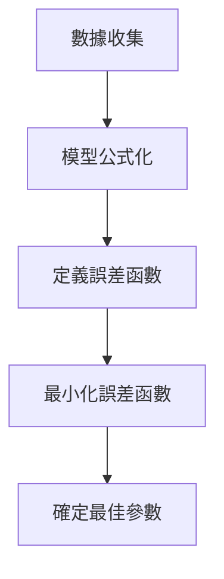

## 1. 引言：現實世界的數據與「最佳」模型

現實世界中觀察到的數據幾乎總是包含「雜訊」或「變異數」。為了從這些數據中找出潛在的規律並預測未來或估計未知數據，我們需要建立一個能 **最完美** 擬合數據的數學模型。

最基礎的方法，至今仍作為現代機器學習基礎發揮著極其重要作用的，就是 **[最小平方法](https://kenji.blog/zh-tw/p/method-of-least-squares/)** ([Method of Least Squares](https://kenji.blog/zh-tw/p/method-of-least-squares/))。

在這篇文章中，我們不再僅僅是死記硬背公式，而是從線性代數（正交投影）這一優美的幾何視角，深入探討 **「為什麼這種計算能找到最佳擬合直線」**。

## 2. [最小平方法](https://kenji.blog/zh-tw/p/method-of-least-squares/)的直觀概念

假設我們有 $n$ 個數據點 $(x_1, y_1), (x_2, y_2), \dots, (x_n, y_n)$。將這些點繪製在散佈圖上時，它們可能並沒有完美地排成一條直線，但總體上似乎遵循著某條直線的趨勢。

此時，設近似數據的直線方程式為 $y = c + dx$。（這裡，截距為 $c$ ，斜率為 $d$ ）。

對於每個數據點 $x_i$，該直線預測的值為 $\hat{y}_i = c + d x_i$。實際觀測值 $y_i$ 與預測值 $\hat{y}_i$ 之間會產生一個誤差（殘差） $e_i$。

$$ e_i = y_i - \hat{y}_i = y_i - (c + d x_i) $$

[最小平方法](https://kenji.blog/zh-tw/p/method-of-least-squares/)是一種尋找能夠使誤差的 **平方和** 最小化的參數 $c$ 和 $d$ 的技術。誤差的平方和 $E$ 定義如下：

$$ E = \sum_{i=1}^{n} e_i^2 = \sum_{i=1}^{n} (y_i - c - d x_i)^2 \quad (\text{誤差函數的定義}) $$

平方的原因是為了防止正負誤差相互抵消，而且它具有在數學上可微且易於處理的強大優勢。



## 3. 使用線性代數進行公式化與「無解的方程式」

當我們使用矩陣和向量的語言，即 **線性代數** 來重寫這一點時，[最小平方法](https://kenji.blog/zh-tw/p/method-of-least-squares/)的真正優美之處便顯現出來了。

假設所有數據點都完美地位於直線 $y = c + dx$ 上，我們得到以下 $n$ 個方程式：

$$
\begin{cases}
c + d x_1 = y_1 \\\\
c + d x_2 = y_2 \\\\
\vdots \\\\
c + d x_n = y_n
\end{cases}
$$

用矩陣形式表示，我們得到：

$$
\begin{bmatrix}
1 & x_1 \\\\
1 & x_2 \\\\
\vdots & \vdots \\\\
1 & x_n
\end{bmatrix}
\begin{bmatrix}
c \\\\
d
\end{bmatrix}
=
\begin{bmatrix}
y_1 \\\\
y_2 \\\\
\vdots \\\\
y_n
\end{bmatrix}
$$

我們將其簡寫為 $A\mathbf{x} = \mathbf{b}$。這裡，
- $A$ 是一個 $n \times 2$ 的 **設計矩陣** (Design Matrix)
- $\mathbf{x} = \begin{bmatrix} c \\\\ d \end{bmatrix}$ 是我們想要尋找的 **參數向量**
- $\mathbf{b}$ 是觀測值的 **目標變數向量**

當數據具有變異數時（3個或更多點不在同一直線上），不存在完美滿足此方程式 $A\mathbf{x} = \mathbf{b}$ 的解 $\mathbf{x}$。也就是說，聯立方程式是 **不一致的** (inconsistent)。

## 4. 幾何視角：行空間與正交投影

方程式 $A\mathbf{x} = \mathbf{b}$ 無法求解在幾何上意味著什麼？

將矩陣 $A$ 乘以向量 $\mathbf{x}$ 意味著創建 $A$ 的每個行向量的線性組合。由 $A$ 的所有可能的線性組合所創建的空間稱為 $A$ 的 **行空間** (Column Space)，記作 $C(A)$。

$$ A\mathbf{x} \in C(A) $$

無解意味著向量 $\mathbf{b}$ 位於這個行空間 $C(A)$ 的 **外部**。

我們正在尋找的不是一個完美的解，而是在 $C(A)$ 內一個盡可能接近 $\mathbf{b}$ 的向量。我們稱之為 $A\hat{\mathbf{x}}$。此時，向量 $\mathbf{b}$ 與 $A\hat{\mathbf{x}}$ 之間的距離（的平方）最小。這正是[最小平方法](https://kenji.blog/zh-tw/p/method-of-least-squares/)。

在幾何上，給出空間中某點 $\mathbf{b}$ 到某個平面 $C(A)$ 的最短距離的點，正是從 $\mathbf{b}$ 到 $C(A)$ 所作的 **垂足**。這被稱為 **正交投影** (Orthogonal Projection)。

設誤差向量為 $\mathbf{e} = \mathbf{b} - A\hat{\mathbf{x}}$，最短距離的條件是「誤差向量 $\mathbf{e}$ 正交於行空間 $C(A)$」。

正交於行空間 $C(A)$ 意味著正交於 $A$ 的所有行向量。這意味著誤差向量 $\mathbf{e}$ 屬於矩陣 $A$ 的轉置矩陣 $A^T$ 的 **左零空間** (Left Nullspace)。即，

$$ A^T \mathbf{e} = \mathbf{0} \quad (\text{正交條件}) $$

## 5. 正規方程式的推導

讓我們將 $\mathbf{e} = \mathbf{b} - A\hat{\mathbf{x}}$ 代入上述的正交條件。

$$ A^T (\mathbf{b} - A\hat{\mathbf{x}}) = \mathbf{0} $$
$$ A^T \mathbf{b} - A^T A \hat{\mathbf{x}} = \mathbf{0} $$

整理後，我們得到以下極其重要的方程式。

$$ A^T A \hat{\mathbf{x}} = A^T \mathbf{b} \quad (\text{正規方程式}) $$

這個方程式被稱為 **正規方程式** (Normal Equation)。最初的 $A\mathbf{x} = \mathbf{b}$ 沒有解，但這個在等式兩邊左乘 $A^T$ 的正規方程式總是有解的。此外，如果 $A$ 的行向量是線性獨立的，$A^T A$ 就是可逆的（具有反矩陣），並且最佳解 $\hat{\mathbf{x}}$ 被唯一確定如下：

$$ \hat{\mathbf{x}} = (A^T A)^{-1} A^T \mathbf{b} $$

這個公式是統計學和機器學習中最優美的結果之一。你可以僅僅透過正交性的幾何概念得出這個結論，而無需使用微積分。

```mermaid
flowchart LR
    b["向量 b"] -->|"正交投影"| p["投影向量 p = A x_hat"]
    p --> C["行空間 C("A")"]
    b -->|"誤差向量 e"| p
    e["e = b - A x_hat"] -.->|"正交"| C
```

## 6. Python中的實作範例

讓我們實際用程式來計算一下，而不僅僅是理論。使用 Python 中的數值計算函式庫 NumPy，你可以非常容易地實作正規方程式。

```python
import numpy as np

# 樣本數據 (x 和 y)
x_data = np.array([1, 2, 3, 4, 5])
y_data = np.array([2.1, 3.9, 6.2, 8.1, 9.8])

# 創建設計矩陣 A
# 組合 x_data 的行和用於截距的 1 的行
# 使用 np.c_ 沿著行的方向連接
A = np.c_[np.ones(len(x_data)), x_data]
b = y_data

# 求解正規方程式：(A^T A) x_hat = A^T b
# A.T 是 A 的轉置，@ 表示矩陣乘法
A_T_A = A.T @ A
A_T_b = A.T @ b

# 使用 np.linalg.solve 求解聯立方程式
# 在數值上比直接計算反矩陣更穩定
x_hat = np.linalg.solve(A_T_A, A_T_b)

c_hat, d_hat = x_hat
print(f"最佳截距: {c_hat:.4f}")
print(f"最佳斜率: {d_hat:.4f}")
```

執行這段程式碼將計算出最擬合給定數據點的直線的截距和斜率。在幕後，它正是執行了前面推導出的矩陣計算。

## 7. 總結與未來發展

[最小平方法](https://kenji.blog/zh-tw/p/method-of-least-squares/)是從數據中估計模型參數的最強大、最標準的技術。使用微積分的知識，它可以被推導為「誤差函數的梯度變為0的點」，但透過從線性代數的角度將其理解為「在行空間上的正交投影」，其數學結構的優美性便凸顯出來。

這種方法並不侷限於簡單的直線擬合（簡單迴歸）。透過在設計矩陣 $A$ 的行中添加如 $x^2, x^3$ 等項，它可以自然地擴展到 **多項式迴歸**，也可以發展為對每個數據點的重要性進行加權的 **加權[最小平方法](https://kenji.blog/zh-tw/p/method-of-least-squares/)**。

作為接近數據背後真相的第一步，對[最小平方法](https://kenji.blog/zh-tw/p/method-of-least-squares/)本質的理解具有不可估量的價值。
