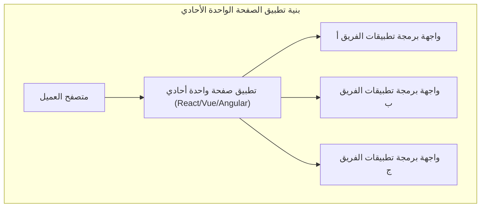
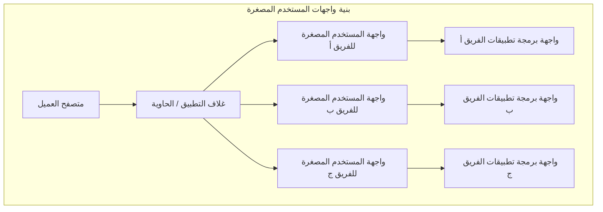
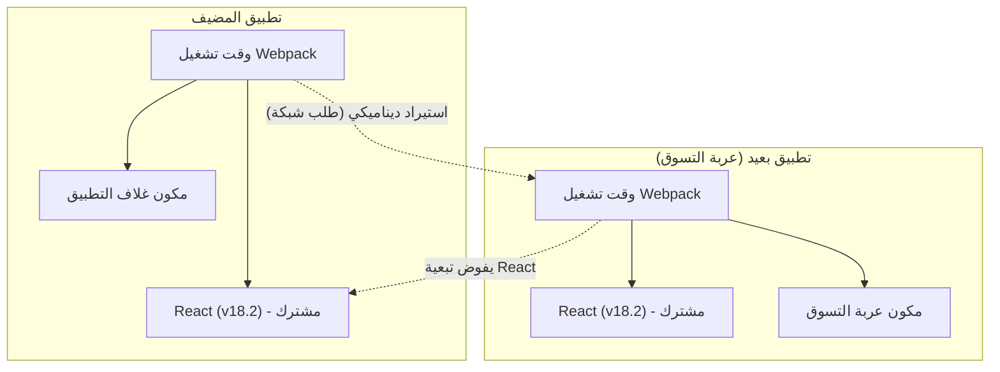

في السنوات الأخيرة، استمرت المتطلبات المفروضة على واجهة المستخدم وتجربة المستخدم (UI/UX) لتطبيقات الويب في الازدياد، وأصبحت قاعدة بيانات الواجهة الأمامية ضخمة بشكل لم يسبق له مثيل. مع ظهور تطبيق الصفحة الواحدة ( **SPA** )، تم تحقيق تجربة مستخدم غنية، ولكن "واجهة المستخدم الأحادية" المعقدة أصبحت تمثل عنق زجاجة في عملية التطوير.

في هذه المقالة، سنشرح بالتفصيل بنية **واجهات المستخدم المصغرة** ( Micro Frontends ) لتقسيم تطبيقات الصفحة الواحدة (SPA) الضخمة وزيادة استقلالية الفريق، مقارنةً بالخدمات المصغرة في الواجهة الخلفية، وطرق الدمج المختلفة، وصولاً إلى أنماط التنفيذ باستخدام **Module Federation** في Webpack، والذي أصبح المعيار الفعلي اليوم.

## 1. لماذا نحتاج إلى واجهات المستخدم المصغرة؟

### حدود الواجهة الأمامية الأحادية

في تطبيقات الويب المبكرة، كانت الواجهة الأمامية مجرد طبقة رقيقة لعرض HTML الذي تم إنشاؤه بواسطة الواجهة الخلفية. ومع ذلك، مع انتشار أطر العمل الحديثة مثل React و Vue و Angular، تم نقل الكثير من منطق الأعمال وإدارة الحالة إلى جانب العميل، مما أدى إلى زيادة هائلة في حجم كود الواجهة الأمامية.

ونتيجة لذلك، ظهرت **واجهة المستخدم الأحادية**. إن تجميع كل مكونات واجهة المستخدم، والتوجيه، وإدارة الحالة في مستودع واحد ضخم يؤدي إلى المشكلات التالية:

* **زيادة أوقات البناء** : مع نمو قاعدة التعليمات البرمجية، يزداد الوقت اللازم للبناء والاختبار بشكل كبير.
* **التبعيات بين الفرق وتكاليف التنسيق** : نظرًا لأن فرقًا متعددة تتعامل مع نفس قاعدة التعليمات البرمجية، تحدث تعارضات الدمج بشكل متكرر، وتتطلب جهودًا كبيرة لتنسيق دورات الإصدار.
* **تراكم الديون الفنية والتقييد** : نظرًا لأن التطبيق بأكمله يعتمد على إصدار إطار عمل أو مكتبة واحدة، يصبح من الصعب إجراء إعادة هيكلة تدريجية أو إدخال تقنيات جديدة.

### مقارنة مع الخدمات المصغرة للواجهة الخلفية

في عالم الواجهة الخلفية، انتشرت **بنية الخدمات المصغرة** على نطاق واسع، حيث يتم تقسيم النظام الأحادي الضخم لبناء مجموعة من الخدمات التي يمكن نشرها بشكل مستقل. يتيح ذلك لكل فريق أن يكون لديه قاعدة بيانات خاصة به، ومجموعة تقنيات، ودورة نشر، مما يحسن بشكل كبير من قابلية التوسع وسرعة التطوير.

ومع ذلك، حتى إذا تم تقسيم الواجهة الخلفية إلى خدمات مصغرة وتم تقسيمها حسب الفرق، فلا يمكن تحقيق استقلالية حقيقية من البداية إلى النهاية إذا ظلت واجهة المستخدم المقدمة للمستخدم (الواجهة الأمامية) أحادية. فإضافة ميزات من قبل كل فريق ستواجه في النهاية عنق زجاجة يتمثل في دمج الواجهة الأمامية.

**واجهات المستخدم المصغرة** هي نهج لحل هذه المشكلة وجلب نفس فوائد الخدمات المصغرة (النشر المستقل، والحرية التقنية، والفرق المستقلة) إلى تطوير الواجهة الأمامية.

## 2. ما هي واجهات المستخدم المصغرة؟

واجهات المستخدم المصغرة هي أسلوب معماري يتم فيه بناء تطبيق الويب كمجموعة من تطبيقات الواجهة الأمامية الصغيرة التي يتم تطويرها واختبارها ونشرها بواسطة فرق مستقلة.

### الفوائد الرئيسية

1. **النشر المستقل** : يمكن إصدار كل واجهة مستخدم مصغرة في أي وقت دون التأثير على الميزات الأخرى.
2. **استقلالية الفريق** : يمكن للفرق متعددة الوظائف المسؤولة عن مجال عمل معين، من قاعدة البيانات إلى واجهة المستخدم، اتخاذ القرارات بشكل مستقل.
3. **ضمان الحرية التقنية** : يمكن لكل فريق اختيار مجموعة التقنيات الأكثر ملاءمة لمتطلباته، مما يسهل الانتقال التدريجي (مثال: من Angular القديم إلى React الجديد).
4. **تحسين تحمل الأخطاء** : حتى إذا حدث خطأ في ميزة ما، لا يتعطل التطبيق بأكمله، ويمكن حصر نطاق الخطأ.

### العيوب والتحديات

من ناحية أخرى، تواجه واجهات المستخدم المصغرة تحديات فريدة.

* **تضخم حجم البيانات (Payload)** : نظرًا لأن تطبيقات الواجهة الأمامية المتعددة تعمل بشكل مستقل، فهناك خطر تنزيل المكتبات المشتركة (مثال: React نفسه) بشكل متكرر.
* **زيادة تعقيد التشغيل** : تتطلب إدارة العديد من المستودعات ومسارات CI/CD، مما يزيد من العبء على DevOps.
* **الحفاظ على تجربة مستخدم متسقة** : لدمج واجهات المستخدم التي طورتها فرق مختلفة، من الضروري استخدام نظام تصميم والابتكار لتوفير تجربة سلسة لا تبدو غريبة للمستخدم.

## 3. مقارنة البنية بين SPA الأحادي وواجهات المستخدم المصغرة

تقارن الرسوم البيانية التالية بين الاختلافات الهيكلية بين تطبيقات SPA الأحادية التقليدية وبنية واجهات المستخدم المصغرة.





كما يوضح الشكل أعلاه، في واجهات المستخدم المصغرة يوجد **App Shell** (تطبيق حاوية) يقوم بتحميل وتكامل تطبيقات الواجهة الأمامية التي طورتها كل فرقة بشكل ديناميكي. من خلال هذا، يتم تقسيم كل شيء من واجهة برمجة التطبيقات الخلفية إلى واجهة المستخدم عموديًا بالكامل، مما يحافظ على استقلالية كل فريق.

## 4. أنماط طرق الدمج

لتحقيق واجهات المستخدم المصغرة، فإن المفتاح الأكبر هو كيفية "دمج" التطبيقات المقسمة في شاشة واحدة. تُقسم طرق الدمج عمومًا إلى ثلاث فئات.

### 4.1. الدمج وقت البناء (Build-time Integration)

وهي طريقة تستخدم حزم NPM وما شابه ذلك لدمج الوحدات التي بناها كل فريق في عملية بناء التطبيق المضيف.

* **المزايا** : التنفيذ بسيط للغاية ويسهل إجراء التحليل الثابت. يمكن استخدام آلية مدير الحزم الحالي كما هي.
* **العيوب** : في كل مرة يتم فيها تحديث مكون تابع، يجب إعادة بناء التطبيق المضيف بأكمله وإعادة نشره. نظرًا لأن هذا يعيق "النشر المستقل"، وهو الهدف الرئيسي لواجهات المستخدم المصغرة، فإنه لا يُنصح به حاليًا في كثير من الأحيان.

### 4.2. الدمج من جانب الخادم (Server-side Integration)

عند بناء HTML على جانب الخادم، تقوم هذه الطريقة بجلب أجزاء HTML من كل واجهة مستخدم مصغرة، وتجميعها، وإرجاعها إلى العميل.

* **المزايا** : العرض الأولي سريع وممتاز لتحسين محركات البحث (SEO). لا يضع عبئًا على جانب العميل.
* **التقنيات النموذجية** : Nginx SSI (Server Side Includes)، و Edge Side Includes (ESI)، و Project Mosaic الذي طورته Zalando.
* **العيوب** : يزداد تعقيد البنية التحتية، وهناك حاجة إلى آليات إضافية لتحقيق تفاعلات غنية من جانب العميل (توجيه يشبه SPA).

### 4.3. الدمج من جانب العميل (Client-side Integration)

وهي طريقة تقوم بتحميل كل واجهة مستخدم مصغرة ودمجها ديناميكيًا على المتصفح (العميل). هذا هو النهج الأكثر انتشارًا في تطوير التطبيقات الحديثة المعتمدة على SPA.

#### 4.3.1. iframe

إنها الطريقة الكلاسيكية التي توفر عزلاً أكيدًا.

* **المزايا** : نطاق CSS و JavaScript معزول تمامًا، لذلك لا يحدث أي تداخل. يمكن التعايش بين أطر عمل مختلفة بأمان.
* **العيوب** : زيادة أعباء الأداء، وقد يؤثر سلبًا على محركات البحث (SEO). كما أن الاتصال بين إطارات iframe (مشاركة الحالة ومزامنة التوجيه) يحتاج إلى المرور عبر `postMessage`، مما يميل إلى التعقيد.

#### 4.3.2. Web Components

وهي طريقة تستخدم Web Components القياسية للمتصفح ( Custom Elements, Shadow DOM ) لتغليف المكونات ودمجها.

* **المزايا** : إنها تقنية قياسية لا تعتمد على إطار عمل معين وتتمتع بقابلية عالية للتشغيل البيني. يتيح Shadow DOM عزل CSS أيضًا.
* **العيوب** : على الرغم من أن دعم المتصفح ناضج، إلا أن التوافق مع العرض من جانب الخادم (SSR) ودمج إدارة الحالة العالمية يتطلب بعض الابتكار.

#### 4.3.3. Webpack Module Federation

وهو مكون إضافي ثوري تم تقديمه في Webpack 5، وهو حاليًا **المعيار الفعلي** للدمج من جانب العميل. يتيح لك تحميل التعليمات البرمجية ديناميكيًا من بنية Webpack أخرى في وقت التشغيل.

## 5. نظرة متعمقة على Webpack Module Federation

غيّر Webpack Module Federation نموذج تنفيذ واجهات المستخدم المصغرة بشكل كبير. نوضح هنا آلياته وأمثلة على تنفيذه بالتفصيل.

### الآلية وحل التبعيات

في Module Federation، يمكن للتطبيق أن يلعب دورًا كمضيف ( **Host** ) وعن بُعد ( **Remote** ).
المضيف هو التطبيق المسؤول عن التحميل الأولي، بينما يوفر التطبيق البعيد الوحدات التي يتم تحميلها ديناميكيًا.

الجدير بالذكر هو **آلية حل التبعيات**. عندما تستخدم العديد من التطبيقات البعيدة نفس المكتبة (مثال: React أو Lodash)، يمنع Module Federation التنزيلات المكررة ويعيد استخدام نسخة واحدة بذكاء من المكتبة المشتركة بين المضيف والبعيد.



يوضح الشكل أعلاه أن التطبيق البعيد لا يقوم بتنزيل React الخاص به، ولكنه يعيد استخدام React المقدم من التطبيق المضيف. بفضل هذا، يتم حل نقطة الضعف في الدمج من جانب العميل، وهي "تضخم حجم البيانات"، ببراعة.

### مثال على التنفيذ: إعداد ModuleFederationPlugin

دعنا نلقي نظرة على مثال فعلي لإعداد Webpack 5. هنا، نفترض تكوينًا حيث يقوم التطبيق المضيف بتحميل مكون تطبيق بعيد (ShoppingCart).

#### ملف webpack.config.js لجانب البعيد (ShoppingCart)

في جانب البعيد، نقوم بتعريف المكونات المكشوفة والمكتبات المشتركة.

```javascript
// remote/webpack.config.js
const { ModuleFederationPlugin } = require('webpack').container;
const path = require('path');

module.exports = {
  entry: './src/index',
  mode: 'development',
  output: {
    publicPath: 'auto',
  },
  plugins: [
    new ModuleFederationPlugin({
      name: 'shoppingCart',          // اسم فريد للتطبيق
      filename: 'remoteEntry.js',    // نقطة الإدخال المحملة من الخارج
      exposes: {
        './CartWidget': './src/components/CartWidget', // المكونات المكشوفة
      },
      shared: {                      // التبعيات المشتركة
        react: { singleton: true, requiredVersion: '^18.2.0' },
        'react-dom': { singleton: true, requiredVersion: '^18.2.0' },
      },
    }),
  ],
};
```

#### ملف webpack.config.js لجانب المضيف

في جانب المضيف، نحدد من أين يتم تحميل التطبيق البعيد.

```javascript
// host/webpack.config.js
const { ModuleFederationPlugin } = require('webpack').container;

module.exports = {
  entry: './src/index',
  mode: 'development',
  plugins: [
    new ModuleFederationPlugin({
      name: 'hostApp',
      remotes: {
        // اسم_البعيد@رابط_البعيد/remoteEntry.js
        shoppingCart: 'shoppingCart@http://localhost:3001/remoteEntry.js',
      },
      shared: {
        react: { singleton: true, eager: true },
        'react-dom': { singleton: true, eager: true },
      },
    }),
  ],
};
```

#### مثال على الدمج بالتحميل البطيء في React

في كود React لجانب المضيف، نستخدم `React.lazy` و `Suspense` لتحميل المكون البعيد ببطء عبر الشبكة.

```javascript
// host/src/App.jsx
import React, { Suspense } from 'react';

// تحديد اسم البعيد/اسم المكشوف المعرف في webpack.config.js
const RemoteCartWidget = React.lazy(() => import('shoppingCart/CartWidget'));

const App = () => {
  return (
    <div>
      <header>
        <h1>My E-Commerce Site</h1>
      </header>
      <main>
        <h2>Product List</h2>
        {/* ... تقديم قائمة المنتجات ... */}
      </main>
      <aside>
        {/* تحديد واجهة المستخدم الاحتياطية حتى يتم تحميل المكون البعيد */}
        <Suspense fallback={<div>Loading Cart...</div>}>
          <RemoteCartWidget />
        </Suspense>
      </aside>
    </div>
  );
};

export default App;
```

بهذه الطريقة، باستخدام Module Federation، يمكن للمطورين دمج المكونات المنشورة في مستودعات منفصلة وخوادم منفصلة بنفس الشعور تمامًا مثل استيراد المكونات المحلية.

## 6. مشاركة الحالة وتحديات التوجيه

عند تنفيذ واجهات المستخدم المصغرة، فإن أكثر الأمور صعوبة من الناحية التقنية هي "مشاركة الحالة" و"التوجيه". يجب الحفاظ على استقلالية كل فريق مع تقديم تجربة سلسة للمستخدمين.

### نهج إدارة الحالة

في واجهات المستخدم المصغرة، تعتبر مشاركة إدارة الحالة العالمية (مثال: متجر واحد ضخم لـ [Redux](https://kenji.blog/ar/p/state-management-history-redux-context-recoil-zustand/)) **نمطًا مضادًا**. هذا لأنه يخلق ارتباطًا وثيقًا بين التطبيقات ويعيق النشر المستقل.

بدلاً من ذلك، يوصى بالأساليب المفككة التالية.

1. **Custom Events / Event Bus** : استخدام واجهة برمجة تطبيقات المتصفح القياسية `CustomEvent` أو مكتبة Event Bus خفيفة الوزن للتواصل باستخدام نمط النشر-الاشتراك (Publish-Subscribe).
   * مثال: عند الضغط على زر "إضافة إلى عربة التسوق"، يتم إطلاق الحدث `ITEM_ADDED_TO_CART`، ويقوم تطبيق Cart بالاستماع إليه وتحديث حالته الخاصة.
2. **عناوين URL / معلمات الاستعلام** : آلية مشاركة الحالة الأكثر قوة هي URL. من خلال الاحتفاظ باستعلامات البحث والفلاتر المحددة في URL، يمكن لأي واجهة مستخدم مصغرة مزامنة الحالة ببساطة عن طريق تحليل URL.
3. **Web Storage** : بالنسبة للبيانات التي تتطلب استمرارية ولا تتغير بشكل متكرر، مثل رموز المصادقة وإعدادات المستخدم، تتم مشاركتها من خلال `localStorage` و `sessionStorage`.

### استراتيجيات التوجيه

التوجيه هو عنصر حاسم يحدد مستوى التحكم في تنقل المستخدم.

* **نمط App Shell (توجيه من جانب العميل)** :
  يحتوي التطبيق الحاوية (App Shell) في المستوى الأعلى على جهاز التوجيه الرئيسي (مثال: `react-router`)، ويقوم بتركيب / إلغاء تركيب واجهات المستخدم المصغرة المناسبة بناءً على مسار URL.
  * `/products/*` -> تفويض التوجيه إلى تطبيق فريق المنتج.
  * `/checkout/*` -> التفويض لتطبيق فريق الدفع.
  داخل كل واجهة مستخدم مصغرة، يمكن أن يكون هناك توجيه داخلي إضافي.

* **التوجيه في طبقة [BFF](https://kenji.blog/ar/p/microservices-architecture-bff-api-gateway/) (الواجهة الخلفية للواجهة الأمامية)** :
  طريقة لتقييم المسار على مستوى البنية التحتية للخادم (مثال: Nginx أو بوابة API)، وتقديم HTML لواجهة المستخدم المصغرة المناسبة من البداية. يحدث تحديث قوي عند الانتقال بين الصفحات، لكن درجة الفصل في البنية المعمارية هي الأعلى.

## 7. التأثير على المنظمة واستقلالية الفريق

يعتبر **قانون كونواي** ("المنظمة التي تصمم نظامًا تنتج تصميمًا ينسخ هيكل الاتصال لتلك المنظمة") مهمًا للغاية في هندسة البرمجيات.

يمكن القول إن واجهات المستخدم المصغرة هي تطبيق **عكسي لقانون كونواي**، حيث يتم عكس هذا القانون. بمعنى آخر، لتحقيق البنية المعمارية المرغوبة (غير مرتبطة بشدة ومستقلة)، يتم تحسين الهيكل التنظيمي ليتناسب معها.

بدلاً من المنظمات الوظيفية التقليدية مثل "فريق الواجهة الأمامية" و "فريق الواجهة الخلفية" و "فريق قاعدة البيانات"، من الضروري تشكيل **فريق متعدد الوظائف** مخصص لمجال عمل معين (مثال: "البحث"، "الدفع"، "إدارة المستخدمين"). تظهر القيمة الحقيقية لواجهات المستخدم المصغرة فقط عندما يتحمل كل فريق المسؤولية الكاملة عن مجاله، من واجهة برمجة التطبيقات الخلفية إلى مكونات واجهة المستخدم الأمامية.

## 8. الخاتمة

شرحنا بالتفصيل بنية **واجهات المستخدم المصغرة** لتقسيم SPA الضخم وبناء نظام تطوير مستدام.

مع ظهور Webpack Module Federation، أصبح الدمج الديناميكي من جانب العميل أسهل بكثير. ومع ذلك، فإن واجهات المستخدم المصغرة ليست مجرد حلول تقنية للمشكلات، بل هي تحول نموذجي يمتد إلى هيكل المنظمة وعملية تطوير الفريق.

سيكون مفتاح النجاح هو التقييم الدقيق لمقايضة زيادة التعقيد، واختيار طريقة الدمج والبنية المناسبة التي تتناسب مع حجم الفريق ومرحلة نمو المنتج.
