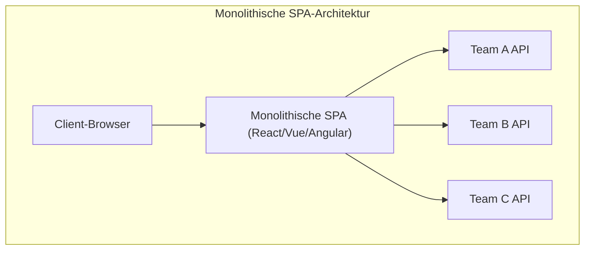
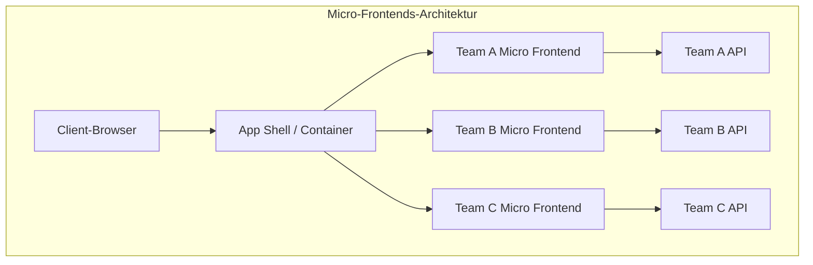
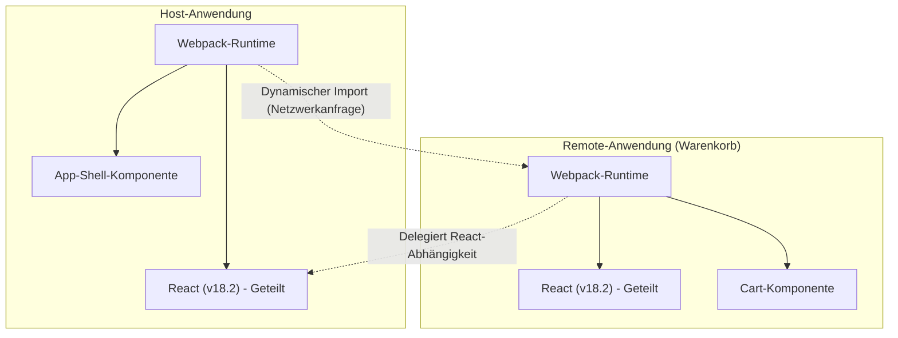

In den letzten Jahren sind die Anforderungen an UI/UX von Webanwendungen stetig gestiegen, und die Codebasis im Frontend ist so groß wie nie zuvor. Während das Aufkommen von Single Page Applications ( **SPA** ) reichhaltige Benutzererlebnisse ermöglicht hat, wird der komplex gewordene „Frontend-Monolith“ zunehmend zu einem Engpass in der Entwicklung.

Dieser Artikel erklärt detailliert die Architektur der **Micro Frontends** (Mikro-Frontends), die dazu dient, riesige SPAs aufzuteilen und die Autonomie von Teams zu erhöhen. Dabei werden der Vergleich mit Backend-[Microservices](https://kenji.blog/de/p/microservices-architecture-bff-api-gateway/), verschiedene Integrationsmethoden sowie Implementierungsmuster unter Verwendung der **Module Federation** von Webpack, die sich als aktueller De-facto-Standard etabliert, behandelt.

## 1. Warum sind Micro Frontends notwendig?

### Die Grenzen monolithischer Frontends

In frühen Webanwendungen war das Frontend lediglich eine dünne Schicht zur Darstellung von durch das Backend generiertem HTML. Durch die Verbreitung moderner Frameworks wie React, Vue und Angular wurden jedoch große Teile der Geschäftslogik und des [Zustand](https://kenji.blog/de/p/state-management-history-redux-context-recoil-zustand/)smanagements auf die Client-Seite verlagert, was zu einer explosionsartigen Zunahme des Frontend-Codes führte.

Das Ergebnis ist der **Frontend-Monolith**. Indem alle UI-Komponenten, das Routing und das Zustandsmanagement in einem einzigen riesigen Repository zusammengefasst werden, treten folgende Probleme auf:

* **Verlängerte Build-Zeiten**: Mit wachsender Codebasis steigt die für Builds und Tests benötigte Zeit exponentiell an.
* **Abhängigkeiten und Koordinationsaufwand zwischen Teams**: Da mehrere Teams an derselben Codebasis arbeiten, kommt es häufig zu Merge-Konflikten, und die Abstimmung der Release-Zyklen erfordert enormen Aufwand.
* **Anhäufung technischer Schulden und [Lock](https://kenji.blog/de/p/rdbms-transaction-acid-isolation-level-lock/)-in**: Da die gesamte Anwendung an bestimmte Versionen eines einzelnen Frameworks oder von Bibliotheken gebunden ist, werden schrittweises Refactoring und die Einführung neuer Technologien erschwert.

### Kontrast zu [Microservices](https://kenji.blog/de/p/microservices-architecture-bff-api-gateway/) im Backend

In der Backend-Welt hat sich die **Microservices-Architektur** weit verbreitet, bei der ein riesiger Monolith aufgeteilt und eine Sammlung unabhängig bereitstellbarer Dienste aufgebaut wird. Dies ermöglicht es jedem Team, eigene Datenbanken, Technologie-Stacks und Deployment-Zyklen zu haben, was die Skalierbarkeit und Entwicklungsgeschwindigkeit drastisch verbessert.

Selbst wenn das Backend in Microservices unterteilt ist, lässt sich jedoch keine echte Ende-zu-Ende-Autonomie erreichen, wenn die dem Benutzer präsentierte UI (Frontend) ein einziger Monolith bleibt. Die Einführung neuer Funktionen durch die jeweiligen Teams stößt letztlich auf den Engpass der Frontend-Integration.

**Micro Frontends** ist ein Ansatz, der dieses Problem löst und der Frontend-Entwicklung dieselben Vorteile bringt wie Microservices (unabhängiges Deployment, technologische Freiheit, autonome Teams).

## 2. Was sind Micro Frontends?

Micro Frontends ist ein Architekturstil, bei dem eine Webanwendung als Sammlung kleiner Frontend-Anwendungen aufgebaut wird, die von unabhängigen Teams entwickelt, getestet und bereitgestellt werden.

### Hauptvorteile

1. **Unabhängiges Deployment**: Jedes Micro Frontend kann jederzeit freigegeben werden, ohne andere Funktionen zu beeinträchtigen.
2. **Team-Autonomie**: Cross-funktionale Teams, die für eine bestimmte Geschäftsdomäne von der Datenbank bis zur UI verantwortlich sind, können unabhängige Entscheidungen treffen.
3. **Sicherstellung technologischer Freiheit**: Jedes Team kann den für die Anforderungen optimalen Technologie-[Stack](https://kenji.blog/de/p/c-language-pointers-memory-management-stack-heap/) wählen, was schrittweise Migrationen (z. B. vom alten Angular zum neuen React) erleichtert.
4. **Verbesserte Fehlertoleranz**: Selbst wenn in einigen Funktionen Fehler auftreten, stürzt nicht die gesamte Anwendung ab, sondern der Fehlerbereich kann isoliert werden.

### Nachteile und Herausforderungen

Andererseits bringen Micro Frontends auch spezifische Herausforderungen mit sich.

* **Payload-Bloat**: Da mehrere Frontend-Anwendungen unabhängig voneinander arbeiten, besteht die Gefahr, dass gemeinsame Bibliotheken (z. B. React selbst) mehrfach heruntergeladen werden.
* **Zunehmende operative Komplexität**: Die Verwaltung zahlreicher Repositories und CI/CD-Pipelines erhöht den DevOps-Aufwand.
* **Aufrechterhaltung einer konsistenten UX**: Um von verschiedenen Teams entwickelte UIs zu integrieren, ist es unerlässlich, Designsysteme zu nutzen und ein nahtloses Benutzererlebnis zu gewährleisten, das sich nicht fremd anfühlt.

## 3. Architekturvergleich: Monolithische SPA vs. Micro Frontends

Die strukturellen Unterschiede zwischen einer traditionellen monolithischen SPA und einer Micro-Frontend-Architektur werden in den folgenden Diagrammen verglichen.





Wie die obige Abbildung zeigt, gibt es bei Micro Frontends eine **App Shell** (Container-Anwendung), die die von den einzelnen Teams entwickelten Frontend-Anwendungen dynamisch lädt und integriert. Dadurch werden die API des Backends und die UI vollständig vertikal aufgeteilt, was die Unabhängigkeit jedes Teams bewahrt.

## 4. Muster von Integrationsmethoden

Um Micro Frontends zu realisieren, ist der größte Schlüssel, wie die aufgeteilten Anwendungen in einem einzigen Bildschirm „integriert“ werden. Integrationsmethoden werden grob in drei Kategorien unterteilt.

### 4.1. Build-Zeit-Integration (Build-time Integration)

Dies ist eine Methode, bei der von jedem Team erstellte Module mithilfe von NPM-Paketen usw. während des Build-Prozesses der Host-Anwendung integriert werden.

* **Vorteile**: Die Implementierung ist sehr einfach und statische Analysen sind leicht durchführbar. Die Mechanismen bestehender Paketmanager können direkt genutzt werden.
* **Nachteile**: Jedes Mal, wenn eine abhängige Komponente aktualisiert wird, muss die gesamte Host-Anwendung neu gebuildet und bereitgestellt werden. Da dies das Hauptziel von Micro Frontends, nämlich das „unabhängige Deployment“, behindert, wird diese Methode heute oft nicht empfohlen.

### 4.2. Serverseitige Integration (Server-side Integration)

Eine Methode, bei der während der Erstellung von HTML auf der Serverseite HTML-Fragmente von den einzelnen Micro Frontends abgerufen, kombiniert und an den Client zurückgegeben werden.

* **Vorteile**: Das anfängliche Rendern ist schnell und es ist SEO-freundlich. Der Client wird nicht belastet.
* **Repräsentative Technologien**: SSI (Server Side Includes) von Nginx, Edge Side Includes (ESI) und Project Mosaic (entwickelt von Zalando) gehören dazu.
* **Nachteile**: Die Komplexität der Infrastruktur steigt, und für reichhaltige clientseitige Interaktionen (SPA-artiges Routing) sind zusätzliche Mechanismen erforderlich.

### 4.3. Clientseitige Integration (Client-side Integration)

Hierbei werden die einzelnen Micro Frontends dynamisch im Browser (Client) geladen und integriert. Dies ist der vorherrschende Ansatz bei der modernen, SPA-basierten Entwicklung.

#### 4.3.1. iframe

Die klassischste Methode, die eine verlässliche Isolation bietet.

* **Vorteile**: Der Gültigkeitsbereich von CSS und JavaScript ist vollständig isoliert, sodass es zu keinen Interferenzen kommt. Verschiedene Frameworks können sicher koexistieren.
* **Nachteile**: Der Performance-Overhead ist groß und kann SEO negativ beeinflussen. Zudem muss die Kommunikation zwischen iframes ([Zustand](https://kenji.blog/de/p/state-management-history-redux-context-recoil-zustand/)sfreigabe oder Synchronisierung von Routing) über `postMessage` erfolgen, was schnell komplex wird.

#### 4.3.2. Web Components

Eine Methode, die die Browser-Standardtechnologie Web Components (Custom Elements, Shadow DOM) verwendet, um Komponenten zu kapseln und zu integrieren.

* **Vorteile**: Es ist ein framework-unabhängiger Standard mit hoher Interoperabilität. CSS-Isolation ist durch Shadow DOM ebenfalls möglich.
* **Nachteile**: Obwohl die Browser-Unterstützung ausgereift ist, bedarf es bei der Kombination mit SSR (Server-Side Rendering) und bei der Integration von globalem [Zustand](https://kenji.blog/de/p/state-management-history-redux-context-recoil-zustand/)smanagement einiger Kreativität.

#### 4.3.3. Webpack Module Federation

Dieses bahnbrechende Plugin wurde mit Webpack 5 eingeführt und ist mittlerweile der **De-facto-Standard** für clientseitige Integration. Es ermöglicht das dynamische Laden von Code aus anderen Webpack-Builds zur Laufzeit.

## 5. Webpack Module Federation im Detail

Webpack Module Federation hat das Paradigma der Implementierung von Micro Frontends drastisch verändert. Hier werden die Funktionsweise und Implementierungsbeispiele ausführlich erklärt.

### Funktionsweise und Abhängigkeitsauflösung

Bei Module Federation kann eine Anwendung sowohl die Rolle des **Host** (Gastgebers) als auch des **Remote** (Entfernten) einnehmen.
Der Host ist die Anwendung, die für das anfängliche Laden verantwortlich ist, während der Remote dynamisch geladene Module bereitstellt.

Besonders hervorzuheben ist der Mechanismus zur **Auflösung von Abhängigkeiten**. Wenn mehrere Remote-Anwendungen dieselbe Bibliothek (z. B. React oder Lodash) verwenden, verhindert Module Federation das doppelte Herunterladen und verwendet eine einzige Instanz der geteilten Bibliothek auf intelligente Weise zwischen Host und Remote wieder.



Die obige Abbildung zeigt, wie die Remote-Anwendung nicht ihr eigenes React herunterlädt, sondern das vom Host bereitgestellte React wiederverwendet. Dadurch wird die "Aufblähung der Nutzlast" (Payload-Bloat), eine Schwäche der clientseitigen Integration, bravourös gelöst.

### Implementierungsbeispiel: Konfiguration des ModuleFederationPlugin

Sehen wir uns ein tatsächliches Einstellungsbeispiel für Webpack 5 an. Hier gehen wir davon aus, dass die Host-Anwendung eine Komponente einer Remote-Anwendung (ShoppingCart) lädt.

#### webpack.config.js der Remote-Seite (ShoppingCart)

Auf der Remote-Seite werden die freizugebenden Komponenten und gemeinsam genutzten Bibliotheken definiert.

```javascript
// remote/webpack.config.js
const { ModuleFederationPlugin } = require('webpack').container;
const path = require('path');

module.exports = {
  entry: './src/index',
  mode: 'development',
  output: {
    publicPath: 'auto',
  },
  plugins: [
    new ModuleFederationPlugin({
      name: 'shoppingCart',          // Eindeutiger Name der Anwendung
      filename: 'remoteEntry.js',    // Von außen geladener Einstiegspunkt
      exposes: {
        './CartWidget': './src/components/CartWidget', // Zu exportierende Komponente
      },
      shared: {                      // Gemeinsam genutzte Abhängigkeiten
        react: { singleton: true, requiredVersion: '^18.2.0' },
        'react-dom': { singleton: true, requiredVersion: '^18.2.0' },
      },
    }),
  ],
};
```

#### webpack.config.js der Host-Seite

Auf der Host-Seite wird definiert, von wo die Remote-Anwendung geladen werden soll.

```javascript
// host/webpack.config.js
const { ModuleFederationPlugin } = require('webpack').container;

module.exports = {
  entry: './src/index',
  mode: 'development',
  plugins: [
    new ModuleFederationPlugin({
      name: 'hostApp',
      remotes: {
        // remoteName@remoteURL/remoteEntry.js
        shoppingCart: 'shoppingCart@http://localhost:3001/remoteEntry.js',
      },
      shared: {
        react: { singleton: true, eager: true },
        'react-dom': { singleton: true, eager: true },
      },
    }),
  ],
};
```

#### Beispiel für die Integration mit verzögertem Laden in React

Im React-Code auf der Host-Seite werden `React.lazy` und `Suspense` verwendet, um Remote-Komponenten asynchron über das Netzwerk zu laden.

```javascript
// host/src/App.jsx
import React, { Suspense } from 'react';

// Angegeben als remotesName/exposesName, die in webpack.config.js definiert sind
const RemoteCartWidget = React.lazy(() => import('shoppingCart/CartWidget'));

const App = () => {
  return (
    <div>
      <header>
        <h1>My E-Commerce Site</h1>
      </header>
      <main>
        <h2>Product List</h2>
        {/* ... Rendern der Produktliste ... */}
      </main>
      <aside>
        {/* Fallback-UI angeben, solange die Remote-Komponente geladen wird */}
        <Suspense fallback={<div>Loading Cart...</div>}>
          <RemoteCartWidget />
        </Suspense>
      </aside>
    </div>
  );
};

export default App;
```

Durch die Verwendung von Module Federation können Entwickler auf diese Weise Komponenten integrieren, die in verschiedenen Repositories und auf verschiedenen Servern bereitgestellt werden, mit demselben Gefühl, als würden sie lokale Komponenten importieren.

## 6. Herausforderungen bei der [Zustand](https://kenji.blog/de/p/state-management-history-redux-context-recoil-zustand/)steilung und beim Routing

Bei der Implementierung von Micro Frontends sind die "Zustandsteilung" (State Sharing) und das "Routing" technisch am schwierigsten. Die Autonomie jedes Teams muss gewahrt bleiben, während dem Benutzer ein nahtloses Erlebnis geboten wird.

### Ansätze zum Zustandsmanagement

In Micro Frontends gilt die gemeinsame Nutzung eines globalen Zustandsmanagements (z. B. ein riesiger einzelner Store von [Redux](https://kenji.blog/de/p/state-management-history-redux-context-recoil-zustand/)) als **Anti-Pattern**. Dies liegt daran, dass es eine enge Kopplung zwischen den Anwendungen schafft und unabhängiges Deployment behindert.

Stattdessen werden lose gekoppelte Ansätze wie die folgenden empfohlen.

1. **Custom Events / Event Bus**: Verwenden Sie die Standard-Browser-API `CustomEvent` oder eine leichtgewichtige Event-Bus-Bibliothek, um nach dem Publish-Subscribe-Muster zu kommunizieren.
   * Beispiel: Wenn der Button "In den Warenkorb" geklickt wird, wird das Ereignis `ITEM_ADDED_TO_CART` ausgelöst, das von der Cart-Anwendung empfangen wird, um ihren eigenen [Zustand](https://kenji.blog/de/p/state-management-history-redux-context-recoil-zustand/) zu aktualisieren.
2. **URL / Query-Parameter**: Der robusteste Mechanismus zur Zustandsteilung ist die URL. Indem Suchanfragen oder ausgewählte Filter in die URL aufgenommen werden, kann jedes Micro Frontend seinen Zustand einfach durch Parsen der URL synchronisieren.
3. **Web Storage**: Dauerhaft benötigte Daten mit geringer Änderungsfrequenz wie Authentifizierungstokens und Benutzereinstellungen werden über `localStorage` oder `sessionStorage` geteilt.

### Strategien für das Routing

Das Routing ist ein wichtiges Element bei der Entscheidung, auf welcher Ebene die Benutzernavigation gesteuert wird.

* **App Shell-Muster (Clientseitiges Routing)**:
  Eine übergeordnete Container-Anwendung (App Shell) hält den Haupt-Router (z. B. `react-router`) und mountet/unmountet die entsprechenden Micro Frontends abhängig vom URL-Pfad.
  * `/products/*` -> Delegiert das Routing an die Anwendung des Produktteams.
  * `/checkout/*` -> Delegiert an die Anwendung des Zahlungs-Teams.
  Innerhalb jedes Micro Frontends kann es zudem ein eigenes internes Routing geben.

* **Routing in der [BFF](https://kenji.blog/de/p/microservices-architecture-bff-api-gateway/)-Ebene (Backend For Frontend)**:
  Hier wird der Pfad auf der Ebene der Serverinfrastruktur (z. B. Nginx oder API-Gateway) bewertet, und von Beginn an wird der HTML-Code des passenden Micro Frontends serviert. Bei Seitenwechseln kommt es zu einem Hard Refresh, aber der Trennungsgrad der Architektur ist am höchsten.

## 7. Auswirkungen auf die Organisation und Team-Autonomie

**Conways Gesetz** ("Organisationen, die Systeme entwerfen, sind gezwungen, Entwürfe zu erstellen, die Kopien der Kommunikationsstrukturen dieser Organisationen sind") ist für die Softwarearchitektur von entscheidender Bedeutung.

Micro Frontends können als Umsetzung des **umgekehrten Conway-Gesetzes** (Inverse Conway Maneuver) betrachtet werden. Das bedeutet, dass die Organisationsstruktur optimiert wird, um die gewünschte Architektur (lose gekoppelt und autonom) zu verwirklichen.

Anstelle der traditionellen funktionsbasierten Organisation wie "Frontend-Team", "Backend-Team" und "Datenbank-Team" ist es unerlässlich, **cross-funktionale Teams** zu bilden, die auf bestimmte Geschäftsdomänen (z. B. "Suche", "Zahlung", "Benutzerverwaltung") spezialisiert sind. Der wahre Wert von Micro Frontends zeigt sich erst dann, wenn jedes Team die volle Verantwortung für seine Domäne von der Backend-API bis zur Frontend-UI-Komponente übernimmt.

## 8. Fazit

Wir haben detailliert die Architektur der **Micro Frontends** erläutert, um riesige SPAs aufzuteilen und eine nachhaltige Entwicklungsstruktur aufzubauen.

Mit dem Erscheinen von Webpack Module Federation ist die dynamische clientseitige Integration drastisch einfacher geworden. Micro Frontends sind jedoch nicht nur eine technische Lösung, sondern ein Paradigmenwechsel, der tief in die Organisationsstruktur und die Entwicklungsprozesse von Teams eingreift.

Eine genaue Bewertung des Kompromisses zwischen der steigenden Komplexität und die Auswahl der richtigen Integrationsmethode und Architektur im Einklang mit der Teamgröße und der Wachstumsphase des Produkts sind der Schlüssel zum Erfolg.
