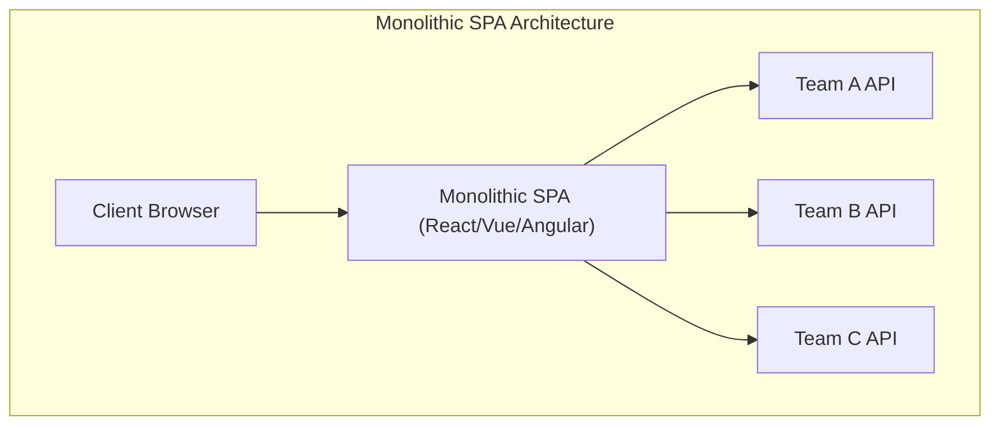
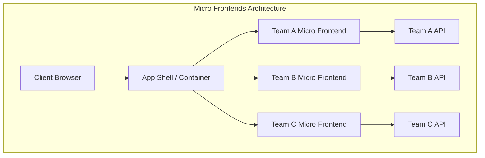
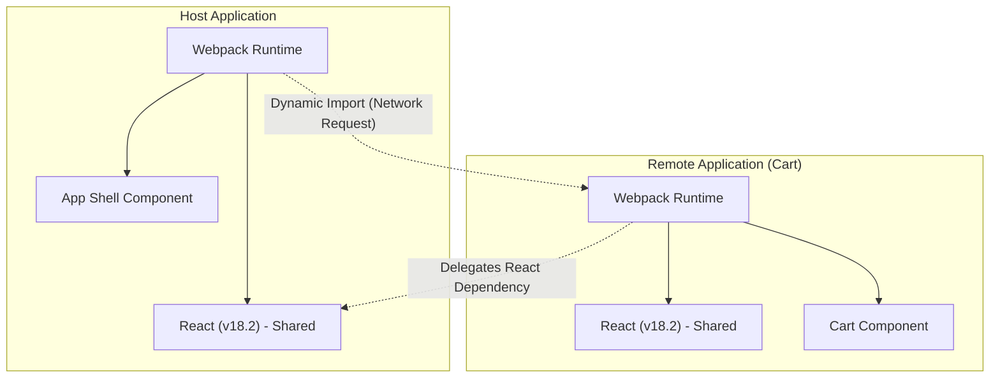

In recent years, demands for UI/UX in web applications have continued to rise, and frontend codebases have grown larger than ever before. While the rise of Single Page Applications (**SPA**) has realized rich user experiences, the resulting complex "frontend monolith" is becoming a bottleneck in development.

In this article, we will explain in great detail the **Micro Frontends** architecture for splitting giant SPAs and increasing team autonomy. We will cover its contrast with backend microservices, various integration methods, and implementation patterns using Webpack's **Module Federation**, which is becoming the modern de facto standard.

## 1. Why Do We Need Micro Frontends?

### The Limits of Monolithic Frontends

In early web applications, the frontend was merely a thin layer for rendering HTML generated by the backend. However, with the spread of modern frameworks like React, Vue, and Angular, much of the business logic and state management has been delegated to the client side, causing frontend code volume to explode.

The result of this is the **frontend monolith**. By centralizing all UI components, routing, and state management in a single massive repository, the following problems have become apparent:

* **Prolonged Build Times**: As the codebase grows, the time required for builds and tests increases exponentially.
* **Inter-team Dependencies and Coordination Costs**: Because multiple teams touch the same codebase, merge conflicts occur frequently, and adjusting release cycles requires significant effort.
* **Accumulation of Technical Debt and Lock-in**: Since the entire application relies on a single version of a framework or library, gradual refactoring or the introduction of new technologies becomes difficult.

### Contrast with Backend Microservices

In the backend world, the **Microservices Architecture**—which splits giant monoliths to build independently deployable services—has become widely adopted. This allows each team to have its own database, technology stack, and deployment cycle, drastically improving scalability and development velocity.

However, even if the backend is converted to microservices and split by team, if the UI (frontend) provided to the user remains a single monolith, true end-to-end autonomy cannot be achieved. Feature additions by each team will ultimately face the bottleneck of frontend integration.

**Micro Frontends** is an approach to solve this problem and bring the same benefits as microservices (independent deployment, technological freedom, autonomous teams) to frontend development.

## 2. What Are Micro Frontends?

Micro Frontends is an architectural style in which a web application is built as a collection of small frontend applications developed, tested, and deployed by independent teams.

### Key Benefits

1. **Independent Deployment**: Each micro frontend can be released at any time without affecting other features.
2. **Team Autonomy**: Cross-functional teams responsible for specific business domains, from databases to UIs, can make independent decisions.
3. **Ensuring Technological Freedom**: Each team can choose the most suitable technology stack for their requirements, facilitating gradual migrations (e.g., from old Angular to modern React).
4. **Improved Fault Tolerance**: Even if an error occurs in some features, the scope of the error can be localized without crashing the entire application.

### Disadvantages and Challenges

On the other hand, Micro Frontends also have unique challenges:

* **Payload Bloat**: Since multiple frontend applications run independently, there is a risk that common libraries (e.g., React itself) will be downloaded redundantly.
* **Increased Operational Complexity**: Numerous repositories and CI/CD pipelines need to be managed, increasing the DevOps burden.
* **Maintaining Consistent UX**: To integrate UIs developed by different teams, it is essential to use design systems and devise ways to provide a seamless experience without making users feel discomfort.

## 3. Architecture Comparison: Monolith SPA vs. Micro Frontends

The structural differences between traditional monolithic SPAs and the micro frontends architecture are compared in the diagrams below.





As shown in the diagrams above, in micro frontends, an **App Shell** (container application) exists to dynamically load and integrate frontend applications developed by each team. This allows complete vertical division from backend APIs to UIs, maintaining the independence of each team.

## 4. Integration Method Patterns

To realize micro frontends, the biggest key is how to "integrate" divided applications into a single screen. Integration methods are broadly classified into three categories.

### 4.1. Build-time Integration

This is a method of integrating modules built by each team during the host application's build process using NPM packages, etc.

* **Pros**: Implementation is very simple, and static analysis is easy. You can utilize existing package manager mechanisms as they are.
* **Cons**: Every time a dependent component is updated, the entire host application must be rebuilt and redeployed. Because this hinders "independent deployment," which is the primary goal of micro frontends, it is often not recommended today.

### 4.2. Server-side Integration

This is a method where, when assembling HTML on the server side, HTML fragments are fetched from each micro frontend, combined, and returned to the client.

* **Pros**: Initial rendering is fast and excellent for SEO. It does not place a burden on the client side.
* **Typical Technologies**: Nginx's SSI (Server Side Includes), Edge Side Includes (ESI), and Project Mosaic developed by Zalando.
* **Cons**: Infrastructure complexity increases, and additional mechanisms are required to achieve rich client-side interactions (SPA-like routing).

### 4.3. Client-side Integration

This is a method of dynamically loading and integrating each micro frontend in the browser (client). It is the most mainstream approach in modern SPA-based development.

#### 4.3.1. iframe

This is the most classic method offering robust isolation.

* **Pros**: Because the scope of CSS and JavaScript is completely isolated, no interference occurs. Different frameworks can safely coexist.
* **Cons**: The performance overhead is large, and it can negatively affect SEO. Also, communication between iframes (state sharing and routing synchronization) needs to go through `postMessage`, which tends to be complicated.

#### 4.3.2. Web Components

This is a method that encapsulates and integrates components using browser-standard Web Components (Custom Elements, Shadow DOM).

* **Pros**: It is a framework-agnostic standard technology with high interoperability. CSS isolation is also possible via Shadow DOM.
* **Cons**: While browser support is mature, ingenuity is needed for compatibility with SSR (Server-Side Rendering) and integration of global state management.

#### 4.3.3. Webpack Module Federation

This is an innovative plugin introduced in Webpack 5, and it is currently the **de facto standard** for client-side integration. It enables dynamically loading code from other Webpack builds at runtime.

## 5. Deep Dive into Webpack Module Federation

Webpack Module Federation dramatically changed the implementation paradigm of micro frontends. Here, we will explain its mechanics and implementation examples in detail.

### Mechanics and Dependency Resolution

In Module Federation, an application can serve as both a **Host** and a **Remote**.
The Host is the application responsible for initial loading, while the Remote provides modules that are loaded dynamically.

What is particularly notable is its **dependency resolution mechanism**. When multiple Remote applications use the same library (e.g., React or Lodash), Module Federation prevents duplicate downloads and smartly reuses a single instance of the shared library between the Host and Remotes.



The diagram above shows the Remote application not downloading its own React, but reusing the React provided by the Host application. This brilliantly solves "payload bloat," which was a weakness of client-side integration.

### Implementation Example: ModuleFederationPlugin Configuration

Let's look at an actual Webpack 5 configuration example. Here, we assume a setup where the Host application loads components from a Remote application (ShoppingCart).

#### Remote Side (ShoppingCart) webpack.config.js

On the Remote side, you define the components to expose and the libraries to share.

```javascript
// remote/webpack.config.js
const { ModuleFederationPlugin } = require('webpack').container;
const path = require('path');

module.exports = {
  entry: './src/index',
  mode: 'development',
  output: {
    publicPath: 'auto',
  },
  plugins: [
    new ModuleFederationPlugin({
      name: 'shoppingCart',          // Unique name of the application
      filename: 'remoteEntry.js',    // Entry point to be loaded from outside
      exposes: {
        './CartWidget': './src/components/CartWidget', // Components to expose
      },
      shared: {                      // Shared dependencies
        react: { singleton: true, requiredVersion: '^18.2.0' },
        'react-dom': { singleton: true, requiredVersion: '^18.2.0' },
      },
    }),
  ],
};
```

#### Host Side webpack.config.js

On the Host side, you define where to load the Remote application from.

```javascript
// host/webpack.config.js
const { ModuleFederationPlugin } = require('webpack').container;

module.exports = {
  entry: './src/index',
  mode: 'development',
  plugins: [
    new ModuleFederationPlugin({
      name: 'hostApp',
      remotes: {
        // remoteName@remoteURL/remoteEntry.js
        shoppingCart: 'shoppingCart@http://localhost:3001/remoteEntry.js',
      },
      shared: {
        react: { singleton: true, eager: true },
        'react-dom': { singleton: true, eager: true },
      },
    }),
  ],
};
```

#### Lazy Loading Integration Example in React

In the React code on the Host side, we use `React.lazy` and `Suspense` to lazily load the Remote component over the network.

```javascript
// host/src/App.jsx
import React, { Suspense } from 'react';

// Specify the remotes name / exposes name defined in webpack.config.js
const RemoteCartWidget = React.lazy(() => import('shoppingCart/CartWidget'));

const App = () => {
  return (
    <div>
      <header>
        <h1>My E-Commerce Site</h1>
      </header>
      <main>
        <h2>Product List</h2>
        {/* ... Render product list ... */}
      </main>
      <aside>
        {/* Specify fallback UI until Remote component is loaded */}
        <Suspense fallback={<div>Loading Cart...</div>}>
          <RemoteCartWidget />
        </Suspense>
      </aside>
    </div>
  );
};

export default App;
```

In this way, by using Module Federation, developers can integrate components deployed in different repositories or on different servers with the exact same feel as importing local components.

## 6. State Sharing and Routing Challenges

When implementing micro frontends, the most technically difficult aspects are "state sharing" and "routing". While maintaining the autonomy of each team, a seamless experience must be provided to the user.

### [State Management](https://kenji.blog/en/p/state-management-history-redux-context-recoil-zustand/) Approaches

In micro frontends, sharing global state management (e.g., a massive single [Redux](https://kenji.blog/en/p/state-management-history-redux-context-recoil-zustand/) store) is considered an **anti-pattern**. This creates tight coupling between applications and hinders independent deployment.

Instead, loosely coupled approaches like the following are recommended:

1. **Custom Events / Event Bus**: Communication is done in a Publish-Subscribe pattern using `CustomEvent`, a standard browser API, or lightweight Event Bus libraries.
   * Example: When the "Add to Cart" button is pressed, the `ITEM_ADDED_TO_CART` event is fired, and the Cart application listens to it and updates its own state.
2. **URL / Query Parameters**: The most robust state sharing mechanism is the URL. By holding search queries or selected filters in the URL, any micro frontend can synchronize state simply by parsing the URL.
3. **Web Storage**: Data that needs persistence but is infrequently modified, such as authentication tokens and user settings, is shared through `localStorage` or `sessionStorage`.

### Routing Strategies

Routing is an important factor in determining at what level user navigation is controlled.

* **App Shell Pattern (Client-Side Routing)**:
  The parent container application (App Shell) has the main router (e.g., `react-router`) and mounts/unmounts appropriate micro frontends according to the URL path.
  * `/products/*` -> Delegates routing to the product team's application.
  * `/checkout/*` -> Delegates to the payment team's application.
  Within each micro frontend, it can have further internal routing.

* **Routing at the BFF (Backend For Frontend) Layer**:
  This is a method of determining paths at the server infrastructure level (e.g., Nginx or API Gateway) and serving the HTML of the appropriate micro frontend from the start. Although hard refreshes occur during page transitions, the degree of architectural separation is the highest.

## 7. Organizational Impact and Team Autonomy

**Conway's Law** ("Organizations which design systems are constrained to produce designs which are copies of the communication structures of these organizations.") is extremely important in software architecture.

Micro frontends can be said to be an implementation of the **Inverse Conway Maneuver**, which turns this law around. In other words, to achieve the desired architecture (loosely coupled and autonomous), the organizational structure is optimized to match it.

Instead of traditional functional organizations like "Frontend Team", "Backend Team", and "Database Team", it is essential to form **cross-functional teams** specialized in specific business domains (e.g., "Search", "Payment", "User Management"). True value of micro frontends is unlocked only when each team has full responsibility for the domain, from backend APIs to frontend UI components.

## 8. Conclusion

We have detailed the **Micro Frontends** architecture for splitting giant SPAs and building sustainable development systems.

With the advent of Webpack Module Federation, dynamic integration on the client side has become dramatically easier. However, micro frontends are not just technical problem-solving; they are a paradigm shift that extends to organizational structure and team development processes.

Accurately evaluating the trade-off of increased complexity and selecting appropriate integration methods and architectures that align with team size and product growth phases will be the key to success.
