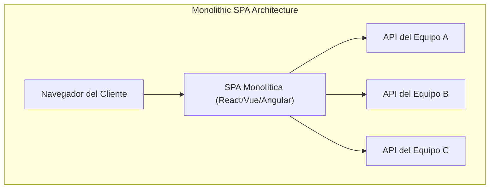
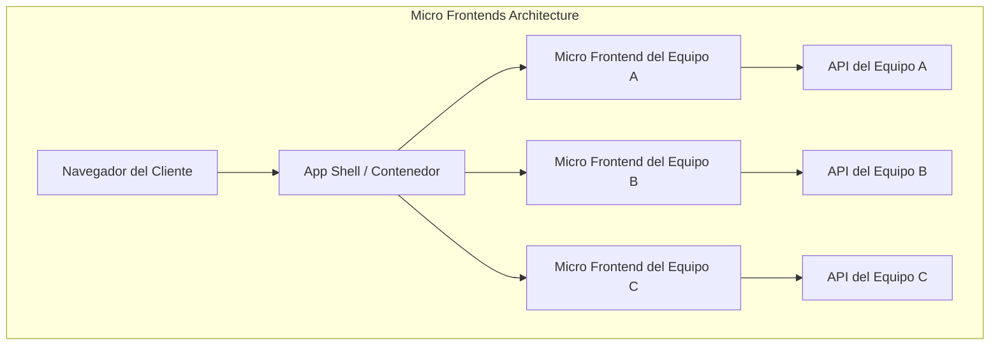
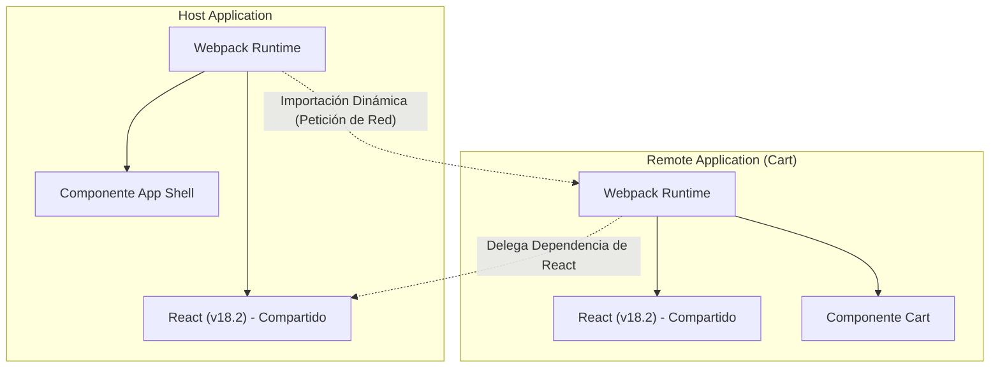

En los últimos años, la demanda de UI/UX en las aplicaciones web ha seguido aumentando, y las bases de código del frontend se han vuelto más grandes que nunca. Si bien el surgimiento de las Single Page Application ( **SPA** ) ha permitido experiencias de usuario enriquecidas, el complejo "monolito frontend" se está convirtiendo en un cuello de botella para el desarrollo.

En este artículo, explicaremos en gran detalle la arquitectura de **micro frontends** ( Micro Frontends ) para dividir SPAs masivas y aumentar la autonomía del equipo, comparándola con los microservicios en el backend, varios métodos de integración y patrones de implementación utilizando **Module Federation** de Webpack, que se está convirtiendo en el estándar de facto actual.

## 1. ¿Por qué necesitamos micro frontends?

### Los límites del frontend monolítico

En las primeras aplicaciones web, el frontend no era más que una fina capa para renderizar el HTML generado por el backend. Sin embargo, con la popularización de frameworks modernos como React, Vue y Angular, gran parte de la lógica de negocio y la gestión de estado se delegó al lado del cliente, causando una explosión en la cantidad de código del frontend.

El resultado de esto es el **monolito frontend**. Al consolidar todos los componentes de la interfaz de usuario, el enrutamiento y la gestión de estado en un único repositorio masivo, surgen los siguientes problemas:

* **Tiempos de compilación prolongados** : A medida que aumenta la base de código, el tiempo necesario para la compilación y las pruebas aumenta de forma exponencial.
* **Dependencias entre equipos y costos de coordinación** : Debido a que múltiples equipos modifican la misma base de código, los conflictos de fusión ocurren con frecuencia y se requiere un gran esfuerzo para coordinar los ciclos de lanzamiento.
* **Acumulación de deuda técnica y dependencia (lock-in)** : Debido a que toda la aplicación depende de la versión de un solo framework o biblioteca, la refactorización gradual o la introducción de nuevas tecnologías se vuelve difícil.

### Comparación con la arquitectura de microservicios del backend

En el mundo del backend, la **arquitectura de microservicios**, que divide un monolito masivo y construye un conjunto de servicios que pueden desplegarse de forma independiente, se ha vuelto muy popular. Esto permite a cada equipo tener su propia base de datos, pila tecnológica y ciclo de despliegue, mejorando drásticamente la escalabilidad y la velocidad de desarrollo.

Sin embargo, incluso si el backend se divide en microservicios por equipo, si la UI (frontend) proporcionada a los usuarios sigue siendo un solo monolito, no se puede lograr una verdadera autonomía de extremo a extremo. La adición de características por parte de cada equipo se enfrenta finalmente al cuello de botella de la integración en el frontend.

Los **micro frontends** son un enfoque para resolver este problema y llevar los mismos beneficios que los microservicios (despliegues independientes, libertad técnica, equipos autónomos) al desarrollo del frontend.

## 2. ¿Qué son los micro frontends?

Los micro frontends son un estilo arquitectónico en el que una aplicación web se construye como una colección de pequeñas aplicaciones frontend desarrolladas, probadas y desplegadas por equipos independientes.

### Beneficios principales

1. **Despliegues independientes** : Cada micro frontend se puede lanzar en cualquier momento sin afectar otras características.
2. **Autonomía del equipo** : Equipos multifuncionales, que son responsables de un dominio de negocio específico desde la base de datos hasta la UI, pueden tomar decisiones de forma independiente.
3. **Asegurar la libertad técnica** : Cada equipo puede elegir la pila tecnológica más adecuada para sus requisitos, facilitando las migraciones graduales (por ejemplo, del antiguo Angular al nuevo React).
4. **Mayor tolerancia a fallos** : Incluso si ocurre un error en algunas funciones, el alcance del error puede ser localizado sin que toda la aplicación se bloquee.

### Desventajas y desafíos

Por otro lado, los micro frontends también tienen sus propios desafíos.

* **Aumento del tamaño del payload (payload bloat)** : Debido a que múltiples aplicaciones frontend operan de forma independiente, existe el riesgo de que las bibliotecas comunes (por ejemplo, el propio React) se descarguen repetidamente.
* **Aumento de la complejidad operativa** : Es necesario gestionar numerosos repositorios y pipelines de CI/CD, lo que aumenta la carga de DevOps.
* **Mantenimiento de un UX consistente** : Para integrar UIs desarrolladas por diferentes equipos, es esencial utilizar un sistema de diseño e implementar medidas para proporcionar una experiencia perfecta (seamless) sin incomodidad para el usuario.

## 3. Comparación arquitectónica: SPA monolítica vs Micro frontends

La siguiente figura compara las diferencias estructurales entre una SPA monolítica tradicional y la arquitectura de micro frontends.





Como muestra el diagrama anterior, en los micro frontends existe un **App Shell** (aplicación contenedora) que carga dinámicamente e integra las aplicaciones frontend desarrolladas por cada equipo. Esto divide todo verticalmente desde la API del backend hasta la UI, preservando la independencia de cada equipo.

## 4. Patrones de métodos de integración

Para lograr micro frontends, la clave principal es cómo "integrar" las aplicaciones divididas en una sola pantalla. Los métodos de integración se dividen a grandes rasgos en tres categorías.

### 4.1. Integración en tiempo de compilación (Build-time Integration)

Un método que integra los módulos compilados por cada equipo en el proceso de compilación de la aplicación anfitriona (host), utilizando paquetes NPM, etc.

* **Ventajas** : La implementación es muy simple y el análisis estático es fácil. Se pueden usar directamente los mecanismos de los gestores de paquetes existentes.
* **Desventajas** : Cada vez que se actualiza un componente con dependencias, toda la aplicación host debe compilarse y desplegarse nuevamente. Esto a menudo no se recomienda en la actualidad, ya que dificulta los "despliegues independientes", que es el propósito principal de los micro frontends.

### 4.2. Integración en el lado del servidor (Server-side Integration)

Un método que recupera fragmentos de HTML de cada micro frontend al ensamblar el HTML en el lado del servidor, y los combina para devolverlos al cliente.

* **Ventajas** : El renderizado inicial es rápido y excelente para el SEO. No supone una carga para el lado del cliente.
* **Tecnologías representativas** : SSI (Server Side Includes) de Nginx, Edge Side Includes (ESI), Project Mosaic desarrollado por Zalando, etc.
* **Desventajas** : Aumenta la complejidad de la infraestructura y requiere mecanismos adicionales para lograr interacciones ricas en el lado del cliente (enrutamiento similar a SPA).

### 4.3. Integración en el lado del cliente (Client-side Integration)

Un método que carga e integra dinámicamente cada micro frontend en el navegador (cliente). Es el enfoque más generalizado en el desarrollo moderno basado en SPA.

#### 4.3.1. iframe

El método clásico que proporciona el aislamiento (isolation) más seguro.

* **Ventajas** : El alcance del CSS y JavaScript está completamente aislado, por lo que no hay interferencias. Permite la coexistencia segura de diferentes frameworks.
* **Desventajas** : Tiene una gran sobrecarga de rendimiento y puede afectar negativamente al SEO. Además, la comunicación entre iframes (compartir el estado o sincronizar el enrutamiento) debe pasar a través de `postMessage`, lo que tiende a ser complejo.

#### 4.3.2. Web Components

Un método que encapsula e integra componentes utilizando Web Components (Custom Elements, Shadow DOM) estándar del navegador.

* **Ventajas** : Es una tecnología estándar independiente del framework y tiene una alta interoperabilidad. También es posible aislar el CSS gracias al Shadow DOM.
* **Desventajas** : Aunque el soporte en los navegadores es maduro, se requiere ingenio para la compatibilidad con SSR (renderizado en el lado del servidor) y la integración de la gestión del estado global.

#### 4.3.3. Webpack Module Federation

Un plugin revolucionario introducido en Webpack 5 que es actualmente el **estándar de facto** para la integración en el lado del cliente. Permite cargar código dinámicamente desde otras compilaciones de Webpack en tiempo de ejecución.

## 5. Profundizando en Webpack Module Federation

Webpack Module Federation ha cambiado drásticamente el paradigma de implementación de los micro frontends. Aquí explicaremos en detalle su mecanismo y un ejemplo de implementación.

### Mecanismo y resolución de dependencias

En Module Federation, las aplicaciones pueden actuar tanto como **Host** (anfitrión) y **Remote** (remoto).
Host es la aplicación responsable de la carga inicial, y Remote proporciona módulos que se cargan dinámicamente.

Lo que es digno de mención es su **mecanismo de resolución de dependencias**. Si varias aplicaciones Remote utilizan la misma biblioteca (por ejemplo, React o Lodash), Module Federation evita las descargas duplicadas y reutiliza de forma inteligente una sola instancia de la biblioteca compartida entre Host y Remote.



El diagrama anterior muestra cómo la aplicación Remote no descarga su propio React, sino que reutiliza el React proporcionado por la aplicación Host. Esto resuelve brillantemente el "aumento del tamaño del payload", que era una debilidad de la integración en el lado del cliente.

### Ejemplo de implementación: Configuración de ModuleFederationPlugin

Veamos un ejemplo de configuración real de Webpack 5. Aquí, asumimos una configuración en la que la aplicación Host carga un componente de una aplicación Remote (ShoppingCart).

#### webpack.config.js en el lado Remote (ShoppingCart)

En el lado Remote, definimos los componentes a exponer y las bibliotecas a compartir.

```javascript
// remote/webpack.config.js
const { ModuleFederationPlugin } = require('webpack').container;
const path = require('path');

module.exports = {
  entry: './src/index',
  mode: 'development',
  output: {
    publicPath: 'auto',
  },
  plugins: [
    new ModuleFederationPlugin({
      name: 'shoppingCart',          // Nombre único de la aplicación
      filename: 'remoteEntry.js',    // Punto de entrada cargado externamente
      exposes: {
        './CartWidget': './src/components/CartWidget', // Componente a exponer
      },
      shared: {                      // Dependencias compartidas
        react: { singleton: true, requiredVersion: '^18.2.0' },
        'react-dom': { singleton: true, requiredVersion: '^18.2.0' },
      },
    }),
  ],
};
```

#### webpack.config.js en el lado Host

En el lado Host, definimos desde dónde cargar las aplicaciones Remote.

```javascript
// host/webpack.config.js
const { ModuleFederationPlugin } = require('webpack').container;

module.exports = {
  entry: './src/index',
  mode: 'development',
  plugins: [
    new ModuleFederationPlugin({
      name: 'hostApp',
      remotes: {
        // nombreRemote@URLRemote/remoteEntry.js
        shoppingCart: 'shoppingCart@http://localhost:3001/remoteEntry.js',
      },
      shared: {
        react: { singleton: true, eager: true },
        'react-dom': { singleton: true, eager: true },
      },
    }),
  ],
};
```

#### Ejemplo de integración con carga diferida (lazy loading) en React

En el código React del lado Host, usamos `React.lazy` y `Suspense` para cargar diferidamente los componentes Remote a través de la red.

```javascript
// host/src/App.jsx
import React, { Suspense } from 'react';

// Especificar nombreRemote/nombreExpuesto definido en webpack.config.js
const RemoteCartWidget = React.lazy(() => import('shoppingCart/CartWidget'));

const App = () => {
  return (
    <div>
      <header>
        <h1>Mi Sitio E-Commerce</h1>
      </header>
      <main>
        <h2>Lista de Productos</h2>
        {/* ... Renderizado de la lista de productos ... */}
      </main>
      <aside>
        {/* Especificar UI de respaldo hasta que se cargue el componente Remote */}
        <Suspense fallback={<div>Cargando Carrito...</div>}>
          <RemoteCartWidget />
        </Suspense>
      </aside>
    </div>
  );
};

export default App;
```

De esta manera, al usar Module Federation, los desarrolladores pueden integrar componentes desplegados en repositorios y servidores separados con exactamente la misma sensación que importar componentes locales.

## 6. Compartir el estado y desafíos del enrutamiento

Al implementar micro frontends, los aspectos técnicamente más difíciles son "compartir el estado" y "el enrutamiento". Es necesario mantener la autonomía de cada equipo y al mismo tiempo proporcionar una experiencia fluida al usuario.

### Enfoques para la gestión del estado

En los micro frontends, compartir la gestión del estado global (por ejemplo, un único almacén (store) masivo de [Redux](https://kenji.blog/es/p/state-management-history-redux-context-recoil-zustand/)) se considera un **antipatrón**. Esto se debe a que crea un fuerte acoplamiento (tight coupling) entre aplicaciones e impide los despliegues independientes.

En su lugar, se recomiendan los siguientes enfoques de bajo acoplamiento (loose coupling):

1. **Custom Events / Event Bus** : La comunicación se realiza en un patrón Publish-Subscribe utilizando la API estándar del navegador `CustomEvent` o bibliotecas ligeras de Event Bus.
   * Ejemplo: Cuando se presiona el botón "Agregar al carrito", se emite el evento `ITEM_ADDED_TO_CART`, y la aplicación Cart lo escucha y actualizará su propio estado.
2. **URL / Parámetros de consulta (Query Parameters)** : El mecanismo más robusto para compartir estados es la URL. Al mantener las consultas de búsqueda y los filtros seleccionados en la URL, cualquier micro frontend puede sincronizar el estado simplemente analizando (parsing) la URL.
3. **Web Storage** : Los datos que requieren persistencia y cambian con poca frecuencia, como tokens de autenticación o configuraciones de usuario, se comparten a través de `localStorage` o `sessionStorage`.

### Estrategias de enrutamiento

El enrutamiento es un elemento clave para decidir en qué nivel controlar la navegación del usuario.

* **Patrón App Shell (Enrutamiento del lado del cliente)** :
  La aplicación contenedora de nivel superior (App Shell) tiene el enrutador principal (ej: `react-router`), y monta/desmonta el micro frontend adecuado según la ruta de la URL.
  * `/products/*` -> Delega el enrutamiento a la aplicación del equipo de productos.
  * `/checkout/*` -> Delega a la aplicación del equipo de pagos.
  Dentro de cada micro frontend, puede tener un enrutamiento interno adicional.

* **Enrutamiento en la capa BFF (Backend For Frontend)** :
  Un método en el que se evalúa la ruta a nivel de la infraestructura del servidor (ej: Nginx o API Gateway), y se sirve desde el principio el HTML del micro frontend adecuado. Ocurre una recarga completa en cada transición de página, pero el nivel de separación arquitectónica es el más alto.

## 7. Impacto organizacional y autonomía del equipo

**La Ley de Conway** ("Las organizaciones que diseñan sistemas están limitadas a producir diseños que son copias de las estructuras de comunicación de estas organizaciones") es de gran importancia en la arquitectura de software.

Se puede decir que los micro frontends son una práctica de la **Ley de Conway Inversa**, que se aprovecha de esta ley. En otras palabras, para lograr la arquitectura deseada (de bajo acoplamiento y autónoma), la estructura organizacional se optimiza en consecuencia.

En lugar de las organizaciones tradicionales basadas en funciones como el "equipo frontend", "equipo backend" y "equipo de base de datos", es esencial formar **equipos multifuncionales** dedicados a un dominio de negocio específico (por ejemplo: "búsqueda", "pagos", "gestión de usuarios"). El verdadero valor de los micro frontends solo se realiza cuando cada equipo tiene plena responsabilidad en su dominio, desde las APIs del backend hasta los componentes de la interfaz de usuario del frontend.

## 8. Conclusión

Hemos explicado en detalle la arquitectura de **micro frontends** para dividir una SPA masiva y construir un sistema de desarrollo sostenible.

Con la aparición de Webpack Module Federation, la integración dinámica en el lado del cliente se ha vuelto drásticamente más fácil. Sin embargo, los micro frontends no son solo una solución técnica, sino un cambio de paradigma (paradigm shift) que se adentra en la estructura organizacional y los procesos de desarrollo de los equipos.

Evaluar con precisión la compensación (trade-off) de una mayor complejidad y elegir el método de integración y la arquitectura adecuados según el tamaño del equipo y la fase de crecimiento del producto, será la clave del éxito.
