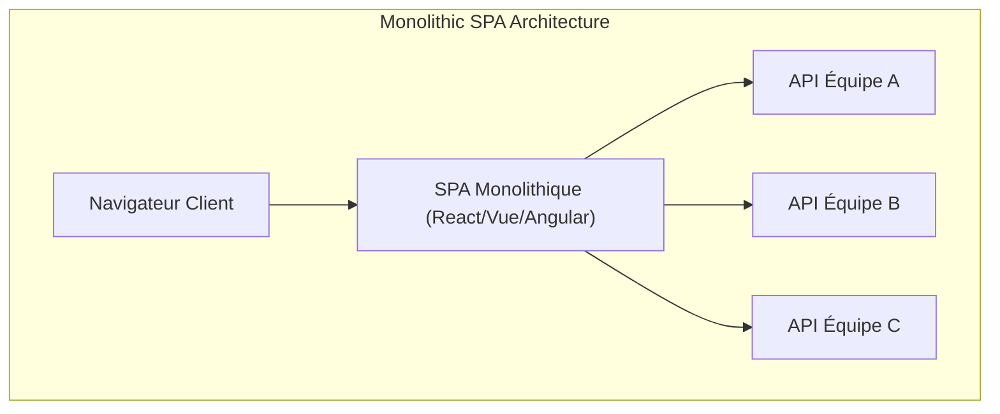
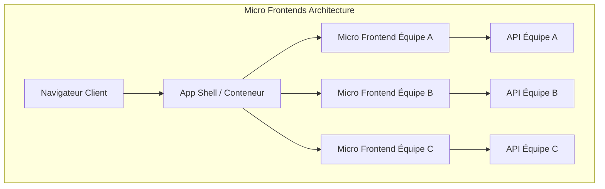
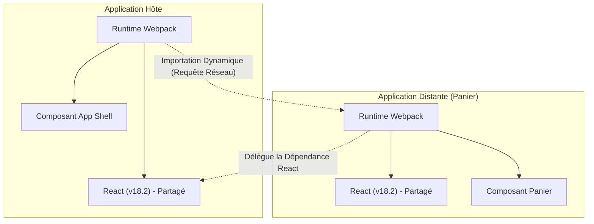

Ces dernières années, les exigences en matière d'UI/UX des applications web n'ont cessé de croître, et les bases de code front-end sont devenues plus volumineuses que jamais. Si l'avènement des Single Page Applications ( **SPA** ) a permis des expériences utilisateur riches, les « monolithes front-end » devenus complexes sont en passe de devenir un goulot d'étranglement pour le développement.

Dans cet article, nous expliquerons très en détail l'architecture des **micro-frontends** ( Micro Frontends ) pour diviser ces SPA de plus en plus volumineuses et accroître l'autonomie des équipes. Nous aborderons la comparaison avec les microservices back-end, les différentes méthodes d'intégration, ainsi que les modèles d'implémentation utilisant la **Module Federation** de Webpack, qui est en train de devenir le standard de facto d'aujourd'hui.

## 1. Pourquoi avons-nous besoin des micro-frontends ?

### Les limites d'un front-end monolithique

Dans les premières applications web, le front-end n'était qu'une fine couche pour rendre le HTML généré par le back-end. Cependant, avec la popularisation des frameworks modernes tels que React, Vue et Angular, une grande partie de la logique métier et de la gestion de l'état a été déléguée côté client, entraînant une augmentation explosive de la quantité de code front-end.

Le résultat de cela est le **monolithe front-end**. Le fait de centraliser tous les composants de l'interface utilisateur, le routage et la gestion de l'état dans un seul dépôt volumineux met en évidence les problèmes suivants :

* **Allongement des temps de compilation** : À mesure que la base de code augmente, le temps requis pour les builds et les tests augmente de manière exponentielle.
* **Dépendances entre les équipes et coûts de coordination** : Étant donné que plusieurs équipes touchent à la même base de code, les conflits de fusion sont fréquents, et la coordination des cycles de publication demande beaucoup d'efforts.
* **Accumulation de la dette technique et enfermement propriétaire** : Comme l'ensemble de l'application dépend de la version d'un framework ou d'une bibliothèque unique, un refactoring progressif ou l'adoption de nouvelles technologies devient difficile.

### Comparaison avec la transition vers les microservices back-end

Dans le monde du back-end, l'**architecture des microservices** a été largement adoptée pour diviser d'énormes monolithes en un ensemble de services pouvant être déployés indépendamment. Cela a permis à chaque équipe de posséder sa propre base de données, sa pile technologique et son cycle de déploiement, améliorant considérablement l'évolutivité et la vitesse de développement.

Cependant, même si le back-end est divisé en microservices et séparé par équipe, si l'interface utilisateur (front-end) fournie à l'utilisateur reste un monolithe unique, une véritable autonomie de bout en bout ne peut être obtenue. L'ajout de fonctionnalités par chaque équipe se heurte finalement au goulot d'étranglement de l'intégration front-end.

Les **micro-frontends** sont une approche visant à résoudre ce problème et à apporter les mêmes avantages (déploiement indépendant, liberté technique, équipes autonomes) que les microservices au développement front-end.

## 2. Qu'est-ce qu'un micro-frontend ?

Les micro-frontends sont un style architectural dans lequel une application web est construite comme un ensemble de petites applications front-end développées, testées et déployées par des équipes indépendantes.

### Principaux avantages

1. **Déploiement indépendant** : Chaque micro-frontend peut être publié à tout moment sans affecter les autres fonctionnalités.
2. **Autonomie de l'équipe** : Des équipes interfonctionnelles responsables d'un domaine métier spécifique, de la base de données à l'interface utilisateur, peuvent prendre des décisions de manière indépendante.
3. **Maintien de la liberté technique** : Chaque équipe peut choisir la pile technologique la mieux adaptée à ses besoins, facilitant ainsi les migrations progressives (ex: d'un ancien Angular vers un nouveau React).
4. **Amélioration de la tolérance aux pannes** : Même si une erreur se produit dans une fonctionnalité, la portée de l'erreur peut être localisée sans faire planter l'application entière.

### Inconvénients et défis

D'un autre côté, les micro-frontends présentent également des défis spécifiques.

* **Gonflement de la charge utile (payload)** : Comme plusieurs applications front-end fonctionnent de manière indépendante, il y a un risque que les bibliothèques communes (par exemple, React lui-même) soient téléchargées en double.
* **Augmentation de la complexité opérationnelle** : Il est nécessaire de gérer de multiples dépôts et pipelines CI/CD, ce qui accroît la charge des équipes DevOps.
* **Maintien d'une UX cohérente** : Puisque les interfaces utilisateur développées par différentes équipes doivent être intégrées, il est essentiel d'utiliser un système de conception (design system) et de trouver des moyens d'offrir une expérience fluide et sans frictions pour les utilisateurs.

## 3. Comparaison architecturale entre les SPA monolithiques et les micro-frontends

Nous allons comparer les différences structurelles entre les SPA monolithiques traditionnelles et l'architecture des micro-frontends avec les diagrammes suivants.





Comme le montrent les diagrammes ci-dessus, dans les micro-frontends, il existe un **App Shell** (application conteneur) qui charge et intègre dynamiquement les applications front-end développées par chaque équipe. Cela permet une séparation verticale complète de l'API back-end à l'interface utilisateur, préservant ainsi l'indépendance de chaque équipe.

## 4. Modèles de méthodes d'intégration

Pour réaliser des micro-frontends, le plus grand défi est de savoir comment « intégrer » les applications divisées sur un seul écran. Les méthodes d'intégration peuvent être grossièrement classées en trois catégories.

### 4.1. Intégration au moment du build (Build-time Integration)

Il s'agit d'une méthode où les modules compilés par chaque équipe à l'aide de paquets NPM, etc., sont intégrés lors du processus de compilation de l'application hôte.

* **Avantages** : L'implémentation est très simple et l'analyse statique est facile. Les mécanismes existants des gestionnaires de paquets peuvent être utilisés tels quels.
* **Inconvénients** : Chaque fois qu'un composant dépendant est mis à jour, l'ensemble de l'application hôte doit être recompilé et redéployé. Comme cela empêche le « déploiement indépendant » qui est le but principal des micro-frontends, cela n'est généralement plus recommandé aujourd'hui.

### 4.2. Intégration côté serveur (Server-side Integration)

Lors de l'assemblage du HTML côté serveur, cette méthode consiste à récupérer des fragments HTML de chaque micro-frontend, à les combiner, puis à les renvoyer au client.

* **Avantages** : Le rendu initial est rapide et c'est excellent pour le SEO. Cela n'impose aucune charge du côté client.
* **Technologies représentatives** : Les SSI (Server Side Includes) de Nginx, les Edge Side Includes (ESI), ou Project Mosaic développé par Zalando.
* **Inconvénients** : La complexité de l'infrastructure augmente, et des mécanismes supplémentaires sont nécessaires pour réaliser de riches interactions côté client (routage de type SPA).

### 4.3. Intégration côté client (Client-side Integration)

C'est une méthode où chaque micro-frontend est chargé et intégré dynamiquement dans le navigateur (client). C'est l'approche la plus courante dans le développement moderne basé sur les SPA.

#### 4.3.1. iframe

C'est la méthode qui offre l'isolation la plus classique et la plus sûre.

* **Avantages** : Les portées CSS et JavaScript sont complètement isolées, de sorte qu'aucune interférence ne se produit. Différents frameworks peuvent coexister en toute sécurité.
* **Inconvénients** : La surcharge de performance est importante et cela peut nuire au SEO. De plus, la communication entre les iframes (partage d'état et synchronisation du routage) doit passer par `postMessage`, ce qui a tendance à devenir complexe.

#### 4.3.2. Web Components

Une méthode qui utilise les Web Components standards du navigateur (Custom Elements, Shadow DOM) pour encapsuler et intégrer les composants.

* **Avantages** : Il s'agit d'une technologie standard indépendante du framework, offrant une grande interopérabilité. L'isolation CSS est également possible avec le Shadow DOM.
* **Inconvénients** : Bien que la prise en charge par les navigateurs soit mature, des efforts sont nécessaires pour la compatibilité avec le SSR (rendu côté serveur) et l'intégration de la gestion de l'état global.

#### 4.3.3. Webpack Module Federation

Un plugin révolutionnaire introduit dans Webpack 5, qui est désormais devenu le **standard de facto** pour l'intégration côté client. Il permet de charger dynamiquement du code à partir d'autres builds Webpack lors de l'exécution.

## 5. Examen approfondi de Webpack Module Federation

Webpack Module Federation a considérablement changé le paradigme d'implémentation des micro-frontends. Nous expliquerons ici son mécanisme et des exemples d'implémentation en détail.

### Mécanisme et résolution des dépendances

Avec Module Federation, une application peut jouer à la fois les rôles d'**Host** (Hôte) et de **Remote** (Distant).
L'hôte est l'application responsable du chargement initial, et le distant fournit les modules qui sont chargés dynamiquement.

Ce qu'il faut particulièrement noter, c'est son **mécanisme de résolution des dépendances**. Si plusieurs applications distantes utilisent la même bibliothèque (ex: React ou Lodash), Module Federation empêche les téléchargements redondants et réutilise intelligemment une instance unique de la bibliothèque partagée entre l'hôte et le distant.



Le diagramme ci-dessus montre que l'application distande ne télécharge pas son propre React, mais réutilise le React fourni par l'application hôte. Cela résout brillamment le « gonflement de la charge utile », qui était une faiblesse de l'intégration côté client.

### Exemple d'implémentation : Configuration de ModuleFederationPlugin

Examinons un exemple de configuration réelle dans Webpack 5. Ici, nous supposons une configuration où l'application hôte charge un composant d'une application distande (ShoppingCart).

#### webpack.config.js du côté Remote (ShoppingCart)

Du côté distant, nous définissons les composants à exposer et les bibliothèques à partager.

```javascript
// remote/webpack.config.js
const { ModuleFederationPlugin } = require('webpack').container;
const path = require('path');

module.exports = {
  entry: './src/index',
  mode: 'development',
  output: {
    publicPath: 'auto',
  },
  plugins: [
    new ModuleFederationPlugin({
      name: 'shoppingCart',          // Nom unique de l'application
      filename: 'remoteEntry.js',    // Point d'entrée chargé de l'extérieur
      exposes: {
        './CartWidget': './src/components/CartWidget', // Composant à exposer
      },
      shared: {                      // Dépendances à partager
        react: { singleton: true, requiredVersion: '^18.2.0' },
        'react-dom': { singleton: true, requiredVersion: '^18.2.0' },
      },
    }),
  ],
};
```

#### webpack.config.js du côté Host

Du côté de l'hôte, nous définissons d'où charger l'application distande.

```javascript
// host/webpack.config.js
const { ModuleFederationPlugin } = require('webpack').container;

module.exports = {
  entry: './src/index',
  mode: 'development',
  plugins: [
    new ModuleFederationPlugin({
      name: 'hostApp',
      remotes: {
        // nomDistant@urlDistante/remoteEntry.js
        shoppingCart: 'shoppingCart@http://localhost:3001/remoteEntry.js',
      },
      shared: {
        react: { singleton: true, eager: true },
        'react-dom': { singleton: true, eager: true },
      },
    }),
  ],
};
```

#### Exemple d'intégration avec le chargement différé dans React

Dans le code React de l'hôte, nous utilisons `React.lazy` et `Suspense` pour charger de manière différée (lazy-load) le composant distant sur le réseau.

```javascript
// host/src/App.jsx
import React, { Suspense } from 'react';

// Spécifier nomRemotes/nomExposes défini dans webpack.config.js
const RemoteCartWidget = React.lazy(() => import('shoppingCart/CartWidget'));

const App = () => {
  return (
    <div>
      <header>
        <h1>Mon Site E-Commerce</h1>
      </header>
      <main>
        <h2>Liste des Produits</h2>
        {/* ... Rendu de la liste des produits ... */}
      </main>
      <aside>
        {/* Spécifier l'UI de repli jusqu'à ce que le composant distant soit chargé */}
        <Suspense fallback={<div>Chargement du panier...</div>}>
          <RemoteCartWidget />
        </Suspense>
      </aside>
    </div>
  );
};

export default App;
```

De cette façon, en utilisant Module Federation, les développeurs peuvent intégrer des composants déployés sur d'autres dépôts ou serveurs avec exactement la même sensation que d'importer un composant local.

## 6. Partage de l'état et défis du routage

Le « partage de l'état » et le « routage » sont les défis techniques les plus difficiles à relever lors de la mise en œuvre des micro-frontends. Il faut offrir aux utilisateurs une expérience fluide tout en maintenant l'autonomie de chaque équipe.

### Approches de la gestion de l'état

Dans les micro-frontends, partager la gestion de l'état global (ex: un immense store unique [Redux](https://kenji.blog/fr/p/state-management-history-redux-context-recoil-zustand/)) est considéré comme un **anti-modèle**. Cela crée un couplage fort entre les applications et empêche les déploiements indépendants.

À la place, les approches faiblement couplées suivantes sont recommandées.

1. **Événements Personnalisés / Bus d'Événements (Event Bus)** : Communiquer avec le modèle Publish-Subscribe en utilisant `CustomEvent`, l'API standard du navigateur, ou des bibliothèques légères d'Event Bus.
   * Ex: Lorsque le bouton "Ajouter au panier" est pressé, l'événement `ITEM_ADDED_TO_CART` est déclenché, et l'application Cart l'écoute pour mettre à jour son propre état.
2. **URL / Paramètres de requête** : Le mécanisme de partage d'état le plus robuste est l'URL. En intégrant les requêtes de recherche ou les filtres sélectionnés dans l'URL, n'importe quel micro-frontend peut synchroniser son état simplement en analysant l'URL.
3. **Web Storage** : Les données qui nécessitent une persistance et qui changent rarement, comme les jetons d'authentification et les préférences de l'utilisateur, sont partagées via `localStorage` ou `sessionStorage`.

### Stratégies de routage

Le routage est un élément clé qui détermine à quel niveau la navigation de l'utilisateur est contrôlée.

* **Modèle App Shell (Routage côté client)** :
  L'application conteneur de niveau supérieur (App Shell) possède le routeur principal (ex: `react-router`) et monte/démonte les micro-frontends appropriés en fonction du chemin d'accès à l'URL.
  * `/products/*` -> Délègue le routage à l'application de l'équipe produit.
  * `/checkout/*` -> Délègue à l'application de l'équipe de paiement.
  Chaque micro-frontend peut avoir en plus un routage interne.

* **Routage au niveau du BFF (Backend For Frontend)** :
  C'est une méthode où le chemin d'accès est déterminé au niveau de l'infrastructure du serveur (ex: Nginx ou API Gateway) et où le HTML du micro-frontend approprié est servi dès le début. Bien qu'un rafraîchissement complet (hard refresh) se produise lors de la transition de page, le degré de séparation de l'architecture est le plus élevé.

## 7. Impact sur l'organisation et autonomie des équipes

La **loi de Conway** (« Toute organisation qui conçoit un système produira une conception dont la structure est une copie de la structure de communication de l'organisation ») est très importante dans l'architecture logicielle.

Les micro-frontends peuvent également être considérés comme l'application de la **loi de Conway inverse** (Manoeuvre de Conway inverse). En d'autres termes, pour obtenir l'architecture souhaitée (faiblement couplée et autonome), la structure de l'organisation est optimisée pour y correspondre.

Au lieu de l'organisation fonctionnelle traditionnelle d'une « équipe front-end », « équipe back-end » et « équipe base de données », il est essentiel de former des **équipes interfonctionnelles** spécialisées dans un domaine métier spécifique (ex: « recherche », « paiement », « gestion des utilisateurs »). Ce n'est que lorsque chaque équipe assume l'entière responsabilité de son domaine, des API back-end aux composants de l'interface utilisateur front-end, que les micro-frontends montrent leur véritable valeur.

## 8. Conclusion

Nous avons expliqué en détail l'architecture des **micro-frontends** pour diviser les SPA de plus en plus volumineuses et construire une structure de développement durable.

Avec l'arrivée de Webpack Module Federation, l'intégration dynamique côté client est devenue considérablement plus facile. Cependant, les micro-frontends ne sont pas seulement une solution technique, mais un changement de paradigme qui s'étend à la structure de l'organisation et aux processus de développement des équipes.

Évaluer précisément le compromis de l'augmentation de la complexité et choisir les méthodes d'intégration et les architectures appropriées, en fonction de la taille de l'équipe et de la phase de croissance du produit, sera la clé du succès.
