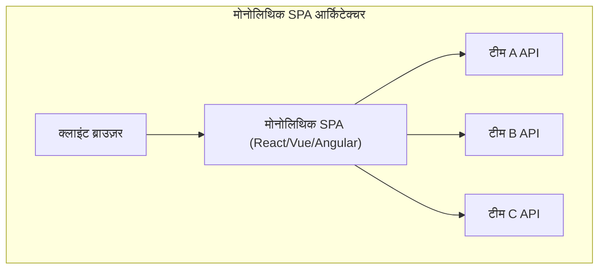
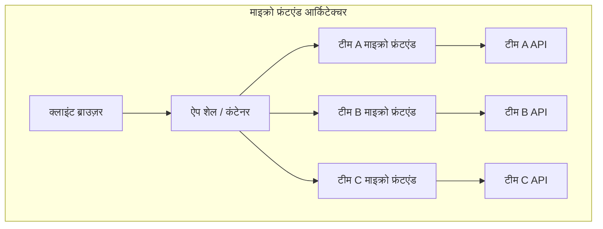
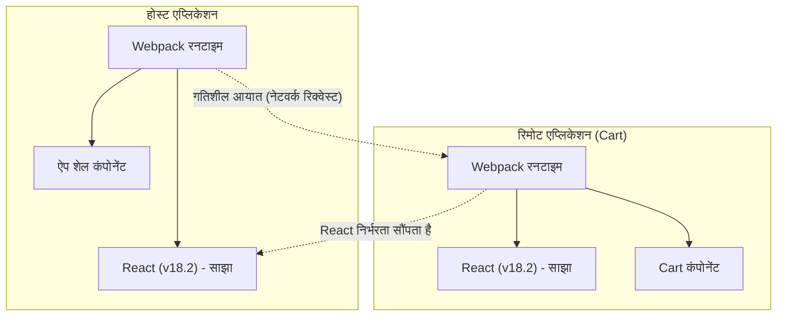

हाल के वर्षों में, वेब एप्लिकेशन के UI/UX की मांग लगातार बढ़ रही है, और फ्रंटएंड का कोडबेस पहले से कहीं अधिक विशाल हो गया है। सिंगल पेज एप्लिकेशन ( **SPA** ) के उदय से समृद्ध उपयोगकर्ता अनुभव तो प्राप्त हुआ, लेकिन जटिल "फ्रंटएंड मोनोलिथ" विकास में बाधा बनते जा रहे हैं।

इस लेख में, हम विशाल SPA को विभाजित करने और टीम की स्वायत्तता को बढ़ाने के लिए **माइक्रो फ्रंटएंड** ( Micro Frontends ) आर्किटेक्चर के बारे में विस्तार से चर्चा करेंगे। इसमें बैकएंड के माइक्रो सर्विसिंग के साथ तुलना, विभिन्न एकीकरण विधियाँ, और आधुनिक मानक बनते जा रहे Webpack के **Module Federation** का उपयोग करने वाले कार्यान्वयन पैटर्न तक शामिल हैं।

## 1. माइक्रो फ्रंटएंड की आवश्यकता क्यों है?

### मोनोलिथिक फ्रंटएंड की सीमाएँ

प्रारंभिक वेब एप्लिकेशनों में, फ्रंटएंड बैकएंड द्वारा उत्पन्न HTML को प्रस्तुत करने के लिए केवल एक पतली परत थी। हालाँकि, React, Vue और Angular जैसे आधुनिक फ्रेमवर्क की लोकप्रियता के साथ, बहुत सारे व्यावसायिक लॉजिक और स्टेट मैनेजमेंट को क्लाइंट साइड पर स्थानांतरित कर दिया गया, जिससे फ्रंटएंड के कोड की मात्रा में भारी वृद्धि हुई।

इसके परिणामस्वरूप **फ्रंटएंड मोनोलिथ** का जन्म हुआ। एक ही विशाल रिपॉजिटरी में सभी UI कंपोनेंट्स, राउटिंग और स्टेट मैनेजमेंट को केंद्रित करने से निम्नलिखित समस्याएँ उत्पन्न होती हैं:

* **लंबे बिल्ड समय** : कोडबेस बढ़ने के साथ, बिल्ड और परीक्षण में लगने वाला समय तेजी से बढ़ता है।
* **टीमों के बीच निर्भरता और समन्वय लागत** : चूंकि कई टीमें एक ही कोडबेस पर काम करती हैं, इसलिए अक्सर मर्ज कॉन्फ्लिक्ट होते हैं, और रिलीज़ साइकिल के समन्वय में बहुत प्रयास लगता है।
* **तकनीकी ऋण का संचय और लॉक-इन** : चूंकि पूरा एप्लिकेशन किसी एक फ्रेमवर्क या लाइब्रेरी के संस्करण पर निर्भर करता है, इसलिए क्रमिक रिफैक्टरिंग या नई तकनीकों को अपनाना मुश्किल हो जाता है।

### बैकएंड माइक्रो सर्विसेज के साथ तुलना

बैकएंड की दुनिया में, विशाल मोनोलिथ को विभाजित करने और स्वतंत्र रूप से डेप्लॉय की जाने वाली सेवाओं के समूह बनाने वाले **माइक्रो सर्विस आर्किटेक्चर** का व्यापक रूप से उपयोग किया गया। इसके परिणामस्वरूप, प्रत्येक टीम के पास अपना डेटाबेस, तकनीकी स्टैक और डेप्लॉयमेंट साइकिल हो सकता है, जिससे स्केलेबिलिटी और विकास गति में भारी सुधार हुआ है।

हालाँकि, भले ही बैकएंड को माइक्रो सर्विसेज में बदलकर टीमों द्वारा विभाजित किया गया हो, लेकिन यदि उपयोगकर्ताओं को प्रदान किया जाने वाला UI (फ्रंटएंड) एक मोनोलिथ ही रहता है, तो सही मायने में एंड-टू-एंड स्वायत्तता प्राप्त नहीं की जा सकती है। प्रत्येक टीम द्वारा नई सुविधाओं का जोड़ना अंततः फ्रंटएंड एकीकरण की बाधा का सामना करता है।

**माइक्रो फ्रंटएंड** इस समस्या का समाधान करता है और फ्रंटएंड विकास में भी माइक्रो सर्विसेज के समान लाभ (स्वतंत्र डेप्लॉयमेंट, तकनीकी स्वतंत्रता, स्वायत्त टीमें) लाने का एक दृष्टिकोण है।

## 2. माइक्रो फ्रंटएंड क्या है?

माइक्रो फ्रंटएंड एक आर्किटेक्चरल शैली है जहाँ वेब एप्लिकेशन को छोटे फ्रंटएंड एप्लिकेशनों के संग्रह के रूप में बनाया जाता है, जिन्हें स्वतंत्र टीमों द्वारा विकसित, परीक्षण और डेप्लॉय किया जाता है।

### मुख्य लाभ

1. **स्वतंत्र डेप्लॉयमेंट** : प्रत्येक माइक्रो फ्रंटएंड को अन्य सुविधाओं को प्रभावित किए बिना किसी भी समय रिलीज़ किया जा सकता है।
2. **टीम की स्वायत्तता** : डेटाबेस से लेकर UI तक किसी विशिष्ट व्यावसायिक डोमेन के लिए जिम्मेदार क्रॉस-फंक्शनल टीमें स्वतंत्र रूप से निर्णय ले सकती हैं।
3. **तकनीकी स्वतंत्रता सुनिश्चित करना** : प्रत्येक टीम अपनी आवश्यकताओं के अनुसार सर्वोत्तम तकनीकी स्टैक चुन सकती है, जिससे क्रमिक माइग्रेशन (उदा: पुराने Angular से नए React में) आसान हो जाता है।
4. **बेहतर फॉल्ट टॉलरेंस** : यदि कुछ सुविधाओं में त्रुटियाँ होती हैं, तो भी पूरे एप्लिकेशन के क्रैश होने के बजाय त्रुटि का दायरा सीमित किया जा सकता है।

### नुकसान और चुनौतियाँ

वहीं दूसरी ओर, माइक्रो फ्रंटएंड की अपनी कुछ चुनौतियाँ भी हैं।

* **पेलोड का बढ़ना** : चूँकि कई फ्रंटएंड एप्लिकेशन स्वतंत्र रूप से काम करते हैं, इसलिए साझा लाइब्रेरी (उदा: React स्वयं) के कई बार डाउनलोड होने का जोखिम होता है।
* **परिचालन जटिलता में वृद्धि** : कई रिपॉजिटरी और CI/CD पाइपलाइनों का प्रबंधन करना आवश्यक है, जिससे DevOps का बोझ बढ़ जाता है।
* **निरंतर UX बनाए रखना** : विभिन्न टीमों द्वारा विकसित UI को एकीकृत करने के लिए, डिज़ाइन सिस्टम का उपयोग करना और उपयोगकर्ताओं को सहज अनुभव प्रदान करने के लिए उपाय करना आवश्यक है।

## 3. मोनोलिथ SPA और माइक्रो फ्रंटएंड आर्किटेक्चर की तुलना

पारंपरिक मोनोलिथिक SPA और माइक्रो फ्रंटएंड आर्किटेक्चर के बीच संरचनात्मक अंतर नीचे दिए गए आरेख में तुलना किए गए हैं।





जैसा कि ऊपर का आरेख दिखाता है, माइक्रो फ्रंटएंड में एक **App Shell** (कंटेनर एप्लिकेशन) मौजूद होता है, जो गतिशील रूप से प्रत्येक टीम द्वारा विकसित फ्रंटएंड एप्लिकेशन को लोड और एकीकृत करता है। इससे बैकएंड API से लेकर UI तक पूरी तरह से लंबवत विभाजन हो जाता है, और प्रत्येक टीम की स्वतंत्रता बनी रहती है।

## 4. एकीकरण विधियों के पैटर्न

माइक्रो फ्रंटएंड को लागू करने के लिए, सबसे बड़ी कुंजी यह है कि विभाजित एप्लिकेशनों को एक स्क्रीन पर कैसे "एकीकृत" किया जाए। एकीकरण विधियों को मोटे तौर पर 3 श्रेणियों में वर्गीकृत किया गया है।

### 4.1. बिल्ड-टाइम एकीकरण (Build-time Integration)

यह NPM पैकेज आदि का उपयोग करके होस्ट एप्लिकेशन की बिल्ड प्रक्रिया के दौरान प्रत्येक टीम द्वारा निर्मित मॉड्यूल को एकीकृत करने की एक विधि है।

* **लाभ** : कार्यान्वयन बहुत सरल है और स्थिर विश्लेषण (static analysis) आसान है। मौजूदा पैकेज मैनेजर के तंत्र का उपयोग किया जा सकता है।
* **नुकसान** : जब भी निर्भर कंपोनेंट्स अपडेट किए जाते हैं, तो पूरे होस्ट एप्लिकेशन को फिर से बिल्ड और डेप्लॉय करना पड़ता है। यह माइक्रो फ्रंटएंड के मुख्य उद्देश्य "स्वतंत्र डेप्लॉयमेंट" में बाधा डालता है, इसलिए वर्तमान में इसे अक्सर अनुशंसित नहीं किया जाता है।

### 4.2. सर्वर-साइड एकीकरण (Server-side Integration)

सर्वर साइड पर HTML को असेंबल करते समय, प्रत्येक माइक्रो फ्रंटएंड से HTML फ्रैगमेंट प्राप्त किए जाते हैं, उन्हें जोड़ा जाता है, और क्लाइंट को वापस किया जाता है।

* **लाभ** : प्रारंभिक रेंडरिंग तेज़ है और SEO के लिए उत्कृष्ट है। यह क्लाइंट साइड पर भार नहीं डालता है।
* **प्रमुख तकनीकें** : Nginx का SSI (Server Side Includes), Edge Side Includes (ESI), और Zalando द्वारा विकसित Project Mosaic आदि।
* **नुकसान** : इन्फ्रास्ट्रक्चर की जटिलता बढ़ जाती है, और समृद्ध क्लाइंट-साइड इंटरैक्शन (SPA-जैसी राउटिंग) प्राप्त करने के लिए अतिरिक्त तंत्र की आवश्यकता होती है।

### 4.3. क्लाइंट-साइड एकीकरण (Client-side Integration)

ब्राउज़र (क्लाइंट) पर गतिशील रूप से प्रत्येक माइक्रो फ्रंटएंड को लोड और एकीकृत करने की विधि है। आधुनिक SPA-आधारित विकास में यह सबसे मुख्यधारा का दृष्टिकोण है।

#### 4.3.1. iframe

यह सबसे क्लासिक और सुरक्षित अलगाव (isolation) प्रदान करने वाली विधि है।

* **लाभ** : CSS और JavaScript का दायरा (scope) पूरी तरह से अलग हो जाता है, इसलिए कोई हस्तक्षेप नहीं होता है। विभिन्न फ्रेमवर्क सुरक्षित रूप से एक साथ रह सकते हैं।
* **नुकसान** : प्रदर्शन पर भारी ओवरहेड होता है और यह SEO को नकारात्मक रूप से प्रभावित कर सकता है। इसके अलावा, iframe के बीच संचार (स्थिति साझा करना और राउटिंग सिंक करना) को `postMessage` के माध्यम से करने की आवश्यकता होती है, जो जटिल हो जाता है।

#### 4.3.2. Web Components

ब्राउज़र के मानक Web Components ( Custom Elements, Shadow DOM ) का उपयोग करके कंपोनेंट्स को एन्कैप्सुलेट और एकीकृत करने की विधि है।

* **लाभ** : यह फ्रेमवर्क-स्वतंत्र मानक तकनीक है और इसमें उच्च इंटरऑपरेबिलिटी है। Shadow DOM का उपयोग करके CSS अलगाव भी संभव है।
* **नुकसान** : हालाँकि ब्राउज़र का समर्थन काफी परिपक्व हो गया है, SSR (सर्वर साइड रेंडरिंग) के साथ संगतता और वैश्विक स्टेट मैनेजमेंट के एकीकरण के लिए रचनात्मक समाधानों की आवश्यकता होती है।

#### 4.3.3. Webpack Module Federation

यह Webpack 5 में पेश किया गया एक क्रांतिकारी प्लगइन है और वर्तमान में क्लाइंट-साइड एकीकरण का **मानक (de facto standard)** बन गया है। यह रनटाइम के दौरान अन्य Webpack बिल्ड से गतिशील रूप से कोड लोड करने की अनुमति देता है।

## 5. Webpack Module Federation का गहराई से अध्ययन

Webpack Module Federation ने माइक्रो फ्रंटएंड के कार्यान्वयन प्रतिमान को नाटकीय रूप से बदल दिया है। यहाँ, हम इसके तंत्र और कार्यान्वयन उदाहरणों को विस्तार से समझाएंगे।

### तंत्र और निर्भरता समाधान (Dependency Resolution)

Module Federation में, एप्लिकेशन **Host** (होस्ट) और **Remote** (रिमोट) दोनों भूमिकाएँ निभा सकता है।
होस्ट वह एप्लिकेशन है जो प्रारंभिक लोडिंग को संभालता है, जबकि रिमोट गतिशील रूप से लोड किए जाने वाले मॉड्यूल प्रदान करता है।

विशेष रूप से उल्लेखनीय इसका **निर्भरता समाधान तंत्र** है। यदि कई रिमोट एप्लिकेशन एक ही लाइब्रेरी (उदा: React या Lodash) का उपयोग करते हैं, तो Module Federation डुप्लिकेट डाउनलोड को रोकता है और समझदारी से होस्ट और रिमोट के बीच साझा लाइब्रेरी के एकल इंस्टेंस का पुन: उपयोग करता है।



ऊपर दिया गया आरेख दिखाता है कि कैसे रिमोट एप्लिकेशन अपना स्वयं का React डाउनलोड नहीं करता है, बल्कि होस्ट एप्लिकेशन द्वारा प्रदान किए गए React का पुन: उपयोग करता है। यह क्लाइंट-साइड एकीकरण की कमजोरी "पेलोड के बढ़ने" को शानदार ढंग से हल करता है।

### कार्यान्वयन उदाहरण: ModuleFederationPlugin सेटिंग्स

आइए वास्तविक Webpack 5 के सेटिंग उदाहरणों को देखें। यहाँ, हम एक ऐसे सेटअप की कल्पना करते हैं जहाँ होस्ट एप्लिकेशन रिमोट एप्लिकेशन (ShoppingCart) के कंपोनेंट को लोड करता है।

#### रिमोट साइड (ShoppingCart) का webpack.config.js

रिमोट साइड पर, हम सार्वजनिक किए जाने वाले कंपोनेंट्स और साझा की जाने वाली लाइब्रेरी को परिभाषित करते हैं।

```javascript
// remote/webpack.config.js
const { ModuleFederationPlugin } = require('webpack').container;
const path = require('path');

module.exports = {
  entry: './src/index',
  mode: 'development',
  output: {
    publicPath: 'auto',
  },
  plugins: [
    new ModuleFederationPlugin({
      name: 'shoppingCart',          // एप्लिकेशन का अद्वितीय नाम
      filename: 'remoteEntry.js',    // एंट्री पॉइंट जिसे बाहर से लोड किया जाएगा
      exposes: {
        './CartWidget': './src/components/CartWidget', // सार्वजनिक किया जाने वाला कंपोनेंट
      },
      shared: {                      // साझा की जाने वाली निर्भरताएँ
        react: { singleton: true, requiredVersion: '^18.2.0' },
        'react-dom': { singleton: true, requiredVersion: '^18.2.0' },
      },
    }),
  ],
};
```

#### होस्ट साइड का webpack.config.js

होस्ट साइड पर, हम परिभाषित करते हैं कि रिमोट एप्लिकेशन को कहाँ से लोड किया जाना है।

```javascript
// host/webpack.config.js
const { ModuleFederationPlugin } = require('webpack').container;

module.exports = {
  entry: './src/index',
  mode: 'development',
  plugins: [
    new ModuleFederationPlugin({
      name: 'hostApp',
      remotes: {
        // remoteName@remoteURL/remoteEntry.js
        shoppingCart: 'shoppingCart@http://localhost:3001/remoteEntry.js',
      },
      shared: {
        react: { singleton: true, eager: true },
        'react-dom': { singleton: true, eager: true },
      },
    }),
  ],
};
```

#### React में लेज़ी लोडिंग (Lazy Loading) एकीकरण का उदाहरण

होस्ट साइड के React कोड में, `React.lazy` और `Suspense` का उपयोग नेटवर्क के माध्यम से रिमोट कंपोनेंट को लेज़ी लोड करने के लिए किया जाता है।

```javascript
// host/src/App.jsx
import React, { Suspense } from 'react';

// webpack.config.js में परिभाषित remotes-name/exposes-name निर्दिष्ट करें
const RemoteCartWidget = React.lazy(() => import('shoppingCart/CartWidget'));

const App = () => {
  return (
    <div>
      <header>
        <h1>My E-Commerce Site</h1>
      </header>
      <main>
        <h2>Product List</h2>
        {/* ... उत्पाद सूची रेंडरिंग ... */}
      </main>
      <aside>
        {/* जब तक रिमोट कंपोनेंट लोड नहीं हो जाता, तब तक के लिए फॉलबैक UI निर्दिष्ट करें */}
        <Suspense fallback={<div>Loading Cart...</div>}>
          <RemoteCartWidget />
        </Suspense>
      </aside>
    </div>
  );
};

export default App;
```

इस प्रकार, Module Federation का उपयोग करके, डेवलपर्स किसी भिन्न रिपॉजिटरी या भिन्न सर्वर पर डेप्लॉय किए गए कंपोनेंट को उसी तरह एकीकृत कर सकते हैं जैसे कि वे किसी स्थानीय कंपोनेंट को आयात करते हैं।

## 6. स्थिति (State) साझाकरण और राउटिंग की चुनौतियाँ

माइक्रो फ्रंटएंड को लागू करते समय तकनीकी रूप से सबसे चुनौतीपूर्ण पहलू "स्टेट शेयरिंग" और "राउटिंग" हैं। उपयोगकर्ताओं को सहज अनुभव प्रदान करते हुए प्रत्येक टीम की स्वायत्तता बनाए रखनी चाहिए।

### स्टेट मैनेजमेंट दृष्टिकोण

माइक्रो फ्रंटएंड में, वैश्विक स्टेट मैनेजमेंट (उदा: [Redux](https://kenji.blog/hi/p/state-management-history-redux-context-recoil-zustand/) का विशाल सिंगल स्टोर) को साझा करना **एंटी-पैटर्न** माना जाता है। ऐसा इसलिए है क्योंकि यह एप्लिकेशनों के बीच एक कड़ा जुड़ाव (tight coupling) बनाता है और स्वतंत्र डेप्लॉयमेंट में बाधा डालता है।

इसके बजाय, निम्नलिखित ढीले-ढाले (loosely coupled) दृष्टिकोणों की अनुशंसा की जाती है:

1. **Custom Events / Event Bus** : संचार के लिए ब्राउज़र के मानक API `CustomEvent` या हल्के Event Bus लाइब्रेरी का उपयोग करके Publish-Subscribe पैटर्न का पालन करें।
   * उदा: जब "कार्ट में जोड़ें" बटन दबाया जाता है, तो `ITEM_ADDED_TO_CART` ईवेंट ट्रिगर होता है, और Cart एप्लिकेशन इसे सुनता है और अपनी स्थिति को अपडेट करता है।
2. **URL / क्वेरी पैरामीटर** : सबसे मजबूत स्थिति साझाकरण तंत्र URL है। खोज क्वेरी या चयनित फ़िल्टर को URL में रखकर, कोई भी माइक्रो फ्रंटएंड केवल URL को पार्स करके स्थिति को सिंक कर सकता है।
3. **Web Storage** : डेटा जिसे बनाए रखने की आवश्यकता होती है और जो कम बार बदलता है, जैसे कि प्रमाणीकरण टोकन या उपयोगकर्ता सेटिंग्स, उन्हें `localStorage` या `sessionStorage` के माध्यम से साझा किया जाता है।

### राउटिंग रणनीतियाँ

राउटिंग यह निर्धारित करने में एक महत्वपूर्ण तत्व है कि उपयोगकर्ता नेविगेशन को किस स्तर पर नियंत्रित किया जाना चाहिए।

* **App Shell पैटर्न (क्लाइंट-साइड राउटिंग)** :
  ऊपरी स्तर का कंटेनर एप्लिकेशन (App Shell) एक मुख्य राउटर (उदा: `react-router`) रखता है, और URL पथ के अनुसार उपयुक्त माइक्रो फ्रंटएंड को माउंट/अनमाउंट करता है।
  * `/products/*` -> उत्पाद टीम के एप्लिकेशन को राउटिंग सौंपें।
  * `/checkout/*` -> भुगतान टीम के एप्लिकेशन को सौंपें।
  प्रत्येक माइक्रो फ्रंटएंड के भीतर एक आंतरिक राउटिंग भी हो सकती है।

* **[BFF](https://kenji.blog/hi/p/microservices-architecture-bff-api-gateway/) (Backend For Frontend) लेयर पर राउटिंग** :
  यह सर्वर इन्फ्रास्ट्रक्चर (उदा: Nginx या [API Gateway](https://kenji.blog/hi/p/microservices-architecture-bff-api-gateway/)) स्तर पर पथ का निर्धारण करने और शुरू से ही उपयुक्त माइक्रो फ्रंटएंड का HTML सर्व करने की विधि है। हालाँकि पृष्ठ परिवर्तन के दौरान एक हार्ड रिफ्रेश होता है, यह आर्किटेक्चर का उच्चतम स्तर का अलगाव (isolation) प्रदान करता है।

## 7. संगठन पर प्रभाव और टीम की स्वायत्तता

**कॉनवे का नियम** ("ऐसी प्रणाली को डिज़ाइन करने वाला संगठन, उस संगठन की संचार संरचना की नकल करते हुए एक डिज़ाइन तैयार करता है") सॉफ्टवेयर आर्किटेक्चर में बहुत महत्वपूर्ण है।

माइक्रो फ्रंटएंड को इस नियम के उलट **उलटा कॉनवे नियम (Reverse Conway's Law)** के अभ्यास के रूप में भी देखा जा सकता है। दूसरे शब्दों में, एक वांछनीय आर्किटेक्चर (ढीले ढंग से युग्मित और स्वायत्त) को प्राप्त करने के लिए, संगठनात्मक संरचना को उसके अनुरूप अनुकूलित किया जाता है।

पारंपरिक कार्यात्मक संगठन जैसे "फ्रंटएंड टीम," "बैकएंड टीम," और "डेटाबेस टीम" के बजाय, एक विशिष्ट व्यावसायिक डोमेन (उदा: "खोज," "भुगतान," "उपयोगकर्ता प्रबंधन") के लिए समर्पित **क्रॉस-फंक्शनल टीम** बनाना आवश्यक है। माइक्रो फ्रंटएंड का असली मूल्य तभी महसूस होता है जब प्रत्येक टीम बैकएंड API से लेकर फ्रंटएंड UI कंपोनेंट तक डोमेन की पूरी जिम्मेदारी लेती है।

## 8. निष्कर्ष

हमने विशाल SPA को विभाजित करने और एक स्थायी विकास प्रणाली बनाने के लिए **माइक्रो फ्रंटएंड** आर्किटेक्चर के बारे में विस्तार से बताया है।

Webpack Module Federation की शुरुआत के साथ, क्लाइंट-साइड पर गतिशील एकीकरण नाटकीय रूप से आसान हो गया है। हालाँकि, माइक्रो फ्रंटएंड केवल एक तकनीकी समस्या-समाधान नहीं है, बल्कि एक प्रतिमान बदलाव है जो संगठन की संरचना और टीमों की विकास प्रक्रियाओं में भी हस्तक्षेप करता है।

जटिलता में वृद्धि के ट्रेड-ऑफ का सटीक मूल्यांकन करना और टीम के आकार और उत्पाद की वृद्धि के चरण के आधार पर उपयुक्त एकीकरण विधियों और आर्किटेक्चर का चयन करना सफलता की कुंजी होगा।
