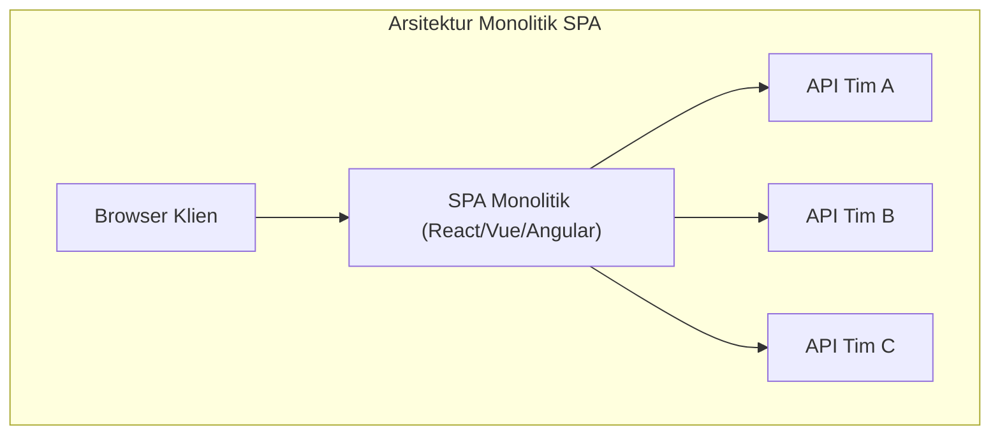
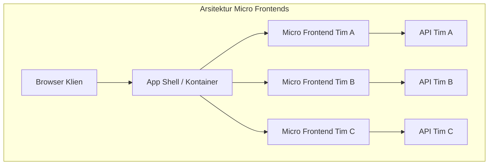
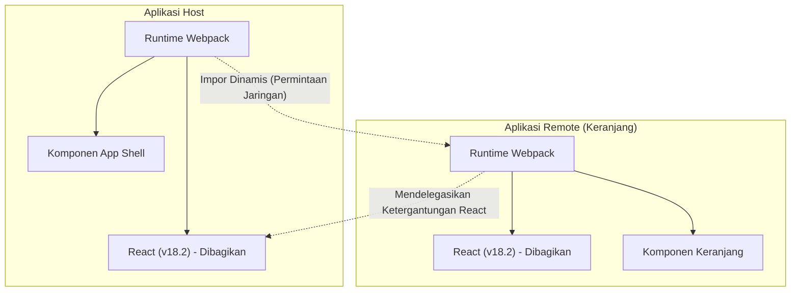

Dalam beberapa tahun terakhir, tuntutan terhadap UI/UX aplikasi web terus meningkat, dan basis kode front-end telah menjadi lebih besar dari sebelumnya. Meskipun munculnya Single Page Application ( **SPA** ) telah mewujudkan pengalaman pengguna yang kaya, "monolit front-end" yang semakin kompleks mulai menjadi hambatan dalam pengembangan.

Pada artikel ini, kami akan memberikan penjelasan yang sangat rinci tentang arsitektur **micro frontends** (Micro Frontends) untuk memisahkan SPA yang semakin membesar dan meningkatkan otonomi tim, mulai dari perbandingannya dengan layanan mikro (microservices) back-end, berbagai metode integrasi, hingga pola implementasi menggunakan **Module Federation** dari Webpack yang kini menjadi standar de facto modern.

## 1. Mengapa Micro Frontends Diperlukan?

### Keterbatasan Front-end Monolitik

Pada aplikasi web awal, front-end hanyalah lapisan tipis untuk merender HTML yang dihasilkan oleh back-end. Namun, dengan populernya kerangka kerja modern seperti React, Vue, dan Angular, banyak logika bisnis dan manajemen status yang dialihkan ke sisi klien, sehingga jumlah kode front-end meningkat secara eksplosif.

Hasilnya adalah **monolit front-end**. Menyatukan semua komponen UI, perutean, dan manajemen status dalam satu repositori raksasa memunculkan masalah-masalah berikut:

* **Waktu build yang lama** : Seiring bertambahnya basis kode, waktu yang dibutuhkan untuk build dan pengujian meningkat secara eksponensial.
* **Biaya ketergantungan dan koordinasi antartim** : Karena beberapa tim memodifikasi basis kode yang sama, konflik penggabungan sering terjadi, dan koordinasi siklus rilis membutuhkan banyak usaha.
* **Akumulasi utang teknis dan penguncian** : Karena seluruh aplikasi bergantung pada versi kerangka kerja atau pustaka tunggal, pemfaktoran ulang (refactoring) bertahap atau adopsi teknologi baru menjadi sulit.

### Perbandingan dengan Layanan Mikro Back-end

Di dunia back-end, **arsitektur layanan mikro** (microservices), yang membagi monolit raksasa menjadi kumpulan layanan yang dapat di-deploy secara independen, telah diadopsi secara luas. Hal ini memungkinkan setiap tim untuk memiliki basis data, tumpukan teknologi, dan siklus rilis mereka sendiri, yang secara dramatis meningkatkan skalabilitas dan kecepatan pengembangan.

Namun, meskipun back-end dibagi menjadi layanan mikro per tim, jika UI (front-end) yang diberikan kepada pengguna tetap berupa monolit tunggal, otonomi end-to-end yang sesungguhnya tidak dapat dicapai. Penambahan fitur oleh setiap tim pada akhirnya akan menghadapi hambatan dalam integrasi front-end.

**Micro frontends** adalah pendekatan untuk memecahkan masalah ini dan membawa manfaat yang sama seperti layanan mikro (penerapan independen, kebebasan teknologi, tim yang otonom) ke dalam pengembangan front-end.

## 2. Apa Itu Micro Frontends?

Micro frontends adalah gaya arsitektur yang membangun aplikasi web sebagai kumpulan aplikasi front-end kecil yang dikembangkan, diuji, dan di-deploy oleh tim-tim yang independen.

### Keuntungan Utama

1. **Deployment independen** : Setiap micro frontend dapat dirilis kapan saja tanpa memengaruhi fitur lainnya.
2. **Otonomi tim** : Tim lintas fungsi yang bertanggung jawab atas domain bisnis tertentu, dari basis data hingga UI, dapat membuat keputusan secara mandiri.
3. **Memastikan kebebasan teknologi** : Setiap tim dapat memilih tumpukan teknologi yang paling sesuai untuk kebutuhan mereka, dan migrasi bertahap (misalnya dari Angular lama ke React baru) menjadi lebih mudah.
4. **Peningkatan toleransi kesalahan** : Jika terjadi kesalahan pada fitur tertentu, ruang lingkup kesalahan dapat dilokalisasi tanpa membuat seluruh aplikasi mogok.

### Kekurangan dan Tantangan

Di sisi lain, micro frontends juga memiliki tantangan tersendiri.

* **Pembengkakan payload** : Karena beberapa aplikasi front-end berjalan secara independen, ada risiko perpustakaan umum (misalnya React itu sendiri) akan diunduh berulang kali.
* **Peningkatan kompleksitas operasional** : Sejumlah besar repositori dan alur CI/CD perlu dikelola, sehingga meningkatkan beban DevOps.
* **Mempertahankan UX yang konsisten** : Untuk mengintegrasikan UI yang dikembangkan oleh tim yang berbeda, sangat penting untuk memanfaatkan sistem desain dan merancang strategi agar dapat memberikan pengalaman yang mulus dan alami kepada pengguna.

## 3. Perbandingan Arsitektur SPA Monolitik dan Micro Frontends

Diagram berikut membandingkan perbedaan struktural antara SPA monolitik konvensional dan arsitektur micro frontends.





Seperti yang ditunjukkan pada diagram di atas, dalam micro frontends terdapat **App Shell** (aplikasi kontainer) yang memuat dan mengintegrasikan aplikasi front-end yang dikembangkan oleh masing-masing tim secara dinamis. Ini sepenuhnya memisahkan aplikasi dari API back-end hingga UI secara vertikal, dan menjaga independensi setiap tim.

## 4. Pola Metode Integrasi

Untuk mewujudkan micro frontends, kunci terbesarnya adalah bagaimana "mengintegrasikan" aplikasi yang terbagi menjadi satu layar. Metode integrasi secara garis besar dibagi menjadi 3 kategori.

### 4.1. Integrasi Saat Build (Build-time Integration)

Ini adalah metode di mana modul yang di-build oleh masing-masing tim diintegrasikan selama proses build aplikasi host, misalnya dengan menggunakan paket NPM.

* **Keuntungan** : Implementasinya sangat sederhana dan analisis statisnya mudah. Mekanisme manajer paket yang ada dapat digunakan sebagaimana adanya.
* **Kekurangan** : Setiap kali komponen dependen diperbarui, seluruh aplikasi host harus di-build dan di-deploy ulang. Hal ini sering kali tidak direkomendasikan saat ini karena menghambat tujuan utama micro frontends, yaitu "deployment independen".

### 4.2. Integrasi Sisi Server (Server-side Integration)

Ini adalah metode di mana saat merakit HTML di sisi server, fragmen HTML diambil dari masing-masing micro frontend, digabungkan, dan dikembalikan ke klien.

* **Keuntungan** : Render awal yang cepat dan baik untuk SEO. Tidak membebani sisi klien.
* **Teknologi perwakilan** : SSI (Server Side Includes) Nginx, Edge Side Includes (ESI), Project Mosaic yang dikembangkan oleh Zalando, dll.
* **Kekurangan** : Meningkatkan kompleksitas infrastruktur, dan membutuhkan mekanisme tambahan untuk mewujudkan interaksi sisi klien yang kaya (perutean ala SPA).

### 4.3. Integrasi Sisi Klien (Client-side Integration)

Ini adalah metode yang memuat dan mengintegrasikan setiap micro frontend secara dinamis pada browser (klien). Ini adalah pendekatan paling umum dalam pengembangan berbasis SPA modern.

#### 4.3.1. iframe

Ini adalah metode yang menyediakan isolasi paling klasik dan dapat diandalkan.

* **Keuntungan** : Karena ruang lingkup CSS dan JavaScript sepenuhnya terisolasi, tidak ada gangguan. Kerangka kerja yang berbeda dapat hidup berdampingan dengan aman.
* **Kekurangan** : Overhead kinerja yang besar dan dapat berdampak negatif pada SEO. Selain itu, komunikasi antar iframe (berbagi status atau sinkronisasi perutean) harus melalui `postMessage`, yang cenderung menjadi kompleks.

#### 4.3.2. Web Components

Ini adalah metode yang merangkum dan mengintegrasikan komponen menggunakan Web Components (Custom Elements, Shadow DOM) standar browser.

* **Keuntungan** : Merupakan teknologi standar yang tidak bergantung pada kerangka kerja dan memiliki interoperabilitas yang tinggi. Isolasi CSS juga dimungkinkan melalui Shadow DOM.
* **Kekurangan** : Meskipun dukungan browser sudah matang, diperlukan penyesuaian untuk kompatibilitas dengan SSR (Server-Side Rendering) dan integrasi manajemen status global.

#### 4.3.3. Webpack Module Federation

Ini adalah plugin revolusioner yang diperkenalkan di Webpack 5, dan saat ini menjadi **standar de facto** untuk integrasi sisi klien. Hal ini memungkinkan pemuatan kode secara dinamis dari build Webpack lain saat runtime.

## 5. Pendalaman Webpack Module Federation

Webpack Module Federation secara dramatis mengubah paradigma implementasi micro frontends. Di sini, kami akan menjelaskan cara kerja dan contoh implementasinya secara detail.

### Cara Kerja dan Penyelesaian Ketergantungan

Dalam Module Federation, sebuah aplikasi dapat bertindak sebagai **Host** maupun **Remote**.
Host adalah aplikasi yang bertanggung jawab atas pemuatan awal, sedangkan Remote menyediakan modul yang dimuat secara dinamis.

Yang perlu diperhatikan adalah **mekanisme penyelesaian ketergantungan**-nya. Jika beberapa aplikasi Remote menggunakan pustaka yang sama (mis. React atau Lodash), Module Federation mencegah unduhan duplikat dan dengan cerdas menggunakan kembali contoh (instance) tunggal pustaka bersama antara Host dan Remote.



Diagram di atas menunjukkan aplikasi Remote tidak mengunduh React-nya sendiri, melainkan menggunakan kembali React yang disediakan oleh aplikasi Host. Hal ini dengan sangat baik menyelesaikan "pembengkakan payload", yang merupakan kelemahan dari integrasi sisi klien.

### Contoh Implementasi: Pengaturan ModuleFederationPlugin

Mari kita lihat contoh konfigurasi aktual di Webpack 5. Di sini, kita asumsikan sebuah konfigurasi di mana aplikasi Host memuat komponen dari aplikasi Remote (ShoppingCart).

#### webpack.config.js Sisi Remote (ShoppingCart)

Di sisi Remote, kita mendefinisikan komponen yang akan diekspos dan pustaka yang akan dibagikan.

```javascript
// remote/webpack.config.js
const { ModuleFederationPlugin } = require('webpack').container;
const path = require('path');

module.exports = {
  entry: './src/index',
  mode: 'development',
  output: {
    publicPath: 'auto',
  },
  plugins: [
    new ModuleFederationPlugin({
      name: 'shoppingCart',          // Nama unik aplikasi
      filename: 'remoteEntry.js',    // Titik masuk yang dimuat dari luar
      exposes: {
        './CartWidget': './src/components/CartWidget', // Komponen yang diekspos
      },
      shared: {                      // Ketergantungan yang dibagikan
        react: { singleton: true, requiredVersion: '^18.2.0' },
        'react-dom': { singleton: true, requiredVersion: '^18.2.0' },
      },
    }),
  ],
};
```

#### webpack.config.js Sisi Host

Di sisi Host, kita menentukan dari mana aplikasi Remote akan dimuat.

```javascript
// host/webpack.config.js
const { ModuleFederationPlugin } = require('webpack').container;

module.exports = {
  entry: './src/index',
  mode: 'development',
  plugins: [
    new ModuleFederationPlugin({
      name: 'hostApp',
      remotes: {
        // namaRemote@URLRemote/remoteEntry.js
        shoppingCart: 'shoppingCart@http://localhost:3001/remoteEntry.js',
      },
      shared: {
        react: { singleton: true, eager: true },
        'react-dom': { singleton: true, eager: true },
      },
    }),
  ],
};
```

#### Contoh Integrasi Pemuatan Lambat (Lazy Loading) di React

Dalam kode React di sisi Host, kita menggunakan `React.lazy` dan `Suspense` untuk memuat komponen Remote secara lambat (lazy load) melalui jaringan.

```javascript
// host/src/App.jsx
import React, { Suspense } from 'react';

// Tentukan nama remote/nama ekspos yang ditentukan dalam webpack.config.js
const RemoteCartWidget = React.lazy(() => import('shoppingCart/CartWidget'));

const App = () => {
  return (
    <div>
      <header>
        <h1>My E-Commerce Site</h1>
      </header>
      <main>
        <h2>Product List</h2>
        {/* ... Render daftar produk ... */}
      </main>
      <aside>
        {/* Tentukan UI fallback hingga komponen Remote dimuat */}
        <Suspense fallback={<div>Loading Cart...</div>}>
          <RemoteCartWidget />
        </Suspense>
      </aside>
    </div>
  );
};

export default App;
```

Dengan menggunakan Module Federation dengan cara ini, pengembang dapat mengintegrasikan komponen yang di-deploy di repositori yang berbeda atau server yang berbeda dengan perasaan yang sama persis seperti mengimpor komponen lokal.

## 6. Berbagi Status dan Tantangan Perutean

Dalam mengimplementasikan micro frontends, hal yang paling sulit secara teknis adalah "berbagi status" dan "perutean". Kita harus memberikan pengalaman yang mulus bagi pengguna sambil mempertahankan otonomi masing-masing tim.

### Pendekatan Manajemen Status

Dalam micro frontends, berbagi manajemen status global (misalnya satu penyimpanan raksasa [Redux](https://kenji.blog/id/p/state-management-history-redux-context-recoil-zustand/)) dianggap sebagai **anti-pola**. Hal ini menciptakan penggabungan yang erat antaraplikasi dan mencegah deployment independen.

Sebagai gantinya, pendekatan yang saling lepas (loosely coupled) seperti berikut ini direkomendasikan.

1. **Custom Events / Event Bus** : Berkomunikasi melalui pola Publish-Subscribe menggunakan API standar browser `CustomEvent` atau pustaka Event Bus yang ringan.
   * Contoh: Saat tombol "Tambahkan ke Keranjang" ditekan, peristiwa `ITEM_ADDED_TO_CART` dipicu, dan aplikasi Cart mendengarkannya dan memperbarui statusnya sendiri.
2. **Parameter URL / Kueri** : Mekanisme berbagi status yang paling kuat adalah URL. Dengan menyimpan kueri penelusuran atau filter yang dipilih di URL, setiap micro frontend dapat menyinkronkan statusnya hanya dengan mengurai (parsing) URL.
3. **Penyimpanan Web (Web Storage)** : Data yang membutuhkan persistensi dan jarang diubah, seperti token autentikasi dan pengaturan pengguna, dibagikan melalui `localStorage` atau `sessionStorage`.

### Strategi Perutean

Perutean adalah elemen kunci yang menentukan pada tingkat mana navigasi pengguna akan dikontrol.

* **Pola App Shell (Perutean Sisi Klien)** :
  Aplikasi kontainer atas (App Shell) memiliki perute utama (mis. `react-router`) dan memasang/melepas (mount/unmount) micro frontend yang sesuai tergantung pada jalur URL.
  * `/products/*` -> Mendelegasikan perutean ke aplikasi tim produk.
  * `/checkout/*` -> Mendelegasikan ke aplikasi tim pembayaran.
  Setiap micro frontend dapat memiliki perutean internal tambahan.

* **Perutean di Lapisan [BFF](https://kenji.blog/id/p/microservices-architecture-bff-api-gateway/) (Backend For Frontend)** :
  Ini adalah metode yang menilai jalur di tingkat infrastruktur server (mis. Nginx atau [API Gateway](https://kenji.blog/id/p/microservices-architecture-bff-api-gateway/)) dan melayani HTML dari micro frontend yang sesuai sejak awal. Hard refresh akan terjadi saat transisi halaman, namun arsitektur ini memiliki tingkat pemisahan tertinggi.

## 7. Dampak pada Organisasi dan Otonomi Tim

**Hukum Conway** ("Sistem yang dirancang oleh sebuah organisasi akan menghasilkan desain yang menyalin struktur komunikasi dari organisasi tersebut") sangat penting dalam arsitektur perangkat lunak.

Micro frontends dapat dikatakan sebagai praktik dari **Hukum Conway Terbalik** (Reverse Conway's Law) yang membalikkan hukum tersebut. Dengan kata lain, agar dapat mencapai arsitektur yang diinginkan (loosely coupled dan otonom), struktur organisasi dioptimalkan agar sesuai dengannya.

Sangat penting untuk membentuk **tim lintas fungsi** yang berfokus pada domain bisnis tertentu (mis. "Pencarian", "Pembayaran", "Manajemen Pengguna") daripada organisasi fungsional konvensional seperti "tim front-end", "tim back-end", dan "tim basis data". Nilai sejati dari micro frontends baru akan terwujud ketika setiap tim memiliki tanggung jawab penuh atas domain tersebut, dari API back-end hingga komponen UI front-end.

## 8. Penutup

Kami telah menjelaskan secara mendetail tentang arsitektur **micro frontends** untuk memisahkan SPA yang membesar dan membangun sistem pengembangan yang berkelanjutan.

Dengan munculnya Webpack Module Federation, integrasi dinamis di sisi klien menjadi sangat mudah secara dramatis. Namun, micro frontends bukanlah sekadar solusi untuk masalah teknis, melainkan pergeseran paradigma yang memengaruhi struktur organisasi dan proses pengembangan tim.

Kunci keberhasilannya adalah mengevaluasi secara akurat kelemahan berupa peningkatan kompleksitas, serta memilih metode integrasi dan arsitektur yang tepat sesuai dengan ukuran tim dan fase pertumbuhan produk.
