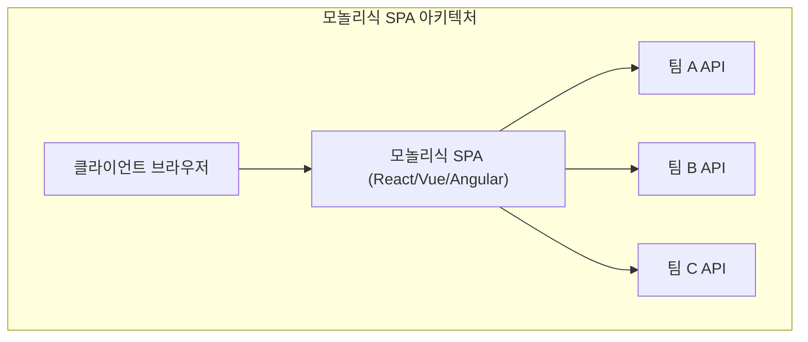
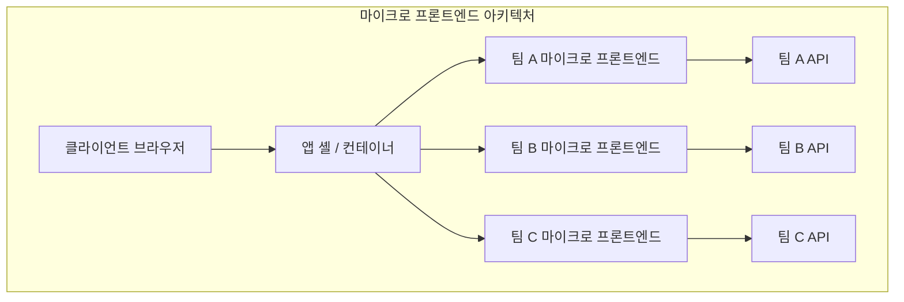
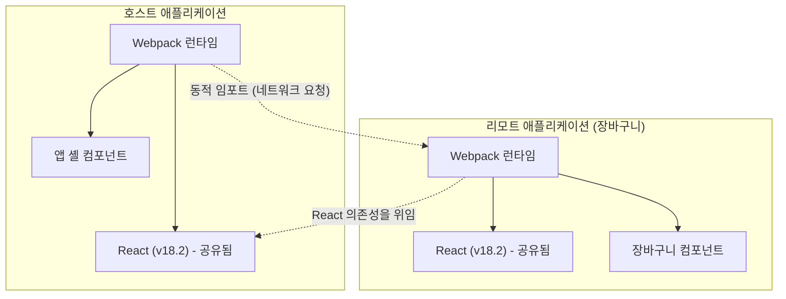

최근 웹 애플리케이션의 UI/UX에 대한 요구는 계속 높아지고 있으며, 프론트엔드 코드베이스는 그 어느 때보다 거대해지고 있습니다. Single Page Application ( **SPA** ) 의 대두로 풍부한 사용자 경험이 실현된 반면, 복잡해진 "프론트엔드 모놀리스"는 개발의 병목이 되고 있습니다.

본 기사에서는 거대해지는 SPA를 분할하고 팀의 자율성을 높이기 위한 **마이크로 프론트엔드** ( Micro Frontends ) 아키텍처에 대해 백엔드의 마이크로서비스화와의 대비, 각종 통합 기법, 그리고 현대의 사실상 표준이 되어가는 Webpack의 **Module Federation** 을 사용한 구현 패턴까지 매우 상세하게 해설합니다.

## 1. 왜 마이크로 프론트엔드가 필요한가?

### 모놀리식 프론트엔드의 한계

초기 웹 애플리케이션에서 프론트엔드는 백엔드가 생성한 HTML을 그리기 위한 얇은 계층에 불과했습니다. 그러나 React, Vue, Angular와 같은 모던 프레임워크의 보급으로 비즈니스 로직이나 상태 관리의 대부분이 클라이언트 측으로 이양되면서 프론트엔드의 코드량은 폭발적으로 증가했습니다.

그 결과로 탄생한 것이 **프론트엔드 모놀리스** 입니다. 하나의 거대한 리포지토리에 모든 UI 컴포넌트, 라우팅, 상태 관리가 집약됨으로써 다음과 같은 문제가 표면화됩니다.

* **빌드 시간의 장기화** : 코드베이스의 증가에 따라 빌드 및 테스트에 걸리는 시간이 기하급수적으로 증가합니다.
* **팀 간의 의존 및 조정 비용** : 여러 팀이 동일한 코드베이스를 다루기 때문에 병합 충돌이 빈발하고, 릴리스 주기 조정에 막대한 노력이 필요합니다.
* **기술적 부채의 축적 및 록인** : 애플리케이션 전체가 단일 프레임워크나 라이브러리의 버전에 의존하기 때문에 단계적인 리팩터링이나 새로운 기술의 도입이 어려워집니다.

### 백엔드의 마이크로서비스화와의 대비

백엔드 세계에서는 거대한 모놀리스를 분할하고 독립적으로 배포 가능한 서비스 군을 구축하는 **마이크로서비스 아키텍처** 가 널리 보급되었습니다. 이를 통해 각 팀은 독자적인 데이터베이스, 기술 스택, 배포 주기를 갖는 것이 가능해졌고 확장성과 개발 속도가 획기적으로 향상되었습니다.

그러나 백엔드가 마이크로서비스화되어 팀별로 분할되더라도 사용자에게 제공되는 UI(프론트엔드)가 단일 모놀리스 상태 그대로라면 진정한 의미의 엔드 투 엔드 자율성은 얻을 수 없습니다. 각 팀의 기능 추가는 결국 프론트엔드 통합이라는 병목에 직면합니다.

**마이크로 프론트엔드** 는 이 문제를 해결하고 프론트엔드 개발에서도 마이크로서비스와 동일한 혜택(독립 배포, 기술적 자유, 자율적인 팀)을 가져다주기 위한 접근 방식입니다.

## 2. 마이크로 프론트엔드란 무엇인가

마이크로 프론트엔드란 웹 애플리케이션을 독립된 팀에 의해 개발, 테스트, 배포되는 작은 프론트엔드 애플리케이션의 집합체로 구축하는 아키텍처 스타일입니다.

### 주요 장점

1. **독립된 배포** : 각 마이크로 프론트엔드는 다른 기능에 영향을 주지 않고 원하는 타이밍에 릴리스할 수 있습니다.
2. **팀의 자율성** : 데이터베이스에서 UI까지 특정 비즈니스 도메인에 책임을 지는 다기능 팀이 독립적으로 의사 결정을 내릴 수 있습니다.
3. **기술적 자유도 확보** : 각 팀은 요구 사항에 가장 적합한 기술 스택을 선택할 수 있으며, 단계적 마이그레이션(예: 오래된 Angular에서 새로운 React로)이 쉬워집니다.
4. **내결함성 향상** : 일부 기능에서 에러가 발생해도 애플리케이션 전체가 충돌하지 않고 에러 범위를 국소화할 수 있습니다.

### 단점 및 과제

한편으로 마이크로 프론트엔드에는 특유의 과제도 존재합니다.

* **페이로드의 비대화** : 여러 프론트엔드 애플리케이션이 독립적으로 동작하기 때문에 공통 라이브러리(예: React 자체)가 중복 다운로드될 위험이 있습니다.
* **운영 복잡성의 증가** : 다수의 리포지토리와 CI/CD 파이프라인을 관리해야 하므로 DevOps의 부담이 증가합니다.
* **일관된 UX 유지** : 서로 다른 팀이 개발한 UI를 통합하기 위해 디자인 시스템을 활용하고 사용자에게 이질감 없는 매끄러운 경험을 제공하기 위한 궁리가 필수적입니다.

## 3. 모놀리스 SPA와 마이크로 프론트엔드의 아키텍처 비교

기존의 모놀리식 SPA와 마이크로 프론트엔드 아키텍처의 구조적인 차이를 아래의 다이어그램으로 비교합니다.





위의 다이어그램이 보여주듯이 마이크로 프론트엔드에서는 **App Shell** (컨테이너 애플리케이션) 이 존재하며, 각 팀이 개발한 프론트엔드 애플리케이션을 동적으로 불러오고 통합합니다. 이를 통해 백엔드 API에서 UI까지 완벽하게 수직으로 분할되어 각 팀의 독립성이 유지됩니다.

## 4. 통합 기법의 패턴

마이크로 프론트엔드를 실현하기 위해서는 분할된 애플리케이션을 어떻게 하나의 화면에 '통합'할 것인지가 가장 큰 열쇠가 됩니다. 통합 기법은 크게 3가지 범주로 분류됩니다.

### 4.1. 빌드 시 통합 (Build-time Integration)

NPM 패키지 등을 사용하여 각 팀이 빌드한 모듈을 호스트 애플리케이션의 빌드 프로세스에서 통합하는 기법입니다.

* **장점** : 구현이 매우 간단하고 정적 분석이 쉽습니다. 기존 패키지 매니저의 메커니즘을 그대로 이용할 수 있습니다.
* **단점** : 의존성이 있는 컴포넌트가 업데이트될 때마다 호스트 애플리케이션 전체를 다시 빌드하고 다시 배포해야 합니다. 이는 마이크로 프론트엔드의 가장 큰 목적인 '독립된 배포'를 방해하므로 현재는 권장되지 않는 경우가 많습니다.

### 4.2. 서버 사이드 통합 (Server-side Integration)

서버 사이드에서 HTML을 조립할 때 각 마이크로 프론트엔드로부터 HTML 프래그먼트를 가져와 결합하여 클라이언트에 반환하는 기법입니다.

* **장점** : 초기 렌더링이 빠르며 SEO에 유리합니다. 클라이언트 측에 부담을 주지 않습니다.
* **대표적인 기술** : Nginx의 SSI (Server Side Includes) 나 Edge Side Includes (ESI), Zalando가 개발한 Project Mosaic 등이 있습니다.
* **단점** : 인프라스트럭처의 복잡성이 증가하며, 풍부한 클라이언트 사이드 인터랙션(SPA적인 라우팅)을 구현하려면 추가적인 장치가 필요합니다.

### 4.3. 클라이언트 사이드 통합 (Client-side Integration)

브라우저(클라이언트) 상에서 동적으로 각 마이크로 프론트엔드를 불러오고 통합하는 기법입니다. 현대의 SPA 기반 개발에서 가장 주류인 접근 방식입니다.

#### 4.3.1. iframe

가장 고전적이고 확실한 격리(아이솔레이션)를 제공하는 기법입니다.

* **장점** : CSS나 JavaScript의 스코프가 완전히 격리되므로 간섭이 일어나지 않습니다. 서로 다른 프레임워크를 안전하게 공존시킬 수 있습니다.
* **단점** : 성능 오버헤드가 크고 SEO에 악영향을 미칠 가능성이 있습니다. 또한 iframe 간의 통신(상태 공유나 라우팅 동기화)은 `postMessage` 를 경유해야 하므로 복잡해지기 쉽습니다.

#### 4.3.2. Web Components

브라우저 표준인 Web Components ( Custom Elements, Shadow DOM ) 를 이용하여 컴포넌트를 캡슐화하고 통합하는 기법입니다.

* **장점** : 프레임워크에 의존하지 않는 표준 기술이며 높은 상호 운용성을 가집니다. Shadow DOM을 통해 CSS 격리도 가능합니다.
* **단점** : 브라우저의 지원 상황은 성숙했지만 SSR(서버 사이드 렌더링)과의 궁합이나 전역 상태 관리 통합에 궁리가 필요합니다.

#### 4.3.3. Webpack Module Federation

Webpack 5에서 도입된 획기적인 플러그인이며, 현재 클라이언트 사이드 통합의 **사실상 표준** 이 되었습니다. 런타임 시에 다른 Webpack 빌드로부터 동적으로 코드를 불러오는 것을 가능하게 합니다.

## 5. Webpack Module Federation 심층 탐구

Webpack Module Federation은 마이크로 프론트엔드의 구현 패러다임을 획기적으로 바꿨습니다. 여기서는 그 메커니즘과 구현 예시를 상세히 해설합니다.

### 메커니즘 및 의존성 해결

Module Federation에서는 애플리케이션이 **Host** (호스트) 와 **Remote** (리모트) 두 가지 역할을 모두 수행할 수 있습니다.
Host는 초기 로드를 담당하는 애플리케이션이며, Remote는 동적으로 로드되는 모듈을 제공합니다.

특기할 만한 점은 그 **의존성 해결 메커니즘** 입니다. 여러 Remote 애플리케이션이 동일한 라이브러리(예: React나 Lodash)를 사용하는 경우, Module Federation은 중복 다운로드를 방지하고 Host와 Remote 간에 공유 라이브러리의 단일 인스턴스를 현명하게 재사용합니다.



위의 다이어그램은 Remote 애플리케이션이 자신의 React를 다운로드하지 않고 Host 애플리케이션이 제공하는 React를 재사용하는 모습을 보여줍니다. 이를 통해 클라이언트 사이드 통합의 약점이었던 '페이로드의 비대화'를 훌륭하게 해결하고 있습니다.

### 구현 예시: ModuleFederationPlugin 설정

실제 Webpack 5의 설정 예를 살펴보겠습니다. 여기서는 Host 애플리케이션이 Remote 애플리케이션(ShoppingCart)의 컴포넌트를 불러오는 구성을 가정합니다.

#### Remote 측 (ShoppingCart) 의 webpack.config.js

Remote 측에서는 공개할 컴포넌트와 공유할 라이브러리를 정의합니다.

```javascript
// remote/webpack.config.js
const { ModuleFederationPlugin } = require('webpack').container;
const path = require('path');

module.exports = {
  entry: './src/index',
  mode: 'development',
  output: {
    publicPath: 'auto',
  },
  plugins: [
    new ModuleFederationPlugin({
      name: 'shoppingCart',          // 애플리케이션의 고유한 이름
      filename: 'remoteEntry.js',    // 외부에서 불러오는 엔트리 포인트
      exposes: {
        './CartWidget': './src/components/CartWidget', // 공개할 컴포넌트
      },
      shared: {                      // 공유할 의존성
        react: { singleton: true, requiredVersion: '^18.2.0' },
        'react-dom': { singleton: true, requiredVersion: '^18.2.0' },
      },
    }),
  ],
};
```

#### Host 측의 webpack.config.js

Host 측에서는 어디서 Remote 애플리케이션을 불러올지 정의합니다.

```javascript
// host/webpack.config.js
const { ModuleFederationPlugin } = require('webpack').container;

module.exports = {
  entry: './src/index',
  mode: 'development',
  plugins: [
    new ModuleFederationPlugin({
      name: 'hostApp',
      remotes: {
        // 리모트이름@리모트URL/remoteEntry.js
        shoppingCart: 'shoppingCart@http://localhost:3001/remoteEntry.js',
      },
      shared: {
        react: { singleton: true, eager: true },
        'react-dom': { singleton: true, eager: true },
      },
    }),
  ],
};
```

#### React에서의 지연 로딩 통합 예시

Host 측의 React 코드에서는 `React.lazy` 와 `Suspense` 를 사용하여 Remote 컴포넌트를 네트워크를 통해 지연 로딩합니다.

```javascript
// host/src/App.jsx
import React, { Suspense } from 'react';

// webpack.config.js에서 정의한 리모트이름/exposes이름 을 지정
const RemoteCartWidget = React.lazy(() => import('shoppingCart/CartWidget'));

const App = () => {
  return (
    <div>
      <header>
        <h1>My E-Commerce Site</h1>
      </header>
      <main>
        <h2>Product List</h2>
        {/* ... 제품 목록 렌더링 ... */}
      </main>
      <aside>
        {/* Remote 컴포넌트가 로드될 때까지의 폴백 UI 지정 */}
        <Suspense fallback={<div>Loading Cart...</div>}>
          <RemoteCartWidget />
        </Suspense>
      </aside>
    </div>
  );
};

export default App;
```

이처럼 Module Federation을 사용함으로써 개발자는 로컬 컴포넌트를 임포트하는 것과 완전히 동일한 감각으로, 다른 리포지토리 및 다른 서버에 배포된 컴포넌트를 통합할 수 있습니다.

## 6. 상태 공유와 라우팅 과제

마이크로 프론트엔드를 구현하는 데 있어 기술적으로 가장 난이도가 높은 것이 '상태 공유'와 '라우팅'입니다. 각 팀의 자율성을 유지하면서 사용자에게는 매끄러운 경험을 제공해야 합니다.

### 상태 관리 접근 방식

마이크로 프론트엔드에서 전역 상태 관리(예: [Redux](https://kenji.blog/ko/p/state-management-history-redux-context-recoil-zustand/)의 거대한 단일 스토어)를 공유하는 것은 **안티패턴** 으로 간주됩니다. 이는 애플리케이션 간의 강한 결합을 만들고 독립된 배포를 방해하기 때문입니다.

대신 다음과 같은 느슨하게 결합된 접근 방식이 권장됩니다.

1. **Custom Events / Event Bus** : 브라우저 표준 API인 `CustomEvent` 나 경량 Event Bus 라이브러리를 사용하여 Publish-Subscribe 패턴으로 통신합니다.
   * 예: "장바구니에 추가" 버튼이 눌렸을 때 `ITEM_ADDED_TO_CART` 이벤트를 발생시키고, Cart 애플리케이션이 이를 리슨하여 자신의 상태를 업데이트합니다.
2. **URL / 쿼리 파라미터** : 가장 견고한 상태 공유 메커니즘은 URL입니다. 검색 쿼리나 선택된 필터를 URL에 유지함으로써 어떤 마이크로 프론트엔드든 URL을 파싱하는 것만으로 상태를 동기화할 수 있습니다.
3. **Web Storage** : 인증 토큰이나 사용자 설정 등 영속화가 필요하고 변경 빈도가 낮은 데이터는 `localStorage` 나 `sessionStorage` 를 통해 공유합니다.

### 라우팅 전략

라우팅은 사용자의 탐색을 어느 수준에서 제어할지 결정하는 중요한 요소입니다.

* **App Shell 패턴 (클라이언트 사이드 라우팅)** :
  상위 컨테이너 애플리케이션(App Shell)이 메인 라우터(예: `react-router`)를 가지며, URL 경로에 따라 적절한 마이크로 프론트엔드를 마운트/언마운트합니다.
  * `/products/*` -> 제품 팀의 애플리케이션에 라우팅을 위임.
  * `/checkout/*` -> 결제 팀의 애플리케이션에 위임.
  각 마이크로 프론트엔드 내에서는 추가적으로 내부 라우팅을 가질 수 있습니다.

* **[BFF](https://kenji.blog/ko/p/microservices-architecture-bff-api-gateway/) (Backend For Frontend) 계층에서의 라우팅** :
  서버 인프라(예: Nginx나 [API Gateway](https://kenji.blog/ko/p/microservices-architecture-bff-api-gateway/)) 수준에서 경로를 판단하여 처음부터 적절한 마이크로 프론트엔드의 HTML을 제공하는 기법입니다. 페이지 전환 시 하드 리프레시가 발생하지만 아키텍처의 분리도는 가장 높습니다.

## 7. 조직에 미치는 영향과 팀의 자율성

**콘웨이의 법칙** ("시스템을 설계하는 조직은 그 조직의 소통 구조를 복제한 구조의 설계를 낳는다")은 소프트웨어 아키텍처에서 매우 중요합니다.

마이크로 프론트엔드는 이 법칙을 역으로 이용한 **역 콘웨이의 법칙** 의 실천이라고도 할 수 있습니다. 즉, 바람직한 아키텍처(느슨하게 결합되고 자율적인)를 실현하기 위해 조직 구조를 거기에 맞게 최적화합니다.

기존의 "프론트엔드 팀", "백엔드 팀", "데이터베이스 팀"과 같은 직능형 조직이 아니라 특정 비즈니스 도메인(예: "검색", "결제", "사용자 관리")에 특화된 **다기능 팀 (Cross-functional Team)** 을 형성하는 것이 필수적입니다. 각 팀이 백엔드 API에서 프론트엔드 UI 컴포넌트까지 도메인의 모든 책임을 가질 때 비로소 마이크로 프론트엔드의 진가가 발휘됩니다.

## 8. 맺음말

거대해진 SPA를 분할하고 지속 가능한 개발 체제를 구축하기 위한 **마이크로 프론트엔드** 아키텍처에 대해 상세히 해설했습니다.

Webpack Module Federation의 등장으로 클라이언트 사이드에서의 동적 통합은 획기적으로 쉬워졌습니다. 그러나 마이크로 프론트엔드는 단순한 기술적인 과제 해결이 아니라 조직의 구조나 팀의 개발 프로세스에까지 발을 들이는 패러다임 전환입니다.

복잡성 증가라는 트레이드오프를 정확히 평가하고, 팀의 규모나 제품의 성장 단계에 맞춰 적절한 통합 기법과 아키텍처를 선택하는 것이 성공의 열쇠가 될 것입니다.
