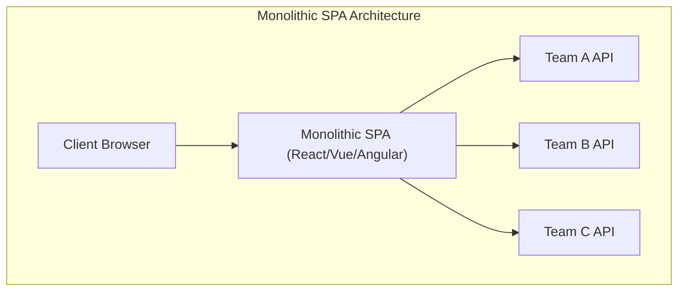
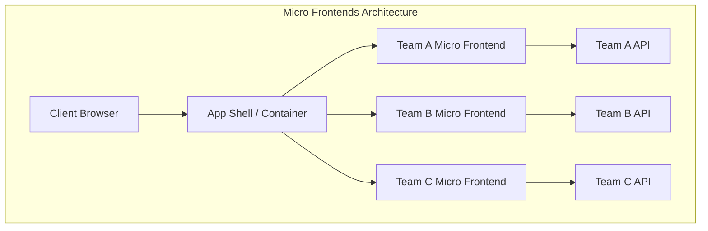
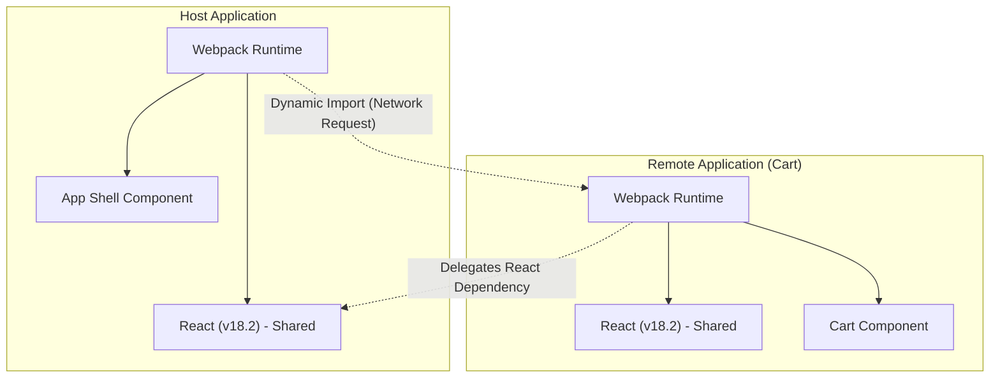

近年、ウェブアプリケーションのUI/UXに対する要求は高まり続け、フロントエンドのコードベースはかつてないほど巨大化しています。Single Page Application ( **SPA** ) の台頭により、リッチなユーザー体験が実現された一方で、複雑化した「フロントエンドモノリス」は開発のボトルネックとなりつつあります。

本記事では、巨大化するSPAを分割し、チームの自律性を高めるための **マイクロフロントエンド** ( Micro Frontends ) アーキテクチャについて、バックエンドの[マイクロサービス](https://kenji.blog/p/microservices-architecture-bff-api-gateway/)化との対比、各種統合手法、そして現代のデファクトスタンダードとなりつつある Webpack の **Module Federation** を用いた実装パターンまで、非常に詳細に解説します。

## 1. なぜマイクロフロントエンドが必要なのか？

### モノリシックなフロントエンドの限界

初期のウェブアプリケーションでは、フロントエンドはバックエンドが生成したHTMLを描画するための薄いレイヤーに過ぎませんでした。しかし、React、Vue、Angularといったモダンフレームワークの普及により、ビジネスロジックや[状態管理](https://kenji.blog/p/state-management-history-redux-context-recoil-zustand/)の多くがクライアント側に移譲され、フロントエンドのコード量は爆発的に増加しました。

この結果として生まれたのが **フロントエンドモノリス** です。1つの巨大なリポジトリに全てのUIコンポーネント、ルーティング、状態管理が集約されることで、以下のような問題が顕在化します。

* **ビルド時間の長期化** : コードベースの増加に伴い、ビルドやテストにかかる時間が指数関数的に増加します。
* **チーム間の依存と調整コスト** : 複数のチームが同一のコードベースを触るため、マージコンフリクトが頻発し、リリースサイクルの調整に多大な労力を要します。
* **技術的負債の蓄積と[ロック](https://kenji.blog/p/rdbms-transaction-acid-isolation-level-lock/)イン** : アプリケーション全体が単一のフレームワークやライブラリのバージョンに依存するため、段階的なリファクタリングや新しい技術の導入が困難になります。

### バックエンドの[マイクロサービス](https://kenji.blog/p/microservices-architecture-bff-api-gateway/)化との対比

バックエンドの世界では、巨大なモノリスを分割し、独立してデプロイ可能なサービス群を構築する **マイクロサービスアーキテクチャ** が広く普及しました。これにより、各チームは独自のデータベース、技術スタック、デプロイサイクルを持つことが可能になり、スケーラビリティと開発ベロシティが劇的に向上しました。

しかし、バックエンドがマイクロサービス化されてチームごとに分割されても、ユーザーに提供されるUI（フロントエンド）が単一のモノリスのままでは、真の意味でのエンドツーエンドの自律性は得られません。各チームの機能追加は、最終的にフロントエンドの統合というボトルネックに直面します。

**マイクロフロントエンド** は、この問題を解決し、フロントエンドの開発においてもマイクロサービスと同様の恩恵（独立デプロイ、技術的自由、自律したチーム）をもたらすためのアプローチです。

## 2. マイクロフロントエンドとは何か

マイクロフロントエンドとは、ウェブアプリケーションを、独立したチームによって開発、テスト、デプロイされる小さなフロントエンドアプリケーションの集合体として構築するアーキテクチャスタイルです。

### 主要なメリット

1. **独立したデプロイ** : 各マイクロフロントエンドは他の機能に影響を与えることなく、任意のタイミングでリリースできます。
2. **チームの自律性** : データベースからUIまで、特定のビジネスドメインに責任を持つクロスファンクショナルなチームが、独立して意思決定を行えます。
3. **技術的自由度の確保** : 各チームは要件に最適な技術スタックを選択でき、段階的な移行（例: 古いAngularから新しいReactへ）が容易になります。
4. **耐障害性の向上** : 一部の機能でエラーが発生しても、アプリケーション全体がクラッシュすることなく、エラーの範囲を局所化できます。

### デメリットと課題

一方で、マイクロフロントエンドには特有の課題も存在します。

* **ペイロードの肥大化** : 複数のフロントエンドアプリケーションが独立して動作するため、共通のライブラリ（例: React自身）が重複してダウンロードされるリスクがあります。
* **運用複雑性の増加** : 多数のリポジトリとCI/CDパイプラインを管理する必要があり、DevOpsの負担が増加します。
* **一貫したUXの維持** : 異なるチームが開発したUIを統合するため、デザインシステムを活用し、ユーザーにとって違和感のないシームレスな体験を提供するための工夫が不可欠です。

## 3. モノリスSPAとマイクロフロントエンドのアーキテクチャ比較

従来のモノリシックなSPAと、マイクロフロントエンドアーキテクチャの構造的な違いを以下の図で比較します。





上の図が示すように、マイクロフロントエンドでは **App Shell** (コンテナアプリケーション) が存在し、各チームが開発したフロントエンドアプリケーションを動的に読み込み、統合します。これにより、バックエンドAPIからUIまでが完全に垂直に分割され、各チームの独立性が保たれます。

## 4. 統合手法のパターン

マイクロフロントエンドを実現するためには、分割されたアプリケーションをどのように1つの画面に「統合」するかが最大の鍵となります。統合手法は大きく分けて3つのカテゴリに分類されます。

### 4.1. ビルド時統合 (Build-time Integration)

NPMパッケージなどを用いて、各チームがビルドしたモジュールをホストアプリケーションのビルドプロセスで統合する手法です。

* **メリット** : 実装が非常にシンプルであり、静的解析が容易です。既存のパッケージマネージャの仕組みをそのまま利用できます。
* **デメリット** : 依存関係のあるコンポーネントが更新されるたびに、ホストアプリケーション全体を再ビルドし、再デプロイする必要があります。これはマイクロフロントエンドの最大の目的である「独立したデプロイ」を妨げるため、現在では推奨されないことが多いです。

### 4.2. サーバサイド統合 (Server-side Integration)

サーバーサイドでHTMLを組み立てる際に、各マイクロフロントエンドからHTMLフラグメントを取得し、結合してクライアントに返す手法です。

* **メリット** : 初回レンダリングが高速であり、SEOに優れています。クライアント側に負担をかけません。
* **代表的な技術** : Nginxの SSI (Server Side Includes) や、Edge Side Includes (ESI)、Zalando が開発した Project Mosaic などがあります。
* **デメリット** : インフラストラクチャの複雑さが増し、リッチなクライアントサイドのインタラクション（SPA的なルーティング）を実現するには追加の仕組みが必要です。

### 4.3. クライアントサイド統合 (Client-side Integration)

ブラウザ（クライアント）上で動的に各マイクロフロントエンドを読み込み、統合する手法です。現代のSPAベースの開発において最も主流なアプローチです。

#### 4.3.1. iframe

最も古典的で確実な隔離（アイソレーション）を提供する手法です。

* **メリット** : CSSやJavaScriptのスコープが完全に隔離されるため、干渉が起こりません。異なるフレームワークを安全に共存させることができます。
* **デメリット** : パフォーマンスのオーバーヘッドが大きく、SEOに悪影響を及ぼす可能性があります。また、iframe間の通信（状態の共有やルーティングの同期）は `postMessage` を経由する必要があり、複雑になりがちです。

#### 4.3.2. Web Components

ブラウザ標準のWeb Components ( Custom Elements, Shadow DOM ) を利用してコンポーネントをカプセル化し、統合する手法です。

* **メリット** : フレームワークに依存しない標準技術であり、高い相互運用性を持ちます。Shadow DOMによりCSSの隔離も可能です。
* **デメリット** : ブラウザのサポート状況は成熟していますが、SSR（サーバーサイドレンダリング）との相性や、グローバルな[状態管理](https://kenji.blog/p/state-management-history-redux-context-recoil-zustand/)の統合に工夫が必要です。

#### 4.3.3. Webpack Module Federation

Webpack 5で導入された画期的なプラグインであり、現在クライアントサイド統合の **デファクトスタンダード** となっています。実行時に他のWebpackビルドから動的にコードを読み込むことを可能にします。

## 5. Webpack Module Federation の深掘り

Webpack Module Federation は、マイクロフロントエンドの実装パラダイムを劇的に変えました。ここでは、その仕組みと実装例を詳細に解説します。

### 仕組みと依存関係解決

Module Federation では、アプリケーションは **Host** (ホスト) と **Remote** (リモート) の両方の役割を果たすことができます。
Host は初期読み込みを担当するアプリケーションであり、Remote は動的に読み込まれるモジュールを提供します。

特筆すべきは、その **依存関係解決メカニズム** です。複数の Remote アプリケーションが同じライブラリ（例: React や Lodash）を使用している場合、Module Federation は重複したダウンロードを防ぎ、Host と Remote 間で共有ライブラリの単一インスタンスを賢く再利用します。



上の図は、Remoteアプリケーションが自身のReactをダウンロードせず、Hostアプリケーションが提供するReactを再利用している様子を示しています。これにより、クライアントサイド統合の弱点であった「ペイロードの肥大化」を見事に解決しています。

### 実装例: ModuleFederationPlugin の設定

実際の Webpack 5 の設定例を見てみましょう。ここでは、Hostアプリケーションが、Remoteアプリケーション（ShoppingCart）のコンポーネントを読み込む構成を想定します。

#### Remote側（ShoppingCart）の webpack.config.js

Remote側では、公開するコンポーネントと共有するライブラリを定義します。

```javascript
// remote/webpack.config.js
const { ModuleFederationPlugin } = require('webpack').container;
const path = require('path');

module.exports = {
  entry: './src/index',
  mode: 'development',
  output: {
    publicPath: 'auto',
  },
  plugins: [
    new ModuleFederationPlugin({
      name: 'shoppingCart',          // アプリケーションの一意な名前
      filename: 'remoteEntry.js',    // 外部から読み込まれるエントリーポイント
      exposes: {
        './CartWidget': './src/components/CartWidget', // 公開するコンポーネント
      },
      shared: {                      // 共有する依存関係
        react: { singleton: true, requiredVersion: '^18.2.0' },
        'react-dom': { singleton: true, requiredVersion: '^18.2.0' },
      },
    }),
  ],
};
```

#### Host側の webpack.config.js

Host側では、どこからRemoteアプリケーションを読み込むかを定義します。

```javascript
// host/webpack.config.js
const { ModuleFederationPlugin } = require('webpack').container;

module.exports = {
  entry: './src/index',
  mode: 'development',
  plugins: [
    new ModuleFederationPlugin({
      name: 'hostApp',
      remotes: {
        // remoteName@remoteURL/remoteEntry.js
        shoppingCart: 'shoppingCart@http://localhost:3001/remoteEntry.js',
      },
      shared: {
        react: { singleton: true, eager: true },
        'react-dom': { singleton: true, eager: true },
      },
    }),
  ],
};
```

#### React での遅延読み込み統合例

Host側のReactコードでは、 `React.lazy` と `Suspense` を使用して、Remoteコンポーネントをネットワーク越しに遅延読み込みします。

```javascript
// host/src/App.jsx
import React, { Suspense } from 'react';

// webpack.config.jsで定義した remotes名/exposes名 を指定
const RemoteCartWidget = React.lazy(() => import('shoppingCart/CartWidget'));

const App = () => {
  return (
    <div>
      <header>
        <h1>My E-Commerce Site</h1>
      </header>
      <main>
        <h2>Product List</h2>
        {/* ... 製品リストのレンダリング ... */}
      </main>
      <aside>
        {/* Remoteコンポーネントが読み込まれるまでのフォールバックUIを指定 */}
        <Suspense fallback={<div>Loading Cart...</div>}>
          <RemoteCartWidget />
        </Suspense>
      </aside>
    </div>
  );
};

export default App;
```

このように、Module Federation を使用することで、開発者はローカルのコンポーネントをインポートするのと全く同じ感覚で、別リポジトリ・別サーバーにデプロイされたコンポーネントを統合することができます。

## 6. 状態の共有とルーティングの課題

マイクロフロントエンドを実装する上で、技術的に最も難易度が高いのが「状態の共有」と「ルーティング」です。各チームの自律性を保ちつつ、ユーザーにはシームレスな体験を提供しなければなりません。

### [状態管理](https://kenji.blog/p/state-management-history-redux-context-recoil-zustand/)のアプローチ

マイクロフロントエンドにおいて、グローバルな状態管理（例: [Redux](https://kenji.blog/p/state-management-history-redux-context-recoil-zustand/) の巨大な単一ストア）を共有することは **アンチパターン** とされています。これは、アプリケーション間の密結合を生み、独立したデプロイを妨げるためです。

代わりに、以下のような疎結合なアプローチが推奨されます。

1. **Custom Events / Event Bus** : ブラウザの標準 API である `CustomEvent` や、軽量な Event Bus ライブラリを使用して、Publish-Subscribe パターンで通信を行います。
   * 例: "カートに追加" ボタンが押されたとき、 `ITEM_ADDED_TO_CART` イベントを発火し、Cart アプリケーションがそれをリッスンして自身の状態を更新します。
2. **URL / クエリパラメータ** : 最も堅牢な状態共有メカニズムはURLです。検索クエリや選択されたフィルターをURLに持たせることで、どのマイクロフロントエンドもURLをパースするだけで状態を同期できます。
3. **Web Storage** : 認証トークンやユーザー設定など、永続化が必要で変更頻度の低いデータは `localStorage` や `sessionStorage` を通じて共有します。

### ルーティングの戦略

ルーティングは、ユーザーのナビゲーションをどのレベルで制御するかを決定する重要な要素です。

* **App Shell パターン (クライアントサイドルーティング)** :
  上位のコンテナアプリケーション（App Shell）がメインのルーター（例: `react-router`）を持ち、URLパスに応じて適切なマイクロフロントエンドをマウント/アンマウントします。
  * `/products/*` -> 製品チームのアプリケーションにルーティングを委譲。
  * `/checkout/*` -> 決済チームのアプリケーションに委譲。
  各マイクロフロントエンド内では、さらに内部ルーティングを持つことができます。

* **[BFF](https://kenji.blog/p/microservices-architecture-bff-api-gateway/) (Backend For Frontend) レイヤーでのルーティング** :
  サーバーのインフラ（例: Nginx や [API Gateway](https://kenji.blog/p/microservices-architecture-bff-api-gateway/)）レベルでパスを判断し、最初から適切なマイクロフロントエンドのHTMLをサーブする手法です。ページ遷移時にハードリフレッシュが発生しますが、アーキテクチャの分離度は最も高くなります。

## 7. 組織への影響とチームの自律性

**コンウェイの法則** （「システムを設計する組織は、その組織のコミュニケーション構造をコピーした構造の設計を生み出す」）は、ソフトウェアアーキテクチャにおいて非常に重要です。

マイクロフロントエンドは、この法則を逆手にとった **逆コンウェイの法則** の実践とも言えます。つまり、望ましいアーキテクチャ（疎結合で自律的）を実現するために、組織構造をそれに合わせて最適化します。

従来の「フロントエンドチーム」「バックエンドチーム」「データベースチーム」といった職能型の組織ではなく、特定のビジネスドメイン（例: 「検索」「決済」「ユーザー管理」）に特化した **クロスファンクショナルチーム** を形成することが不可欠です。各チームがバックエンドAPIからフロントエンドのUIコンポーネントまで、ドメインの全責任を持つことで、初めてマイクロフロントエンドの真価が発揮されます。

## 8. おわりに

巨大化した SPA を分割し、持続可能な開発体制を構築するための **マイクロフロントエンド** アーキテクチャについて詳細に解説しました。

Webpack Module Federation の登場により、クライアントサイドでの動的統合は劇的に容易になりました。しかし、マイクロフロントエンドは単なる技術的な課題解決ではなく、組織の構造やチームの開発プロセスにまで踏み込むパラダイムシフトです。

複雑性の増加というトレードオフを正確に評価し、チームの規模やプロダクトの成長フェーズに合わせて、適切な統合手法とアーキテクチャを選択することが、成功への鍵となるでしょう。
