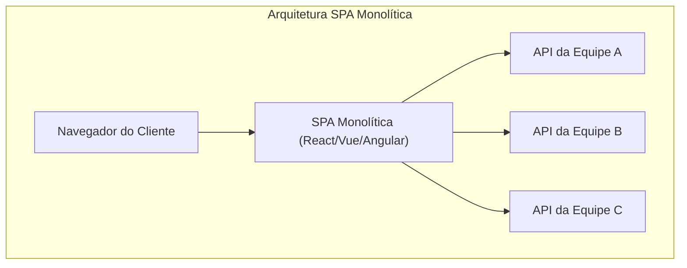
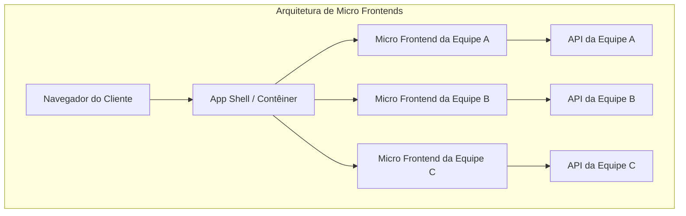
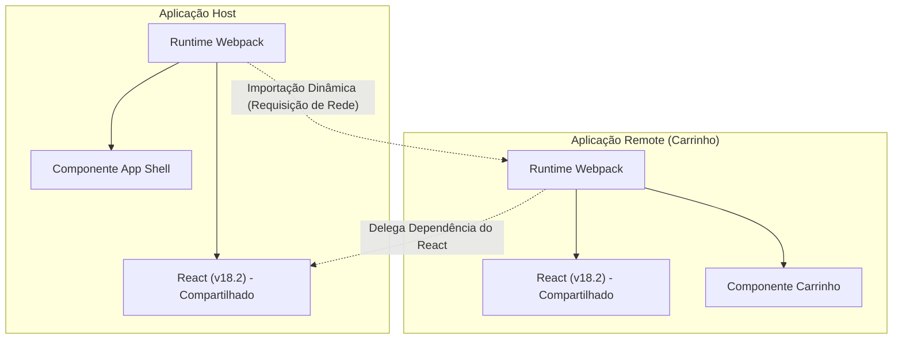

Nos últimos anos, as exigências por UI/UX em aplicações web continuam a crescer, e as bases de código do front-end tornaram-se maiores do que nunca. Enquanto a ascensão das Single Page Applications ( **SPA** ) possibilitou experiências ricas para os usuários, o complexo "monólito front-end" está se tornando um gargalo no desenvolvimento.

Neste artigo, detalharemos a arquitetura de **micro frontends** (Micro Frontends), que visa dividir as crescentes SPAs e aumentar a autonomia das equipes. Abordaremos o contraste com os microsserviços de back-end, vários métodos de integração e os padrões de implementação usando o **Module Federation** do Webpack, que está se tornando o padrão de fato nos dias de hoje.

## 1. Por que os Micro Frontends são necessários?

### Limitações do front-end monolítico

Nas aplicações web iniciais, o front-end era apenas uma camada fina para renderizar o HTML gerado pelo back-end. No entanto, com a popularização de frameworks modernos como React, Vue e Angular, grande parte da lógica de negócios e gerenciamento de estado foi transferida para o lado do cliente, resultando em um aumento explosivo na quantidade de código front-end.

O resultado disso é o **monólito front-end**. Consolidar todos os componentes de UI, roteamento e gerenciamento de estado em um único grande repositório faz com que os seguintes problemas se tornem aparentes:

* **Tempos de build prolongados** : À medida que a base de código cresce, o tempo necessário para builds e testes aumenta exponencialmente.
* **Dependências entre equipes e custos de coordenação** : Como várias equipes mexem na mesma base de código, os conflitos de merge ocorrem com frequência, exigindo um grande esforço para coordenar os ciclos de lançamento.
* **Acúmulo de dívida técnica e lock-in** : Como a aplicação inteira depende de uma única versão de um framework ou biblioteca, a refatoração gradual ou a adoção de novas tecnologias torna-se difícil.

### Contraste com os microsserviços de back-end

No mundo do back-end, a **arquitetura de microsserviços**, que divide grandes monólitos para construir conjuntos de serviços que podem ser implantados de forma independente, tornou-se amplamente adotada. Isso permitiu que cada equipe tivesse seu próprio banco de dados, stack de tecnologia e ciclo de implantação, melhorando drasticamente a escalabilidade e a velocidade de desenvolvimento.

No entanto, mesmo que o back-end seja transformado em microsserviços e dividido por equipe, se a UI (front-end) entregue ao usuário permanecer um monólito único, a verdadeira autonomia de ponta a ponta não é alcançada. A adição de recursos por cada equipe acaba enfrentando o gargalo da integração do front-end.

**Micro frontends** são uma abordagem para resolver esse problema e trazer os mesmos benefícios dos microsserviços (implantação independente, liberdade técnica, equipes autônomas) para o desenvolvimento front-end.

## 2. O que são Micro Frontends?

Micro frontends são um estilo de arquitetura no qual uma aplicação web é construída como uma coleção de pequenas aplicações front-end, desenvolvidas, testadas e implantadas por equipes independentes.

### Principais benefícios

1. **Implantações independentes** : Cada micro frontend pode ser lançado a qualquer momento, sem afetar outras funcionalidades.
2. **Autonomia das equipes** : Equipes multifuncionais, responsáveis por um domínio de negócios específico — desde o banco de dados até a UI — podem tomar decisões de forma independente.
3. **Garantia de liberdade técnica** : Cada equipe pode escolher a stack tecnológica ideal para seus requisitos, facilitando migrações graduais (por exemplo, de um Angular antigo para um React novo).
4. **Maior tolerância a falhas** : Mesmo que ocorra um erro em algumas funcionalidades, a aplicação como um todo não falha, localizando o escopo do erro.

### Desvantagens e desafios

Por outro lado, os micro frontends também apresentam desafios únicos.

* **Inchaço do payload** : Como várias aplicações front-end funcionam independentemente, há o risco de bibliotecas comuns (por exemplo, o próprio React) serem baixadas repetidamente.
* **Aumento da complexidade operacional** : Há a necessidade de gerenciar vários repositórios e pipelines de CI/CD, aumentando a carga do DevOps.
* **Manutenção de uma UX consistente** : Para integrar UIs desenvolvidas por diferentes equipes, o uso de um design system é essencial para fornecer uma experiência contínua e natural aos usuários.

## 3. Comparação de arquitetura entre SPA monolítica e Micro Frontends

As diferenças estruturais entre uma SPA monolítica tradicional e a arquitetura de micro frontends são comparadas nos diagramas abaixo.





Como mostra o diagrama acima, nos micro frontends, existe um **App Shell** (aplicação contêiner) que carrega e integra dinamicamente as aplicações front-end desenvolvidas por cada equipe. Com isso, tudo, desde a API de back-end até a UI, é totalmente dividido verticalmente, mantendo a independência de cada equipe.

## 4. Padrões de métodos de integração

Para concretizar os micro frontends, a maior chave é como "integrar" as aplicações divididas em uma única tela. Os métodos de integração podem ser amplamente classificados em três categorias.

### 4.1. Integração em tempo de build (Build-time Integration)

Um método onde módulos construídos por cada equipe, usando pacotes NPM por exemplo, são integrados durante o processo de build da aplicação host.

* **Vantagens** : A implementação é muito simples e a análise estática é fácil. Os mecanismos dos gerenciadores de pacotes existentes podem ser usados como estão.
* **Desvantagens** : Sempre que um componente com dependências é atualizado, a aplicação host inteira deve ser reconstruída e reimplantada. Como isso impede o objetivo principal dos micro frontends — "implantação independente" — muitas vezes não é recomendado atualmente.

### 4.2. Integração no lado do servidor (Server-side Integration)

Um método onde, ao montar o HTML no lado do servidor, fragmentos de HTML são obtidos de cada micro frontend, combinados e retornados ao cliente.

* **Vantagens** : A renderização inicial é rápida e favorável para o SEO. Não sobrecarrega o lado do cliente.
* **Tecnologias representativas** : SSI (Server Side Includes) do Nginx, Edge Side Includes (ESI) e Project Mosaic desenvolvido pela Zalando.
* **Desvantagens** : A complexidade da infraestrutura aumenta e são necessários mecanismos adicionais para alcançar interações ricas no lado do cliente (roteamento tipo SPA).

### 4.3. Integração no lado do cliente (Client-side Integration)

Um método onde cada micro frontend é carregado e integrado dinamicamente no navegador (cliente). É a abordagem mais comum no desenvolvimento moderno baseado em SPA.

#### 4.3.1. iframe

O método que fornece o isolamento mais clássico e confiável.

* **Vantagens** : Os escopos de CSS e JavaScript são completamente isolados, evitando interferências. Diferentes frameworks podem coexistir de forma segura.
* **Desvantagens** : A sobrecarga de desempenho é grande e pode afetar negativamente o SEO. Além disso, a comunicação entre iframes (compartilhamento de estado e sincronização de roteamento) deve passar pelo `postMessage`, o que tende a se tornar complexo.

#### 4.3.2. Web Components

Um método que utiliza o padrão de navegador Web Components (Custom Elements, Shadow DOM) para encapsular e integrar componentes.

* **Vantagens** : É uma tecnologia padrão independente de framework e possui alta interoperabilidade. O isolamento de CSS também é possível através do Shadow DOM.
* **Desvantagens** : Embora o suporte dos navegadores seja maduro, a integração com SSR (Server-Side Rendering) e o gerenciamento de estado global exigem esforço.

#### 4.3.3. Webpack Module Federation

Um plugin revolucionário introduzido no Webpack 5 e atualmente o **padrão de fato** para a integração no lado do cliente. Permite o carregamento dinâmico de código de outras builds do Webpack em tempo de execução.

## 5. Mergulho profundo no Webpack Module Federation

O Webpack Module Federation mudou drasticamente o paradigma de implementação de micro frontends. Aqui, detalharemos seu funcionamento e exemplos de implementação.

### Funcionamento e resolução de dependências

No Module Federation, uma aplicação pode desempenhar o papel de **Host** e **Remote**.
O Host é a aplicação responsável pelo carregamento inicial, enquanto o Remote fornece os módulos carregados dinamicamente.

O que se destaca é o seu **mecanismo de resolução de dependências**. Quando várias aplicações Remote usam a mesma biblioteca (por exemplo, React ou Lodash), o Module Federation evita o download duplicado e reutiliza inteligentemente uma única instância da biblioteca compartilhada entre o Host e o Remote.



O diagrama acima mostra que a aplicação Remote não baixa seu próprio React, mas reutiliza o React fornecido pela aplicação Host. Isso resolve perfeitamente a "obesidade do payload", que era uma fraqueza da integração no lado do cliente.

### Exemplo de implementação: Configuração do ModuleFederationPlugin

Vamos ver um exemplo real de configuração do Webpack 5. Aqui, assumimos uma configuração onde a aplicação Host carrega um componente da aplicação Remote (ShoppingCart).

#### webpack.config.js no lado Remote (ShoppingCart)

No lado Remote, definimos os componentes a serem expostos e as bibliotecas a serem compartilhadas.

```javascript
// remote/webpack.config.js
const { ModuleFederationPlugin } = require('webpack').container;
const path = require('path');

module.exports = {
  entry: './src/index',
  mode: 'development',
  output: {
    publicPath: 'auto',
  },
  plugins: [
    new ModuleFederationPlugin({
      name: 'shoppingCart',          // Nome exclusivo da aplicação
      filename: 'remoteEntry.js',    // Ponto de entrada carregado externamente
      exposes: {
        './CartWidget': './src/components/CartWidget', // Componente a ser exposto
      },
      shared: {                      // Dependências a serem compartilhadas
        react: { singleton: true, requiredVersion: '^18.2.0' },
        'react-dom': { singleton: true, requiredVersion: '^18.2.0' },
      },
    }),
  ],
};
```

#### webpack.config.js no lado Host

No lado Host, definimos de onde carregar a aplicação Remote.

```javascript
// host/webpack.config.js
const { ModuleFederationPlugin } = require('webpack').container;

module.exports = {
  entry: './src/index',
  mode: 'development',
  plugins: [
    new ModuleFederationPlugin({
      name: 'hostApp',
      remotes: {
        // remoteName@remoteURL/remoteEntry.js
        shoppingCart: 'shoppingCart@http://localhost:3001/remoteEntry.js',
      },
      shared: {
        react: { singleton: true, eager: true },
        'react-dom': { singleton: true, eager: true },
      },
    }),
  ],
};
```

#### Exemplo de integração de lazy loading com React

No código React do lado Host, usamos `React.lazy` e `Suspense` para carregar componentes Remote de forma preguiçosa (lazy loading) através da rede.

```javascript
// host/src/App.jsx
import React, { Suspense } from 'react';

// Especifique nome_remote/nome_exposes definido no webpack.config.js
const RemoteCartWidget = React.lazy(() => import('shoppingCart/CartWidget'));

const App = () => {
  return (
    <div>
      <header>
        <h1>Meu Site de E-Commerce</h1>
      </header>
      <main>
        <h2>Lista de Produtos</h2>
        {/* ... Renderização da lista de produtos ... */}
      </main>
      <aside>
        {/* Especifica a UI de fallback até que o componente Remote seja carregado */}
        <Suspense fallback={<div>Carregando Carrinho...</div>}>
          <RemoteCartWidget />
        </Suspense>
      </aside>
    </div>
  );
};

export default App;
```

Dessa forma, usando o Module Federation, os desenvolvedores podem integrar componentes implantados em diferentes repositórios e servidores com a mesma sensação de importar componentes locais.

## 6. Desafios de compartilhamento de estado e roteamento

Na implementação de micro frontends, os aspectos tecnicamente mais difíceis são o "compartilhamento de estado" e o "roteamento". Devemos fornecer uma experiência contínua aos usuários, mantendo a autonomia de cada equipe.

### Abordagens de gerenciamento de estado

Em micro frontends, compartilhar o gerenciamento de estado global (por exemplo, a única store massiva do [Redux](https://kenji.blog/pt/p/state-management-history-redux-context-recoil-zustand/)) é considerado um **antipadrão**. Isso cria um acoplamento forte entre as aplicações, impedindo implantações independentes.

Em vez disso, as seguintes abordagens de baixo acoplamento são recomendadas:

1. **Custom Events / Event Bus** : Usando a API padrão do navegador `CustomEvent` ou bibliotecas leves de Event Bus para comunicação com o padrão Publish-Subscribe.
   * Exemplo: Quando o botão "Adicionar ao carrinho" é clicado, o evento `ITEM_ADDED_TO_CART` é disparado, e a aplicação de Carrinho o ouve para atualizar seu próprio estado.
2. **URL / Parâmetros de Consulta** : O mecanismo de compartilhamento de estado mais robusto é a URL. Mantendo as consultas de pesquisa e os filtros selecionados na URL, qualquer micro frontend pode sincronizar seu estado apenas analisando a URL.
3. **Web Storage** : Dados que precisam ser persistidos e não mudam com frequência, como tokens de autenticação e configurações de usuário, são compartilhados através do `localStorage` ou `sessionStorage`.

### Estratégias de roteamento

O roteamento é um fator chave que determina em qual nível a navegação do usuário é controlada.

* **Padrão App Shell (Roteamento no lado do cliente)** :
  A aplicação contêiner de nível superior (App Shell) tem o roteador principal (por exemplo, `react-router`) e monta/desmonta os micro frontends apropriados de acordo com o caminho da URL.
  * `/products/*` -> Delega o roteamento para a aplicação da equipe de produtos.
  * `/checkout/*` -> Delega para a aplicação da equipe de pagamentos.
  Dentro de cada micro frontend, eles podem ter seu próprio roteamento interno.

* **Roteamento na camada [BFF](https://kenji.blog/pt/p/microservices-architecture-bff-api-gateway/) (Backend For Frontend)** :
  Um método onde o caminho é avaliado no nível de infraestrutura do servidor (por exemplo, Nginx ou [API Gateway](https://kenji.blog/pt/p/microservices-architecture-bff-api-gateway/)), servindo o HTML do micro frontend apropriado desde o início. Embora ocorra um hard refresh ao transitar de página, o grau de separação da arquitetura é o mais alto.

## 7. Impacto organizacional e autonomia da equipe

A **Lei de Conway** ("qualquer organização que projete um sistema produzirá um design cuja estrutura é uma cópia da estrutura de comunicação da organização") é extremamente importante na arquitetura de software.

Pode-se dizer que os micro frontends são uma prática da **Lei de Conway Inversa** que usa essa lei a seu favor. Em outras palavras, a fim de alcançar a arquitetura desejada (baixo acoplamento e autônoma), a estrutura organizacional é otimizada para corresponder a ela.

Em vez das tradicionais organizações baseadas em funções, como "equipe de front-end", "equipe de back-end" e "equipe de banco de dados", é essencial formar **equipes multifuncionais** especializadas em domínios de negócios específicos (por exemplo, "busca", "pagamentos", "gerenciamento de usuários"). Os micro frontends só mostram seu verdadeiro valor quando cada equipe tem total responsabilidade por seu domínio, desde a API de back-end até os componentes de UI front-end.

## 8. Conclusão

Nós detalhamos a arquitetura de **micro frontends** para dividir SPAs massivos e construir um sistema de desenvolvimento sustentável.

Com o advento do Webpack Module Federation, a integração dinâmica no lado do cliente tornouse drasticamente mais fácil. No entanto, os micro frontends não são apenas uma solução técnica, mas uma mudança de paradigma que abrange até a estrutura da organização e o processo de desenvolvimento da equipe.

Avaliar com precisão os trade-offs do aumento de complexidade e escolher o método de integração e a arquitetura corretos, de acordo com o tamanho da equipe e a fase de crescimento do produto, será a chave para o sucesso.
