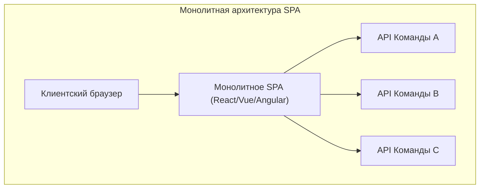
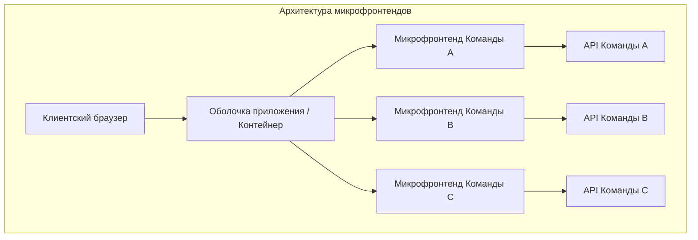
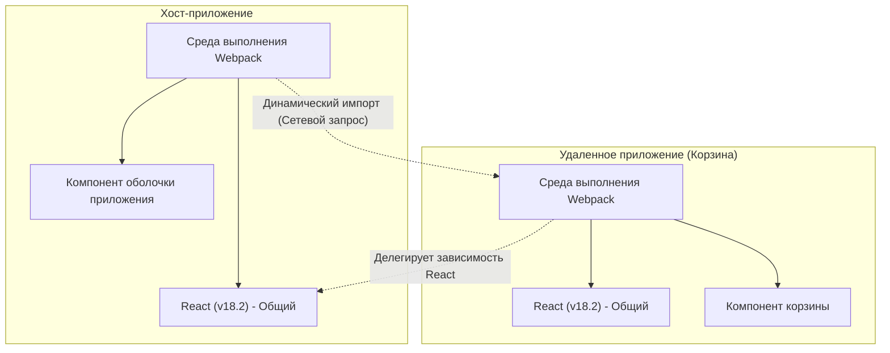

В последние годы требования к UI/UX веб-приложений продолжают расти, и кодовые базы фронтенда стали огромными как никогда. В то время как появление Single Page Application ( **SPA** ) позволило реализовать богатый пользовательский опыт, усложнившийся "фронтенд-монолит" становится узким местом в разработке.

В этой статье мы подробно рассмотрим архитектуру **микрофронтендов** ( Micro Frontends ), предназначенную для разделения разрастающихся SPA и повышения автономности команд. Мы сравним её с микросервисами на бэкенде, изучим различные методы интеграции и паттерны реализации с использованием **Module Federation** в Webpack, который становится современным стандартом де-факто.

## 1. Зачем нужны микрофронтенды?

### Ограничения монолитного фронтенда

В ранних веб-приложениях фронтенд был лишь тонким слоем для отображения HTML, сгенерированного бэкендом. Однако с распространением современных фреймворков, таких как React, Vue и Angular, большая часть бизнес-логики и управления состоянием была перенесена на сторону клиента, что привело к взрывному росту объема кода фронтенда.

Результатом этого стал **фронтенд-монолит**. Когда все UI-компоненты, маршрутизация и управление состоянием собраны в одном гигантском репозитории, возникают следующие проблемы:

* **Увеличение времени сборки** : По мере роста кодовой базы время, затрачиваемое на сборку и тестирование, растет экспоненциально.
* **Зависимости между командами и затраты на координацию** : Поскольку несколько команд работают с одной и той же кодовой базой, часто возникают конфликты слияния, а координация циклов релиза требует огромных усилий.
* **Накопление технического долга и привязка к технологиям** : Поскольку всё приложение зависит от одной версии фреймворка или библиотеки, постепенный рефакторинг и внедрение новых технологий становятся затруднительными.

### Сравнение с микросервисами бэкенда

В мире бэкенда широкое распространение получила **микросервисная архитектура**, при которой гигантский монолит разделяется на набор сервисов, которые можно развертывать независимо. Это позволило каждой команде иметь свою базу данных, технологический стек и цикл развертывания, что кардинально улучшило масштабируемость и скорость разработки.

Однако, даже если бэкенд разделен на микросервисы и распределен по командам, если UI (фронтенд), предоставляемый пользователю, остается единым монолитом, истинная сквозная автономность (end-to-end) не достигается. Добавление функций каждой командой в конечном итоге сталкивается с узким местом интеграции фронтенда.

**Микрофронтенды** — это подход, который решает эту проблему и приносит во фронтенд-разработку те же преимущества (независимое развертывание, технологическая свобода, автономные команды), что и микросервисы.

## 2. Что такое микрофронтенды?

Микрофронтенды — это архитектурный стиль, при котором веб-приложение создается как совокупность небольших фронтенд-приложений, которые разрабатываются, тестируются и развертываются независимыми командами.

### Основные преимущества

1. **Независимое развертывание** : Каждый микрофронтенд может быть выпущен в любое время, не влияя на другие функции.
2. **Автономность команд** : Кросс-функциональные команды, отвечающие за определенный бизнес-домен от базы данных до UI, могут принимать решения независимо.
3. **Обеспечение технологической свободы** : Каждая команда может выбрать технологический стек, который лучше всего подходит для её требований, что облегчает постепенную миграцию (например, со старого Angular на новый React).
4. **Повышение отказоустойчивости** : Если ошибка возникает в одной из функций, всё приложение не падает, и область ошибки может быть локализована.

### Недостатки и проблемы

С другой стороны, микрофронтендам также присущи определенные проблемы.

* **Раздувание полезной нагрузки (payload)** : Поскольку несколько фронтенд-приложений работают независимо, существует риск повторного скачивания общих библиотек (например, самого React).
* **Увеличение операционной сложности** : Необходимо управлять множеством репозиториев и конвейерами CI/CD, что увеличивает нагрузку на DevOps.
* **Поддержание согласованного UX** : Поскольку UI, разработанные разными командами, интегрируются вместе, необходимо использовать дизайн-системы и принимать меры для обеспечения бесшовного пользовательского опыта без диссонанса.

## 3. Архитектурное сравнение: монолитные SPA и микрофронтенды

Структурные различия между традиционными монолитными SPA и архитектурой микрофронтендов показаны на схемах ниже.





Как показано на схемах выше, в микрофронтендах существует **App Shell** (контейнерное приложение), которое динамически загружает и интегрирует фронтенд-приложения, разработанные каждой командой. Благодаря этому достигается полное вертикальное разделение от бэкенд-API до UI, и сохраняется независимость каждой команды.

## 4. Паттерны методов интеграции

Для реализации микрофронтендов самым главным ключом является то, как "интегрировать" разделенные приложения на одном экране. Методы интеграции можно разделить на три основные категории.

### 4.1. Интеграция во время сборки (Build-time Integration)

В этом методе используются NPM-пакеты и т.п., и модули, собранные каждой командой, интегрируются в процессе сборки хост-приложения.

* **Преимущества** : Реализация очень проста, и статический анализ выполняется легко. Можно использовать существующие механизмы пакетных менеджеров как есть.
* **Недостатки** : При каждом обновлении зависимого компонента всё хост-приложение необходимо пересобирать и повторно развертывать. Это препятствует главной цели микрофронтендов — "независимому развертыванию", поэтому в настоящее время этот метод часто не рекомендуется.

### 4.2. Серверная интеграция (Server-side Integration)

В этом методе при сборке HTML на стороне сервера из каждого микрофронтенда извлекаются фрагменты HTML, объединяются и возвращаются клиенту.

* **Преимущества** : Быстрый первоначальный рендеринг, что отлично подходит для SEO. Не создает нагрузки на сторону клиента.
* **Представительные технологии** : SSI (Server Side Includes) в Nginx, Edge Side Includes (ESI) и Project Mosaic, разработанный Zalando.
* **Недостатки** : Увеличивается сложность инфраструктуры, и для реализации богатых клиентских взаимодействий (маршрутизация в стиле SPA) требуются дополнительные механизмы.

### 4.3. Клиентская интеграция (Client-side Integration)

В этом методе каждый микрофронтенд динамически загружается и интегрируется в браузере (клиенте). Это самый популярный подход в современной разработке на базе SPA.

#### 4.3.1. iframe

Самый классический метод, обеспечивающий надежную изоляцию.

* **Преимущества** : Полная изоляция области видимости CSS и JavaScript, поэтому конфликтов не возникает. Можно безопасно совмещать разные фреймворки.
* **Недостатки** : Большие накладные расходы на производительность, и возможно негативное влияние на SEO. Кроме того, связь между iframe (обмен состоянием и синхронизация маршрутизации) должна осуществляться через `postMessage`, что часто бывает сложным.

#### 4.3.2. Web Components

Метод, использующий стандартные для браузеров Web Components ( Custom Elements, Shadow DOM ) для инкапсуляции и интеграции компонентов.

* **Преимущества** : Стандартная технология, не зависящая от фреймворков, с высокой интероперабельностью. Возможна изоляция CSS с помощью Shadow DOM.
* **Недостатки** : Хотя поддержка браузерами уже созрела, требуются обходные пути для совместимости с SSR (Server-Side Rendering) и интеграции управления глобальным состоянием.

#### 4.3.3. Webpack Module Federation

Это инновационный плагин, представленный в Webpack 5, который в настоящее время является **стандартом де-факто** для клиентской интеграции. Позволяет динамически загружать код из других сборок Webpack во время выполнения.

## 5. Глубокое погружение в Webpack Module Federation

Webpack Module Federation кардинально изменил парадигму реализации микрофронтендов. Здесь мы подробно объясним, как он работает, и приведем примеры реализации.

### Механизм и разрешение зависимостей

В Module Federation приложение может выступать как в роли **Host** (хост), так и **Remote** (удаленное приложение).
Host — это приложение, отвечающее за начальную загрузку, а Remote предоставляет модули, которые загружаются динамически.

Особого внимания заслуживает его **механизм разрешения зависимостей**. Если несколько Remote-приложений используют одну и ту же библиотеку (например, React или Lodash), Module Federation предотвращает дублирование загрузок и грамотно переиспользует единый экземпляр общей библиотеки между Host и Remote.



Схема выше показывает, как Remote-приложение не загружает собственный React, а переиспользует React, предоставляемый Host-приложением. Таким образом великолепно решается проблема "раздувания полезной нагрузки", которая была слабым местом клиентской интеграции.

### Пример реализации: Настройка ModuleFederationPlugin

Давайте посмотрим на пример реальной настройки Webpack 5. Здесь мы предполагаем конфигурацию, в которой Host-приложение загружает компонент из Remote-приложения (ShoppingCart).

#### webpack.config.js на стороне Remote (ShoppingCart)

На стороне Remote мы определяем компоненты для публикации и библиотеки для совместного использования.

```javascript
// remote/webpack.config.js
const { ModuleFederationPlugin } = require('webpack').container;
const path = require('path');

module.exports = {
  entry: './src/index',
  mode: 'development',
  output: {
    publicPath: 'auto',
  },
  plugins: [
    new ModuleFederationPlugin({
      name: 'shoppingCart',          // Уникальное имя приложения
      filename: 'remoteEntry.js',    // Точка входа для загрузки извне
      exposes: {
        './CartWidget': './src/components/CartWidget', // Компонент для публикации
      },
      shared: {                      // Общие зависимости
        react: { singleton: true, requiredVersion: '^18.2.0' },
        'react-dom': { singleton: true, requiredVersion: '^18.2.0' },
      },
    }),
  ],
};
```

#### webpack.config.js на стороне Host

На стороне Host мы определяем, откуда загружать Remote-приложения.

```javascript
// host/webpack.config.js
const { ModuleFederationPlugin } = require('webpack').container;

module.exports = {
  entry: './src/index',
  mode: 'development',
  plugins: [
    new ModuleFederationPlugin({
      name: 'hostApp',
      remotes: {
        // remoteName@remoteURL/remoteEntry.js
        shoppingCart: 'shoppingCart@http://localhost:3001/remoteEntry.js',
      },
      shared: {
        react: { singleton: true, eager: true },
        'react-dom': { singleton: true, eager: true },
      },
    }),
  ],
};
```

#### Пример интеграции с отложенной загрузкой в React

В коде React на стороне Host мы используем `React.lazy` и `Suspense` для отложенной загрузки Remote-компонента по сети.

```javascript
// host/src/App.jsx
import React, { Suspense } from 'react';

// Указываем remotes-имя/exposes-имя, определенные в webpack.config.js
const RemoteCartWidget = React.lazy(() => import('shoppingCart/CartWidget'));

const App = () => {
  return (
    <div>
      <header>
        <h1>Мой сайт электронной коммерции</h1>
      </header>
      <main>
        <h2>Список товаров</h2>
        {/* ... Рендеринг списка товаров ... */}
      </main>
      <aside>
        {/* Указываем резервный UI до загрузки Remote-компонента */}
        <Suspense fallback={<div>Загрузка корзины...</div>}>
          <RemoteCartWidget />
        </Suspense>
      </aside>
    </div>
  );
};

export default App;
```

Таким образом, используя Module Federation, разработчики могут интегрировать компоненты, развернутые в другом репозитории и на другом сервере, с тем же ощущением, что и импорт локального компонента.

## 6. Проблемы с обменом состоянием и маршрутизацией

При реализации микрофронтендов технически наиболее сложными аспектами являются "обмен состоянием" и "маршрутизация". Необходимо обеспечить пользователям бесшовный опыт, сохраняя при этом автономность каждой команды.

### Подходы к управлению состоянием

В микрофронтендах совместное использование глобального управления состоянием (например, огромного единого хранилища [Redux](https://kenji.blog/ru/p/state-management-history-redux-context-recoil-zustand/)) считается **антипаттерном**. Это связано с тем, что оно создает сильную связанность между приложениями и препятствует независимому развертыванию.

Вместо этого рекомендуются следующие слабосвязанные подходы:

1. **Custom Events / Event Bus** : Связь осуществляется по паттерну Publish-Subscribe с использованием стандартного API браузера `CustomEvent` или легковесных библиотек Event Bus.
   * Пример: При нажатии кнопки "Добавить в корзину" генерируется событие `ITEM_ADDED_TO_CART`, и приложение Корзины прослушивает его для обновления своего состояния.
2. **URL / Параметры запроса** : Самый надежный механизм обмена состоянием — это URL. Помещая поисковые запросы или выбранные фильтры в URL, любой микрофронтенд может синхронизировать состояние, просто парся URL.
3. **Web Storage** : Данные, требующие постоянного хранения и редко изменяющиеся, такие как токены аутентификации или пользовательские настройки, передаются через `localStorage` или `sessionStorage`.

### Стратегии маршрутизации

Маршрутизация — ключевой элемент, определяющий уровень, на котором управляется навигация пользователя.

* **Паттерн App Shell (маршрутизация на стороне клиента)** :
  Родительское контейнерное приложение (App Shell) имеет главный маршрутизатор (например, `react-router`) и монтирует/размонтирует соответствующие микрофронтенды в зависимости от пути URL.
  * `/products/*` -> Делегирование маршрутизации приложению команды по товарам.
  * `/checkout/*` -> Делегирование приложению команды по платежам.
  Внутри каждого микрофронтенда может быть собственная внутренняя маршрутизация.

* **Маршрутизация на слое BFF (Backend For Frontend)** :
  Метод, при котором путь определяется на уровне серверной инфраструктуры (например, Nginx или API Gateway), и с самого начала отдается HTML соответствующего микрофронтенда. При переходах между страницами происходит жесткое обновление (hard refresh), но степень разделения архитектуры является самой высокой.

## 7. Влияние на организацию и автономность команд

**Закон Конвея** ("Организации, проектирующие системы, ограничены дизайном, который копирует коммуникационную структуру этих организаций") имеет огромное значение в архитектуре программного обеспечения.

Микрофронтенды можно назвать практическим применением **обратного маневра Конвея**, использующего этот закон в обратном направлении. Другими словами, для достижения желаемой архитектуры (слабосвязанной и автономной) организационная структура оптимизируется под неё.

Крайне важно формировать не традиционные функциональные организации, такие как "команда фронтенда", "команда бэкенда" и "команда баз данных", а **кросс-функциональные команды**, специализирующиеся на определенных бизнес-доменах (например, "поиск", "оплата", "управление пользователями"). Только тогда, когда каждая команда несет полную ответственность за домен, от бэкенд-API до UI-компонентов фронтенда, раскрывается истинная ценность микрофронтендов.

## 8. Заключение

Мы подробно рассмотрели архитектуру **микрофронтендов** для разделения разросшихся SPA и создания устойчивой структуры разработки.

С появлением Webpack Module Federation динамическая интеграция на стороне клиента стала значительно проще. Однако микрофронтенды — это не просто решение технических проблем, а смена парадигмы, которая затрагивает организационную структуру и процессы разработки в команде.

Ключом к успеху будет точная оценка компромисса в виде возрастающей сложности и выбор подходящих методов интеграции и архитектуры в соответствии с размером команды и фазой роста продукта.
