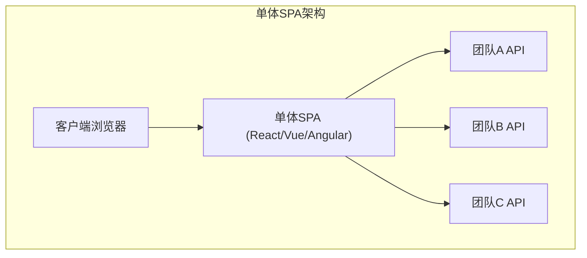
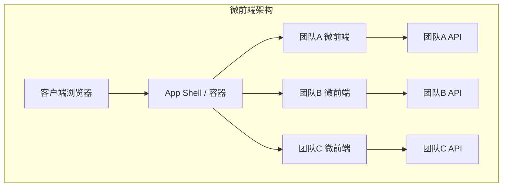
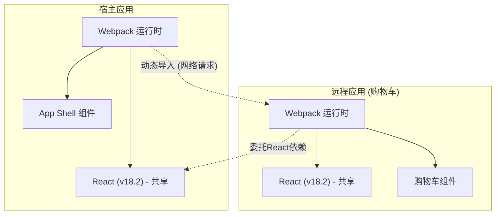

近年来，对Web应用UI/UX的要求不断提高，前端代码库也变得前所未有地庞大。虽然单页应用 ( **SPA** ) 的兴起实现了丰富的用户体验，但变得复杂的“前端单体”正逐渐成为开发的瓶颈。

本文将针对拆分不断膨胀的SPA、提高团队自治性的 **微前端** ( Micro Frontends ) 架构，从与后端微服务化的对比、各种集成方法，一直到使用现代逐渐成为事实标准的 Webpack 的 **Module Federation** 的实现模式，进行非常详细的讲解。

## 1. 为什么需要微前端？

### 单体前端的局限性

在早期的Web应用中，前端只不过是用于渲染后端生成的HTML的薄薄的一层。然而，随着React、Vue、Angular等现代框架的普及，许多业务逻辑和状态管理被转移到了客户端，前端的代码量呈爆炸式增长。

其结果就是产生了 **前端单体** 。由于所有的UI组件、路由、状态管理都集中在一个巨大的代码仓库中，以下问题变得日益突出：

* **构建时间延长** : 随着代码库的增加，构建和测试所需的时间呈指数级增加。
* **团队间的依赖与协调成本** : 由于多个团队修改同一个代码库，合并冲突频繁发生，协调发布周期需要耗费大量精力。
* **技术债务的积累与锁定** : 由于整个应用依赖于单一框架或库的版本，渐进式重构或引入新技术变得困难。

### 与后端微服务化的对比

在后端世界中，拆分巨大的单体应用并构建可独立部署的服务群的 **微服务架构** 已得到广泛普及。这使得各个团队能够拥有自己独立的数据库、技术栈和部署周期，从而极大地提高了可扩展性和开发速度。

然而，即使后端实现了微服务化并按团队进行了拆分，如果提供给用户的UI（前端）仍然是一个单一的单体应用，就无法获得真正意义上的端到端自治性。各个团队的功能添加，最终都会面临前端集成这个瓶颈。

**微前端** 正是解决这一问题，并在前端开发中带来与微服务相同优势（独立部署、技术自由、自治团队）的方法。

## 2. 什么是微前端

微前端是一种架构风格，它将Web应用构建为由独立团队开发、测试和部署的小型前端应用的集合体。

### 主要优势

1. **独立部署** : 各个微前端可以在任何时间点发布，而不会影响其他功能。
2. **团队自治性** : 对特定业务领域负责的跨职能团队，从数据库到UI，可以独立做出决策。
3. **确保技术自由度** : 各个团队可以选择最适合需求的开发栈，并更容易进行渐进式迁移（例如：从旧的Angular迁移到新的React）。
4. **提高容错性** : 即使部分功能发生错误，也不会导致整个应用崩溃，可以将错误范围局部化。

### 缺点与挑战

另一方面，微前端也存在特有的挑战。

* **有效载荷膨胀** : 由于多个前端应用独立运行，可能会产生重复下载公共库（例如：React本身）的风险。
* **运维复杂性增加** : 需要管理大量的代码仓库和CI/CD流水线，增加了DevOps的负担。
* **维持一致的UX** : 为了整合不同团队开发的UI，必须利用设计系统，并提供让用户感觉不到违和感的无缝体验，这需要下很大功夫。

## 3. 单体SPA与微前端的架构比较

下面的图表比较了传统的单体SPA与微前端架构在结构上的差异。





正如上图所示，微前端中存在 **App Shell** (容器应用)，它会动态加载并集成各个团队开发的前端应用。借此，从后端API到UI都被完全垂直地分割开来，保持了各个团队的独立性。

## 4. 集成方法的模式

为了实现微前端，最大的关键在于如何将拆分后的应用“集成”到一个画面中。集成方法大致可分为3个类别。

### 4.1. 构建时集成 (Build-time Integration)

这是一种利用NPM包等，在宿主应用的构建过程中集成各个团队构建的模块的方法。

* **优点** : 实现非常简单，易于进行静态分析。可以直接利用现有的包管理器机制。
* **缺点** : 每次有依赖关系的组件更新时，都需要重新构建并重新部署整个宿主应用。由于这妨碍了微前端最大的目的——“独立部署”，目前通常不推荐使用。

### 4.2. 服务端集成 (Server-side Integration)

这是一种在服务端组装HTML时，从各个微前端获取HTML片段，组合后返回给客户端的方法。

* **优点** : 初始渲染快，有利于SEO。不会给客户端带来负担。
* **代表性技术** : Nginx的 SSI (Server Side Includes)、Edge Side Includes (ESI)，以及Zalando开发的 Project Mosaic 等。
* **缺点** : 增加了基础设施的复杂性，并且需要额外的机制来实现富客户端交互（类似SPA的路由）。

### 4.3. 客户端集成 (Client-side Integration)

这是一种在浏览器（客户端）上动态加载并集成各个微前端的方法。它是现代基于SPA开发中最主流的方法。

#### 4.3.1. iframe

这是提供最经典且可靠隔离（Isolation）的方法。

* **优点** : CSS和JavaScript的作用域被完全隔离，因此不会发生冲突。可以安全地让不同的框架共存。
* **缺点** : 性能开销大，可能会对SEO产生负面影响。此外，iframe之间的通信（状态共享和路由同步）必须经过 `postMessage` ，往往会变得复杂。

#### 4.3.2. Web Components

这是一种利用浏览器标准的Web Components ( Custom Elements, Shadow DOM ) 来封装并集成组件的方法。

* **优点** : 它是不依赖于框架的标准技术，具有很高的互操作性。利用Shadow DOM也可以隔离CSS。
* **缺点** : 尽管浏览器支持情况已经成熟，但在与SSR（服务端渲染）的兼容性，以及全局状态管理的集成方面需要花些心思。

#### 4.3.3. Webpack Module Federation

这是Webpack 5中引入的革命性插件，目前已成为客户端集成的 **事实标准** 。它允许在运行时从其他Webpack构建中动态加载代码。

## 5. 深入了解 Webpack Module Federation

Webpack Module Federation 极大地改变了微前端的实现范式。这里将详细讲解其机制和实现示例。

### 机制与依赖关系解决

在 Module Federation 中，应用可以同时扮演 **Host** (宿主) 和 **Remote** (远程) 两种角色。
Host 是负责初始加载的应用，而 Remote 提供动态加载的模块。

值得一提的是它的 **依赖关系解决机制** 。当多个 Remote 应用使用同一个库（例：React 或 Lodash）时，Module Federation 能够防止重复下载，并在 Host 和 Remote 之间巧妙地重用共享库的单一实例。



上图展示了 Remote 应用并未下载其自身的 React，而是重用了 Host 应用提供的 React。这出色地解决了客户端集成的弱点——“有效载荷膨胀”。

### 实现示例：ModuleFederationPlugin 的配置

让我们来看看实际的 Webpack 5 配置示例。这里假设 Host 应用要加载 Remote 应用（ShoppingCart）的组件。

#### Remote端（ShoppingCart）的 webpack.config.js

在 Remote 端，定义要公开的组件和要共享的库。

```javascript
// remote/webpack.config.js
const { ModuleFederationPlugin } = require('webpack').container;
const path = require('path');

module.exports = {
  entry: './src/index',
  mode: 'development',
  output: {
    publicPath: 'auto',
  },
  plugins: [
    new ModuleFederationPlugin({
      name: 'shoppingCart',          // 应用的唯一名称
      filename: 'remoteEntry.js',    // 供外部加载的入口点
      exposes: {
        './CartWidget': './src/components/CartWidget', // 要公开的组件
      },
      shared: {                      // 要共享的依赖关系
        react: { singleton: true, requiredVersion: '^18.2.0' },
        'react-dom': { singleton: true, requiredVersion: '^18.2.0' },
      },
    }),
  ],
};
```

#### Host端的 webpack.config.js

在 Host 端，定义从哪里加载 Remote 应用。

```javascript
// host/webpack.config.js
const { ModuleFederationPlugin } = require('webpack').container;

module.exports = {
  entry: './src/index',
  mode: 'development',
  plugins: [
    new ModuleFederationPlugin({
      name: 'hostApp',
      remotes: {
        // remoteName@remoteURL/remoteEntry.js
        shoppingCart: 'shoppingCart@http://localhost:3001/remoteEntry.js',
      },
      shared: {
        react: { singleton: true, eager: true },
        'react-dom': { singleton: true, eager: true },
      },
    }),
  ],
};
```

#### React 中的延迟加载集成示例

在 Host 端的 React 代码中，使用 `React.lazy` 和 `Suspense` 通过网络延迟加载 Remote 组件。

```javascript
// host/src/App.jsx
import React, { Suspense } from 'react';

// 指定在 webpack.config.js 中定义的 remotes名/exposes名
const RemoteCartWidget = React.lazy(() => import('shoppingCart/CartWidget'));

const App = () => {
  return (
    <div>
      <header>
        <h1>My E-Commerce Site</h1>
      </header>
      <main>
        <h2>Product List</h2>
        {/* ... 产品列表渲染 ... */}
      </main>
      <aside>
        {/* 指定 Remote 组件加载完成前的后备 UI */}
        <Suspense fallback={<div>Loading Cart...</div>}>
          <RemoteCartWidget />
        </Suspense>
      </aside>
    </div>
  );
};

export default App;
```

像这样，通过使用 Module Federation，开发者就可以以与导入本地组件完全相同的感觉，集成部署在不同代码仓库、不同服务器上的组件。

## 6. 状态共享与路由的挑战

在实现微前端的过程中，技术上难度最高的就是“状态共享”和“路由”。必须在保持各个团队自治性的同时，为用户提供无缝的体验。

### 状态管理方法

在微前端中，共享全局状态管理（例如：[Redux](https://kenji.blog/zh-cn/p/state-management-history-redux-context-recoil-zustand/)巨大的单一Store）被视为 **反模式** 。这是因为它会在应用之间产生紧耦合，从而妨碍独立部署。

取而代之的是，推荐使用以下松耦合的方法：

1. **Custom Events / Event Bus** : 使用浏览器标准API `CustomEvent` 或轻量级的 Event Bus 库，通过发布-订阅（Publish-Subscribe）模式进行通信。
   * 例：当按下“添加到购物车”按钮时，触发 `ITEM_ADDED_TO_CART` 事件，Cart 应用监听到该事件后更新其自身的状态。
2. **URL / 查询参数** : 最稳健的状态共享机制是URL。通过将搜索查询或选中的过滤器放置在URL中，任何微前端只需解析URL即可同步状态。
3. **Web Storage** : 对于认证令牌或用户设置等需要持久化且变更频率低的数据，可通过 `localStorage` 或 `sessionStorage` 进行共享。

### 路由策略

路由是决定在哪个层级控制用户导航的重要元素。

* **App Shell 模式 (客户端路由)** :
  上层的容器应用（App Shell）拥有主路由器（例如：`react-router`），并根据URL路径挂载/卸载相应的微前端。
  * `/products/*` -> 将路由委托给产品团队的应用。
  * `/checkout/*` -> 委托给支付团队的应用。
  在每个微前端内部，还可以拥有内部路由。

* **[BFF](https://kenji.blog/zh-cn/p/microservices-architecture-bff-api-gateway/) (Backend For Frontend) 层的路由** :
  这是一种在服务器基础设施（例如：Nginx 或 [API Gateway](https://kenji.blog/zh-cn/p/microservices-architecture-bff-api-gateway/)）层级判断路径，从一开始就返回合适的微前端HTML的方法。虽然在页面跳转时会发生硬刷新，但架构的隔离度是最高的。

## 7. 对组织的影响与团队的自治性

**康威定律** （“设计系统的组织，其产生的设计等同于组织之内、组织之间的沟通结构”）在软件架构中非常重要。

微前端可以说也是反向利用这一定律的 **逆康威定律** 的实践。也就是说，为了实现期望的架构（松耦合、自治），要根据它来优化组织结构。

不可缺少的是，不是建立传统的“前端团队”、“后端团队”、“数据库团队”这种职能型组织，而是建立专注于特定业务领域（例如：“搜索”、“支付”、“用户管理”）的 **跨职能团队** 。只有当每个团队对从后端API到前端UI组件的整个领域负全责时，才能发挥出微前端的真正价值。

## 8. 结语

本文详细讲解了用于拆分变得庞大的 SPA，并构建可持续开发体制的 **微前端** 架构。

随着 Webpack Module Federation 的出现，客户端的动态集成变得极其容易。然而，微前端不仅是纯粹解决技术挑战，更是深入组织结构和团队开发流程的范式转移。

准确评估增加复杂性这一权衡取舍，根据团队规模和产品成长阶段，选择合适的集成方法和架构，将是成功的关键。
