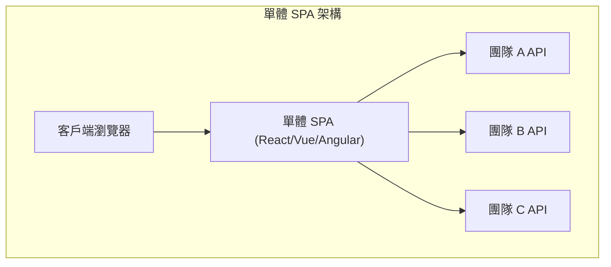
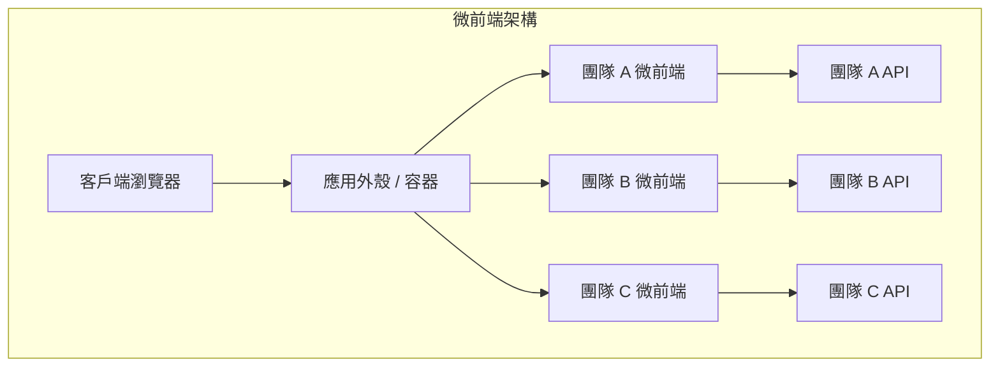
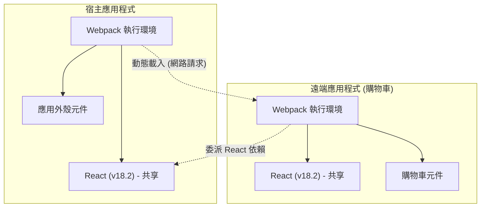

近年來，網路應用程式對 UI/UX 的要求不斷提高，前端的程式碼庫變得前所未有的龐大。隨著 Single Page Application ( **SPA** ) 的興起，雖然實現了豐富的使用者體驗，但複雜化的「前端單體」正逐漸成為開發的瓶頸。

本文將針對如何分割龐大化的 SPA，以提高團隊自主性的 **微前端** ( Micro Frontends ) 架構，從與後端微服務化的對比、各種整合手法，到現在逐漸成為事實標準的 Webpack **Module Federation** 實作模式，進行非常詳細的解說。

## 1. 為什麼需要微前端？

### 單體式前端的極限

在早期的網路應用程式中，前端只不過是為了描繪後端產生之 HTML 的薄薄一層。然而，隨著 React、Vue、Angular 等現代框架的普及，許多商業邏輯與狀態管理被轉移到了客戶端，前端的程式碼量呈現爆炸性成長。

其結果就是誕生了 **前端單體** 。將所有的 UI 元件、路由、狀態管理集中在一個巨大的儲存庫中，導致了以下問題的浮現：

*  **建置時間拉長** : 隨著程式碼庫的增加，建置與測試所需的時間呈指數級增長。
*  **團隊間的依賴與協調成本** : 由於多個團隊會更動同一個程式碼庫，合併衝突頻繁發生，需要耗費大量心力來協調發布週期。
*  **技術債務的累積與鎖定** : 由於整個應用程式依賴於單一框架或函式庫的版本，階段性的重構或新技術的導入變得困難。

### 與後端微服務化的對比

在後端的世界裡，分割巨大單體、建構可獨立部署的服務群的 **微服務架構** 已廣泛普及。這讓每個團隊都能擁有自己的資料庫、技術堆疊和部署週期，可擴展性與開發速度都獲得了戲劇性的提升。

然而，即使後端已經微服務化並按團隊分割，提供給使用者的 UI（前端）若仍然是一個單體，就無法獲得真正意義上的端對端自主性。各個團隊增加功能時，最終都會面臨前端整合這個瓶頸。

**微前端** 就是為了解決這個問題，為前端開發帶來如同微服務般的恩惠（獨立部署、技術自由、自主團隊）的一種方法。

## 2. 什麼是微前端

微前端是一種架構風格，將網路應用程式建構為由獨立團隊開發、測試、部署的小型前端應用程式的集合體。

### 主要優點

1.  **獨立部署** : 每個微前端都可以在不影響其他功能的情況下，於任意時間點發布。
2.  **團隊自主性** : 從資料庫到 UI，對特定商業領域負責的跨職能團隊可以獨立做出決策。
3.  **確保技術自由度** : 每個團隊可以選擇最適合需求的技術堆疊，階段性的轉移（例如：從舊的 Angular 轉移到新的 React）也會變得容易。
4.  **提高容錯性** : 即使部分功能發生錯誤，整個應用程式也不會崩潰，可以將錯誤範圍局部化。

### 缺點與課題

另一方面，微前端也存在特有的課題。

*  **有效負載的肥大化** : 由於多個前端應用程式獨立運作，共用的函式庫（例如：React 本身）有重複下載的風險。
*  **維運複雜度的增加** : 需要管理多個儲存庫和 CI/CD 管道，增加了 DevOps 的負擔。
*  **維持一致的 UX** : 為了整合不同團隊開發的 UI，必須活用設計系統，提供讓使用者不感到突兀、無縫的體驗。

## 3. 單體 SPA 與微前端的架構比較

以下將透過圖表來比較傳統單體式 SPA 與微前端架構在結構上的差異。





如上圖所示，在微前端中存在著 **App Shell** （容器應用程式），會動態載入並整合各團隊開發的前端應用程式。這樣一來，從後端 API 到 UI 都被完全垂直分割，保持了各團隊的獨立性。

## 4. 整合手法的模式

為實現微前端，如何將分割後的應用程式「整合」到一個畫面中，是最大的關鍵。整合手法大致分為三個類別。

### 4.1. 建置時整合 (Build-time Integration)

利用 NPM 套件等方式，在宿主應用程式的建置過程中，整合各團隊建置好的模組的手法。

*  **優點** : 實作非常簡單，靜態分析容易。可以直接利用現有套件管理員的機制。
*  **缺點** : 每當有相依元件更新時，都必須重新建置並重新部署整個宿主應用程式。這阻礙了微前端最大的目標「獨立部署」，因此目前大多不被推薦。

### 4.2. 伺服器端整合 (Server-side Integration)

在伺服器端組裝 HTML 時，從各個微前端取得 HTML 片段，結合後回傳給客戶端的手法。

*  **優點** : 首次渲染快速，對 SEO 友善。不會對客戶端造成負擔。
*  **代表性技術** : Nginx 的 SSI (Server Side Includes)、Edge Side Includes (ESI)，以及 Zalando 開發的 Project Mosaic 等。
*  **缺點** : 增加了基礎設施的複雜性，若要實現豐富的客戶端互動（類似 SPA 的路由），需要額外的機制。

### 4.3. 客戶端整合 (Client-side Integration)

在瀏覽器（客戶端）上動態載入並整合各個微前端的手法。是現代基於 SPA 開發中最主流的方法。

#### 4.3.1. iframe

提供最傳統、最確實隔離的手法。

*  **優點** : CSS 與 JavaScript 的作用域完全隔離，不會發生干擾。可以安全地讓不同的框架共存。
*  **缺點** : 效能的額外負擔大，且可能對 SEO 造成負面影響。此外，iframe 之間的通訊（狀態共享與路由同步）必須透過 `postMessage`，容易變得複雜。

#### 4.3.2. Web Components

利用瀏覽器標準的 Web Components ( Custom Elements, Shadow DOM ) 來封裝並整合元件的手法。

*  **優點** : 是不依賴框架的標準技術，具有很高的互通性。也能透過 Shadow DOM 隔離 CSS。
*  **缺點** : 雖然瀏覽器的支援狀況已經成熟，但在與 SSR（伺服器端渲染）的搭配，以及全域狀態管理的整合上，需要花些心思。

#### 4.3.3. Webpack Module Federation

Webpack 5 導入的劃時代外掛程式，目前已成為客戶端整合的 **事實上的標準** 。它允許在執行時動態從其他 Webpack 建置中載入程式碼。

## 5. Webpack Module Federation 的深入探討

Webpack Module Federation 戲劇性地改變了微前端的實作典範。在此我們將詳細解說它的機制與實作範例。

### 機制與依賴關係解決

在 Module Federation 中，應用程式可以同時扮演 **Host** （宿主）與 **Remote** （遠端）的角色。
Host 是負責初期載入的應用程式，而 Remote 則提供動態載入的模組。

值得一提的是它的 **依賴關係解決機制** 。當多個 Remote 應用程式使用同一個函式庫（例如：React 或 Lodash）時，Module Federation 會防止重複下載，在 Host 與 Remote 之間聰明地重複使用共享函式庫的單一實例。



上圖顯示了 Remote 應用程式不下載自己的 React，而是重複使用 Host 應用程式提供的 React 的情況。這樣一來，完美解決了客戶端整合的弱點「有效負載的肥大化」。

### 實作範例: ModuleFederationPlugin 的設定

讓我們來看看實際的 Webpack 5 設定範例。在此假設由 Host 應用程式載入 Remote 應用程式（ShoppingCart）的元件。

#### Remote 側（ShoppingCart）的 webpack.config.js

在 Remote 側，定義要公開的元件與要共享的函式庫。

```javascript
// remote/webpack.config.js
const { ModuleFederationPlugin } = require('webpack').container;
const path = require('path');

module.exports = {
  entry: './src/index',
  mode: 'development',
  output: {
    publicPath: 'auto',
  },
  plugins: [
    new ModuleFederationPlugin({
      name: 'shoppingCart',          // 應用程式的唯一名稱
      filename: 'remoteEntry.js',    // 從外部載入的進入點
      exposes: {
        './CartWidget': './src/components/CartWidget', // 公開的元件
      },
      shared: {                      // 共享的依賴關係
        react: { singleton: true, requiredVersion: '^18.2.0' },
        'react-dom': { singleton: true, requiredVersion: '^18.2.0' },
      },
    }),
  ],
};
```

#### Host 側的 webpack.config.js

在 Host 側，定義要從哪裡載入 Remote 應用程式。

```javascript
// host/webpack.config.js
const { ModuleFederationPlugin } = require('webpack').container;

module.exports = {
  entry: './src/index',
  mode: 'development',
  plugins: [
    new ModuleFederationPlugin({
      name: 'hostApp',
      remotes: {
        // 遠端名稱@遠端URL/remoteEntry.js
        shoppingCart: 'shoppingCart@http://localhost:3001/remoteEntry.js',
      },
      shared: {
        react: { singleton: true, eager: true },
        'react-dom': { singleton: true, eager: true },
      },
    }),
  ],
};
```

#### React 中的延遲載入整合範例

在 Host 側的 React 程式碼中，使用 `React.lazy` 與 `Suspense` 透過網路延遲載入 Remote 元件。

```javascript
// host/src/App.jsx
import React, { Suspense } from 'react';

// 指定在 webpack.config.js 中定義的 remotes名稱/exposes名稱
const RemoteCartWidget = React.lazy(() => import('shoppingCart/CartWidget'));

const App = () => {
  return (
    <div>
      <header>
        <h1>My E-Commerce Site</h1>
      </header>
      <main>
        <h2>Product List</h2>
        {/* ... 產品列表的渲染 ... */}
      </main>
      <aside>
        {/* 指定在 Remote 元件載入前的降級（Fallback） UI */}
        <Suspense fallback={<div>Loading Cart...</div>}>
          <RemoteCartWidget />
        </Suspense>
      </aside>
    </div>
  );
};

export default App;
```

像這樣，透過使用 Module Federation，開發人員能以和匯入本地元件完全相同的感覺，整合部署在其他儲存庫、其他伺服器的元件。

## 6. 狀態共享與路由的課題

在實作微前端時，技術上難度最高的就是「狀態共享」與「路由」。必須在保持各團隊自主性的同時，為使用者提供無縫的體驗。

### 狀態管理的方法

在微前端中，共享全域狀態管理（例如：[Redux](https://kenji.blog/zh-tw/p/state-management-history-redux-context-recoil-zustand/) 的巨大單一儲存庫）被視為 **反模式** 。這是因為這會產生應用程式之間的緊密耦合，阻礙獨立部署。

取而代之，推薦以下這些低耦合的方法。

1.  **Custom Events / Event Bus** : 使用瀏覽器標準 API 的 `CustomEvent` 或輕量級的 Event Bus 函式庫，以 Publish-Subscribe 模式進行通訊。
   * 範例：按下「加入購物車」按鈕時，觸發 `ITEM_ADDED_TO_CART` 事件，Cart 應用程式監聽該事件並更新自身的狀態。
2.  **URL / 查詢參數** : 最穩固的狀態共享機制就是 URL。透過將搜尋查詢或選取的篩選器放入 URL 中，任何微前端都只需解析 URL 就能同步狀態。
3.  **Web Storage** : 認證權杖或使用者設定等，需要持久化且變更頻率低的資料，透過 `localStorage` 或 `sessionStorage` 來共享。

### 路由的策略

路由是決定在哪個層級控制使用者導覽的重要元素。

*  **App Shell 模式（客戶端路由）** :
  上層的容器應用程式（App Shell）擁有主要的路由器（例如：`react-router`），並根據 URL 路徑掛載/卸載適當的微前端。
  * `/products/*` -> 將路由委派給產品團隊的應用程式。
  * `/checkout/*` -> 委派給結帳團隊的應用程式。
  在各個微前端內部，可以進一步擁有內部路由。

*  **BFF (Backend For Frontend) 層的路由** :
  在伺服器的基礎設施（例如：Nginx 或 API Gateway）層級判斷路徑，從一開始就提供適當微前端之 HTML 的手法。雖然在切換頁面時會發生強制重新整理，但架構的獨立程度是最高的。

## 7. 對組織的影響與團隊的自主性

**康威定律** （「設計系統的組織，其產生之設計等同於該組織溝通結構的複本」）在軟體架構中非常重要。

微前端可以說是反向利用這項定律的 **逆康威定律** 實踐。也就是說，為了實現理想的架構（低耦合且自主），將組織結構配合它進行最佳化。

不可或缺的是，不要建立傳統「前端團隊」、「後端團隊」、「資料庫團隊」等以職能劃分的組織，而是建立專注於特定商業領域（例如：「搜尋」、「結帳」、「使用者管理」）的 **跨職能團隊** 。唯有各個團隊擁有從後端 API 到前端 UI 元件、對該領域負起全部責任時，才能發揮微前端真正的價值。

## 8. 結語

本文詳細解說了用於分割龐大化的 SPA，並建構永續開發體制的 **微前端** 架構。

隨著 Webpack Module Federation 的出現，在客戶端進行動態整合變得戲劇性地容易。然而，微前端不單單只是技術上的課題解決，更是深入組織結構與團隊開發流程的典範轉移。

準確評估複雜度增加的權衡，並配合團隊規模與產品的成長階段，選擇適當的整合手法與架構，將會是成功的關鍵。
