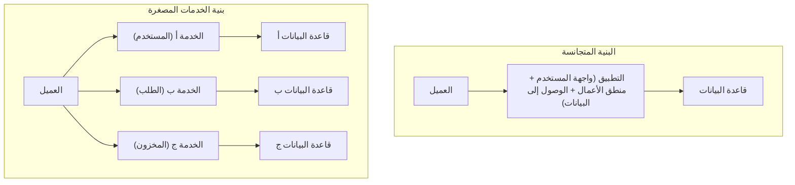
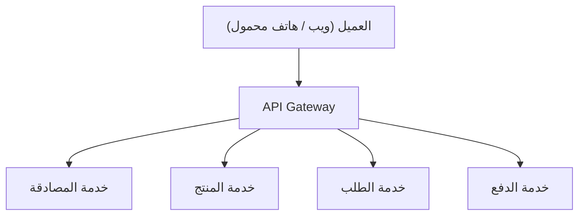
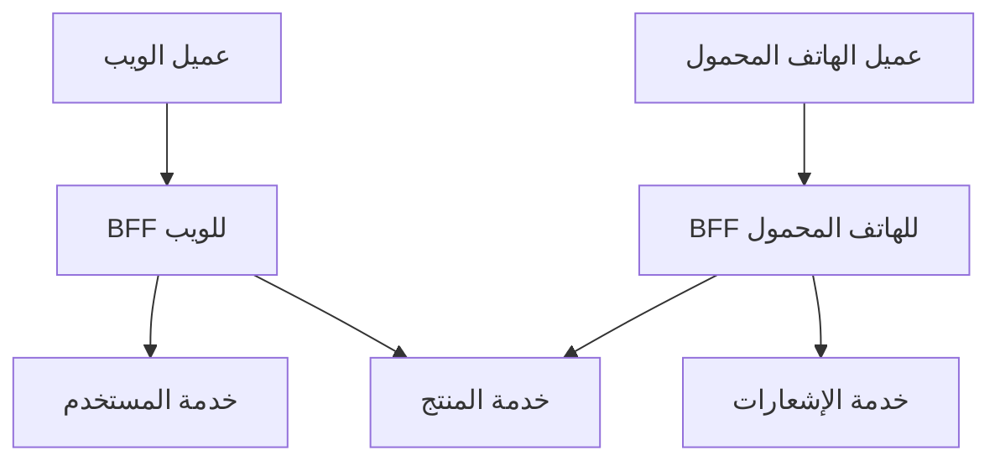

# ضوء وظل بنية الخدمات المصغرة (BFF و API Gateway)

في تطوير البرمجيات الحديثة، تزداد حالات اعتماد **بنية الخدمات المصغرة** لزيادة قابلية التوسع ورشاقة التطوير. ومع ذلك، فإن تقسيم النظام يعني في الوقت نفسه خلق تعقيدات جديدة.

تبدأ هذه المقالة بحدود البنية المتجانسة، وتتعمق في الفوائد التي تجلبها الخدمات المصغرة وجزء "الظل" الكامن وراءها (مثل التحديات التشغيلية). بعد ذلك، سنشرح بالتفصيل أنماط البنية المعمارية **API Gateway** و **BFF (Backend for Frontend)**، والتي تعتبر حلولاً لهذه التحديات، مع الرسوم التوضيحية وأمثلة ملموسة للكود.

---

## 1. حدود البنية المتجانسة

**البنية المتجانسة** هي نهج يتم فيه بناء جميع وظائف التطبيق (واجهة المستخدم، ومنطق الأعمال، والوصول إلى البيانات، إلخ) كقاعدة تعليمات برمجية واحدة وعملية واحدة. في التطوير الأولي، يكون هذا الخيار فعالاً للغاية لأنه بسيط وسهل النشر.

ولكن مع نمو النظام وزيادة حجم الوظائف وفرق التطوير، تبدأ الحدود التالية في الظهور:

*   **تضخم وتعقيد قاعدة التعليمات البرمجية**: تؤدي الإضافات المتكررة للميزات إلى تضخم قاعدة التعليمات البرمجية، مما يجعل من الصعب فهمها ككل. يزداد خطر تأثير تغيير واحد على وظائف غير متوقعة (تراجع الأخطاء).
*   **نقص مرونة النشر**: حتى بالنسبة للتعديلات الصغيرة، يجب إعادة بناء ونشر التطبيق بأكمله. هذا يؤدي إلى إطالة وقت النشر وتقليل الرشاقة.
*   **قيود قابلية التوسع**: حتى إذا كانت وظيفة معينة (مثل وظيفة معالجة الصور) تستهلك الكثير من الموارد، فإن الخيار الوحيد هو توسيع نطاق التطبيق بأكمله، مما يقلل من كفاءة استخدام الموارد.
*   **ثبات حزمة التكنولوجيا**: نظراً لوجود قاعدة تعليمات برمجية واحدة، يصعب إدخال لغات أو أطر عمل جديدة جزئياً، مما يجعلك مقيداً بالتقنيات القديمة.

للتغلب على هذه التحديات، تفكر العديد من الشركات في الانتقال إلى **بنية الخدمات المصغرة**.

---

## 2. فوائد بنية الخدمات المصغرة

في **بنية الخدمات المصغرة**، يتم تصميم التطبيق كمجموعة من الخدمات الصغيرة المستقلة (الخدمات المصغرة) لكل وظيفة تجارية. يمكن نشر كل خدمة بشكل مستقل وعادة ما يكون لها قاعدة بيانات خاصة بها.



تمتلك الخدمات المصغرة الأضواء (الفوائد) التالية:

*   **النشر المستقل**: نظراً لأنه يمكن تطوير ونشر كل خدمة بشكل مستقل، فإنه يمكن تسريع دورة الإصدار.
*   **التوسع الفردي**: يمكن فقط توسيع نطاق الخدمات ذات الحمل العالي بشكل فردي، مما يؤدي إلى تحسين تكاليف البنية التحتية.
*   **تنوع التقنيات (Polyglot)**: يمكنك اختيار لغة البرمجة وقاعدة البيانات الأمثل لكل خدمة.
*   **توطين الأعطال**: حتى في حالة تعطل خدمة واحدة، يمكن منع النظام بأكمله من التوقف (إذا كان هناك تصميم مناسب لتحمل الأخطاء).

---

## 3. "ظل" الخدمات المصغرة: التحديات التشغيلية

ومع ذلك، فإن الخدمات المصغرة ليست "رصاصة فضية". من خلال لامركزية النظام، يرافقه "ظل" وهو التعقيد الفريد للأنظمة الموزعة.

### 3.1. زمن انتقال الشبكة وتعقيد الاتصالات
العمليات التي كانت تقتصر على استدعاء الدوال في الذاكرة في النظام المتجانس تتغير إلى اتصالات عبر الشبكة (مثل HTTP/REST، gRPC). يؤدي هذا إلى حدوث **زمن انتقال الشبكة (Network Latency)**، مما يزيد من خطر إبطاء سرعة استجابة النظام بأكمله. بالإضافة إلى ذلك، نظراً لأن الشبكة غير مستقرة دائماً، فمن الضروري تنفيذ تحكم معقد في الاتصالات مثل المهلة المحددة، والتحكم في إعادة المحاولة، وقاطع الدائرة.

### 3.2. المعاملات الموزعة وتناسق البيانات
نظراً لأن كل خدمة لها قاعدة بيانات خاصة بها، فإن تحديث البيانات (المعاملات) عبر خدمات متعددة يصبح صعباً للغاية. لا يمكن استخدام معاملات [ACID](https://kenji.blog/ar/p/rdbms-transaction-acid-isolation-level-lock/) المتاحة في أنظمة RDBMS التقليدية، ويجب تبني أنماط تصميم معقدة تسمح بالتناسق النهائي (Eventual [Consistency](https://kenji.blog/ar/p/cap-theorem-distributed-systems-tradeoff/)) مثل **نمط Saga** و **توفير الأحداث (Event Sourcing)**.

### 3.3. تعقيد الوصول من العميل
عندما يكون هناك العشرات أو المئات من الخدمات، فمن غير الواقعي أن يعرف العميل (متصفح الويب أو تطبيق الهاتف المحمول) نقاط نهاية API التي يجب استدعاؤها والاتصال بها بشكل فردي. أيضاً، لعرض شاشة واحدة، من الضروري إرسال عدد كبير من الطلبات (Chatty API) إلى خدمات متعددة، مما يؤدي إلى تدهور الأداء.

لحل "تعقيد الوصول من العميل" هذا، يظهر **API Gateway** و **BFF**.

---

## 4. الوسيط بين العميل ومجموعة الخدمات: API Gateway

يتم وضع **API Gateway** بين العميل ومجموعة الخدمات المصغرة في الخلفية، ويعمل كنقطة دخول واحدة (نافذة استقبال) لجميع الطلبات.



### 4.1. الأدوار الرئيسية لـ API Gateway
*   **التوجيه (Routing)**: يوجه الطلبات (Reverse Proxy) إلى الخدمة الخلفية المناسبة بناءً على مسار الطلب من العميل.
*   **المصادقة والتفويض**: يقوم بالتحقق من الرموز (مثل JWT) مركزياً في طبقة البوابة، مما يقلل من عبء عمليات المصادقة على جانب كل خدمة مصغرة.
*   **تحديد المعدل (Rate Limit / التحكم في التدفق)**: يحد من عدد استدعاءات واجهة برمجة التطبيقات (API) لحماية الخلفية من الطلبات المفرطة.
*   **تحويل البروتوكول**: يستقبل الطلبات من العميل عبر HTTP (REST) ويقوم بتحويل البروتوكول للاتصال بالخلفية عبر gRPC، على سبيل المثال.

### 4.2. تحديات API Gateway (نقطة الفشل المفردة والتحول إلى عنق زجاجة)
على الرغم من أن API Gateway قوي للغاية، إلا أنه نظراً لأن كل حركة المرور تتركز فيه، فهناك خطر أن يصبح **نقطة فشل مفردة (SPOF)** للنظام بأكمله. بالإضافة إلى ذلك، إذا تم حشو الكثير من الوظائف (المصادقة، التحويل، بعض منطق الأعمال، إلخ) في API Gateway، فسيصبح بوابة متجانسة ضخمة، مما سيؤدي في النهاية إلى الإضرار بالرشاقة وتكرار "مأساة ناقل خدمة المؤسسة (ESB)".

---

## 5. التحسين لكل عميل: نمط BFF (Backend for Frontend)

من خلال تطوير مفهوم API Gateway بشكل أكبر، يوفر نمط **BFF (Backend for Frontend)** طبقة API مخصصة لمتطلبات العميل.

### 5.1. مفهوم نمط BFF
اعتماداً على نوع العميل، مثل متصفحات الويب، أو تطبيقات iOS، أو تطبيقات Android، أو الساعات الذكية، تختلف متطلبات البيانات التي يجب عرضها على الشاشة وعرض النطاق الترددي للشبكة اختلافاً كبيراً.

إذا حاولت تلبية كل هذه المتطلبات باستخدام بوابة API واحدة، فستصبح واجهة برمجة التطبيقات (API) عامة جداً وتتضمن بيانات غير ضرورية (Overfetching)، أو على العكس، سيكون من الضروري إرسال طلبات متعددة من العميل لتعويض البيانات المفقودة (Underfetching).

في BFF، **يتم إعداد خلفية مخصصة (BFF) لكل نوع من العملاء**. يقوم BFF بتجميع (Aggregation) ومعالجة البيانات التي تحتاجها واجهة المستخدم لهذا العميل فقط في التنسيق المناسب وإعادتها.

### 5.2. فصل BFF للويب و BFF للهاتف المحمول

يوضح الشكل أدناه البنية المعمارية التي تضع BFF منفصلاً للويب والهاتف المحمول.



*   **Web BFF**: يجمع ويعيد مجموعة بيانات غنية ليتم عرضها على الشاشة الواسعة لجهاز الكمبيوتر.
*   **Mobile BFF**: مع الأخذ في الاعتبار الشاشات الضيقة وشبكات الاتصال غير المستقرة، فإنه يعيد حمولة (Payload) يتم فيها تقليل حجم البيانات إلى الحد الأدنى.

وبهذه الطريقة، من خلال قيام فريق واجهة المستخدم نفسه بتطوير وصيانة BFF المخصص لعميلهم، يصبح من الممكن المضي قدماً في تطوير واجهة مستخدم رشيقة دون انتظار تغييرات API من فريق الخلفية.

---

## 6. مثال على تنفيذ تجميع البيانات في BFF (Node.js × GraphQL)

كحزمة تقنية لـ BFF، اكتسب **GraphQL** شعبية كبيرة في السنوات الأخيرة. نظراً لأن GraphQL يسمح للعميل بتحديد "البيانات الضرورية فقط" في الاستعلام، فإنه يتناسب تماماً مع الغرض من BFF.

هنا، باستخدام Node.js (Apollo Server)، سنقدم مثالاً بسيطاً لتنفيذ BFF يجمع واجهات برمجة التطبيقات لمعلومات المستخدم وسجل الطلبات.

### مثال على الكود: تجميع البيانات باستخدام GraphQL

```javascript
// index.js
const { ApolloServer, gql } = require('apollo-server');
const axios = require('axios');

// 1. تعريف مخطط GraphQL
// نقوم بتعريف بنية البيانات التي يحتاجها العميل.
const typeDefs = gql`
  type User {
    id: ID!
    name: String!
    email: String!
  }

  type Order {
    id: ID!
    productId: ID!
    amount: Int!
    status: String!
  }

  type UserProfile {
    user: User!
    orders: [Order]!
  }

  type Query {
    # استعلام للحصول على ملف تعريف المستخدم وسجل الطلبات مرة واحدة
    userProfile(userId: ID!): UserProfile
  }
`;

// 2. تعريف المحلل (منطق تجميع البيانات)
const resolvers = {
  Query: {
    userProfile: async (_, { userId }) => {
      try {
        // إرسال طلبات HTTP المتوازية إلى خدمات مصغرة مختلفة (المستخدم والطلب)
        // باستخدام Promise.all، نقوم بتقليل وقت انتظار الشبكة إلى الحد الأدنى.
        const [userResponse, ordersResponse] = await Promise.all([
          axios.get(\`http://user-service/api/users/\${userId}\`),
          axios.get(\`http://order-service/api/orders?userId=\${userId}\`)
        ]);

        // دمج البيانات المسترجعة وإعادتها وفقاً لتنسيق مخطط GraphQL
        return {
          user: userResponse.data,
          orders: ordersResponse.data
        };
      } catch (error) {
        console.error("فشل جلب البيانات من الخدمات المصغرة", error);
        throw new Error("فشل جلب بيانات ملف تعريف المستخدم");
      }
    }
  }
};

// 3. بدء تشغيل الخادم
const server = new ApolloServer({ typeDefs, resolvers });

server.listen({ port: 4000 }).then(({ url }) => {
  console.log(\`🚀 خادم BFF جاهز عند \${url}\`);
});
```

من خلال هذا التنفيذ، يمكن للعميل الحصول على بيانات من خدمات خلفية متعددة (معلومات المستخدم وسجل الطلبات) مرة واحدة بمجرد تنفيذ استعلام GraphQL واحد يسمى `userProfile`. يتم تقليل عدد الاتصالات من جانب العميل بشكل كبير، مما يؤدي إلى تحسين الأداء وتجربة التطوير.

---

## 7. خاتمة

تعد بنية الخدمات المصغرة نهجاً قوياً لتطوير أنظمة ضخمة بطريقة قابلة للتوسع، ولكن من الضروري مواجهة تحديات "الظل" الفريدة للأنظمة الموزعة.

كوسيلة لحل هذه التحديات وتحسين الاتصال بين العميل والخلفية، أصبحت أنماط **API Gateway** و **BFF** لا غنى عنها. على وجه الخصوص، يعد BFF، الذي يوفر نقطة نهاية مخصصة لكل نوع من العملاء، بنية معمارية رائعة تحرر سرعة تطور واجهة المستخدم من قيود الخلفية.

وفقاً لهيكل فريق شركتك، وتنوع العملاء، وحجم النظام، دعونا نقوم بتصميم وتقديم API Gateway و BFF بشكل مناسب لبناء نظام أكثر قوة ورشاقة.
